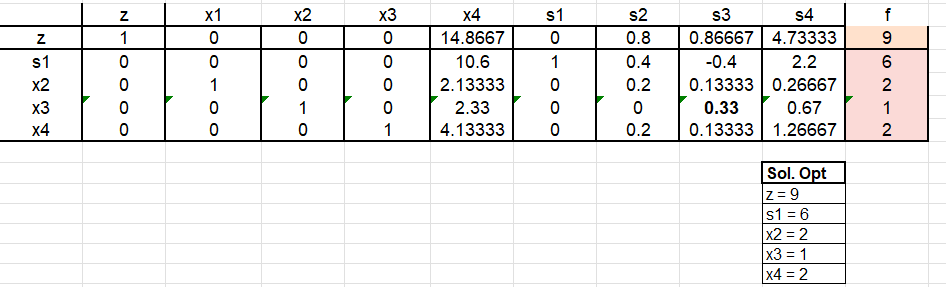
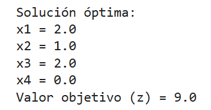

## Problema 1.1
Se resolvió el simplex haciendo uso de el conociminto en como identificar el numero pivote y la fila del pivote.
Una nueva tabla se formava al dividir la vieja fila pivote entre el numero pivote y se completaba haciendo el uso de una forma similar a esta
**Fila vieja - Numero correspondiente en columna pivote * Numero correspondiente en fila pivote**

Así resolvemos hasta que no haya ningún coeficiente negativo en Z

## Problema 1.2
Este consistía en realizar el problema anterior pero por medio de un programa, que se realizó con Julia, con el fin de comparar los resultados entre ambos métodos de resolución. 
Se hizo uso de las librerías Pkg, JuMP, HiGHS, Ipopt y Optimization 
Se crearon las variables y restrincciones con @variable y @constraint
Se establecio la funcion objetivo a maximizar con @objective y se optimizó con **set_optimizer(model, HiGHS.Optimizer)** 
Y finalmente se imprimieron los resultados
