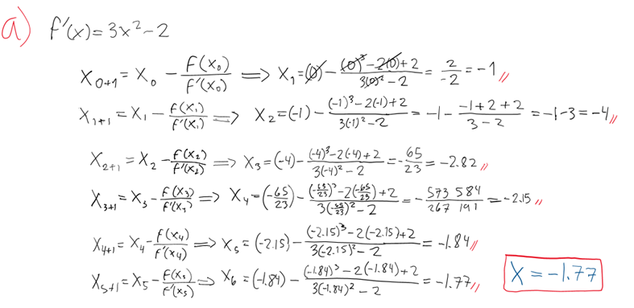
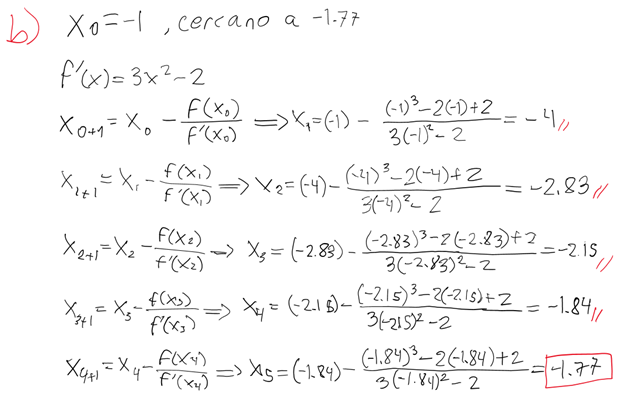

---
header-includes:
  - \usepackage{amsmath}
  - \usepackage{amssymb}
  - \usepackage{fontspec}
  - \setmainfont{FiraCode Nerd Font}
  - \setmonofont{FiraCode Nerd Font Mono}
  - \usepackage{setspace}
  - \setstretch{1.5}
  - \usepackage{fvextra}
  - \DefineVerbatimEnvironment{Highlighting}{Verbatim}{breaklines,commandchars=\\\{\}}
  - \hypersetup{colorlinks=true, linkcolor=blue, urlcolor=blue}
  - \AtBeginEnvironment{longtable}{\small}
geometry: top=0.67in, bottom=0.67in, left=0.85in, right=0.85in
---

# Laboratorio 2

Se resolvieron ocho problemas usando programación lineal y métodos numéricos implementados en Python. Los modelos fueron desarrollados e implementados en Jupyter Notebook y archivos de reportes`.md`.

## Integrantes

- Abby Donis
- Cindy Gualim
- Josué Say

## Enlaces

- [Repositorio](https://github.com/JosueSay/labs-ms/tree/main/Labs/lab2)

# Problema 1

Tres refinerías con capacidades diarias de 6, 5 y 8 millones de galones, respectivamente, abastecen a tres áreas de distribución con demandas diarias de 4, 8 y 7 millones de galones, respectivamente. La gasolina se transporta a las tres áreas de distribución a través de una red de oleoductos. El costo de transporte es de \$0.10 por 1000 galones por kilómetro de oleoducto. En la tabla 1 se presenta la distancia en kilómetros entre las refinerías y las áreas de distribución. La refinería 1 no está conectada al área de distribución 3.

|             | Área 1 | Área 2 | Área 3 |
| ----------- | ------ | ------ | ------ |
| Refinería 1 | 120    | 180    | –      |
| Refinería 2 | 100    | 150    | 80     |
| Refinería 3 | 200    | 250    | 120    |

## Inciso a

Formular el modelo de transporte asociado.
Se planteó el modelo de transporte con tres refinerías (R1, R2, R3) y tres áreas de distribución (A1, A2, A3). La refinería 1 **no tiene conexión directa con el área 3**, por lo que se representó con `Inf` en la matriz de costos.

### Cálculo de Costos

Se utilizó la siguiente fórmula para obtener el costo por millón de galones:

Costo = distancia (km) × $100

Ya que el costo de transporte es de $0.10 por cada 1000 galones por km.

## Inciso b

Usando JuMP o Pupl, determine el programa de envíos óptimo en la red de distribución.

*Se implementó el modelo con las siguientes características:*

- Variables `x[i,j]` para representar los envíos desde refinería `i` a área `j`.
- Restricciones:
  - Cada refinería entrega exactamente su capacidad.
  - Cada área recibe exactamente lo que necesita.
- Se minimiza el costo total de transporte, excluyendo rutas prohibidas (`Inf`).

### Resultado

- El modelo se resolvió correctamente.
- Costo total mínimo: **\$217,000**

## Inciso c

Suponga ahora que la demanda diaria en el área 3 disminuye a 4 millones de galones. La producción excedente en las refinerías 1 y 2 se envía a otras áreas de distribución por medio de camiones. El costo de transporte por 100 galones es de \$1.50 desde la refinería 1 y de \$2.00 desde la refinería 2. La refinería 3 puede enviar su producción excedente a otros procesos químicos dentro de la planta.
Formule y resuelva de nuevo el programa óptimo de envíos.

*Se modificó el escenario:*

- **Área 3** redujo su demanda de 7 a 4 millones.
- Se creó un **destino ficticio** para enviar el excedente de producción (3 millones).
- Refinería 1 puede enviar al ficticio por \$1500/millón.
- Refinería 2 por \$2000/millón.
- Refinería 3 **no puede enviar al destino ficticio** (costo `Inf`).

### Nuevos datos

- Matriz de costos pasó de 3x3 a 3x4.
- Nueva demanda: [4, 8, 4, 3] para balancear la oferta total de 19 millones.

### Resultado

- Refinería 1 envió 2 millones a A1.
- Refinería 2 envió 5 millones a A2.
- Refinería 3 envió 2 millones a A1 y 3 millones a A2.
- **Ningún envío fue hecho al destino ficticio**, ya que sus costos eran más altos que las rutas normales.
- **Costo total mínimo:** **\$189,000**

# Problema 2

Resuelva el siguiente problema de asignación.

|      |     |     |      |     |     |     |
| ---- | --- | --- | ---- | --- | --- | --- |
| \$3  | \$8 | \$2 | \$10 | \$3 | \$3 | \$9 |
| \$2  | \$2 | \$7 | \$6  | \$5 | \$2 | \$7 |
| \$5  | \$6 | \$4 | \$5  | \$6 | \$6 | \$6 |
| \$4  | \$2 | \$7 | \$5  | \$9 | \$4 | \$7 |
| \$10 | \$3 | \$8 | \$4  | \$2 | \$3 | \$5 |
| \$3  | \$5 | \$4 | \$2  | \$3 | \$7 | \$8 |

## Descripción del Problema

Se tienen:

- 6 agentes
- 7 tareas

El objetivo es asignar **una tarea a cada agente** tal que el **costo total de asignación sea mínimo**, con las siguientes restricciones:

- Cada agente realiza **exactamente una tarea**.
- Cada tarea puede ser asignada a **lo sumo una vez**.

## Matriz de Costos

La matriz representa el costo de asignar al agente `i` la tarea `j`:

```bash
[ 3 8 2 10 3 3 9;
  2 2 7 6 5 2 7;
  5 6 4 5 6 6 6;
  4 2 7 5 9 4 7;
 10 3 8 4 2 3 5;
  3 5 4 2 3 7 8 ]
```

## Modelado con JuMP

- Variables binarias `x[i,j]`:
  - `1` si el agente `i` realiza la tarea `j`
  - `0` si no
- Restricciones:
  - Cada agente: `sum(x[i, j]) == 1`
  - Cada tarea: `sum(x[i, j]) <= 1`
- Función objetivo: minimizar `sum(costos[i,j] * x[i,j])`

## Resultado del Modelo

El solver HiGHS encontró la asignación óptima con un **costo mínimo total de \$15.00**.

### Asignaciones Óptimas

| Agente | Tarea Asignada | Costo |
|--------|----------------|-------|
| 1      | 6              | \$3   |
| 2      | 1              | \$2   |
| 3      | 3              | \$4   |
| 4      | 2              | \$2   |
| 5      | 5              | \$2   |
| 6      | 4              | \$2   |

> Nota: la **tarea 7 no fue asignada**, ya que hay más tareas que agentes.

# Problema 3

Una empresa necesita asignar cuatro puestos de trabajo a cuatro trabajadores. El costo de desempeñar un puesto es una función de las habilidades de los trabajadores. En la tabla siguiente se resume el costo de las asignaciones. El trabajador 1 no puede tener el puesto 3, y el trabajador 3 no puede desempeñar el puesto 4. Determine la asignación óptima mediante programación lineal.

|              | Puesto 1 | Puesto 2 | Puesto 3 | Puesto 4 |
| ------------ | -------- | -------- | -------- | -------- |
| Trabajador 1 | \$50     | \$50     | –        | \$20     |
| Trabajador 2 | \$70     | \$40     | \$20     | \$30     |
| Trabajador 3 | \$90     | \$30     | \$50     | –        |
| Trabajador 4 | \$70     | \$20     | \$60     | \$70     |

## Matriz de Costos

costos = [
    50   50   Inf   20;
    70   40    20   30;
    90   30    50  Inf;
    70   20    60   70
]

## Modelado con JuMP

- Variables binarias `x[i,j]`:
  - `1` si el trabajador `i` ocupa el puesto `j`
  - `0` si no
- Restricciones:
  - Cada trabajador debe tener **exactamente un puesto**.
  - Cada puesto debe ser asignado a **exactamente un trabajador**.
- Los valores `Inf` son ignorados en la función objetivo.

## Resultado del Modelo

El solver HiGHS encontró la solución óptima con un **costo total de \$90.00**.

### Asignaciones Óptimas

| Trabajador | Puesto Asignado | Costo |
|------------|------------------|-------|
| 1          | 1                | \$50  |
| 2          | 3                | \$20  |
| 4          | 2                | \$20  |

> Nota: El **trabajador 3** y el **puesto 4** no fueron asignados debido a las restricciones prohibidas, lo cual es válido en este contexto.

# Problema 4

Implementar en Python los tres algoritmos vistos en clase para hallar los ceros de una función $f : [a, b] \rightarrow \mathbb{R}$

- método de bisección
- método de la secante
- método de Newton-Raphson

Como parámetros, sus algoritmos deben recibir la función $f$, la derivada $df$ (en el caso de Newton), el intervalo $[a, b]$ o el punto inicial de búsqueda $x_0 \in \mathbb{R}$. Así como los criterios de paro `maxIter` y `tol > 0`.

Para la salida, sus funciones deben devolver la lista de aproximaciones realizadas y el valor de punto $x^*$ donde se encontró el cero.

## Método de Bisección

**Función utilizada (ecuación de actualización):**

$$
x = \frac{a + b}{2}
$$

**Parámetros de entrada:**

- `f`: función a evaluar
- `a, b`: extremos del intervalo inicial
- `maxIter`: número máximo de iteraciones
- `tol`: tolerancia para el criterio de paro
- `verbose`: indicador opcional para mostrar el proceso iterativo

**Valor de retorno:**
Se devuelve un diccionario con las siguientes claves:

- `converged`: indica si el método alcanzó la tolerancia
- `root`: aproximación final de la raíz
- `fAtRoot`: valor de la función en la raíz
- `iterations`: número de iteraciones realizadas
- `approximations`: lista de todas las aproximaciones intermedias
- `error`: error estimado en la última iteración
- `message`: mensaje descriptivo del estado final

**Validación:**
Se verifica que exista un cambio de signo en el intervalo inicial, es decir:

$$
f(a) \cdot f(b) < 0
$$

Si no se cumple, el método se detiene inmediatamente.

**Criterio de paro:**
Se evalúa si el tamaño del intervalo es menor que la tolerancia:

$$
|b - a| < \text{tol}
$$

Esta condición es evaluada en cada iteración. Además se tiene el criterio de paro si se llega a la cantidad de`maxIter` enviado.

## Método de la Secante

**Función utilizada (ecuación de actualización):**

$$
x_{k+1} = \frac{x_{k-1} \cdot f(x_k) - x_k \cdot f(x_{k-1})}{f(x_k) - f(x_{k-1})}
$$

**Parámetros de entrada:**

- `f`: función a evaluar
- `x0, x1`: dos puntos iniciales
- `maxIter`: número máximo de iteraciones
- `tol`: tolerancia para el criterio de paro
- `verbose`: indicador opcional para imprimir el proceso

**Valor de retorno:**
Se retorna un diccionario con:

- `converged`: si se alcanzó la tolerancia
- `root`: aproximación final de la raíz
- `fAtRoot`: valor de la función en la raíz
- `iterations`: número de iteraciones realizadas
- `approximations`: lista de aproximaciones sucesivas
- `error`: diferencia entre las dos últimas aproximaciones
- `message`: descripción del resultado final

**Validación:**
Se valida que la diferencia entre los valores funcionales no sea cero, es decir:

$$
f(x_k) - f(x_{k-1}) \neq 0
$$

> Es decir que sea diferenciable $f'(x_k) \neq 0$

**Criterio de paro:**
Se verifica si la diferencia entre dos iteraciones consecutivas es menor que la tolerancia:

$$
|x_{k+1} - x_k| < \text{tol}
$$

Además se tiene el criterio de paro si se llega a la cantidad de`maxIter` enviado.

## Método de Newton-Raphson

**Función utilizada (ecuación de actualización):**

$$
x_{k+1} = x_k - \frac{f(x_k)}{f'(x_k)}
$$

**Parámetros de entrada:**

- `f`: función a evaluar
- `df`: derivada de la función
- `x0`: valor inicial
- `maxIter`: máximo número de iteraciones
- `tol`: tolerancia para el criterio de paro
- `verbose`: indicador opcional de impresión

**Valor de retorno:**
El resultado es un diccionario con:

- `converged`: si se alcanzó la tolerancia
- `root`: valor aproximado de la raíz
- `fAtRoot`: valor de la función en la raíz
- `iterations`: número de iteraciones realizadas
- `approximations`: secuencia de valores generados
- `error`: diferencia entre las dos últimas aproximaciones
- `message`: texto explicativo del estado final

**Validación:**
Se verifica que la derivada no se anule en el punto de evaluación:

$$
f'(x_k) \neq 0
$$

Esto asegura que la tangente esté bien definida.

**Criterio de paro:**
Se detiene el proceso cuando la diferencia entre iteraciones es menor que la tolerancia:

$$
|x_{k+1} - x_k| < \text{tol}
$$

Además se tiene el criterio de paro si se llega a la cantidad de`maxIter` enviado.

# Problema 5

Hallar todos los ceros de la función

$$
g(x) = x^2 + \frac{1}{x - 7}
$$

con al menos **7 decimales de precisión**.

Compare las soluciones obtenidas con cada uno de los algoritmos anteriores en términos del número de iteraciones.

## Resultados por método

### 1. Método de Bisección

Para cada raíz, se seleccionó un intervalo $[a, b]$ donde $f(a) \cdot f(b) < 0$.

| Raíz encontrada      | Intervalo usado | Iteraciones | Raíz (7 decimales) |
| -------------------- | --------------- | ----------- | ------------------ |
| -0.36839485401287675 | \[-2,0]         | 32          | -0.3683949         |
| 0.38892324501648545  | \[0, 2]         | 32          | 0.3889232          |
| 6.979471608847382    | \[6.5, 6.98]    | 30          | 6.9794716          |

Este método encontró los ceros correctamente pero con más iteraciones.

### 2. Método de la Secante

Usando dos puntos iniciales bien elegidos en los alrededores de cada raíz:

| Raíz encontrada    | Puntos iniciales | Iteraciones | Raíz (7 decimales) |
| ------------------ | ---------------- | ----------- | ------------------ |
| -0.368394853732975 | (-2, 0)          | 12          | -0.3683949         |
| 0.3889232446865156 | (0, 2)           | 12          | 0.3889232          |
| 6.979471609046458  | (6.5, 6.98)      | 8           | 6.9794716          |

Se utilizó los opuntos extremos del intervalo del método de bisección y se obtuvieorn los mismos resultados pero en menos iteraciones.

### 3. Método de Newton-Raphson

Usando un solo punto inicial $x_0$. Aquí se observa la sensibilidad del método.

| Punto inicial $x_0$ | Raíz encontrada     | Iteraciones | Comentario                             |
| ------------------- | ------------------- | ----------- | -------------------------------------- |
| -2                  | -0.3683948537329749 | 7           | Converge correctamente                 |
| 0                   | -0.3683948537329749 | 10          | Converge, aunque comenzó lejos         |
| 6.5                 | 0.3889232446865155  | 8           | No converge a la raíz cercana esperada |
| 2                   | 0.3889232446865155  | 7           | Converge rápido a la raíz positiva     |
| 6.98                | 6.97947160904646    | 4           | Muy buena convergencia                 |

- El método de Newton-Raphson varió su comportamiento con distintos puntos iniciales.
- No es adecuado para encontrar todas las raíces sin análisis previo del dominio (sin embargo, para esta función se hizo análisis del dominio para saber previamente las raíces ya que para todos los métodos métodos no encuentra todos los ceros por lo que hay que ir por intervalo).
- Falló en distinguir entre las dos primeras raíces cuando se partía desde $x_0 = 6.5$ y $x_0 = 2$, conduciendo a la raíz equivocada.

## Conclusión

- **Bisección**: garantiza convergencia, pero con mayor número de iteraciones (30–32).
- **Secante**: logra la mejor eficiencia cuando se escogen buenos puntos iniciales.
- **Newton-Raphson**: el más rápido en casos ideales, pero sensible a la elección del punto inicial; puede converger a la raíz equivocada.

# Problema 6

Hallar todos los ceros del polinomio

$$
f(x) = 2x^5 + 3x^4 - 3x^3 - 10x^2 - 4x + 4,
$$

mediante los algoritmos numéricos.

## Resultados por método

### 1. Método de Bisección

Para cada raíz se seleccionó un intervalo $[a, b]$ con cambio de signo: $f(a) \cdot f(b) < 0$.

| Raíz encontrada     | Intervalo usado | Iteraciones | Raíz (9 decimales) |
| ------------------- | --------------- | ----------- | ------------------ |
| -1.3037028114194982 | \[-5, 0]        | 34          | -1.303702811       |
| 0.4546075598336756  | \[0, 1]         | 31          | 0.454607560        |
| 1.5937398741953075  | \[1, 5]         | 33          | 1.593739874        |

Este método encontró todos las raices, pero con mayor cantidad de iteraciones en cada caso.

### 2. Método de la Secante

Se probaron distintos pares de puntos iniciales, con resultados consistentes:

| Raíz encontrada     | Puntos iniciales | Iteraciones | Raíz (9 decimales) |
| ------------------- | ---------------- | ----------- | ------------------ |
| -1.3037028112439697 | (-5, -1)         | 9           | -1.303702811       |
| 0.4546075601876466  | (0, 1)           | 8           | 0.454607560        |
| 1.5937398739794297  | (1.3, 5)         | 13          | 1.593739874        |

La secante logró resultados correctos en menos iteraciones que la bisección, pero fue sensible al escoger los puntos ya que al escoger los puntos extremos del intervalo del método de bisección se obtuvieron:

| Raíz encontrada     | Puntos iniciales | Iteraciones | Raíz (9 decimales) |
| ------------------- | ---------------- | ----------- | ------------------ |
| 0.4546075601876466  | (-5, -1)         | 10          | 0.454607560        |
| 0.4546075601876466  | (0, 1)           | 8           | 0.454607560        |
| 0.4546075601876466  | (1.3, 5)         | 10          | 0.454607560        |

### 3. Método de Newton-Raphson

Este método fue probado con distintos puntos iniciales $x_0$:

| Punto inicial $x_0$ | Raíz encontrada     | Iteraciones | Comentario                       |
| ------------------- | ------------------- | ----------- | -------------------------------- |
| -5                  | -1.3037028112439695 | 12          | Converge correctamente           |
| 0                   | 0.4546075601876466  | 7           | Converge rápido                  |
| 1                   | 0.4546075601876466  | 6           | Converge, pero a raíz equivocada |
| 5                   | 1.5937398739794297  | 11          | Converge correctamente           |

- Newton-Raphson converge rápidamente si el punto inicial está razonablemente cerca de una raíz.
- Con $x_0 = 1$, convergió a la raíz en $x \approx 0.4546$ en lugar de la cercana a 1.59.
- No detecta automáticamente todas las raíces, por lo que se necesita análisis previo del dominio o múltiples ejecuciones (al igual que en los otros métodos).

## Conclusión

- **Bisección**: garantizó convergencia con precisión, pero tomó entre 31 y 34 iteraciones por raíz.
- **Secante**: fue más eficiente, convergiendo entre 8 y 13 iteraciones, dependiendo de los puntos iniciales.
- **Newton-Raphson**: el más rápido cuando parte cerca de la raíz (6 a 12 iteraciones), pero puede converger a una raíz no deseada si el punto inicial está mal ubicado.

# Problema 7

Considere la función $f(x) = x^3 - 2x + 2$. Vamos a utilizar el método de Newton-Raphson con el punto inicial $x_0 = 0$ para hallar un cero de este polinomio.

## Inciso a

- Comenzando en $x_0$. ¿Converge el método a la solución requerida? ¿Por qué?

- Explique qué ocurre con las iteraciones.

$f(x) = x^3 - 2x + 2$

$x_0 = 0$

$x_{k+1} = x_k - \frac{f(x_k)}{f'(x_k)}$

**Raíz:** $-1.77$

{height=200px}

Las iteraciones (total de 6) poco a poco se acercan a un punto, en el cual los decimales se empiezan a repetir, esto indica que está convergiendo en este punto y obtiene la raíz indicada por la gráfica.

{height=200px}

## Inciso b

Diseñe una estrategia para resolver el cero requerido.

Una mejora posible fue que las iteraciones disminuyeron al acercar el punto a la raíz.

{height=200px}

# Problema 8

Implementar en Python un algoritmo para hallar los ceros de una función diferenciable $F : \mathbb{R}^n \rightarrow \mathbb{R}^n$ usando el método de Newton multidimensional. Aquí

$$
\mathbf{x} =
\begin{pmatrix}
x_1 \\
x_2 \\
\vdots \\
x_n
\end{pmatrix}
\quad \text{y} \quad
F(\mathbf{x}) =
\begin{pmatrix}
f_1(x_1, x_2, \ldots, x_n) \\
f_2(x_1, x_2, \ldots, x_n) \\
\vdots \\
f_n(x_1, x_2, \ldots, x_n)
\end{pmatrix}
$$

Como parámetros su algoritmo debe recibir la función $f$, la derivada $Df$, el punto inicial de búsqueda $x_0 \in \mathbb{R}^n$. Así como los criterios de paro `maxIter` y `tol > 0`.
Para la salida, su función debe devolver la lista de aproximaciones realizadas y el valor de punto $x^* \in \mathbb{R}^n$ donde está el cero.

Con su implementación, resolver el siguiente sistema de ecuaciones con 7 cifras decimales de precisión:

$$
3x - \cos(yz) - \frac{1}{2} = 0,
$$

$$
x^2 - 81(y + 0.1)^2 + \sin z + 1.06 = 0,
$$

$$
e^{-xy} + 20z + \frac{10\pi - 3}{3} = 0.
$$
