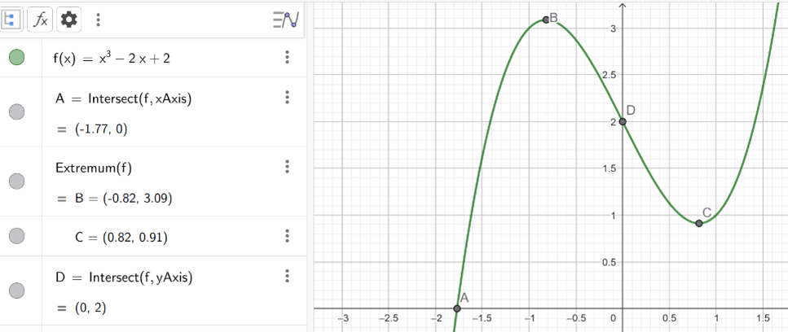
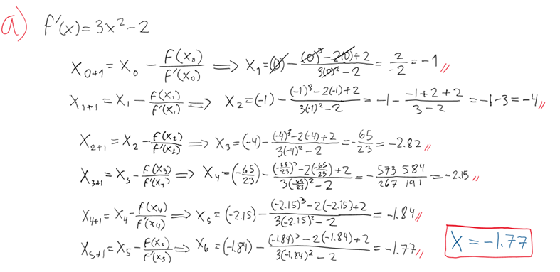

# Problema 7

Considere la función $f(x) = x^3 - 2x + 2$. Vamos a utilizar el método de Newton-Raphson con el punto inicial $x_0 = 0$ para hallar un cero de este polinomio.

## Inciso a

- Comenzando en $x_0$. ¿Converge el método a la solución requerida? ¿Por qué?

- Explique qué ocurre con las iteraciones.

$f(x) = x^3 - 2x + 2$

$x_0 = 0$

$x_{k+1} = x_k - \frac{f(x_k)}{f'(x_k)}$

**Raíz:** $-1.77$

Las iteraciones (total de 6) poco a poco se acercan a un punto, en el cual los decimales se empiezan a repetir, esto indica que está convergiendo en este punto y obtiene la raíz indicada por la gráfica.

## Inciso b

Diseñe una estrategia para resolver el cero requerido.

Una mejora posible fue que las iteraciones disminuyeron al acercar el punto a la raíz.

# Problema 8

Implementar en Python un algoritmo para hallar los ceros de una función diferenciable $F : \mathbb{R}^n \rightarrow \mathbb{R}^n$ usando el método de Newton multidimensional. Aquí

$$
\mathbf{x} =
\begin{pmatrix}
x_1 \\
x_2 \\
\vdots \\
x_n
\end{pmatrix}
\quad \text{y} \quad
F(\mathbf{x}) =
\begin{pmatrix}
f_1(x_1, x_2, \ldots, x_n) \\
f_2(x_1, x_2, \ldots, x_n) \\
\vdots \\
f_n(x_1, x_2, \ldots, x_n)
\end{pmatrix}
$$

Como parámetros su algoritmo debe recibir la función $f$, la derivada $Df$, el punto inicial de búsqueda $x_0 \in \mathbb{R}^n$. Así como los criterios de paro `maxIter` y `tol > 0`.
Para la salida, su función debe devolver la lista de aproximaciones realizadas y el valor de punto $x^* \in \mathbb{R}^n$ donde está el cero.

Con su implementación, resolver el siguiente sistema de ecuaciones con 7 cifras decimales de precisión:

$$
3x - \cos(yz) - \frac{1}{2} = 0,
$$

$$
x^2 - 81(y + 0.1)^2 + \sin z + 1.06 = 0,
$$

$$
e^{-xy} + 20z + \frac{10\pi - 3}{3} = 0.
$$
