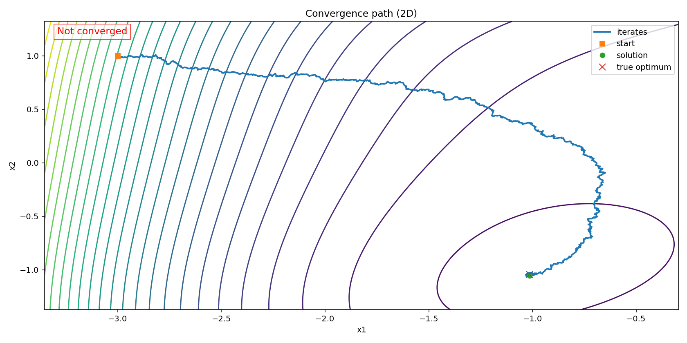
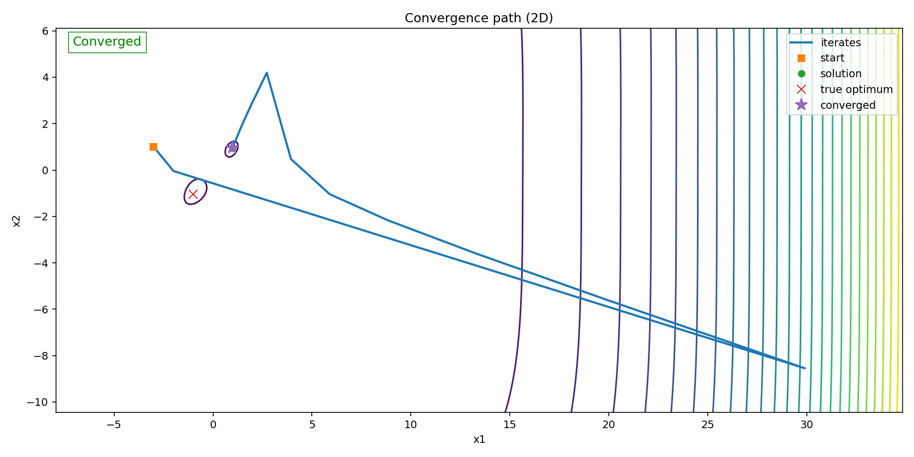
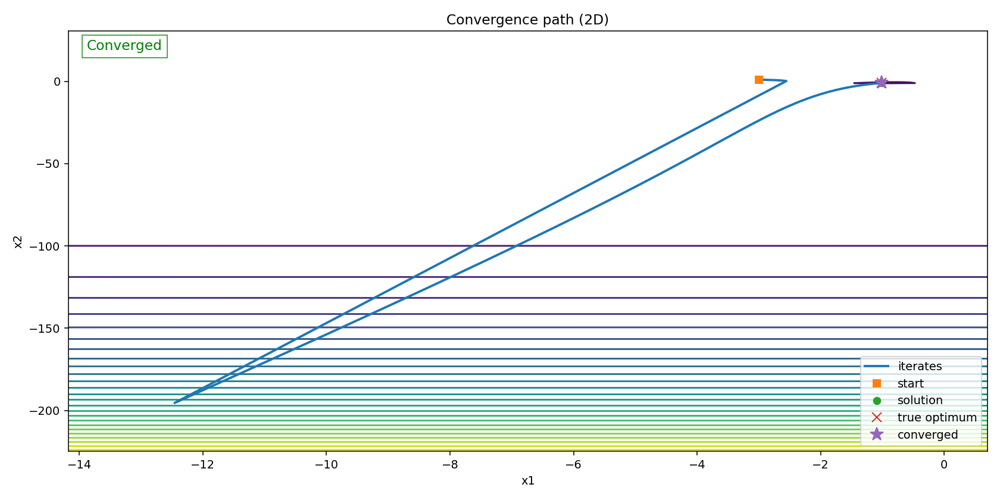
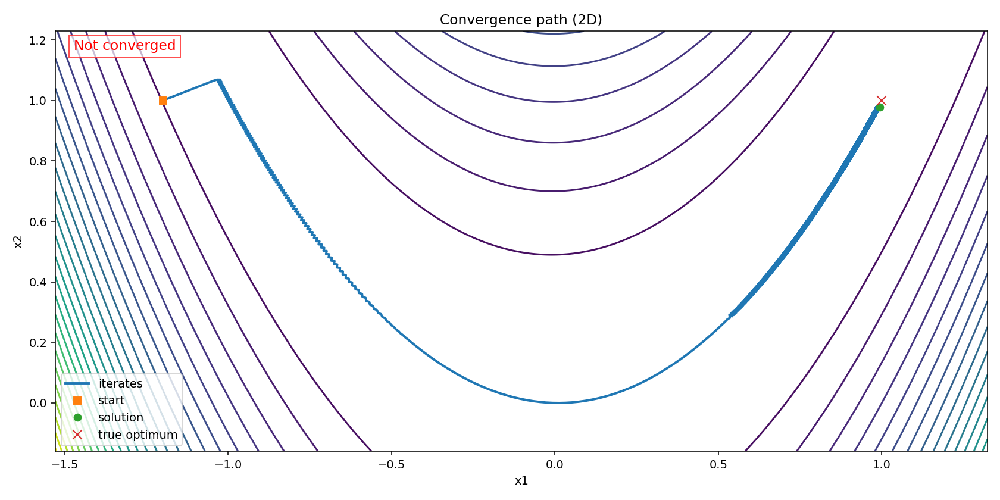
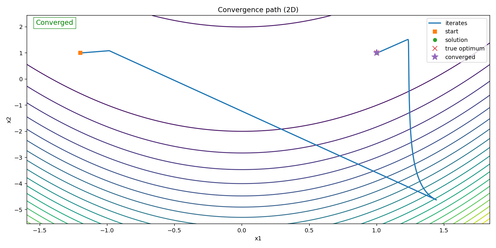
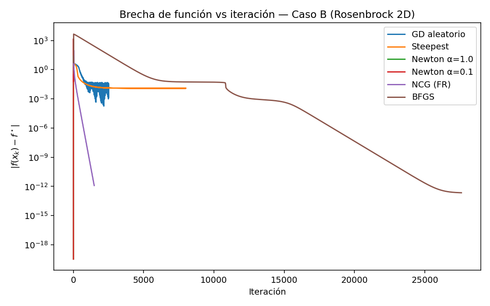
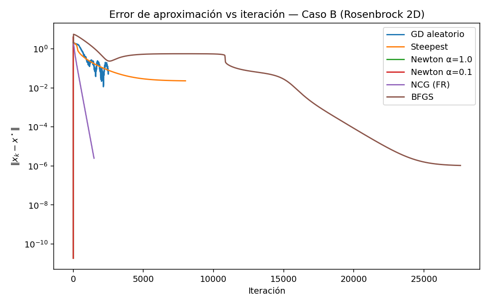
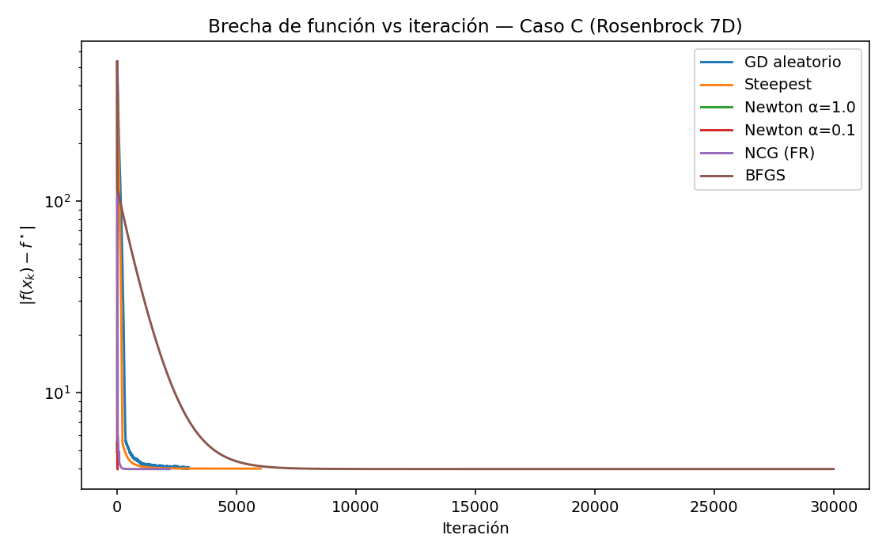
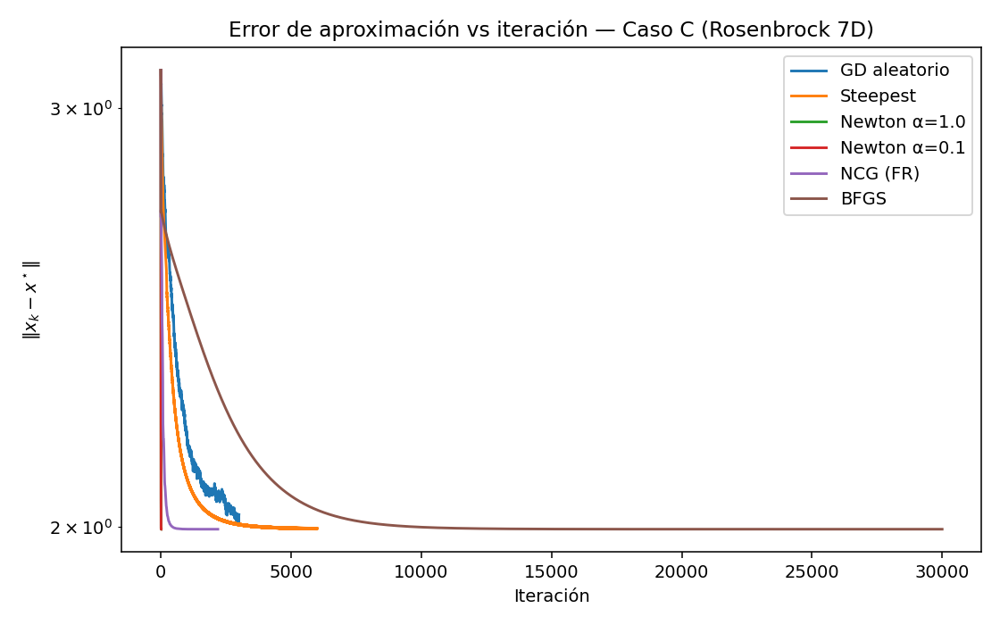
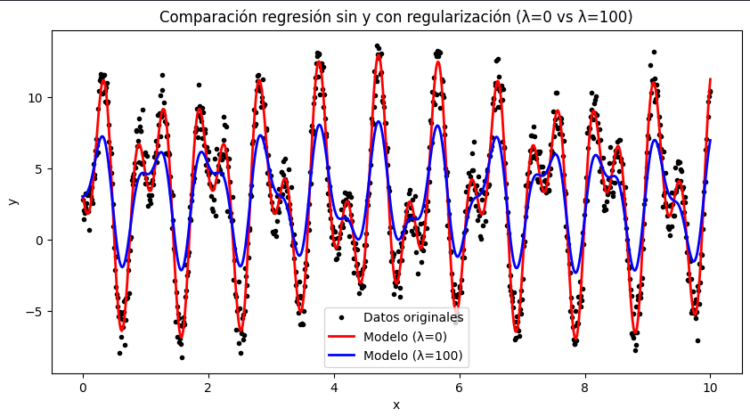

<!-- ---
header-includes:
  - \usepackage{amsmath}
  - \usepackage{amssymb}
  - \usepackage{fontspec}
  - \setmainfont{FiraCode Nerd Font}
  - \setmonofont{FiraCode Nerd Font Mono}
  - \usepackage{setspace}
  - \setstretch{1.5}
  - \usepackage{fvextra}
  - \DefineVerbatimEnvironment{Highlighting}{Verbatim}{breaklines,commandchars=\\\{\}}
  - \hypersetup{colorlinks=true, linkcolor=blue, urlcolor=blue}
  - \AtBeginEnvironment{longtable}{\small}
geometry: top=0.67in, bottom=0.67in, left=0.85in, right=0.85in
--- -->

# Laboratorio 3

Este laboratorio implementa y analiza distintos métodos de optimización basados en descenso por gradiente, incluyendo variantes deterministas, estocásticas y de segundo orden, así como su aplicación en problemas de funciones de prueba, búsqueda de múltiples mínimos y ajuste de modelos de regresión regularizada.

## Integrantes

- Abby Donis
- Cindy Gualim
- Josué Say

## Enlaces

- [Repositorio](https://github.com/JosueSay/labs-ms/tree/main/Labs/lab3)

# Problema 1

Implementar los siguientes métodos de descenso gradiente (naïve = tamaño de paso $\alpha$ constante):

- Descenso gradiente naïve con dirección de descenso aleatoria
- Descenso máximo naïve
- Descenso gradiente de Newton, con Hessiano exacto
- Un método de gradiente conjugado (Fletcher-Reeves, Hestenes-Stiefel, Polak-Ribière)
- Método BFGS.

En cada uno de los métodos, su función debe recibir los siguientes argumentos:

- La función objetivo $f$.
- El gradiente de la función objetivo $df$.
- El hessiano $ddf$ (cuando sea necesario).
- Un punto inicial $x_0 \in \mathbb{R}^n$.
- El tamaño de paso $\alpha > 0$.
- El número máximo de iteraciones $maxIter$.
- La tolerancia $\varepsilon$, así como un criterio de paro.

Como resultado, sus algoritmos deben devolver: la mejor solución encontrada *best* (la última de las aproximaciones calculadas); la secuencia de iteraciones $x_k$; la secuencia de valores $f(x_k)$; la secuencia de errores en cada paso (según el error de su criterio de paro).

Además, es deseable indicar el número de iteraciones efectuadas por el algoritmo, y si se obtuvo o no convergencia del método.

## Funciones auxiliares

### Función `norm(...)`

Esta función la usaremos para calcular errores con norma midiendo la longitud del vector en un espacio vectorial.

### Función `projOrth(...)`

Dado que tenemos el gradiente, debemos ir al negativo ($-\nabla f(x)$) de este para encontrar una válida dirección de descenso, pero también podemos tomar otras direccioens siempre que formen un ángulo menor de $90°$ con el gradiente.

Entonces para generar otras direcciones, se necesita un vector ortogonal al gradiente y combinarlo con un angulo $\phi$. Esta es la principal función de `projOrth`, con esta función vamos a recibir:

- `u`: punto de partida que luego se proyectará (vector).
- `b_orth`: esto es un vector al que se quiere ser ortogonal.

En caso que b tenga un valor de 1, indica que es un vector; si es mayor será una colección de vectores y queremos proyectar `u` a esto para que sea ortogonal a todos.

El proceso es que se normalizará del vector `b_orth` obteniendo un vector unitario `b` luego restamos al vector enviado a su proyección sobre `b` para asegurar que `v` sea ortogonal a `b`:

$$
v \leftarrow v - (v \cdot b) b
$$

Por último, debemos devolver un vector unitario ortogonal al `b_orth` pero si el vector `u` estaba casi alineado con `b_orth`, entonces al quitarle la proyección se queda en algo casi nulo ($\|v\| \approx 0$), y al normalizar esto ocurrirá un error numérica ($v / \|v\|$), por lo que debemos hacer una validación previa para retornar el vector:

- Si $ \|v\| \approx 0$: devolvemos `v` sin normalizar (es decir, un vector casi nulo, aunque no sea unitario).
- Si $ \|v\| > 0$: podemos normalizar con seguridad y devolvemos el vector unitario $v / \|v\|$.

> **Nota:** `v` es una copia del vector de partida `u` para no modificar el valor original enviado.

Esto lo utilizamos ya que las direcciones de descenso distintas al gradiente podemos tomar una dirección que forme un ángulo con el gradiente y para esto necesitamos:

$$
d = \cos(\phi)(-\hat g) + \sin(\phi) v
$$

donde:

- $-\hat g$ es el gradiente negativo unitario.
- $v$ es un vector unitario ortogonal al gradiente.

## Parámetros de entrada

1. **`f`**
   Función objetivo $f:\mathbb{R}^n\to\mathbb{R}$. Debe aceptar `np.array` y devolver escalar.

2. **`df`**
   Gradiente $\nabla f(x)$. Debe devolver `np.array` de shape `(n,)`.

3. **`x0`**
   Punto inicial `np.array` de shape `(n,)` (tipo float).

4. **`alpha`**
   Tamaño de paso constante $\alpha>0$.
   Grande => riesgo de divergencia; pequeño => lento.

5. **`maxIter`**
   Máximo de iteraciones (paro “duro”).

6. **`tol`**
   Tolerancia $\varepsilon>0$ (paro por precisión según `stopCrit`).

7. **`stopCrit`**
   Criterio de paro por tolerancia:

   - `"grad"`: $\|\nabla f(x_k)\|\le\varepsilon$
   - `"fx"`: $|f(x_k)-f(x_{k-1})|\le\varepsilon$
   - `"xAbs"`: $\|x_k-x_{k-1}\|\le\varepsilon$
   - `"xRel"`: $\|x_k-x_{k-1}\|/\max(1,\|x_k\|)\le\varepsilon$

8. **`normOrder`**
   Norma para medir gradiente/pasos/errores: `1`, `2` (default) o `np.inf`.

9. **`isPlottable`**
   `True` -> si $n=2$ guarda trayectoria para graficar.

10. **`randomState`**
    Semilla para reproducibilidad (afecta la dirección aleatoria y el muestreo de ángulos).

11. **`verbose`**
    `True` -> imprime resumen por iteración (`k`, `f(x_k)`, $\|\nabla f\|$, $\|step\|$, error, `phi`).

## Retornos

1. **`best`**

   Última aproximación $x_{k^*}$.

   - Tipo: `np.array` shape `(n,)`.

2. **`xs`**

   Secuencia de iterados $[x_0,\dots,x_{k^*}]$.

   - Tipo: `np.array` shape `(k^*+1, n)`.

3. **`fxs`**

   Valores de la función $[f(x_0),\dots,f(x_{k^*})]$.

   - Tipo: `np.array` shape `(k^*+1,)`.

4. **`errors`**

   Errores por iteración según `stopCrit` (grad, fx, xAbs, xRel).

   - Tipo: `np.array` shape `(k^*,)` — uno por paso realizado.

5. **`metrics`** (`dict`) — resumen para reporte/gráficas:

   - `method`: etiqueta del método usado.
   - `converged`: `True/False`.
   - `stopReason`: `"tolerance"` o `"maxIter"`.
   - `iterations`: $k^*$ (número de pasos realizados).
   - `finalX`: copia de `best`.
   - `finalFx`: $f(best)$.
   - `gradNorm`: $\|\nabla f(best)\|$ con `normOrder`.
   - `stepNorm`: $\|x_{k^*}-x_{k^*-1}\|$ (si $k^*>0$).
   - `approxError`: último error (según `stopCrit`).
   - `alpha`: tamaño de paso usado.
   - `timeSec`: tiempo total (segundos).
   - `seed`: `randomState` efectivo.
   - `history` (sub-dict con series):

     - `k`: array de iteraciones $[1,\dots,k^*]$.
     - `gradNorms`: $\|\nabla f(x_k)\|$ para $k=0,\dots,k^*$.
     - `stepNorms`: $\|x_k-x_{k-1}\|$ para $k=1,\dots,k^*$.
     - `approxErrors`: copia de `errors`.
     - `angles`: ángulo $\phi_k$ usado (si aplica).
     - `directions`: direcciones $d_k$ (si se guardan).
     - `xs2D`: trayectoria 2D (si `isPlottable` y $n=2$).

> Nota: `len(xs) = len(fxs) = k^*+1`, `len(errors) = len(stepNorms) = len(history['k']) = k^*`.
> Si el paro fue por tolerancia, `converged=True` y `stopReason="tolerance"`; si no, `"maxIter"`.

## Descenso gradiente naïve con dirección de descenso aleatoria y Descenso máximo naïve

### Funcionamiento

Esta función implementa descenso por gradiente con paso constante ($\alpha$) y dirección que puede ser:

- **Steepest**: $d_k=-\nabla f(x_k)$ (si `phiMode="fixed", phi=0`).
- **Ángulo fijo**: combina $-\hat g$ con un vector ortogonal (si `phiMode="fixed", phi!=0`).
- **Aleatoria**: toma $\phi\sim U(lo,hi)$ y combina $-\hat g$ con un ortogonal (si `phiMode="random"`).

La actualización siempre es:

$$
x_{k+1}=x_k+\alpha\,d_k
$$

### Flujo interno

1. **Configurar modo/ángulo**
   Fusiona `extra` con defaults. Si `random`, usará $\phi\in(lo,hi)$. Si `fixed`, usa $\phi=$ `phiFixed`.

2. **Estado inicial**

   - Normaliza formas, evalúa $f(x_0)$ y el gradiente $g_0=\nabla f(x_0)$.
   - Guarda historia para métricas (para gráficas si $n=2$).

3. **Bucle de iteraciones (k=1…maxIter)**

   a. Seleccionar $\phi$ (aleatorio o fijo).

   b. Construir dirección $d_k$:

   - Si $\|g_k\|$ \~ 0 -> usar $d_k=-g_k$ (ya se está en crítico).
   - Si no:

     - $\hat g = g_k/\|g_k\|$.
     - $v=\text{projOrth}(z,\hat g)$ (unitario y ortogonal a $\hat g$).
     - $d_k=\cos\phi(-\hat g)+\sin\phi\,v$.

     > Esto implementa el “abanico” de direcciones de descenso: ángulo < $90^\circ$ con $-\nabla f$.

   c. Paso naïve: $x_{k+1}=x_k+\alpha d_k$.

   d. Cálculo de error según `stopCrit`:

   - `"grad"`: $\|\nabla f(x_{k+1})\|$
   - `"fx"`: $|f(x_{k+1})-f(x_k)|$
   - `"xAbs"`: $\|x_{k+1}-x_k\|$
   - `"xRel"`: $\|x_{k+1}-x_k\|/\max(1,\|x_{k+1}\|)$

   e. Registro & verbose: guarda $x_{k+1}$, $f$, errores, $\phi$, $\|g\|$, $\|step\|$; imprime si `verbose`.

   f. Paro: si `err <= tol` -> `converged=True` y sale; si no, continúa.

4. **Métricas finales**
   Construye `metrics` con etiqueta del método (según `phiMode`/`phi`), convergencia, iteraciones, $\| \nabla f \|$, tiempos e historia.

### Parámetros de entrada

1. **`extra`** *(solo en `gradientDescentNaive` — los wrappers lo fijan internamente)*

    - `"phiMode"`: `"random"` (default) o `"fixed"`.
    - `"phi"`: ángulo fijo (radianes) si `"fixed"`; `0.0` ≡ *steepest descent*.
    - `"phiRange"`: `(lo, hi)` en radianes para `"random"`. Recom.: dentro de $(-π/2, π/2)$ para garantizar descenso.

> Nota: Los *wrappers*
>
> - `gradientDescentRandom(...)` fija `extra={"phiMode":"random"}` y no exponen `extra`.
> - `steepestDescent(...)` fija `extra={"phiMode":"fixed","phi":0.0}` y no exponen `extra`.
>   Ambos reciben el resto de parámetros (`alpha`, `maxIter`, `tol`, `stopCrit`, `normOrder`, `isPlottable`, `randomState`, `verbose`).

### Retornos

- `metrics.method`:

  - `"Steepest Descent (naive)"` (si `phiMode="fixed", phi=0`)
  - `"Gradient Descent (random direction naive)"` (si `phiMode="random"`)
  - `"Gradient Descent (fixed-angle naive)"` (si `phiMode="fixed", phi≠0`)
- `metrics.history.angles`: array con $\phi_k$ por iteración.
- Lo demás: **usa los retornos comunes**.

## Descenso gradiente de Newton, con Hessiano exacto

### Funcionamiento

El método de Newton minimiza $f$ usando un*modelo cuadrático local en $x_k$:

$$
m_k(d)=f(x_k)+\nabla f(x_k)^\top d+\tfrac12\, d^\top \nabla^2 f(x_k)\, d.
$$

Minimizar $m_k$ da la dirección de Newton como solución del sistema

$$
\nabla^2 f(x_k)\, d_k=-\nabla f(x_k).
$$

Luego se actualiza con paso constante $\alpha$ (típicamente $\alpha=1$):

$$
x_{k+1}=x_k+\alpha\, d_k.
$$

- Si el Hessiano es definido positivo (PD) en el entorno del mínimo, $d_k$ suele ser dirección de descenso ($\nabla f(x_k)^\top d_k<0$) y la convergencia cerca de la solución es cuadrática.
- Si el Hessiano es indefinido/mal condicionado, $d_k$ puede no ser de descenso; en ese caso se verifica $g^\top d<0$ y, si falla, se cambia a $d=-g$ (steepest) como respaldo para asegurar descenso.
- La dirección se obtiene resolviendo el sistema lineal; no se invierte la matriz salvo que se pida explícitamente.

### Flujo interno

1. **Validaciones de `extra`**

   - Requiere `extra["ddf"]`: `ddf(x)` o matriz constante $n\times n$.
   - `solveSystem{"solve","inv"}` (por defecto `"solve"`).

2. **Estado inicial**

   - Convierte `x0` a vector `float` de shape `(n,)`.
   - Evalúa $f(x_0)$ y $g_0=\nabla f(x_0)$.
   - Inicializa contenedores de historia (para métricas y, si $n=2$, trayectoria 2D).
   - `verbose` imprime resumen de $k=0$.

3. **Bucle (k = 1…maxIter)**

   a. **Hessiano**: $H_k=$ `ddf(x)` (o matriz fija).

   b. **Dirección de Newton**: resuelve $H_k d=-g_k$.

   - Si `solveSystem="solve"` usa `np.linalg.solve`.
   - Si falla (singular/indefinida), usa pseudo-inversa como respaldo.

   c. **Chequeo de descenso**: calcula $g_k^\top d$.

   - Si no es finito o $\ge 0$, cambia a $d=-g_k$.

   d. **Actualización**: `x_new = x + alpha*d`, `fx_new = f(x_new)`, `step = x_new - x`.

   e. **Error** según `stopCrit`:

   - `"grad"`: $\|\nabla f(x_{k+1})\|$
   - `"fx"`: $|f(x_{k+1})-f(x_k)|$
   - `"xAbs"`: $\|x_{k+1}-x_k\|$
   - `"xRel"`: $\|x_{k+1}-x_k\|/\max(1,\|x_{k+1}\|)$

   f. **Registro & verbose**: guarda series (gradNorms, stepNorms, errors, directions, …) e imprime si `verbose`.

   g. **Paro por tolerancia**: si `err <= tol`, marca `converged=True` y termina.

   h. **Avance**: asigna `x <- x_new`, `g <- df(x_new)` y continúa.

4. **Cierre y métricas**

   - Calcula tiempo total, número de iteraciones $k^*$ y arma `metrics` con:
     `method="Newton (exact Hessian, naive step)"`, `converged`, `stopReason`, `iterations`, `finalX`, `finalFx`, `gradNorm`, `stepNorm`, `approxError`, `alpha`, `timeSec`, `seed`, `solveSystem`, e `history` (sin ángulos: `angles=None`).

### Parámetros de entrada

1. **`extra`**

    - **`ddf`** *(requerido)*: Hessiano exacto. Puede ser:

      - *callable* `ddf(x)` -> retorna matriz $n\times n$.
      - Matriz fija `np.ndarray` $n\times n$ (solo si es constante).
    - **`solveSystem`**: `"solve"` (default) | `"inv"`.

      - `"solve"` usa `np.linalg.solve(H, -g)` (mejor numéricamente).
      - `"inv"` usa $d=-H^{-1}g$ (menos recomendado).

> Notas:
>
> - La implementación verifica $g^\top d<0$; si no se cumple (Hessiano no PD o mal condicionado), cambia a $d=-g$ como respaldo para asegurar dirección de descenso.
> - Si el sistema con $H$ falla, se usa pseudo-inversa como *fallback*.

### Retornos

- `metrics.method`: Newton (exact Hessian, naive step).
- `metrics.solveSystem`: `solve` o `inv` (cómo se resolvió $H d=-g$).
- `metrics.history.angles`: `None` (Newton no usa ángulos).
- Lo demás: **usa los retornos comunes**.

## Gradiente Conjugado (FR / PR / PR+ / HS)

### Funcionamiento

El Gradiente Conjugado no lineal (GC) acelera el descenso usando direcciones que combinan la información actual y la pasada:

$$
d_k = -g_k + \beta_k\, d_{k-1}, \quad g_k=\nabla f(x_k).
$$

Luego actualiza con paso constante (naïve):

$$
x_{k+1}=x_k+\alpha\, d_k.
$$

La elección de $\beta_k$ define la variante:

- **FR (Fletcher–Reeves):** $\displaystyle \beta^{FR}_{k+1}=\frac{\langle g_{k+1},g_{k+1}\rangle}{\langle g_k,g_k\rangle}$.
- **PR (Polak–Ribiere):** $\displaystyle \beta^{PR}_{k+1}=\frac{\langle g_{k+1},\, g_{k+1}-g_k\rangle}{\langle g_k,g_k\rangle}$.
- **PR+ (recortado):** $\beta^{PR+}_{k+1}=\max\{0,\beta^{PR}_{k+1}\}$.
- **HS (Hestenes–Stiefel):** $\displaystyle \beta^{HS}_{k+1}=\frac{\langle g_{k+1},\, y_k\rangle}{\langle d_k,\, y_k\rangle}$, $y_k=g_{k+1}-g_k$.

### Flujo interno

1. **Inicialización:**

   $x_0$ dado, $g_0=\nabla f(x_0)$, $d_0=-g_0$. Registrar historia.

2. **Iteración $k=1,\dots$:**

   a. **Paso naïve:** $x_{k}=x_{k-1}+\alpha\, d_{k-1}$.

   b. **Evaluar:** $f(x_k)$, $g_k=\nabla f(x_k)$ y el error según `stopCrit`.

   c. **Paro por tolerancia:** si `err <= tol`, detener.

   d. **Cálculo de $\beta$:** FR/PR/PR+/HS (con estabilizador en denominadores).

   e. **Reinicio opcional:** cada `restartEvery` pasos => $\beta=0$ (dirección = $-g_k$).

   f. **Asegurar descenso (opcional):** si `g_k^T d_k >= 0` => reiniciar $d_k=-g_k$.

### Parámetros de entrada

En `extra`:

- **`betaRule`**: `"FR"` (default) | `"PR"` | `"PR+"` | `"HS"`.
- **`restartEvery`**: `int` o `None`. Si es entero $m>0$, reinicia cada $m$ pasos (pone $d=-g$).
- **`denomEps`**: `float` (default `1e-15`). Pequeño $\epsilon$ para evitar divisiones numéricamente inestables.
- **`ensureDescent`**: `bool` (default `True`). Si $g^\top d \ge 0$, fuerza reinicio a $d=-g$.

> El resto de entradas (`f, df, x0, alpha, maxIter, tol, stopCrit, normOrder, isPlottable, randomState, verbose`) son **comunes**.

### Retornos

Usa los **retornos comunes** y añade:

- `metrics.method`: `"Nonlinear Conjugate Gradient (naive, {betaRule})"`.
- `metrics.betaRule`: regla seleccionada.
- `metrics.restartEvery`: valor usado (o `None`).
- `metrics.restarts`: número de reinicios efectuados.
- `metrics.ensureDescent`: `True/False`.
- `metrics.history.betas`: serie de $\beta_k$.
- `metrics.history.angles`: `None` (GC no usa ángulos).
- `metrics.history.directions`: direcciones $d_k$ registradas.

## Método BFGS (cuasi-Newton)

### Funcionamiento

BFGS aproxima iterativamente la inversa del Hessiano $H_k \approx \nabla^2 f(x_k)^{-1}$ para construir una dirección tipo Newton sin calcular $\nabla^2 f$ explícito:

$$
d_k = -\,H_k\,g_k,\quad g_k=\nabla f(x_k),
\qquad
x_{k+1}=x_k+\alpha\,d_k \ \ (\alpha>0 \ \text{constante, naïve})
$$

Tras el paso, actualiza $H_k$ usando solo primeras derivadas con el par

$$
s_k = x_{k+1}-x_k,\qquad y_k = g_{k+1}-g_k,
$$

aplicando la fórmula BFGS (garantiza $H_{k+1}$ simétrica y, si $s_k^\top y_k>0$, definida positiva):

$$
H_{k+1} = \big(I-\rho_k s_k y_k^\top\big) H_k \big(I-\rho_k y_k s_k^\top\big) + \rho_k\, s_k s_k^\top,
\quad \rho_k=\frac{1}{y_k^\top s_k}.
$$

### Flujo interno

1. **Inicialización**

   $x_0$ dado, $H_0=I$ (o matriz SPD provista), $g_0=\nabla f(x_0)$.

2. **Dirección**

   $d_k=-H_k g_k$. (Opcional: si $g_k^\top d_k\ge 0$, forzar $d_k=-g_k$ para asegurar descenso).

3. **Paso (naive)**

   $x_{k+1}=x_k+\alpha d_k$.

4. **Actualización de memoria**

   $s_k=x_{k+1}-x_k$, $y_k=g_{k+1}-g_k$.

   - **Curvatura**: si $y_k^\top s_k \le \varepsilon$ (muy pequeño/no positivo) se omite la actualización para evitar perder SPD.
   - Si pasa el umbral: aplicar fórmula BFGS y simetrizar numéricamente $H_{k+1}\leftarrow \tfrac12(H_{k+1}+H_{k+1}^\top)$.

5. **Criterios de paro**

   Según `stopCrit` (norma del gradiente, cambio en $f$, o en $x$), o por `maxIter`.

### Parámetros de entrada

- **`H0`**: inversa-Hessiana inicial $(n\times n)$. *Default:* $I$.
- **`skipUpdateIf`**: umbral para $y_k^\top s_k$ (p.ej. `1e-12`). Si $\le$ umbral, no se actualiza $H$.
- **`ensureDescent`** (`True/False`): si $g_k^\top d_k \ge 0$, usar $d_k=-g_k$ (respaldo de descenso).

> El resto (`f, df, x0, alpha, maxIter, tol, stopCrit, normOrder, isPlottable, randomState, verbose`) son **comunes**.

### Retornos

Usa los **retornos comunes** y añade:

- `metrics.method`: `"BFGS (naive step)"`.
- `metrics.skipUpdateIf`, `metrics.ensureDescent`.
- `metrics.history.directions`: direcciones $d_k$.
- `metrics.history.angles`: `None` (no usa ángulos).

# Problema 2

## Metodología

- **Implementación unificada de métodos.** Se programó GD aleatorio/steepest, Newton (Hessiano exacto), NCG (FR/PR/PR+/HS) y BFGS que retornaba `(best, xs, fxs, errors, metrics)`; `metrics.history` guardaba series ($||\nabla f||$, pasos, errores, direcciones, etc.).
- **Ejecuciones por caso (A/B/C).** Para cada método se crearon funciones de tipo `collect*Results(...)` que ejecutaban todas las funciones con sus hiperparámetros y devolvían un diccionario por caso.
- **Trazabilidad y reproducibilidad.** Se serializaron los resultados con `writeIndividualLogs(...)` a `.log (JSON)` por método y caso en `log/`, usando **semilla fija 22801**.
- **Visualización 2D.** Con `plotConvergencePath(...)` se generaron curvas de nivel y trayectorias para los casos 2D (A y B).
- **Gráficas comparativas.** Con `extractSeries`, `plotCaseMetric` y `plotAllComparisons` se construyeron, por caso, comparativas de tres métricas:
  $|x_k-x^\star|$ (error de aproximación), $|\nabla f(x_k)|$ (criterio de paro) y $|f(x_k)-f^\star|$ (brecha de función), que se guardaron en `plots/`.
- **Tablas de resultados.** Con `tabulate` y `buildCaseTable` se elaboraron tablas dentro de un `.md` por caso con:

  - convergencia
  - iteraciones
  - $\alpha$
  - técnica/notas
  - solución
  - error
  - $||\nabla f||$
  - final
  - f(best)
  - tiempo
- **Selección de parámetros.** Se ajustaron manualmente $\alpha$, tolerancias y `maxIter` para observar convergencia o estancamiento bajo paso constante y `stopCrit="grad"`.
- **Estructura de artefactos.** Las imágenes por método (para trazas puntuales), gráficas comparativas (cuerpo del reporte) y logs (anexo) se organizaron según el árbol mostrado.

Testar sus algoritmos del Ejercicio 1 con las siguientes funciones:

## Inciso a

La función $f : \mathbb{R}^2 \to \mathbb{R}$, dada por

$$
f(x, y) = x^4 + y^4 - 4xy + \frac{1}{2}y + 1.
$$

Punto inicial: $x_0 = (-3, 1)^T$, Óptimo: $x^* = (-1.01463, -1.04453)^T, \; f(x^*) = -1.51132$.

### Descenso gradiente naïve con dirección de descenso aleatoria

### Descenso máximo naïve

### Descenso gradiente de Newton, con Hessiano exacto

**$\alpha$ = 1.0**

**$\alpha$ = 0.1**

### Método de gradiente conjugado (Fletcher-Reeves)

### Método BFGS

## Inciso b

La función de Rosembrock 2-dimensional $f : \mathbb{R}^2 \to \mathbb{R}$, dada por

$$
f(x_1, x_2) = 100(x_2 - x_1^2)^2 + (1 - x_1)^2.
$$

Punto inicial: $x_0 = (-1.2, 1)^T$, Óptimo: $x^* = (1, 1)^T, \; f(x^*) = 0$.

### Descenso gradiente naïve con dirección de descenso aleatoria

### Descenso máximo naïve

### Descenso gradiente de Newton, con Hessiano exacto

**$\alpha$ = 1.0**

**$\alpha$ = 0.1**

### Método de gradiente conjugado (Fletcher-Reeves)

### Método BFGS

## Inciso c

La función de Rosembrock 7-dimensional $f : \mathbb{R}^7 \to \mathbb{R}$, dada por

$$
f(x) = \sum_{i=1}^6 100(x_{i+1} - x_i^2)^2 + (1 - x_i)^2.
$$

Punto inicial: $x_0 = (-1.2, 1, 1, 1, 1, -1.2, 1)^T$, Óptimo: $x^* = (1, 1, \dots, 1)^T, \; f(x^*) = 0$.

>**Nota:** Esta función no se puede graficar pero se adjunta en el jupyter notebook datos para observar que ocurrio con esta función.

## Análisis

### Tabla comparativa

En conjunto, los resultados reflejan claramente lo que se esperaría según la geometría de las funciones y la naturaleza de cada método con paso constante:

- **Newton:** destaca tanto en número de iteraciones como en tiempo porque aprovecha información de curvatura.

  - En **A**, Newton converge rápido, pero con $\alpha=1$ puede desviarse hacia otra cuenca de atracción y quedarse en un mínimo distinto del teórico (aproximadamente $[0.983,0.950]$, $f \approx -0.512$). Al reducir el paso ($\alpha=0.1$), la secuencia se mantiene en la cuenca correcta y alcanza el óptimo esperado.
  - En **B**, cerca de $(1,1)$, la función se comporta casi como cuadrática, lo que permite que Newton, con $\alpha=1$ o $0.1$, llegue al mínimo en apenas 6 pasos.
  - En **C**, el valle tipo Rosenbrock de alta dimensión es muy mal condicionado: incluso con gradientes pequeños, el descenso en $f$ es lento y se observan estancamientos en valores que no son mínimos, lo que refleja una topografía prácticamente plana en algunas direcciones.

- **Gradiente (steepest y dirección aleatoria):** con parámetros constantes, no logra converger dentro del límite de iteraciones.

  - Con $\alpha=0.01$, el método oscila por el valle, manteniendo errores entre $10^{-1}$ y $10^{0}$ en A/B/C.
  - Reducir aún más $\alpha$ permite avanzar, pero la norma del gradiente disminuye tan lentamente que se agota el número máximo de iteraciones sin alcanzar la tolerancia.

- **Conjugado no lineal:**

  - La variante **FR** es la única que converge de manera estable en los tres casos con $\alpha$ fijo, porque su $\beta$ depende solo de las normas de gradiente y no se ve afectada por la falta de búsqueda en línea.
  - Por el contrario, **PR/PR$^+$/HS**, que dependen de diferencias $g_{k+1}-g_k$ y productos $d_k^\top y_k$, son muy sensibles al tamaño del paso y a la curvatura del valle tipo Rosenbrock. Esto puede generar signos o denominadores adversos que rompen la dirección de descenso y provocan reinicios frecuentes. Por eso, en tus pruebas solo PR logró converger en $f_a$, mientras que FR funcionó en los tres casos.

- **BFGS:** muestra sus limitaciones con $\alpha$ constante:

  - Cuando $y_k^\top s_k$ es pequeño (valles planos), la actualización se omite para mantener $H_k$ positiva definida.
  - Al no captar bien la curvatura, $H_k$ queda cerca de la identidad y el método se comporta como un gradiente mal preacondicionado.
  - En **A/B**, eventualmente converge, pero requiere miles de pasos; en **C**, se estanca y no alcanza la tolerancia pese a $30{,}000$ iteraciones, lo que coincide con un $y_k^\top s_k$ casi nulo a lo largo del recorrido.

### Gráficas de errores

La pendiente de las curvas indica la **tasa de convergencia**, mientras que los cruces muestran qué método domina en cada tramo. Las tres métricas —$|x_k-x^\star|$, $|\nabla f(x_k)|$ y $|f(x_k)-f^\star|$— se corroboran entre sí: cuando las dos primeras disminuyen rápidamente, la tercera también lo hace, salvo en los casos donde el método se estaciona fuera del óptimo.

**Caso A ($f_a$)**

1. **Newton ($\alpha=0.1$) y NCG (FR)**

   - Presentan caídas casi verticales en las tres métricas.
   - Alcanzan el óptimo con $|x_k-x^\star| \sim 10^{-6}$ (curvas moradas/rojas).

2. **Newton ($\alpha=1$)**

   - Reduce rápidamente $|\nabla f|$ y $|f-f^\star|$.
   - Sin embargo, el **error en $x$** no disminuye de la misma forma; converge a un crítico distinto del teórico (curva verde no coincide en $|x_k-x^\star|$).

3. **BFGS**

   - Desciende de manera casi lineal en escala logarítmica (curva marrón), pero más lentamente que Newton y NCG.

4. **Steepest y GD aleatorio**

   - Se aplanan pronto y oscilan cerca del valle.
   - Se observan mesetas en $|\nabla f|$ y $|x_k-x^\star|$.

**Caso B (Rosenbrock 2D)**

1. **Newton**

   - Domina claramente, alcanzando precisión de máquina en aproximadamente 6 iteraciones para $|f-f^\star|$, $|\nabla f|$ y $|x_k-x^\star|$.

2. **NCG (FR)**

   - Presenta un descenso monótono con pendiente constante en escala logarítmica.
   - Llega a $|x_k-x^\star| \sim 10^{-6}$ alrededor de $1.5\times10^3$ iteraciones.

3. **BFGS**

   - Reduce todas las métricas lentamente; se observan tramos casi planos en $|\nabla f|$.

4. **Steepest y GD aleatorio**

   - Se estancan en un rango de $\sim10^{-2}$ a $10^0$.

**Caso C (Rosenbrock 7D)**

1. **Newton ($\alpha=0.1$) y NCG (FR)**

   - Norma del gradiente $|\nabla f|$ cae a $10^{-8}$.
   - Sin embargo, $|f-f^\star|$ se estanca alrededor de 4 y $|x_k-x^\star|$ no baja de \~2.
   - Esto indica que ambos métodos alcanzan una **zona casi estacionaria** lejos del óptimo, consistente con un valle plano y muy mal condicionado.
   - El paro por norma de gradiente explica esta situación.

2. **BFGS**

   - Desciende muy lentamente en las tres métricas.
   - No logra acercarse a la vecindad del óptimo.

3. **Steepest y GD aleatorio**

   - Quedan rápidamente en mesetas altas, lejos de cualquier mínimo significativo.

#### Resumen

- **Caso A:**

  - Más efectivos: **Newton ($\alpha=0.1$)** y **NCG (FR)**.
  - **Newton ($\alpha=1$)** converge a otro crítico distinto.

- **Caso B:**

  - Método claramente superior: **Newton**.
  - Segundo lugar: **NCG (FR)**.
  - **BFGS** llega al óptimo, pero más lentamente.

- **Caso C:**

  - Ningún método alcanza el óptimo.
  - **Newton ($\alpha=0.1$)** y **NCG (FR)** minimizan la norma del gradiente, pero quedan atrapados lejos en valor de $f$ y distancia a $x^\star$.

# Problema 4

Considere el siguiente conjunto de datos que se incluye en el archivo **datos_lab3.csv**. Estos datos corresponden a una serie de tiempo.

Se quiere realizar un modelo de regresión de la forma

$$
y = \beta_0 + \beta_1 x + \beta_2 x^2 + \beta_3 \sin(7x) + \beta_4 \sin(13x),
$$

que explique la relación entre las variables $x$ y $y$.

Para ello, vamos a formular un problema de optimización en la variable vectorial

$$
\beta = (\beta_0, \beta_1, \beta_2, \beta_3, \beta_4) \in \mathbb{R}^5.
$$

Hallar el modelo de regresión corresponde a hallar el vector $\beta$ que minimiza la función de error regularizada

$$
E_\lambda(\beta) = \sum_{i=1}^{n} \left( f(x_i) - y_i \right)^2 + \lambda \sum_{i=1}^{n-1} \left( f(x_{i+1}) - f(x_i) \right)^2.
$$

Implementamos en Python un algoritmo de optimización para resolver el problema de regresión en los siguientes 3 casos:

## Detalles de implementación comunes

- **Lectura de datos**: `pandas.read_csv("datos_lab3.csv")` para obtener vectores `x` y `y`.
- **Matriz de diseño**: construimos $X \in \mathbb{R}^{n\times 5}$ con columnas
  $[1,\; x,\; x^2,\; \sin(7x),\; \sin(13x)]$.
- **Ordenamiento por tiempo**: como el término de suavidad usa diferencias $f(x_{i+1})-f(x_i)$, aseguramos que los datos estén **ordenados por $x$** (series de tiempo) antes de formar la matriz de diferencias $D$.
- **Estabilidad numérica**: cuando resolvimos sistemas, preferimos resolver con
  `np.linalg.solve(A, b)` o `np.linalg.pinv(A) @ b` sobre invertir matrices explícitamente.
- **Gráficas**: comparamos datos originales vs. predicciones para cada $\lambda$ en la misma figura.

## Inciso a: $\lambda = 0$

En este caso no hay regularización, por lo que la solución corresponde a una **regresión lineal múltiple clásica**.  
Se resolvió el sistema utilizando la ecuación normal:

$$
\beta = (X^T X)^{-1} X^T y,
$$

donde $X$ es la matriz de diseño con las columnas correspondientes a $1$, $x$, $x^2$, $\sin(7x)$ y $\sin(13x)$.

**Resultado gráfico:**

<!--  -->

Se observa que el modelo se ajusta mucho a los datos, pero también sigue el ruido, lo cual representa un **sobreajuste**.

## Inciso b: $\lambda = 100$

Aquí se introduce la **regularización de Tychonoff**, añadiendo el término:

$$
\lambda \sum_{i=1}^{n-1} (f(x_{i+1}) - f(x_i))^2,
$$

que penaliza variaciones bruscas en las predicciones.  
Se implementó creando una matriz de diferencias $D$ para medir las variaciones entre puntos consecutivos, y se resolvió:

$$
\beta = (X^T X + \lambda (DX)^T(DX))^{-1} X^T y.
$$

**Resultado gráfico:**

<!--  -->

La curva azul muestra un ajuste más **suave**, que reduce el sobreajuste y capta mejor la tendencia general de los datos.

## Inciso c: $\lambda = 500$

Se repitió el procedimiento anterior con un valor mayor de $\lambda$, lo que impone un mayor peso a la suavidad en comparación con el ajuste exacto a los datos.

**Resultado gráfico con los tres casos:**

<!--  -->

En verde, el modelo con $\lambda=500$ es aún más **suave**, perdiendo detalle de las oscilaciones, pero mostrando claramente la tendencia global.

## Conclusiones

- La constante de regularización $\lambda$ controla el balance entre el ajuste a los datos y la suavidad del modelo.
- **$\lambda = 0$**: el modelo se ajusta exactamente a los datos, pero también al ruido (**sobreajuste**).  
- **$\lambda = 100$**: se obtiene un buen compromiso entre ajuste y suavidad, capturando la tendencia de los datos sin oscilar demasiado.  
- **$\lambda = 500$**: el modelo prioriza la suavidad, pierde detalle fino, pero evita el sobreajuste y sigue la tendencia global.  

En problemas reales de series de tiempo, elegir un valor intermedio de $\lambda$ es recomendable para **generalizar mejor** y no depender del ruido de los datos.
