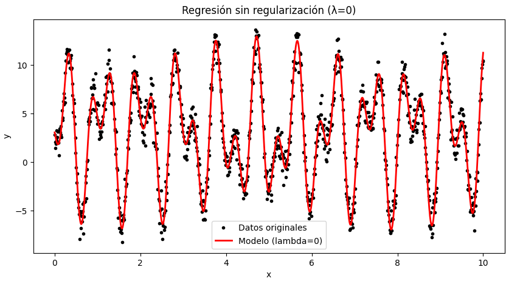
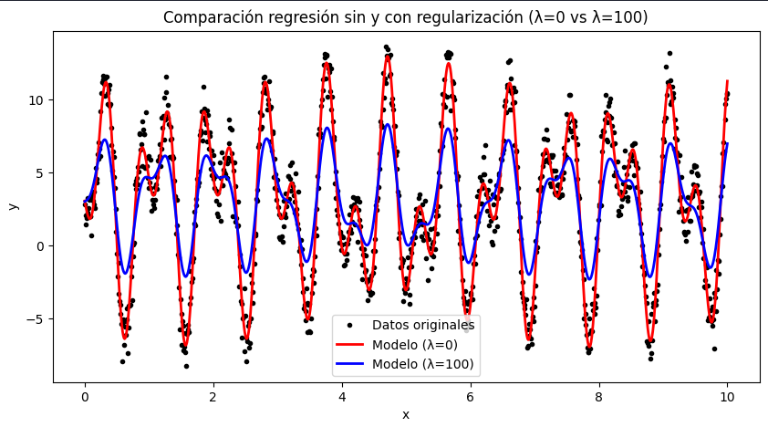
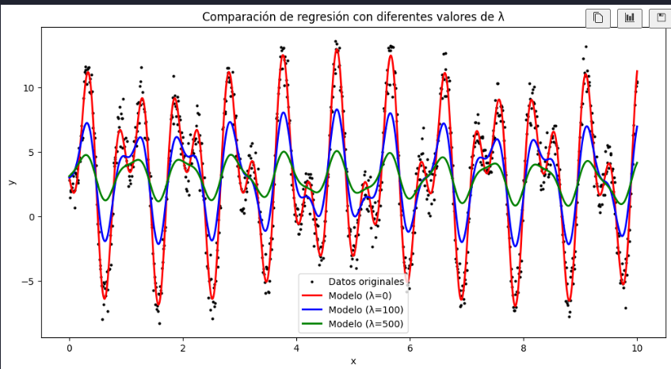

# Problema 4

Considere el siguiente conjunto de datos que se incluye en el archivo **datos_lab3.csv**. Estos datos corresponden a una serie de tiempo.

Se quiere realizar un modelo de regresión de la forma

$$
y = \beta_0 + \beta_1 x + \beta_2 x^2 + \beta_3 \sin(7x) + \beta_4 \sin(13x),
$$

que explique la relación entre las variables $x$ y $y$.

Para ello, vamos a formular un problema de optimización en la variable vectorial

$$
\beta = (\beta_0, \beta_1, \beta_2, \beta_3, \beta_4) \in \mathbb{R}^5.
$$

Hallar el modelo de regresión corresponde a hallar el vector $\beta$ que minimiza la función de error regularizada

$$
E_\lambda(\beta) = \sum_{i=1}^{n} \left( f(x_i) - y_i \right)^2 + \lambda \sum_{i=1}^{n-1} \left( f(x_{i+1}) - f(x_i) \right)^2.
$$

Implementamos en Python un algoritmo de optimización para resolver el problema de regresión en los siguientes 3 casos:

## Detalles de implementación comunes

- **Lectura de datos**: `pandas.read_csv("datos_lab3.csv")` para obtener vectores `x` y `y`.
- **Matriz de diseño**: construimos $X \in \mathbb{R}^{n\times 5}$ con columnas
  $[1,\; x,\; x^2,\; \sin(7x),\; \sin(13x)]$.
- **Ordenamiento por tiempo**: como el término de suavidad usa diferencias $f(x_{i+1})-f(x_i)$, aseguramos que los datos estén **ordenados por $x$** (series de tiempo) antes de formar la matriz de diferencias $D$.
- **Estabilidad numérica**: cuando resolvimos sistemas, preferimos resolver con
  `np.linalg.solve(A, b)` o `np.linalg.pinv(A) @ b` sobre invertir matrices explícitamente.
- **Gráficas**: comparamos datos originales vs. predicciones para cada $\lambda$ en la misma figura.

## Inciso a: $\lambda = 0$

En este caso no hay regularización, por lo que la solución corresponde a una **regresión lineal múltiple clásica**.  
Se resolvió el sistema utilizando la ecuación normal:

$$
\beta = (X^T X)^{-1} X^T y,
$$

donde $X$ es la matriz de diseño con las columnas correspondientes a $1$, $x$, $x^2$, $\sin(7x)$ y $\sin(13x)$.

**Resultado gráfico:**

<!--  -->

Se observa que el modelo se ajusta mucho a los datos, pero también sigue el ruido, lo cual representa un **sobreajuste**.

## Inciso b: $\lambda = 100$

Aquí se introduce la **regularización de Tychonoff**, añadiendo el término:

$$
\lambda \sum_{i=1}^{n-1} (f(x_{i+1}) - f(x_i))^2,
$$

que penaliza variaciones bruscas en las predicciones.  
Se implementó creando una matriz de diferencias $D$ para medir las variaciones entre puntos consecutivos, y se resolvió:

$$
\beta = (X^T X + \lambda (DX)^T(DX))^{-1} X^T y.
$$

**Resultado gráfico:**

<!--  -->

La curva azul muestra un ajuste más **suave**, que reduce el sobreajuste y capta mejor la tendencia general de los datos.

## Inciso c: $\lambda = 500$

Se repitió el procedimiento anterior con un valor mayor de $\lambda$, lo que impone un mayor peso a la suavidad en comparación con el ajuste exacto a los datos.

**Resultado gráfico con los tres casos:**

<!--  -->

En verde, el modelo con $\lambda=500$ es aún más **suave**, perdiendo detalle de las oscilaciones, pero mostrando claramente la tendencia global.

## Conclusiones

- La constante de regularización $\lambda$ controla el balance entre el ajuste a los datos y la suavidad del modelo.
- **$\lambda = 0$**: el modelo se ajusta exactamente a los datos, pero también al ruido (**sobreajuste**).  
- **$\lambda = 100$**: se obtiene un buen compromiso entre ajuste y suavidad, capturando la tendencia de los datos sin oscilar demasiado.  
- **$\lambda = 500$**: el modelo prioriza la suavidad, pierde detalle fino, pero evita el sobreajuste y sigue la tendencia global.  

En problemas reales de series de tiempo, elegir un valor intermedio de $\lambda$ es recomendable para **generalizar mejor** y no depender del ruido de los datos.
