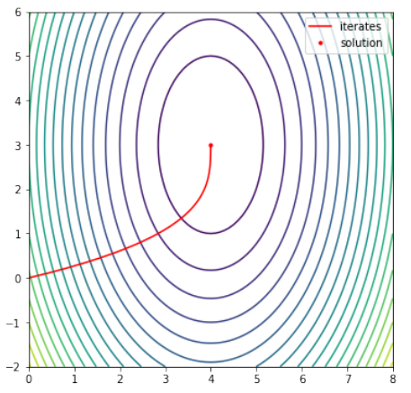

# Problema 2

Testar sus algoritmos del Ejercicio 1 con las siguientes funciones:

## Inciso a

La función $f : \mathbb{R}^2 \to \mathbb{R}$, dada por

$$
f(x, y) = x^4 + y^4 - 4xy + \frac{1}{2}y + 1.
$$

Punto inicial: $x_0 = (-3, 1, -3, 1)^T$, Óptimo: $x^* = (-1.01463, -1.04453)^T, \; f(x^*) = -1.51132$.

## Inciso b

La función de Rosembrock 2-dimensional $f : \mathbb{R}^2 \to \mathbb{R}$, dada por

$$
f(x_1, x_2) = 100(x_2 - x_1^2)^2 + (1 - x_1)^2.
$$

Punto inicial: $x_0 = (-1.2, 1)^T$, Óptimo: $x^* = (1, 1)^T, \; f(x^*) = 0$.

## Inciso c

La función de Rosembrock 7-dimensional $f : \mathbb{R}^7 \to \mathbb{R}$, dada por

$$
f(x) = \sum_{i=1}^6 100(x_{i+1} - x_i^2)^2 + (1 - x_i)^2.
$$

Punto inicial: $x_0 = (-1.2, 1, 1, 1, 1, -1.2, 1)^T$, Óptimo: $x^* = (1, 1, \dots, 1)^T, \; f(x^*) = 0$.

Para las funciones 2D, muestre visualizaciones de la secuencia de aproximaciones $\{x_k\}$ convergiendo al mínimo local de su función.

En cada uno de los casos, hallar un tamaño de paso $\alpha$ que garantice la convergencia de los métodos, y elabore una tabla comparativa de los resultados, error, número de iteraciones requeridas por cada método. Por ejemplo:

| Algoritmo de optimización    | Convergencia (Sí/No) | Número de Iteraciones | Solución | Error |
| ---------------------------- | -------------------- | --------------------- | -------- | ----- |
| Descenso gradiente           |                      |                       |          |       |
| Descenso gradiente aleatorio |                      |                       |          |       |
| Descenso máximo              |                      |                       |          |       |
| Descenso de Newton           |                      |                       |          |       |
| Fletcher-Reeves              |                      |                       |          |       |
| BFGS                         |                      |                       |          |       |

Elabore gráficas que muestren el error de aproximación, en función del número de iteración, y muestre la comparación de la evolución de la convergencia en sus cinco métodos. A partir de estas gráficas, discuta cuál de los métodos es más efectivo, en cada caso. Para ello, debe tomar en cuenta:

- La solución aproximada obtenida
- El error de aproximación
- La norma del gradiente en la solución
