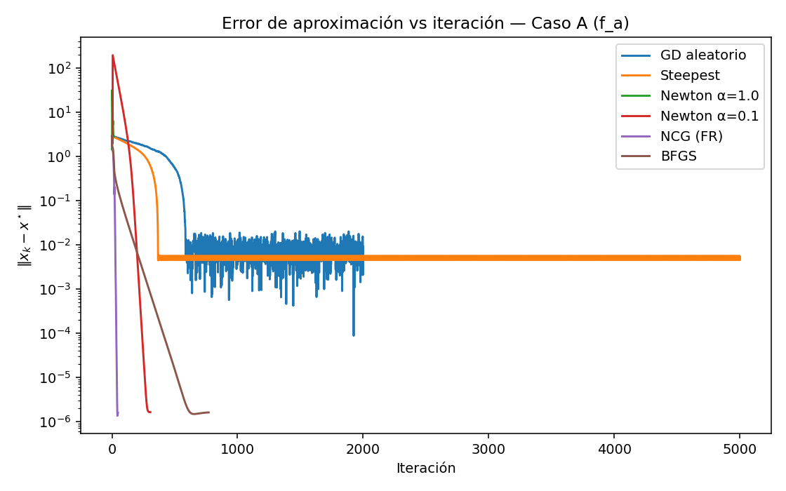

# Problema 2

## Metodología

- **Implementación unificada de métodos.** Se programó GD aleatorio/steepest, Newton (Hessiano exacto), NCG (FR/PR/PR+/HS) y BFGS que retornaba `(best, xs, fxs, errors, metrics)`; `metrics.history` guardaba series ($||\nabla f||$, pasos, errores, direcciones, etc.).
- **Ejecuciones por caso (A/B/C).** Para cada método se crearon funciones de tipo `collect*Results(...)` que ejecutaban todas las funciones con sus hiperparámetros y devolvían un diccionario por caso.
- **Trazabilidad y reproducibilidad.** Se serializaron los resultados con `writeIndividualLogs(...)` a `.log (JSON)` por método y caso en `log/`, usando **semilla fija 22801**.
- **Visualización 2D.** Con `plotConvergencePath(...)` se generaron curvas de nivel y trayectorias para los casos 2D (A y B).
- **Gráficas comparativas.** Con `extractSeries`, `plotCaseMetric` y `plotAllComparisons` se construyeron, por caso, comparativas de tres métricas:
  $|x_k-x^\star|$ (error de aproximación), $|\nabla f(x_k)|$ (criterio de paro) y $|f(x_k)-f^\star|$ (brecha de función), que se guardaron en `plots/`.
- **Tablas de resultados.** Con `tabulate` y `buildCaseTable` se elaboraron tablas dentro de un `.md` por caso con:

  - convergencia
  - iteraciones
  - $\alpha$
  - técnica/notas
  - solución
  - error
  - $||\nabla f||$
  - final
  - f(best)
  - tiempo
- **Selección de parámetros.** Se ajustaron manualmente $\alpha$, tolerancias y `maxIter` para observar convergencia o estancamiento bajo paso constante y `stopCrit="grad"`.
- **Estructura de artefactos.** Las imágenes por método (para trazas puntuales), gráficas comparativas (cuerpo del reporte) y logs (anexo) se organizaron según el árbol mostrado.

Testar sus algoritmos del Ejercicio 1 con las siguientes funciones:

## Inciso a

La función $f : \mathbb{R}^2 \to \mathbb{R}$, dada por

$$
f(x, y) = x^4 + y^4 - 4xy + \frac{1}{2}y + 1.
$$

Punto inicial: $x_0 = (-3, 1)^T$, Óptimo: $x^* = (-1.01463, -1.04453)^T, \; f(x^*) = -1.51132$.

### Descenso gradiente naïve con dirección de descenso aleatoria

### Descenso máximo naïve

### Descenso gradiente de Newton, con Hessiano exacto

**$\alpha$ = 1.0**

**$\alpha$ = 0.1**

### Método de gradiente conjugado (Fletcher-Reeves)

### Método BFGS

## Inciso b

La función de Rosembrock 2-dimensional $f : \mathbb{R}^2 \to \mathbb{R}$, dada por

$$
f(x_1, x_2) = 100(x_2 - x_1^2)^2 + (1 - x_1)^2.
$$

Punto inicial: $x_0 = (-1.2, 1)^T$, Óptimo: $x^* = (1, 1)^T, \; f(x^*) = 0$.

### Descenso gradiente naïve con dirección de descenso aleatoria

### Descenso máximo naïve

### Descenso gradiente de Newton, con Hessiano exacto

**$\alpha$ = 1.0**

**$\alpha$ = 0.1**

### Método de gradiente conjugado (Fletcher-Reeves)

### Método BFGS

## Inciso c

La función de Rosembrock 7-dimensional $f : \mathbb{R}^7 \to \mathbb{R}$, dada por

$$
f(x) = \sum_{i=1}^6 100(x_{i+1} - x_i^2)^2 + (1 - x_i)^2.
$$

Punto inicial: $x_0 = (-1.2, 1, 1, 1, 1, -1.2, 1)^T$, Óptimo: $x^* = (1, 1, \dots, 1)^T, \; f(x^*) = 0$.

>**Nota:** Esta función no se puede graficar pero se adjunta en el jupyter notebook datos para observar que ocurrio con esta función.

## Análisis

### Tabla comparativa

En conjunto, los resultados reflejan claramente lo que se esperaría según la geometría de las funciones y la naturaleza de cada método con paso constante:

- **Newton:** destaca tanto en número de iteraciones como en tiempo porque aprovecha información de curvatura.

  - En **A**, Newton converge rápido, pero con $\alpha=1$ puede desviarse hacia otra cuenca de atracción y quedarse en un mínimo distinto del teórico (aproximadamente $[0.983,0.950]$, $f \approx -0.512$). Al reducir el paso ($\alpha=0.1$), la secuencia se mantiene en la cuenca correcta y alcanza el óptimo esperado.
  - En **B**, cerca de $(1,1)$, la función se comporta casi como cuadrática, lo que permite que Newton, con $\alpha=1$ o $0.1$, llegue al mínimo en apenas 6 pasos.
  - En **C**, el valle tipo Rosenbrock de alta dimensión es muy mal condicionado: incluso con gradientes pequeños, el descenso en $f$ es lento y se observan estancamientos en valores que no son mínimos, lo que refleja una topografía prácticamente plana en algunas direcciones.

- **Gradiente (steepest y dirección aleatoria):** con parámetros constantes, no logra converger dentro del límite de iteraciones.

  - Con $\alpha=0.01$, el método oscila por el valle, manteniendo errores entre $10^{-1}$ y $10^{0}$ en A/B/C.
  - Reducir aún más $\alpha$ permite avanzar, pero la norma del gradiente disminuye tan lentamente que se agota el número máximo de iteraciones sin alcanzar la tolerancia.

- **Conjugado no lineal:**

  - La variante **FR** es la única que converge de manera estable en los tres casos con $\alpha$ fijo, porque su $\beta$ depende solo de las normas de gradiente y no se ve afectada por la falta de búsqueda en línea.
  - Por el contrario, **PR/PR$^+$/HS**, que dependen de diferencias $g_{k+1}-g_k$ y productos $d_k^\top y_k$, son muy sensibles al tamaño del paso y a la curvatura del valle tipo Rosenbrock. Esto puede generar signos o denominadores adversos que rompen la dirección de descenso y provocan reinicios frecuentes. Por eso, en tus pruebas solo PR logró converger en $f_a$, mientras que FR funcionó en los tres casos.

- **BFGS:** muestra sus limitaciones con $\alpha$ constante:

  - Cuando $y_k^\top s_k$ es pequeño (valles planos), la actualización se omite para mantener $H_k$ positiva definida.
  - Al no captar bien la curvatura, $H_k$ queda cerca de la identidad y el método se comporta como un gradiente mal preacondicionado.
  - En **A/B**, eventualmente converge, pero requiere miles de pasos; en **C**, se estanca y no alcanza la tolerancia pese a $30{,}000$ iteraciones, lo que coincide con un $y_k^\top s_k$ casi nulo a lo largo del recorrido.

### Gráficas de errores

La pendiente de las curvas indica la **tasa de convergencia**, mientras que los cruces muestran qué método domina en cada tramo. Las tres métricas —$|x_k-x^\star|$, $|\nabla f(x_k)|$ y $|f(x_k)-f^\star|$— se corroboran entre sí: cuando las dos primeras disminuyen rápidamente, la tercera también lo hace, salvo en los casos donde el método se estaciona fuera del óptimo.

**Caso A ($f_a$)**

1. **Newton ($\alpha=0.1$) y NCG (FR)**

   - Presentan caídas casi verticales en las tres métricas.
   - Alcanzan el óptimo con $|x_k-x^\star| \sim 10^{-6}$ (curvas moradas/rojas).

2. **Newton ($\alpha=1$)**

   - Reduce rápidamente $|\nabla f|$ y $|f-f^\star|$.
   - Sin embargo, el **error en $x$** no disminuye de la misma forma; converge a un crítico distinto del teórico (curva verde no coincide en $|x_k-x^\star|$).

3. **BFGS**

   - Desciende de manera casi lineal en escala logarítmica (curva marrón), pero más lentamente que Newton y NCG.

4. **Steepest y GD aleatorio**

   - Se aplanan pronto y oscilan cerca del valle.
   - Se observan mesetas en $|\nabla f|$ y $|x_k-x^\star|$.

**Caso B (Rosenbrock 2D)**

1. **Newton**

   - Domina claramente, alcanzando precisión de máquina en aproximadamente 6 iteraciones para $|f-f^\star|$, $|\nabla f|$ y $|x_k-x^\star|$.

2. **NCG (FR)**

   - Presenta un descenso monótono con pendiente constante en escala logarítmica.
   - Llega a $|x_k-x^\star| \sim 10^{-6}$ alrededor de $1.5\times10^3$ iteraciones.

3. **BFGS**

   - Reduce todas las métricas lentamente; se observan tramos casi planos en $|\nabla f|$.

4. **Steepest y GD aleatorio**

   - Se estancan en un rango de $\sim10^{-2}$ a $10^0$.

**Caso C (Rosenbrock 7D)**

1. **Newton ($\alpha=0.1$) y NCG (FR)**

   - Norma del gradiente $|\nabla f|$ cae a $10^{-8}$.
   - Sin embargo, $|f-f^\star|$ se estanca alrededor de 4 y $|x_k-x^\star|$ no baja de \~2.
   - Esto indica que ambos métodos alcanzan una **zona casi estacionaria** lejos del óptimo, consistente con un valle plano y muy mal condicionado.
   - El paro por norma de gradiente explica esta situación.

2. **BFGS**

   - Desciende muy lentamente en las tres métricas.
   - No logra acercarse a la vecindad del óptimo.

3. **Steepest y GD aleatorio**

   - Quedan rápidamente en mesetas altas, lejos de cualquier mínimo significativo.

#### Resumen

- **Caso A:**

  - Más efectivos: **Newton ($\alpha=0.1$)** y **NCG (FR)**.
  - **Newton ($\alpha=1$)** converge a otro crítico distinto.

- **Caso B:**

  - Método claramente superior: **Newton**.
  - Segundo lugar: **NCG (FR)**.
  - **BFGS** llega al óptimo, pero más lentamente.

- **Caso C:**

  - Ningún método alcanza el óptimo.
  - **Newton ($\alpha=0.1$)** y **NCG (FR)** minimizan la norma del gradiente, pero quedan atrapados lejos en valor de $f$ y distancia a $x^\star$.
