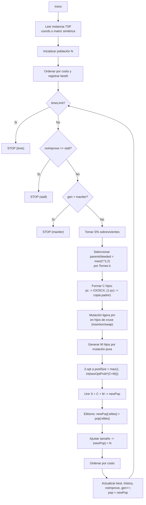

# Algoritmo Genético

Este algoritmo genético (AG) para TSP itera sobre generaciones construyendo una nueva población a partir de: sobrevivientes (S%), hijos por cruce (C%) y mutación pura (M%), con intensificación local (2-opt) y protección del mejor (elitismo). Dispone de **tres criterios de paro** que se evalúan **en cada generación**:

* `--stall = s`

  * Si pasan **s** generaciones seguidas sin `best` nuevo -> **STOP** (motivo: `"stall"`).
* `--timeLimit = T` (segundos)

  * Si `time.time() - t0 >= T` -> **STOP** (motivo: `"time"`), **independiente** de `stall`.
* `--maxIter = G`

  * Si se alcanzan **G** generaciones -> **STOP** (motivo: `"maxIter"`).

**Prioridad efectiva** (porque se chequean en cada gen):
**tiempo excedido -> para**; si no, **stall excedido -> para**; si no, **si gen > maxIter -> para**.

Las técnicas empleadas se resumen en las siguientes fases:

* **Selección por torneo (k)**: controla la **presión selectiva** (k grande -> más explotación; k pequeño -> más diversidad).
* **Cruces de permutación**:
  * **OX** (Order Crossover): conserva un segmento del padre 1 y respeta el orden relativo del padre 2 (no mira distancias).
  * **SCX** (Sequential Constructive): elige el siguiente más cercano entre recomendaciones de ambos padres; aprovecha **distancias** locales.
* **Mutación**:
  * **Ligera (pm)** sobre hijos de cruce: *insertion* o *swap* (una operación, con prob. `pm`).
  * **Pura (M%)**: crea individuos siempre mutados desde tours base (diversidad garantizada).
* **2-opt** (intensificación): aplica, en sitio, una inversión si mejora el costo; cantidad controlada por `twoOptProb`.
* **Elitismo**: reinyecta los mejores de la generación previa (`elites`) para no perder soluciones de alta calidad.
* **Control de tamaños**: S% + C% + M% = 1 -> población exacta de tamaño N en cada generación.
* **Paro robusto**: combinación de `timeLimit`, `stall` y `maxIter` con la prioridad indicada arriba.



## Configuración

### Ciudades y distancias (simétricas, tipo Manhattan)

Ciudades: **A, B, C, D, E, F, G, H**

Matriz de distancias $d_{ij}=d_{ji}$ (enteros):

|       |  A |  B |  C |  D |  E |  F |  G |  H |
| ----- | -: | -: | -: | -: | -: | -: | -: | -: |
| **A** |  0 |  2 |  4 |  6 |  9 |  7 |  5 |  3 |
| **B** |  2 |  0 |  2 |  4 |  7 |  5 |  3 |  5 |
| **C** |  4 |  2 |  0 |  2 |  5 |  3 |  5 |  7 |
| **D** |  6 |  4 |  2 |  0 |  3 |  5 |  7 |  9 |
| **E** |  9 |  7 |  5 |  3 |  0 |  2 |  4 |  6 |
| **F** |  7 |  5 |  3 |  5 |  2 |  0 |  2 |  4 |
| **G** |  5 |  3 |  5 |  7 |  4 |  2 |  0 |  2 |
| **H** |  3 |  5 |  7 |  9 |  6 |  4 |  2 |  0 |

> Ejemplo de tour y costo: A->B->C->D->E->F->G->H->A = **2+2+2+3+2+2+2+3 = 18**.

### Población inicial (N=10)

Tours (permutaciones) y costos ya **precalculados** con la tabla:

| ID     | Cromosoma       |  Costo |
| ------ | --------------- | -----: |
| **P0** | A B C D E F G H | **18** |
| **P1** | A H G F E D C B | **18** |
| P2     | A B C F E D G H |     20 |
| P3     | A C B D E F G H |     19 |
| P4     | A B D C E F H G |     21 |
| P5     | A D C B E F G H |     22 |
| P6     | A B C D F E G H |     19 |
| P7     | A G F E D C B H |     23 |
| P8     | A E F G H D C B |     24 |
| P9     | A C D E F G H B |     20 |

*(Menor costo = mejor; P0 y P1 son co-mejores.)*

### Parámetros para el ejemplo

* `N=10`
* `--survivors=0.20` -> **S = 2**
* `--crossover=0.60` -> **C = 6**
* `--mutation=0.20` -> **M = 2**
* `--pc=0.95` (prob. de cruce por pareja)
* `--pm=0.30`
* `--elitism=0.10` -> **élites = 1**
* `--k=5` (torneo)
* `--twoOptProb=0.30` -> con 8 hijos nuevos => `poolSize=int(0.3*8)=2`
* `--stall=400` (paro por 400 gens sin mejorar)

## Fases

### Sobrevivir (S%)

1. Cálculo de S

   * Fórmula del código: `S = max(1, int(N * survivors))`.
   * Con `N=10` y `survivors=0.20` -> `S = max(1, int(10*0.20)) = max(1, 2) = 2`.

2. Ordenar por costo

   * El código ordena la población por `fitness` (menor costo = mejor).
   * Si hay empates, Python mantiene el orden relativo previo (sort estable). Para este ejemplo tomamos el orden listado.

3. Selección de los S mejores

   * Se copian **tal cual** los primeros `S` individuos de la población ordenada a la nueva generación.
   * No se cruzan, no se mutan en esta fase, no se les aplica 2-opt aquí. Es literalmente un "copiar y pegar" para preservar calidad.

4. Resultado concreto con tu población inicial

   * Población ordenada por costo (de menor a mayor):
     P0 (18), P1 (18), P3 (19), P6 (19), P2 (20), P9 (20), P4 (21), P5 (22), P7 (23), P8 (24).
   * `S=2` -> sobreviven: **P0** y **P1**.
   * Se colocan al inicio de la nueva población:

     ```bash
     newPop (parcial) = [ P0(18), P1(18) ]
     tamaño actual = 2
     faltan = N - S = 10 - 2 = 8
     ```

   * Estos "faltan" se completarán luego con C hijos por cruce y M hijos por mutación (fases posteriores).

5. Qué significa exactamente "sobrevivir"

   * "Sobrevivir" = pasar **intacto** a la siguiente generación.
   * Ventaja: garantiza estabilidad del mejor desempeño conocido (explotación).
   * Nota: estos sobrevivientes **sí pueden** ser elegidos más adelante como **padres** en la fase de selección (torneo k), porque la selección de padres muestrea desde **toda** la población de la generación actual.

### Seleccionar padres

1. ¿Cuántos padres se necesitan?

   * Objetivo de cruce: `C = 6` hijos por cruce.
   * Regla del código: `parentsNeeded = max(C*2, 2)` -> `parentsNeeded = 12`.
   * Motivo: cada hijo se construye a partir de una **pareja** (2 padres). Con `C=6` -> 6 parejas -> 12 padres.

2. ¿De dónde salen los 12 padres?

   * Se hacen **12 torneos independientes** de tamaño `k=5`.
   * En **cada torneo**: se **muestran 5 individuos al azar** (sin repetir *dentro* del torneo, pero **sí pueden repetirse entre torneos distintos**). Gana el de **menor costo** entre esos 5.
   * Se repite hasta obtener **12 ganadores**. Estos 12 ganadores pueden contener **repetidos** (por eso un mismo individuo puede participar en varias parejas).

3. ¿Sobre qué población se hacen los torneos?

   * Sobre la **población actual ordenada** (P0..P9).
   * Nota: que P0 y P1 hayan "sobrevivido" en la fase 1 no cambia esta fase; la **selección de padres** siempre muestrea desde **toda** la población actual (no desde `newPop` parcial).

4. Ejecución concreta (12 torneos k=5)

   * T1: {P1, P4, P7, P9, P2} -> gana **P1 (18)**
   * T2: {P3, P0, P5, P8, P6} -> gana **P0 (18)**
   * T3: {P2, P7, P5, P4, P9} -> gana **P2 (20)**
   * T4: {P0, P1, P2, P3, P4} -> gana **P0 (18)**
   * T5: {P3, P4, P6, P7, P8} -> gana **P3 (19)**
   * T6: {P1, P2, P5, P6, P9} -> gana **P1 (18)**
   * T7: {P0, P2, P3, P5, P7} -> gana **P0 (18)**
   * T8: {P6, P7, P8, P9, P4} -> gana **P6 (19)**
   * T9: {P1, P3, P4, P5, P9} -> gana **P1 (18)**
   * T10: {P0, P8, P2, P4, P7} -> gana **P0 (18)**
   * T11: {P5, P6, P7, P8, P9} -> gana **P6 (19)**
   * T12: {P2, P3, P4, P5, P1} -> gana **P1 (18)**

   Lista de 12 padres (en orden):
   `[P1, P0, P2, P0, P3, P1, P0, P6, P1, P0, P6, P1]`

5. Formar las 6 parejas (en pares consecutivos)

   * Pareja 1: (P1, P0)
   * Pareja 2: (P2, P0)
   * Pareja 3: (P3, P1)
   * Pareja 4: (P0, P6)
   * Pareja 5: (P1, P0)
   * Pareja 6: (P6, P1)

   Estas **6 parejas** alimentarán la fase de cruce. Ahí entra `pc`:

   * Por cada pareja, con `pc=0.95` -> cruce (OX o SCX).
   * Con prob. `1 - pc = 0.05` -> "no cruce" y se copia el primer padre (hijo = padre1).

### Parejas y cruce (OX o SCX) con `pc`

1. Parejas (vienen de la Fase 2, 12 ganadores en orden):
   `[P1, P0, P2, P0, P3, P1, P0, P6, P1, P0, P6, P1]`
   Se forman 6 parejas consecutivas:

```bash
#1 (P1, P0)   #2 (P2, P0)   #3 (P3, P1)
#4 (P0, P6)   #5 (P1, P0)   #6 (P6, P1)
```

2. Moneda con `pc=0.95` por pareja
   Ejemplo de resultado (consistente con pc alto):

```bash
#1 Sí  #2 Sí  #3 Sí  #4 Sí  #5 NO  #6 Sí
```

Esto da 5 hijos por **cruce** y 1 **copia** (el de la pareja #5).
En total, tras recorrer las 6 parejas: `childrenC = [c1,c2,c3,c4,copy,c6]`
Esperado estadístico: `pc*6 = 5.7  ->  $\approx$ 5 ó 6 cruzados`.

> **Pareja #5: (P1, P0)**
> Moneda falla (5%): **NO cruce** es decir que Hijo = **copia** del primer padre: `copy = P1[:] = [A, H, G, F, E, D, C, B]`

#### Ejemplo OX (pareja #1: P1, P0)

Padres (de la tabla):

* P1 = `[A, H, G, F, E, D, C, B]`
* P0 = `[A, B, C, D, E, F, G, H]`

OX hace:

1. Elegir segmento de **P1**. `a=2, b=5` -> segmento `[G, F, E, D]`.
2. Hijo con huecos: `[_ , _ , G , F , E , D , _ , _]`
3. Rellenar con orden relativo de **P0** saltando lo ya copiado (`G,F,E,D`):
   P0 filtrado -> `[A, B, C, H]`
4. Colocar en huecos por orden: posiciones 0,1,6,7 -> `[A, B, C, H]`

Hijo OX (#1):
`[A, B, G, F, E, D, C, H]`

> OX no mira distancias; solo preserva el segmento de P1 y rellena respetando el orden de P0.

#### Ejemplo SCX (pareja #4: P0, P6) con la **matriz de distancias** dada

Padres:

* P0 = `[A, B, C, D, E, F, G, H]`
* P6 = `[A, B, C, D, F, E, G, H]`

Regla SCX: en cada paso, desde `current`, mirar `next1[current]` (siguiente en P0) y `next2[current]` (siguiente en P6), elegir **el no usado** más **cercano** según la matriz. Si ninguno es válido, elegir el **no usado** más cercano global.

Pasos (distancias de la tabla):

* Inicio: `current=A`, candidatos: `B` (P0) y `B` (P6).
  `d(A,B)=2` -> elegir `B`. Hijo: `[A,B]`.
* `current=B`, candidatos: `C` (P0) y `C` (P6).
  `d(B,C)=2` -> `C`. Hijo: `[A,B,C]`.
* `current=C`, candidatos: `D` (P0) y `D` (P6).
  `d(C,D)=2` -> `D`. Hijo: `[A,B,C,D]`.
* `current=D`, candidatos: `E` (P0, d=3) y `F` (P6, d=5).
  Elegir `E`. Hijo: `[A,B,C,D,E]`.
* `current=E`, candidatos: `F` (P0, d=2) y `G` (P6, d=4) -> `F`.
* `current=F`, candidatos: `G` (P0, d=2) y `E` (P6, usado) -> `G`.
* `current=G`, candidatos: `H` (P0, d=2) y `H` (P6, d=2) -> `H`.

Hijo SCX (#4):
`[A, B, C, D, E, F, G, H]`  (en esta instancia, SCX reconstruye el camino "lineal" porque sus vecinos inmediatos son siempre los más cercanos en la matriz).

> SCX sí usa distancias: en `D` prefirió `E` (3) sobre `F` (5). En instancias más "irregulares" SCX arma hijos distintos y, a menudo, de mejor costo inicial.

### Mutación ligera en hijos de cruce (pm)

Ahora, **por cada hijo de cruce**, lanzas una moneda con probabilidad `pm` para decidir si aplicas **una sola** mutación ligera:

* Regla del código: para cada hijo `h` en `childrenC`

  * con prob. `pm` -> aplicar **insertion** (70%) o **swap** (30%)
  * con prob. `1 - pm` -> no hacer nada
* Nota: esto **no** toca a los hijos "copy" de la fase de cruce, salvo que también sean parte de `childrenC`.

Valores típicos:

* En berlin52, si `pm=-1` -> el código usa `pm = 1/n`. Con `n=52`, `pm $\approx$ 0.019`. Con 6 hijos -> se espera `6 * 0.019 $\approx$ 0.11` mutaciones (casi siempre 0, a veces 1).
* Para ver mutaciones en el ejemplo didáctico, usemos `pm = 0.30` -> se espera `6 * 0.30 = 1.8` mutaciones.

Ejemplos sobre hijos concretos:

* Ejemplo `c1` viene del OX de la pareja #1:
  `c1 = [A, B, G, F, E, D, C, H]`

  * **Insertion** (70%): elige índices `i=3`, `j=6` (0-based).
    Quitar `C` de posición 6 e insertarlo en 3:
    antes -> `[A, B, G, F, E, D, C, H]`
    quitar `C` -> `[A, B, G, F, E, D, H]`
    insertar `C` en `i=3` -> `[A, B, G, C, F, E, D, H]`
  * **Swap** (30%): elige `i=1`, `j=4`. Intercambia `B` y `E`:
    `[A, E, G, F, B, D, C, H]`

* Ejemplo `c4` viene del SCX de la pareja #4 y era lineal:
  `c4 = [A, B, C, D, E, F, G, H]`

  * **Insertion** `i=2`, `j=5` (mueve `F` a la pos 2):
    antes -> `[A, B, C, D, E, F, G, H]`
    quitar `F` -> `[A, B, C, D, E, G, H]`
    insertar en 2 -> `[A, B, F, C, D, E, G, H]`

Observación: esta mutación **ligera** introduce variación sin "romper" completamente la estructura heredada del cruce.

### Mutación pura (bloque M%)

Ahora toca **crear M individuos nuevos** exclusivamente por mutación. Con `M = 2`:

* Para cada uno:

  * Elegir un **tour base** al azar de la población actual (con reemplazo).
  * Aplicar **siempre** una mutación (insertion o swap).
* Aquí **no interviene `pm`** (mutación garantizada).

Ejemplos concretos:

* `m0` desde `P9 = [A, C, D, E, F, G, H, B]`
  **Insertion** `i=2`, `j=7` (mover `B` a pos 2):
  antes -> `[A, C, D, E, F, G, H, B]`
  quitar `B` -> `[A, C, D, E, F, G, H]`
  insertar en 2 -> `[A, C, B, D, E, F, G, H]`

* `m1` desde `P4 = [A, B, D, C, E, F, H, G]`
  **Swap** `i=2`, `j=3` (intercambia `D` y `C`):
  `[A, B, C, D, E, F, H, G]`

Resultado acumulado de la generación (sin contar 2-opt ni elitismo aún):

* Survivors S = 2 -> `[P0, P1]`
* Hijos por cruce C = 6 -> `childrenC` (con algunas mutaciones ligeras según `pm`)
* Hijos por mutación M = 2 -> `childrenM = [m0, m1]`

Total -> `2 + 6 + 2 = 10` individuos para la nueva población (*tamaño N se mantiene*).

### 2-opt ocasional con twoOptProb

1. Cuántos hijos se intentan pulir

   * hijosNuevos = len(childrenC) + len(childrenM) = 6 + 2 = 8
   * poolSize = max(1, int(twoOptProb \* hijosNuevos))

     * con twoOptProb=0.30 -> int(0.3\*8)=2 -> se eligen 2 hijos distintos al azar
   * No crea individuos nuevos; modifica "in situ". Siempre >= 1 por el `max(1, …)`.

2. Qué hace exactamente 2-opt (en tu código `apply2optOnce`)

   * Recorre pares de aristas no adyacentes y evalúa el cambio de costo al **revertir** el subsegmento t\[i..j].
   * Reemplaza aristas (t\[i−1], t\[i]) y (t\[j], t\[j+1]) por (t\[i−1], t\[j]) y (t\[i], t\[j+1]) (con wrap en extremos).
   * Si encuentra alguna mejora ($\Delta$ < 0), aplica **una sola** inversión "mejor encontrada" y termina. Si no hay mejora, no cambia el tour.

3. Selección del pool (ejemplo)

   * Supón que el muestreo elige `{c3, m1}` de los 8 hijos nuevos.

4. Ejemplo 2-opt con mejora (sobre c3)

   * Antes (c3): `[A, B, G, C, F, E, D, H]`  (uno de los hijos de cruce)
   * El algoritmo detecta que revertir el segmento i..j = 2..6 (\[G, C, F, E, D]) mejora.
   * Aristas que se reemplazan:

     * Antes: (B,G) y (D,H) -> d(B,G)=3, d(D,H)=9 -> suma antes = 12
     * Después: (B,D) y (G,H) -> d(B,D)=4, d(G,H)=2 -> suma después = 6
     * $\Delta$ = 6 − 12 = −6 (mejora de 6 unidades)
   * Se invierte el subsegmento 2..6: `[G, C, F, E, D]` -> `[D, E, F, C, G]`
   * Después (c3’): `[A, B, D, E, F, C, G, H]`
   * Comentario: 2-opt "descruza" aristas largas y suele bajar costo sin introducir ruido aleatorio.

5. Ejemplo 2-opt sin mejora (sobre m1)

   * Antes (m1), p.ej. el hijo por mutación pura: `[A, B, C, D, E, F, H, G]`
   * `apply2optOnce` prueba pares (i,j); con la matriz dada, ninguna inversión reduce el costo.
   * Después (m1’): queda igual.

### Elitismo (`--elitism`)

1. ¿Cuántos élites?

   * Fórmula: `elites = max(1, int(N * elitism))`.
   * Con `N=10` y `elitism=0.10` -> `elites = 1`.

2. ¿Cuándo aplica y qué hace?

   * Tras armar `newPop = survivors + childrenC + childrenM` (ya se tienes S=2, C=6, M=2 -> tamaño 10).
   * Se **sobrescriben** las primeras posiciones de `newPop` con los **mejores de la generación anterior**:
     `newPop[:elites] = pop[:elites]`
   * No añade individuos; **no cambia N**. Solo garantiza que el mejor "antiguo" esté presente.

3. Ejemplo concreto con nuestro flujo

   * Antes del elitismo (supongamos):

     ```bash
     survivors = [P0(18), P1(18)]
     childrenC = [c1, c2, c3, c4, copy, c6]
     childrenM = [m0, m1]
     newPop_pre = [P0(18), P1(18), c1, c2, c3, c4, copy, c6, m0, m1]  # tamaño 10
     ```

   * `pop[:elites]` son los mejores **de la generación anterior** (ordenada). Aquí: `[P0(18)]`.
   * Aplicar elitismo:
     `newPop_pre[:1] = [P0(18)]` -> en este caso **no cambia nada** (ya estaba P0 en `newPop_pre[0]`).
   * Luego el código **ordena** `newPop` por costo:

     ```bash
     newPop = sorted(newPop_pre, key=fitness)
     ```

     * Si algún hijo (p. ej., `c3`) resulta mejor que 18, tras ordenar quedará **primero**.
     * El elitismo no "bloquea" al mejor nuevo; solo asegura que **P0** no se pierda si todo lo demás saliera peor.

4. ¿Y si S=0 o S muy bajo?

   * El elitismo sigue **inyectando** al menos un mejor de la gen. anterior.
   * Sirve de "airbag" si por azar C/M generan población floja.

5. ¿Puede duplicar individuos?

   * Sí, puede haber duplicados (p. ej., `P0` ya estaba en `survivors` y además entra por elitismo).
   * No hay deduplicación en esta fase; la diversidad se maneja con `k`, `M%`, `pm`, etc.

### Cierre de generación

1. Ajuste de tamaño (si aplica)

   * Recortar o rellenar para que `len(newPop) == N`.

2. Ordenar por costo

   * `newPop.sort(key=fitness)`  -> el mejor de la generación queda en `newPop[0]`.

3. Actualizar métricas

   * `currBest = newPop[0]`, `currCost = fitness(currBest)`.
   * `best/bestCost` y `history`:

     * `history.append( min(history[-1], currCost) )`  -> guarda el **best-so-far** por generación.
     * Si `currCost < bestCost`: actualizar `best`, reiniciar `noImprove`, registrar `events`, opcionalmente `saveFrame`.
