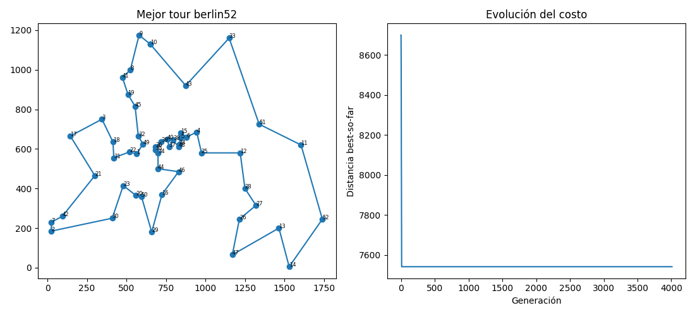
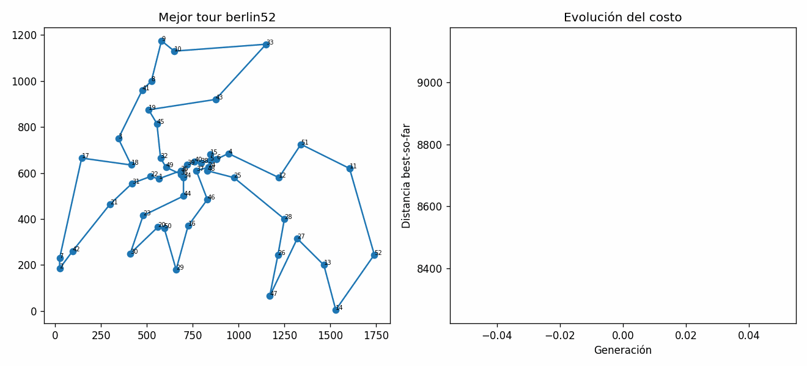
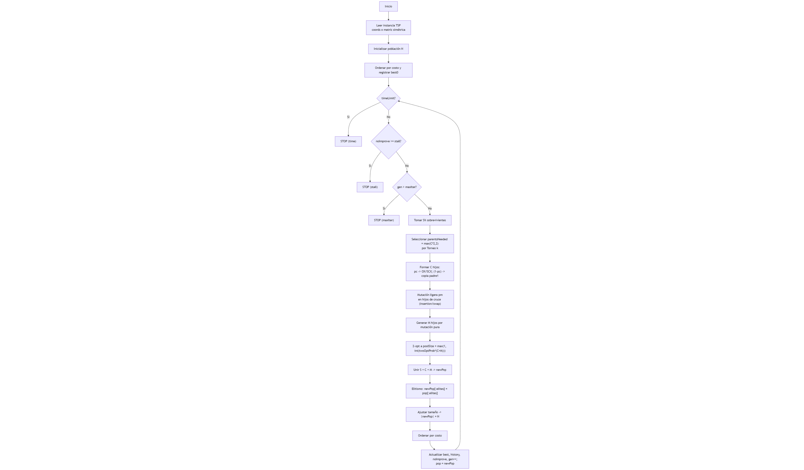

# TSP-GA (berlin52)

## Integrantes

- Abby Donis
- Cindy Gualim
- Josué Say

## Enlaces

- [Repositorio](https://github.com/JosueSay/labs-ms/tree/main/Labs/lab4)

## Estructura del proyecto

```bash
.
├─ ga.py          # Núcleo del GA: operadores + bucle runGa()
├─ io_tsp.py      # I/O TSPLIB + distancias (matriz simétrica comprimida)
├─ poblation.py   # Generación de población y semillas (random + nearest-insertion)
├─ viz.py         # Visualización: frames PNG, GIF y plot final
├─ main.py        # CLI/orquestación (args, llamada a runGa, plots, GIF)
├─ optimal.py     # Visualiza la ruta óptima provista por el problema
└─ requirements.txt
```

### Contenido por archivo

- **ga.py**

  - `selectionTournament`, `crossoverOX`, `crossoverSCX`
  - `mutateInsertion`, `mutateSwap`, `apply2optOnce`
  - `runGa(...)`: lazo principal del GA (selección -> cruce -> mutación graphResult 2-opt ocasional -> reemplazo), logging de mejoras, cortes por estancamiento/tiempo, guardado de frames.

- **io_tsp.py**
  - `parseTsp`: lee formato TSPLIB (`NAME`, `NODE_COORD_SECTION`, etc.).
  - `buildDistanceMatrixCompressed`: crea matriz de distancias simétrica comprimida (triángulo superior) con `EUC_2D` (redondeo entero).
  - `getDistance`, `tourDistance`: *lookups* O(1) y costo total del tour.

- **poblation.py**
  - `makeRandomTour`, `nearestInsertionSeed` (semilla heurística)
  - `initPopulation`: mezcla semillas heurísticas + tours aleatorios.

- **viz.py**

  - `saveFrame`: guarda PNG (mejor tour + curva de costo).
  - `makeGifFromFrames`: construye GIF desde los PNG.
  - `plotResults`: muestra figura final con tour y evolución.

- **main.py**
  - CLI con `argparse`. Ejecuta `runGa`, imprime resumen, invoca `plotResults`/`makeGifFromFrames`. Incluye modo `--estimate` (calienta y estima tiempo).

- **optimal.py**
  - Script auxiliar para graficar la ruta óptima que provee el problema (usa utilidades de `io_tsp.py` y `viz.py`). Útil para comparar vs. el mejor tour encontrado por el GA.

## Instalación

```bash
pip install -r requirements.txt
```

## Comando "óptimo"

Estos parámetros dieron el mejor resultado en tus corridas (con `seed=42`):

```bash
python main.py --N 600 --maxIter 200000 --survivors 0.10 --crossover 0.80 --mutation 0.10 --pc 0.98 --pm -1 --elitism 0.03 --k 3 --scx --twoOptProb 0.30 --stall 4000 --timeLimit 0 --seed 42 --estimate 300 --noPlot
```

> **Sugerencia:** si se desea GIF se debe añadir `--record --framesDir frames --gifOut berlin52_tsp_optimal.gif`.

## Resultados

**Gráfica de costos y solución óptima:**



**GIF del proceso seguido por el algoritmo genético:**



# Algoritmo Genético

Este algoritmo genético (AG) para TSP itera sobre generaciones construyendo una nueva población a partir de: sobrevivientes (S%), hijos por cruce (C%) y mutación pura (M%), con intensificación local (2-opt) y protección del mejor (elitismo). Dispone de **tres criterios de paro** que se evalúan **en cada generación**:

- `--stall = s`
  - Si pasan **s** generaciones seguidas sin `best` nuevo -> **STOP** (motivo: `"stall"`).

- `--timeLimit = T` (segundos)
  - Si `time.time() - t0 >= T` -> **STOP** (motivo: `"time"`), **independiente** de `stall`.

- `--maxIter = G`
  - Si se alcanzan **G** generaciones -> **STOP** (motivo: `"maxIter"`).

**Prioridad**: **tiempo excedido -> para**; si no, **stall excedido -> para**; si no, **si gen > maxIter -> para**.

Las técnicas empleadas se resumen en las siguientes fases:

- **Selección por torneo (k)**: controla la **presión selectiva** (k grande -> más explotación; k pequeño -> más diversidad).
- **Cruces de permutación**:
  - **OX** (Order Crossover): conserva un segmento del padre 1 y respeta el orden relativo del padre 2 (no mira distancias).
  - **SCX** (Sequential Constructive): elige el siguiente más cercano entre recomendaciones de ambos padres; aprovecha **distancias** locales.
- **Mutación**:
  - **Ligera (pm)** sobre hijos de cruce: *insertion* o *swap* (una operación, con prob. `pm`).
  - **Pura (M%)**: crea individuos siempre mutados desde tours base (diversidad garantizada).
- **2-opt** (intensificación): aplica, en sitio, una inversión si mejora el costo; cantidad controlada por `twoOptProb`.
- **Elitismo**: reinyecta los mejores de la generación previa (`elites`) para no perder soluciones de alta calidad.
- **Control de tamaños**: S% + C% + M% = 1 -> población exacta de tamaño N en cada generación.
- **Paro robusto**: combinación de `timeLimit`, `stall` y `maxIter` con la prioridad indicada arriba.



## Configuración

### Ciudades y distancias (simétricas, tipo Manhattan)

Ciudades: **A, B, C, D, E, F, G, H**

Matriz de distancias $d_{ij}=d_{ji}$ (enteros):

|       |  A |  B |  C |  D |  E |  F |  G |  H |
| ----- | -: | -: | -: | -: | -: | -: | -: | -: |
| **A** |  0 |  2 |  4 |  6 |  9 |  7 |  5 |  3 |
| **B** |  2 |  0 |  2 |  4 |  7 |  5 |  3 |  5 |
| **C** |  4 |  2 |  0 |  2 |  5 |  3 |  5 |  7 |
| **D** |  6 |  4 |  2 |  0 |  3 |  5 |  7 |  9 |
| **E** |  9 |  7 |  5 |  3 |  0 |  2 |  4 |  6 |
| **F** |  7 |  5 |  3 |  5 |  2 |  0 |  2 |  4 |
| **G** |  5 |  3 |  5 |  7 |  4 |  2 |  0 |  2 |
| **H** |  3 |  5 |  7 |  9 |  6 |  4 |  2 |  0 |

> Ejemplo de tour y costo: A->B->C->D->E->F->G->H->A = **2+2+2+3+2+2+2+3 = 18**.

### Población inicial (N=10)

Tours (permutaciones) y costos ya **precalculados** con la tabla:

| ID     | Cromosoma       |  Costo |
| ------ | --------------- | -----: |
| **P0** | A B C D E F G H | **18** |
| **P1** | A H G F E D C B | **18** |
| P2     | A B C F E D G H |     20 |
| P3     | A C B D E F G H |     19 |
| P4     | A B D C E F H G |     21 |
| P5     | A D C B E F G H |     22 |
| P6     | A B C D F E G H |     19 |
| P7     | A G F E D C B H |     23 |
| P8     | A E F G H D C B |     24 |
| P9     | A C D E F G H B |     20 |

*(Menor costo = mejor; P0 y P1 son co-mejores.)*

### Parámetros para el ejemplo

- `N=10`
- `--survivors=0.20` -> **S = 2**
- `--crossover=0.60` -> **C = 6**
- `--mutation=0.20` -> **M = 2**
- `--pc=0.95` (prob. de cruce por pareja)
- `--pm=0.30`
- `--elitism=0.10` -> **élites = 1**
- `--k=5` (torneo)
- `--twoOptProb=0.30` -> con 8 hijos nuevos => `poolSize=int(0.3*8)=2`
- `--stall=400` (paro por 400 gens sin mejorar)

## Fases

### Sobrevivir (S%)

1. Cálculo de S

   - Fórmula del código: `S = max(1, int(N * survivors))`.
   - Con `N=10` y `survivors=0.20` -> `S = max(1, int(10*0.20)) = max(1, 2) = 2`.

2. Ordenar por costo

   - El código ordena la población por `fitness` (menor costo = mejor).
   - Si hay empates, Python mantiene el orden relativo previo (sort estable). Para este ejemplo tomamos el orden listado.

3. Selección de los S mejores

   - Se copian **tal cual** los primeros `S` individuos de la población ordenada a la nueva generación.
   - No se cruzan, no se mutan en esta fase, no se les aplica 2-opt aquí. Es literalmente un "copiar y pegar" para preservar calidad.

4. Resultado concreto con tu población inicial

   - Población ordenada por costo (de menor a mayor):
     P0 (18), P1 (18), P3 (19), P6 (19), P2 (20), P9 (20), P4 (21), P5 (22), P7 (23), P8 (24).
   - `S=2` -> sobreviven: **P0** y **P1**.
   - Se colocan al inicio de la nueva población:

     ```bash
     newPop (parcial) = [ P0(18), P1(18) ]
     tamaño actual = 2
     faltan = N - S = 10 - 2 = 8
     ```

   - Estos "faltan" se completarán luego con C hijos por cruce y M hijos por mutación (fases posteriores).

5. Qué significa exactamente "sobrevivir"

   - "Sobrevivir" = pasar **intacto** a la siguiente generación.
   - Ventaja: garantiza estabilidad del mejor desempeño conocido (explotación).
   - Nota: estos sobrevivientes **sí pueden** ser elegidos más adelante como **padres** en la fase de selección (torneo k), porque la selección de padres muestrea desde **toda** la población de la generación actual.

### Seleccionar padres

1. ¿Cuántos padres se necesitan?

   - Objetivo de cruce: `C = 6` hijos por cruce.
   - Regla del código: `parentsNeeded = max(C*2, 2)` -> `parentsNeeded = 12`.
   - Motivo: cada hijo se construye a partir de una **pareja** (2 padres). Con `C=6` -> 6 parejas -> 12 padres.

2. ¿De dónde salen los 12 padres?

   - Se hacen **12 torneos independientes** de tamaño `k=5`.
   - En **cada torneo**: se **muestran 5 individuos al azar** (sin repetir *dentro* del torneo, pero **sí pueden repetirse entre torneos distintos**). Gana el de **menor costo** entre esos 5.
   - Se repite hasta obtener **12 ganadores**. Estos 12 ganadores pueden contener **repetidos** (por eso un mismo individuo puede participar en varias parejas).

3. ¿Sobre qué población se hacen los torneos?

   - Sobre la **población actual ordenada** (P0..P9).
   - Nota: que P0 y P1 hayan "sobrevivido" en la fase 1 no cambia esta fase; la **selección de padres** siempre muestrea desde **toda** la población actual (no desde `newPop` parcial).

4. Ejecución concreta (12 torneos k=5)

   - T1: {P1, P4, P7, P9, P2} -> gana **P1 (18)**
   - T2: {P3, P0, P5, P8, P6} -> gana **P0 (18)**
   - T3: {P2, P7, P5, P4, P9} -> gana **P2 (20)**
   - T4: {P0, P1, P2, P3, P4} -> gana **P0 (18)**
   - T5: {P3, P4, P6, P7, P8} -> gana **P3 (19)**
   - T6: {P1, P2, P5, P6, P9} -> gana **P1 (18)**
   - T7: {P0, P2, P3, P5, P7} -> gana **P0 (18)**
   - T8: {P6, P7, P8, P9, P4} -> gana **P6 (19)**
   - T9: {P1, P3, P4, P5, P9} -> gana **P1 (18)**
   - T10: {P0, P8, P2, P4, P7} -> gana **P0 (18)**
   - T11: {P5, P6, P7, P8, P9} -> gana **P6 (19)**
   - T12: {P2, P3, P4, P5, P1} -> gana **P1 (18)**

   Lista de 12 padres (en orden):
   `[P1, P0, P2, P0, P3, P1, P0, P6, P1, P0, P6, P1]`

5. Formar las 6 parejas (en pares consecutivos)

   - Pareja 1: (P1, P0)
   - Pareja 2: (P2, P0)
   - Pareja 3: (P3, P1)
   - Pareja 4: (P0, P6)
   - Pareja 5: (P1, P0)
   - Pareja 6: (P6, P1)

   Estas **6 parejas** alimentarán la fase de cruce. Ahí entra `pc`:

   - Por cada pareja, con `pc=0.95` -> cruce (OX o SCX).
   - Con prob. `1 - pc = 0.05` -> "no cruce" y se copia el primer padre (hijo = padre1).

### Parejas y cruce (OX o SCX) con `pc`

1. Parejas (vienen de la Fase 2, 12 ganadores en orden):
   `[P1, P0, P2, P0, P3, P1, P0, P6, P1, P0, P6, P1]`
   Se forman 6 parejas consecutivas:

```bash
#1 (P1, P0)   #2 (P2, P0)   #3 (P3, P1)
#4 (P0, P6)   #5 (P1, P0)   #6 (P6, P1)
```

2. Moneda con `pc=0.95` por pareja
   Ejemplo de resultado (consistente con pc alto):

```bash
#1 Sí  #2 Sí  #3 Sí  #4 Sí  #5 NO  #6 Sí
```

Esto da 5 hijos por **cruce** y 1 **copia** (el de la pareja #5).
En total, tras recorrer las 6 parejas: `childrenC = [c1,c2,c3,c4,copy,c6]`
Esperado estadístico: `pc*6 = 5.7  ->  $\approx$ 5 ó 6 cruzados`.

> **Pareja #5: (P1, P0)**
> Moneda falla (5%): **NO cruce** es decir que Hijo = **copia** del primer padre: `copy = P1[:] = [A, H, G, F, E, D, C, B]`

#### Ejemplo OX (pareja #1: P1, P0)

Padres (de la tabla):

- P1 = `[A, H, G, F, E, D, C, B]`
- P0 = `[A, B, C, D, E, F, G, H]`

OX hace:

1. Elegir segmento de **P1**. `a=2, b=5` -> segmento `[G, F, E, D]`.
2. Hijo con huecos: `[_ , _ , G , F , E , D , _ , _]`
3. Rellenar con orden relativo de **P0** saltando lo ya copiado (`G,F,E,D`):
   P0 filtrado -> `[A, B, C, H]`
4. Colocar en huecos por orden: posiciones 0,1,6,7 -> `[A, B, C, H]`

Hijo OX (#1):
`[A, B, G, F, E, D, C, H]`

> OX no mira distancias; solo preserva el segmento de P1 y rellena respetando el orden de P0.

#### Ejemplo SCX (pareja #4: P0, P6) con la **matriz de distancias** dada

Padres:

- P0 = `[A, B, C, D, E, F, G, H]`
- P6 = `[A, B, C, D, F, E, G, H]`

Regla SCX: en cada paso, desde `current`, mirar `next1[current]` (siguiente en P0) y `next2[current]` (siguiente en P6), elegir **el no usado** más **cercano** según la matriz. Si ninguno es válido, elegir el **no usado** más cercano global.

Pasos (distancias de la tabla):

- Inicio: `current=A`, candidatos: `B` (P0) y `B` (P6).
  `d(A,B)=2` -> elegir `B`. Hijo: `[A,B]`.
- `current=B`, candidatos: `C` (P0) y `C` (P6).
  `d(B,C)=2` -> `C`. Hijo: `[A,B,C]`.
- `current=C`, candidatos: `D` (P0) y `D` (P6).
  `d(C,D)=2` -> `D`. Hijo: `[A,B,C,D]`.
- `current=D`, candidatos: `E` (P0, d=3) y `F` (P6, d=5).
  Elegir `E`. Hijo: `[A,B,C,D,E]`.
- `current=E`, candidatos: `F` (P0, d=2) y `G` (P6, d=4) -> `F`.
- `current=F`, candidatos: `G` (P0, d=2) y `E` (P6, usado) -> `G`.
- `current=G`, candidatos: `H` (P0, d=2) y `H` (P6, d=2) -> `H`.

Hijo SCX (#4):
`[A, B, C, D, E, F, G, H]`  (en esta instancia, SCX reconstruye el camino "lineal" porque sus vecinos inmediatos son siempre los más cercanos en la matriz).

> SCX sí usa distancias: en `D` prefirió `E` (3) sobre `F` (5). En instancias más "irregulares" SCX arma hijos distintos y, a menudo, de mejor costo inicial.

### Mutación ligera en hijos de cruce (pm)

Ahora, **por cada hijo de cruce**, lanzas una moneda con probabilidad `pm` para decidir si aplicas **una sola** mutación ligera:

- Regla del código: para cada hijo `h` en `childrenC`

  - con prob. `pm` -> aplicar **insertion** (70%) o **swap** (30%)
  - con prob. `1 - pm` -> no hacer nada
- Nota: esto **no** toca a los hijos "copy" de la fase de cruce, salvo que también sean parte de `childrenC`.

Valores típicos:

- En berlin52, si `pm=-1` -> el código usa `pm = 1/n`. Con `n=52`, `pm $\approx$ 0.019`. Con 6 hijos -> se espera `6 * 0.019 $\approx$ 0.11` mutaciones (casi siempre 0, a veces 1).
- Para ver mutaciones en el ejemplo didáctico, usemos `pm = 0.30` -> se espera `6 * 0.30 = 1.8` mutaciones.

Ejemplos sobre hijos concretos:

- Ejemplo `c1` viene del OX de la pareja #1:
  `c1 = [A, B, G, F, E, D, C, H]`

  - **Insertion** (70%): elige índices `i=3`, `j=6` (0-based).
    Quitar `C` de posición 6 e insertarlo en 3:
    antes -> `[A, B, G, F, E, D, C, H]`
    quitar `C` -> `[A, B, G, F, E, D, H]`
    insertar `C` en `i=3` -> `[A, B, G, C, F, E, D, H]`
  - **Swap** (30%): elige `i=1`, `j=4`. Intercambia `B` y `E`:
    `[A, E, G, F, B, D, C, H]`

- Ejemplo `c4` viene del SCX de la pareja #4 y era lineal:
  `c4 = [A, B, C, D, E, F, G, H]`

  - **Insertion** `i=2`, `j=5` (mueve `F` a la pos 2):
    antes -> `[A, B, C, D, E, F, G, H]`
    quitar `F` -> `[A, B, C, D, E, G, H]`
    insertar en 2 -> `[A, B, F, C, D, E, G, H]`

Observación: esta mutación **ligera** introduce variación sin "romper" completamente la estructura heredada del cruce.

### Mutación pura (bloque M%)

Ahora toca **crear M individuos nuevos** exclusivamente por mutación. Con `M = 2`:

- Para cada uno:

  - Elegir un **tour base** al azar de la población actual (con reemplazo).
  - Aplicar **siempre** una mutación (insertion o swap).
- Aquí **no interviene `pm`** (mutación garantizada).

Ejemplos concretos:

- `m0` desde `P9 = [A, C, D, E, F, G, H, B]`
  **Insertion** `i=2`, `j=7` (mover `B` a pos 2):
  antes -> `[A, C, D, E, F, G, H, B]`
  quitar `B` -> `[A, C, D, E, F, G, H]`
  insertar en 2 -> `[A, C, B, D, E, F, G, H]`

- `m1` desde `P4 = [A, B, D, C, E, F, H, G]`
  **Swap** `i=2`, `j=3` (intercambia `D` y `C`):
  `[A, B, C, D, E, F, H, G]`

Resultado acumulado de la generación (sin contar 2-opt ni elitismo aún):

- Survivors S = 2 -> `[P0, P1]`
- Hijos por cruce C = 6 -> `childrenC` (con algunas mutaciones ligeras según `pm`)
- Hijos por mutación M = 2 -> `childrenM = [m0, m1]`

Total -> `2 + 6 + 2 = 10` individuos para la nueva población (*tamaño N se mantiene*).

### 2-opt ocasional con twoOptProb

1. Cuántos hijos se intentan pulir

   - hijosNuevos = len(childrenC) + len(childrenM) = 6 + 2 = 8
   - poolSize = max(1, int(twoOptProb \* hijosNuevos))

     - con twoOptProb=0.30 -> int(0.3\*8)=2 -> se eligen 2 hijos distintos al azar
   - No crea individuos nuevos; modifica "in situ". Siempre >= 1 por el `max(1, …)`.

2. Qué hace exactamente 2-opt (en tu código `apply2optOnce`)

   - Recorre pares de aristas no adyacentes y evalúa el cambio de costo al **revertir** el subsegmento t\[i..j].
   - Reemplaza aristas (t\[i−1], t\[i]) y (t\[j], t\[j+1]) por (t\[i−1], t\[j]) y (t\[i], t\[j+1]) (con wrap en extremos).
   - Si encuentra alguna mejora ($\Delta$ < 0), aplica **una sola** inversión "mejor encontrada" y termina. Si no hay mejora, no cambia el tour.

3. Selección del pool (ejemplo)

   - Supón que el muestreo elige `{c3, m1}` de los 8 hijos nuevos.

4. Ejemplo 2-opt con mejora (sobre c3)

   - Antes (c3): `[A, B, G, C, F, E, D, H]`  (uno de los hijos de cruce)
   - El algoritmo detecta que revertir el segmento i..j = 2..6 (\[G, C, F, E, D]) mejora.
   - Aristas que se reemplazan:

     - Antes: (B,G) y (D,H) -> d(B,G)=3, d(D,H)=9 -> suma antes = 12
     - Después: (B,D) y (G,H) -> d(B,D)=4, d(G,H)=2 -> suma después = 6
     - $\Delta$ = 6 − 12 = −6 (mejora de 6 unidades)
   - Se invierte el subsegmento 2..6: `[G, C, F, E, D]` -> `[D, E, F, C, G]`
   - Después (c3’): `[A, B, D, E, F, C, G, H]`
   - Comentario: 2-opt "descruza" aristas largas y suele bajar costo sin introducir ruido aleatorio.

5. Ejemplo 2-opt sin mejora (sobre m1)

   - Antes (m1), p.ej. el hijo por mutación pura: `[A, B, C, D, E, F, H, G]`
   - `apply2optOnce` prueba pares (i,j); con la matriz dada, ninguna inversión reduce el costo.
   - Después (m1’): queda igual.

### Elitismo (`--elitism`)

1. ¿Cuántos élites?

   - Fórmula: `elites = max(1, int(N * elitism))`.
   - Con `N=10` y `elitism=0.10` -> `elites = 1`.

2. ¿Cuándo aplica y qué hace?

   - Tras armar `newPop = survivors + childrenC + childrenM` (ya se tienes S=2, C=6, M=2 -> tamaño 10).
   - Se **sobrescriben** las primeras posiciones de `newPop` con los **mejores de la generación anterior**:
     `newPop[:elites] = pop[:elites]`
   - No añade individuos; **no cambia N**. Solo garantiza que el mejor "antiguo" esté presente.

3. Ejemplo concreto con nuestro flujo

   - Antes del elitismo (supongamos):

     ```bash
     survivors = [P0(18), P1(18)]
     childrenC = [c1, c2, c3, c4, copy, c6]
     childrenM = [m0, m1]
     newPop_pre = [P0(18), P1(18), c1, c2, c3, c4, copy, c6, m0, m1]  # tamaño 10
     ```

   - `pop[:elites]` son los mejores **de la generación anterior** (ordenada). Aquí: `[P0(18)]`.
   - Aplicar elitismo:
     `newPop_pre[:1] = [P0(18)]` -> en este caso **no cambia nada** (ya estaba P0 en `newPop_pre[0]`).
   - Luego el código **ordena** `newPop` por costo:

     ```bash
     newPop = sorted(newPop_pre, key=fitness)
     ```

     - Si algún hijo (p. ej., `c3`) resulta mejor que 18, tras ordenar quedará **primero**.
     - El elitismo no "bloquea" al mejor nuevo; solo asegura que **P0** no se pierda si todo lo demás saliera peor.

4. ¿Y si S=0 o S muy bajo?

   - El elitismo sigue **inyectando** al menos un mejor de la gen. anterior.
   - Sirve de "airbag" si por azar C/M generan población floja.

5. ¿Puede duplicar individuos?

   - Sí, puede haber duplicados (p. ej., `P0` ya estaba en `survivors` y además entra por elitismo).
   - No hay deduplicación en esta fase; la diversidad se maneja con `k`, `M%`, `pm`, etc.

### Cierre de generación

1. Ajuste de tamaño (si aplica)

   - Recortar o rellenar para que `len(newPop) == N`.

2. Ordenar por costo

   - `newPop.sort(key=fitness)`  -> el mejor de la generación queda en `newPop[0]`.

3. Actualizar métricas

   - `currBest = newPop[0]`, `currCost = fitness(currBest)`.
   - `best/bestCost` y `history`:

     - `history.append( min(history[-1], currCost) )`  -> guarda el **best-so-far** por generación.
     - Si `currCost < bestCost`: actualizar `best`, reiniciar `noImprove`, registrar `events`, opcionalmente `saveFrame`.

# Parámetros

## Explicación de parámetros

| Parámetro      | Tipo  | Rango / Valores  |             Default | Descripción                                               |
| -------------- | ----- | --------------:  | ------------------: | --------------------------------------------------------- |
| `--file`       | str   |  ruta existente  | `data/berlin52.tsp` | Archivo TSPLIB a cargar.                                  |
| `--N`          | int   |            >= 10 |                 300 | Tamaño de población.                                      |
| `--maxIter`    | int   |             >= 1 |                1500 | Iteraciones máximas (generaciones).                       |
| `--survivors`  | float |          \[0,1]  |                0.20 | Fracción S de sobrevivientes.                             |
| `--crossover`  | float |          \[0,1]  |                0.60 | Fracción C creada por cruce.                              |
| `--mutation`   | float |          \[0,1]  |                0.20 | Fracción M creada por mutación. **S+C+M=1**.              |
| `--pc`         | float |          \[0,1]  |                0.95 | Probabilidad de aplicar cruce a una pareja.               |
| `--pm`         | float |   \[0,1] o `-1`  |                  -1 | Mutación ligera a hijos (si `-1` -> usa 1/n).             |
| `--elitism`    | float |          \[0,1]  |                0.05 | Fracción élite reinyectada.                               |
| `--k`          | int   |             >= 2 |                   5 | Tamaño de torneo (selección).                             |
| `--scx`        | flag  |               —  |                 off | Si está presente, usa SCX en lugar de OX.                 |
| `--twoOptProb` | float |          \[0,1]  |                0.05 | Proporción de hijos sometidos a **una** 2-opt.            |
| `--stall`      | int   |             >= 0 |                 400 | Cortar si no mejora en `stall` generaciones.              |
| `--timeLimit`  | float |       >= 0 (seg) |                 0.0 | Cortar por tiempo (0 = sin límite).                       |
| `--record`     | flag  |               —  |                 off | Guarda un PNG en cada mejora.                             |
| `--framesDir`  | str   |         carpeta  |            `frames` | Carpeta para PNG de mejoras.                              |
| `--gifOut`     | str   |     ruta `.gif`  |                  "" | Construye GIF desde `framesDir` (requiere `--record`).    |
| `--seed`       | int   |      cualquiera  |                  42 | Semilla aleatoria (reproducibilidad).                     |
| `--estimate`   | int   |             >= 1 |                   0 | Corre *warmup* N gen para estimar tiempo total y termina. |
| `--noPlot`     | flag  |               —  |                 off | No mostrar la figura final.                               |

## Uso de parámetros

### Tabla 1 — Parámetros y efectos

| Parámetro          | Qué controla                                   | Si (+) (más)                              | Si (-) (menos)                           | Interacciones clave                                         |
| ------------------ | ---------------------------------------------- | ----------------------------------------- | ---------------------------------------- | ----------------------------------------------------------- |
| **N**              | Tamaño de población                            | +diversidad, +estabilidad, +tiempo        | +ruido estocástico, +velocidad           | Con `k` (torneo), `twoOptProb` (costo), `stall`/`timeLimit` |
| **survivors (S%)** | Porción copiada tal cual                       | +explotación, +estabilidad, −diversidad   | +diversidad, riesgo de olvidar buenos    | Con `elitism`, con `k`                                      |
| **crossover (C%)** | Porción creada por cruce                       | +recombinación (si `pc` alto)             | −exploración, +copias                    | Con `pc` y operador (`--scx`/OX)                            |
| **mutation (M%)**  | Porción por mutación pura                      | +diversidad, +escape locales              | −diversidad                              | Con `pm` (mutación ligera); M% **siempre** muta             |
| **pc**             | Prob. de cruzar una pareja                     | +hijos recombinados (menos copias)        | +copias de padres                        | Con `C%` y operador (SCX > OX en calidad)                   |
| **pm**             | Prob. de mutación ligera en hijos de cruce     | +diversidad, +escape                      | +conservación, riesgo de estancamiento   | Si `pm=0` y `M%=0` => **cero** diversidad                   |
| **elitism**        | No./% élite reinyectado                         | +protección del best, +explotación        | +diversidad, riesgo de olvidar best      | No exceder S% (o mantener bajo)                             |
| **k**              | Tamaño de torneo                               | +presión selectiva, −diversidad           | +exploración, +ruido                     | Con N (k relativo a N), con S%                              |
| **--scx**          | Usa SCX (vs. OX)                               | Hijos con mejor costo inicial             | (OX) más neutro, requiere 2-opt          | SCX escala mejor en n grandes                               |
| **twoOptProb**     | % de hijos pulidos con 2-opt                   | +calidad media, +tiempo                   | −tiempo, −pulido                         | Con N y C%+M% (No. de hijos)                                 |
| **stall**          | Paro por estancamiento                         | +chance mejoras tardías, +tiempo          | +cortes tempranos                        | Con `timeLimit`/`maxIter`                                   |
| **timeLimit**      | Paro por tiempo (s)                            | Corta a tiempo fijo                       | —                                        | Con `stall`/`maxIter`                                       |
| **maxIter**        | Tope de generaciones                           | +búsqueda                                 | +corte                                   | Con `stall`/`timeLimit`                                     |

### Tabla 2 — Quién aporta diversidad y quién aporta explotación

| Mecanismo          | Principal efecto              | Riesgo si (+)                 | Riesgo si (-)          | Úsalo para               |
| ------------------ | ----------------------------- | ----------------------------- | ---------------------- | ------------------------ |
| **S% (survivors)** | Explotación (conserva buenos) | Convergencia prematura        | Olvidar buenos tours   | Estabilidad              |
| **k (torneo)**     | Explotación (si k grande)     | Pérdida de diversidad         | Selecciones ruidosas   | Ajustar presión          |
| **C% + pc**        | Exploración (recombinar)      | — (si pc muy bajo -> copias)  | Poca recombinación     | Mezclar building blocks  |
| **M%**             | Diversidad "fuerte"           | Demasiado ruido               | Falta de diversidad    | Salir de óptimos locales |
| **pm**             | Diversidad "ligera"           | Romper buenos hijos           | Estancarse             | Afinar variación fina    |
| **twoOptProb**     | Intensificación local         | Coste extra                   | Menos pulido           | Bajar costo sin ruido    |
| **elitism**        | Protección del best           | Atasco si es alto             | Pérdida del best       | Estabilidad del récord   |

### Tabla 3 — Chequeos de coherencia

| Regla                   | Qué verificar                | Por qué                              |
| ----------------------- | ---------------------------- | ------------------------------------ |
| **S% + C% + M% = 1.0**  | Exacto (considera redondeos) | Evitar población != N                |
| **N >= 10**             | Tu código lo exige           | Evitar dinámica degenerada           |
| **elitism <= \~S%**     | O mantén `elitism` bajo      | Evitar sobre-sobrescritura constante |
| **pc >= 0.8**           | Ideal 0.9–1.0                | Evitar demasiadas copias             |
| **(M% > 0) o (pm > 0)** | Al menos uno > 0             | Sin esto **no hay** diversidad       |
| **k en 3–7**            | No poner k $\approx$ N       | Evitar presión excesiva              |
| **twoOptProb <= 0.3**   | Subir gradualmente           | Evitar costes altos "inútiles"       |
| **stall y timeLimit**   | Consistentes con `maxIter`   | No cortar demasiado pronto/ tarde    |

### Tabla 4 — Síntomas y Ajustes rápidos

| Síntoma                         | Causa probable                | Ajuste                                                       |
| ------------------------------- | ----------------------------- | ------------------------------------------------------------ |
| Se estanca muy pronto           | S alto, k alto, pm bajo, M=0  | (-)S, (-)k, (+)pm (p.ej. 1/n -> 2/n), (+)M, (+)twoOptProb    |
| Mejora pero luego empeora mucho | pm alto, M alto               | (-)pm, (-)M, (+)S o (+)elitism levemente                     |
| Mucho tiempo sin mejoras        | twoOptProb bajo, C bajo       | (+)twoOptProb, (+)C, activar `--scx`                         |
| Población "clonada"             | pc bajo, k alto, elitism alto | (+)pc, (-)k, (-)elitism, (+)M o (+)pm                        |
| Oscila/ruidosa                  | pm/M muy altos                | (-)pm, (-)M, mantener twoOptProb                             |
| Corre lento                     | N alto, twoOptProb alto       | (-)N, (-)twoOptProb, usa SCX (mejores hijos con menos 2-opt) |

### Tabla 5 — Valores guía (base)

| Escala          |        N | S% / C% / M%                      | pc       | pm                       | elitism   | k   | twoOptProb | stall     |
| --------------- | -------: | --------------------------------- | -------- | ------------------------ | --------- | --- | ---------- | --------- |
| **52 nodos**    |  150–300 | 0.20 / 0.60 / 0.20                | 0.9–1.0  | $\approx$1/52 (0.02)     | 0.02–0.05 | 5   | 0.05–0.15  | 200–800   |
| **\~500 nodos** | 800–1200 | 0.15–0.25 / 0.55–0.65 / 0.15–0.25 | 0.95–1.0 | 1/n (0.002)–0.02         | 0.02–0.05 | 3–5 | 0.03–0.10  | 1000–5000 |

> Para n grandes, **SCX** suele rendir mejor que OX; para n pequeños, OX va bien.

### Reglas "huele a mal" (rápidas)

- `S>=0.5` **y** `elitism>=0.2` -> clonación/atasco.
- `C<=0.3` **o** `pc<=0.6` -> poca recombinación (copias).
- `M=0` **y** `pm=0` -> sin diversidad (casi seguro estancamiento).
- `k>=N/2` -> presión excesiva (ganan siempre los top).
- `twoOptProb>=0.5` con N grande -> tiempo muy alto con poca ganancia marginal.
- `stall` muy bajo (p.ej. <100 en 52 nodos) -> cortes prematuros; muy alto sin `timeLimit` -> runs eternos.
