# Laboratorio 5

Este laboratorio es sobre **campos de direcciones**, **isóclinas** y **diagramas de fase**, además de resolución analítica de EDOs y PVIs.

## Integrantes

- Abby Donis
- Cindy Gualim
- Josué Say

## Enlaces

- [Repositorio](https://github.com/JosueSay/labs-ms/tree/main/Labs/lab5)

# Problema 1

Implementar en Python una función que grafique el campo de direcciones asociado a una ecuación diferencial de primer orden  

$$\frac{dy}{dx} = f(x,y). \tag{1}$$

Como parámetros su algoritmo debe recibir la función $f$, los límites $x_{\min}, x_{\max}, y_{\min}, y_{\max}$ de la ventana que desea graficar, y parámetros $xstep$ y $ystep$ para indicar la separación en la que quiere subdividir su grid de puntos sobre los ejes $x$ y $y$, respectivamente. Puede añadir parámetros adicionales que usted desee.  

También debe incluir algún parámetro que permita graficar entre el campo $F$ asociado a la ecuación (1), o el campo unitario $N$ equivalente.  

Para la salida, su función debe devolver una figura con el campo de direcciones requerido. Si usted lo desea, puede incorporar que su función grafique también las líneas de flujo o curvas solución de la ecuación diferencial.  

**Sugerencia:** Apoyarse de las funciones `numpy.linspace` para crear los rangos y subdivisiones en los ejes $x$ y $y$. Usar la función `numpy.meshgrid` para generar la rejilla de puntos a graficar. Usar `matplotlib.pyplot.quiver` para construir el campo vectorial requerido. Puede usar la función `matplotlib.pyplot.streamplot` para graficar las líneas de flujo.  

Se sugiere implementar la construcción del campo a través de una función auxiliar:  

```python
def F(x, y):
    return (expr1, expr2)
```

donde `expr1` y `expr2` corresponden a las componentes del campo $F(x,y)$ que desea graficar.

Ilustrar los resultados de su función graficando dos campos vectoriales de su elección.

## Procedimiento

### 1. De la EDO al campo vectorial

La ecuación diferencial de primer orden es de la forma

$$
\frac{dy}{dx} = f(x,y).
$$

Podemos representarla como un campo vectorial en el plano:

$$
F(x,y) = (1,\, f(x,y)).
$$

- La primera componente siempre es **1** -> significa que avanzamos en el eje $x$.
- La segunda componente es el valor de la pendiente en $(x,y)$.

Así, cada punto del plano recibe una flecha que indica la dirección de la curva solución en ese punto.

### 2. Normalización de vectores

Si usamos directamente $F(x,y)$, algunas flechas pueden salir muy largas o muy cortas.
Por eso, calculamos el vector unitario equivalente:

$$
\hat{F}(x,y) = \frac{(1, f(x,y))}{\sqrt{1 + f(x,y)^2}}.
$$

Esto asegura que todas las flechas tengan la misma longitud, pero con la dirección correcta.
Ese fue el caso en tus gráficas (usaste `useUnitField=True`).

### 3. Construcción del grid

- Usamos `numpy.linspace` para crear subdivisiones uniformes en los intervalos $[x_{\min}, x_{\max}]$ y $[y_{\min}, y_{\max}]$.
- Luego `numpy.meshgrid` genera la rejilla bidimensional de puntos donde evaluamos $F(x,y)$.

### 4. Visualización

- `matplotlib.pyplot.quiver`: dibuja las flechas del campo direccional.
- `matplotlib.pyplot.streamplot`: esto se ve en el primer gráfico donde se pueden ver líneas de flujo, que siguen las trayectorias solución.

### 5. Ejemplos implementados

1. **$y' = y$:**

    

2. **$y' = 1 - y$:**

    

3. **$y' = sin(x)$:**

    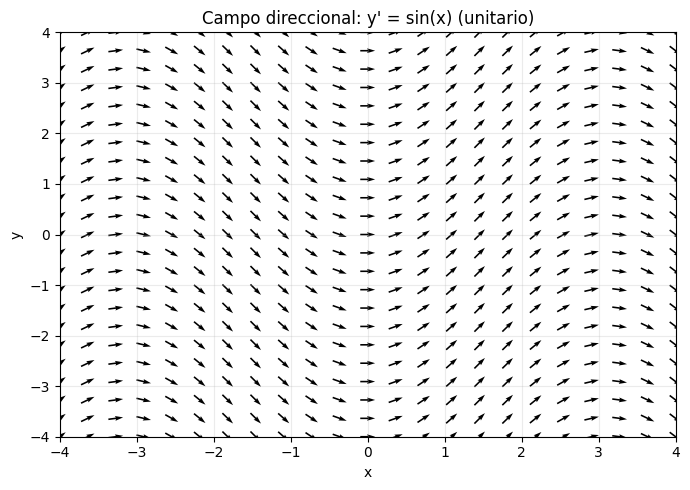

# Problema 2

Para las siguientes ecuaciones diferenciales ordinarias, utilizar métodos cualitativos para esbozar las soluciones de la EDO.  
Luego, resolver cada EDO con los métodos aprendidos en sus cursos pasados, para determinar una expresión de la solución general de cada EDO. Comparar la solución obtenida contra su solución esbozada. Discutir si coinciden las curvas solución.  

> Nota: en clase se vieron las siguientes técnicas para esbozar soluciones de una EDO
>
> 1. **Campo de pendientes**
>
>    - Representar la EDO $y'=f(x,y)$ como el campo vectorial $F(x,y)=(1,f(x,y))$.
>    - Graficar flechas cortas que muestran la dirección local de las soluciones.
> 2. **Análisis de signos de $f(x,y)$**
>
>    - Si $f(x,y)>0$: la solución sube.
>    - Si $f(x,y)<0$: la solución baja.
>    - Si $f(x,y)=0$: hay solución constante o equilibrio.
> 3. **Análisis de concavidad**
>
>    - Usar $y''=f_x+f f_y$.
>    - Si $y''>0$: cóncava hacia arriba.
>    - Si $y''<0$: cóncava hacia abajo.
>    - Si $y''=0$: punto de inflexión.
> 4. **Método de las isóclinas**
>
>    - Trazar curvas donde $f(x,y)=c$ es constante.
>    - Cada curva guía el campo de pendientes y muestra familias de trayectorias.
> 5. **Diagramas de fase (para EDO autónomas)**
>
>    - Identificar puntos de equilibrio (donde $f(y)=0$).
>    - Clasificarlos como atractores, repulsores o semiestables.
>    - Representar con flechas la dirección de las soluciones según el signo de $f(y)$.
> 6. **Teorema de existencia y unicidad** (como herramienta de validez)
>
>    - Verificar continuidad de $f$ y $\partial f/\partial y$ para asegurar que las trayectorias no se crucen y la representación cualitativa tenga sentido.

## $y' = -xy$

### Esbozo mediante campo de pendientes (con análisis de concavidad)

- **Definir función:**

$$
f(x,y) = -xy
$$

- **Análisis de signo de $f(x,y)$:**

  - Cuadrante I ($x>0, y>0$): $f<0$
  - Cuadrante II ($x<0, y>0$): $f>0$
  - Cuadrante III ($x<0, y<0$): $f<0$
  - Cuadrante IV ($x>0, y<0$): $f>0$
  - Sobre los ejes: $f=0$ (pendiente horizontal).

- **Concavidad:**

  $$
  f_x + f f_y = -y + (-xy)(-x) = -y + x^2y = y(x^2 - 1)
  $$

  Factorizamos:

  $$
  f_x + f f_y = y(x+1)(x-1)
  $$

  Estudio de signos:

  | Intervalo de $x$ | Signo de $(x+1)(x-1)$ | Resultado en $y>0$   | Resultado en $y<0$   |
  | ------------------ | ----------------------- | ---------------------- | ---------------------- |
  | $(-\infty,-1)$   | $+$                   | $+$ (cóncava arriba) | $-$ (cóncava abajo)  |
  | $(-1,1)$         | $-$                   | $-$ (cóncava abajo)  | $+$ (cóncava arriba) |
  | $(1,\infty)$     | $+$                   | $+$ (cóncava arriba) | $-$ (cóncava abajo)  |

- Existen **puntos de inflexión** en $x=-1$ y $x=1$.
- En la parte superior (cuando $y>0$), las curvas alternan entre concavidad hacia arriba y hacia abajo según los intervalos de $x$.
- En la parte inferior (cuando $y<0$), ocurre lo opuesto.
- La recta $y=0$ sigue siendo una solución constante.

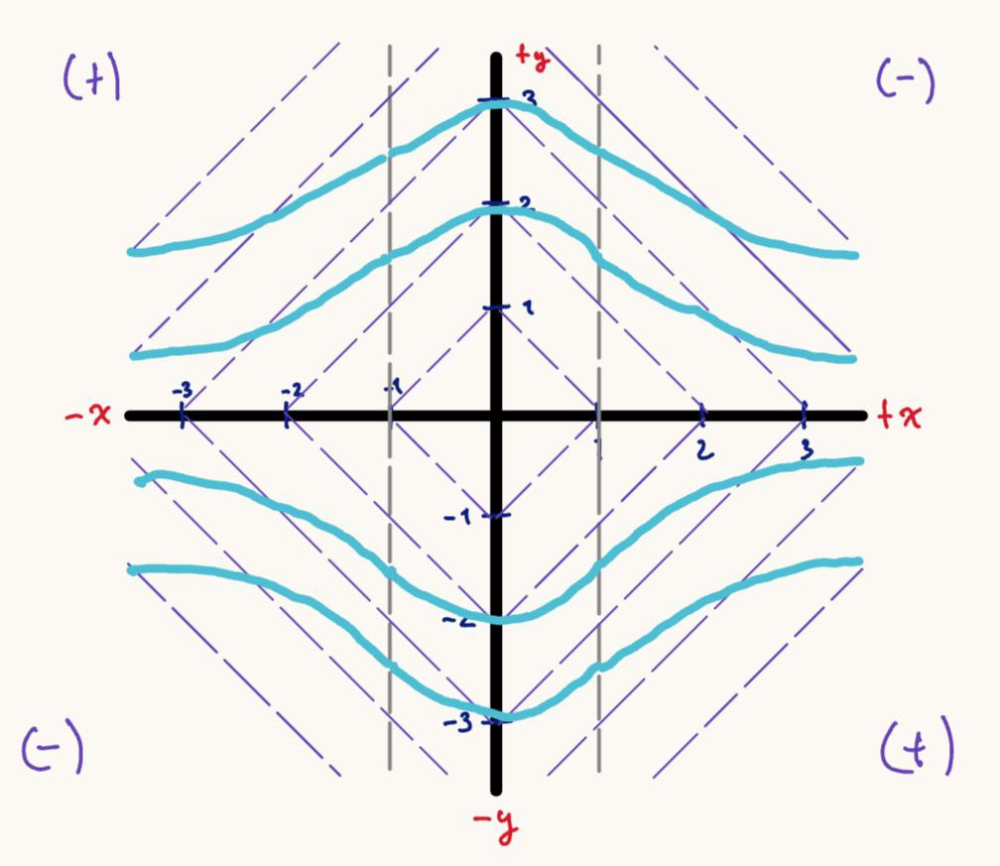

### Solución de la EDO

Ecuación separable:

$$
\frac{dy}{y}=-x\,dx
\;\;\Rightarrow\;\;
\int\frac{1}{y}\,dy=\int -x\,dx
\;\;\Rightarrow\;\;
\ln|y|=-\frac{x^{2}}{2}+C
$$

Exponentiando:

$$
|y|=e^{C}\,e^{-x^{2}/2}\;\Rightarrow\; \boxed{\,y(x)=C\,e^{-x^{2}/2}\,}
$$

donde $C\in\mathbb{R}$ (incluye $y\equiv 0$ con $C=0$).

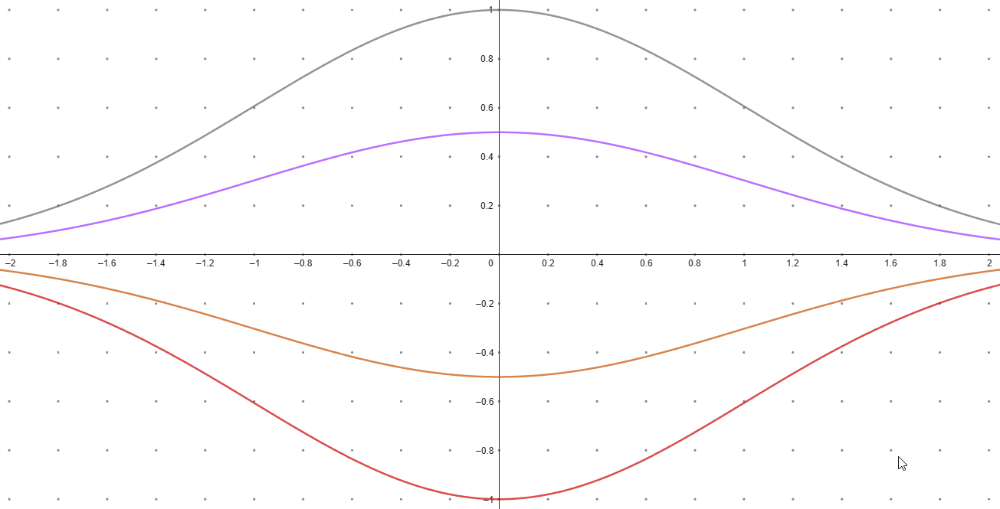

## $y' = xy$

### Esbozo mediante campo de pendientes (con análisis de concavidad)

Definimos:

$$
f(x,y) = xy
$$

- **Análisis de signo de $f(x,y)$:**

  - Cuadrante I ($x>0, y>0$): $f>0$
  - Cuadrante II ($x<0, y>0$): $f<0$
  - Cuadrante III ($x<0, y<0$): $f>0$
  - Cuadrante IV ($x>0, y<0$): $f<0$
  - Sobre los ejes $x=0$ o $y=0$: $f=0$ (pendiente horizontal).

- **Análisis de concavidad:**

  $$
  f_x + f f_y = y + (xy)(x) = y + x^2y = y(x^2+1)
  $$

  Como $x^2+1 > 0$ siempre, el signo depende de $y$:

  - Si $y>0$: concavidad hacia arriba.
  - Si $y<0$: concavidad hacia abajo.

- En los cuadrantes I y II las curvas suben con concavidad hacia arriba.
- En los cuadrantes III y IV las curvas suben con concavidad hacia abajo.
- La recta $y=0$ es solución constante.

Esto genera curvas en forma de "U" arriba del eje $x$ y curvas invertidas debajo del eje $x$.

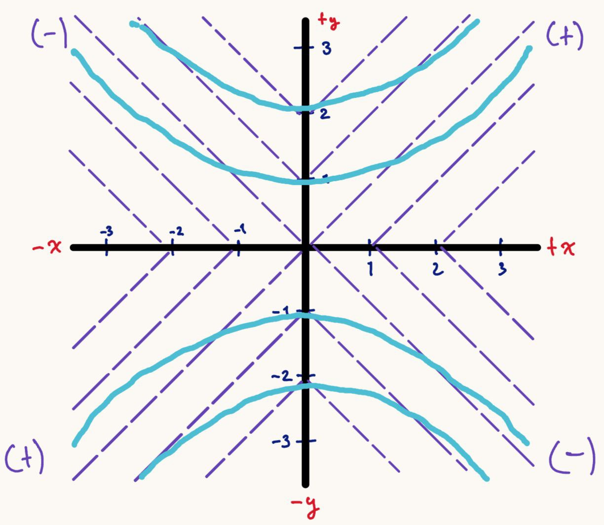

### Solución de la EDO

Ecuación separable (partimos de $y'=xy$ $\Leftrightarrow$ $\frac{dy}{dx}=x\,y$):

$$
\frac{dy}{y}=x\,dx
\;\;\Rightarrow\;\;
\int \frac{1}{y}\,dy=\int x\,dx
\;\;\Rightarrow\;\;
\ln|y|=\frac{x^{2}}{2}+C.
$$

**Exponentiando:**

$$
|y|=e^{C}\,e^{x^{2}/2}\;=\;K\,e^{x^{2}/2},\quad K>0
\;\;\Rightarrow\;\;
\boxed{\,y(x)=C\,e^{x^{2}/2}\,}
$$

donde $C\in\mathbb{R}$ (incluye $y\equiv 0$ con $C=0$).

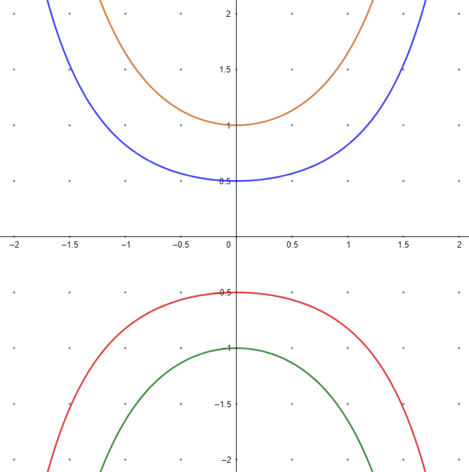

## $x\,dx + y\,dy = 0$

### Esbozo mediante método de isóclinas

1. **Pasa a forma normal**

    $$
    \frac{dy}{dx}=-\frac{x}{y}=f(x,y).
    $$

    > $y\neq 0$.

2. **Definir isóclinas** $f(x,y)=c$

    $$
    -\frac{x}{y}=c\;\;\Longrightarrow\;\; y=-\frac{x}{c}.
    $$

    Son rectas que pasan por el origen; cada recta tiene pendiente constante $c$ para las soluciones. Ejemplos:

    - $c=1$: $y=-x$
    - $c=2$: $y=-\tfrac{x}{2}$
    - $c=-1$: $y=x$
    - $c=-2$: $y=\tfrac{x}{2}$

3. **Dibujo del campo**

    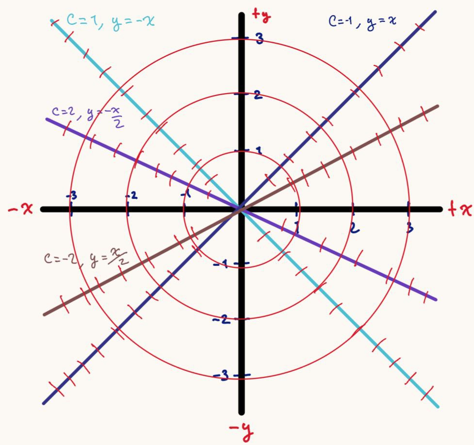

### Solución de la EDO

Ecuación separable (a partir de $x\,dx + y\,dy = 0$ o, en forma normal, $y'=-x/y$):

$$
y\,dy=-x\,dx
\;\;\Rightarrow\;\;
\int y\,dy=\int -x\,dx
\;\;\Rightarrow\;\;
\frac{y^{2}}{2}=-\,\frac{x^{2}}{2}+C.
$$

Multiplicando por 2 y reacomodando:

$$
\boxed{\,x^{2}+y^{2}=C_1\,}
$$

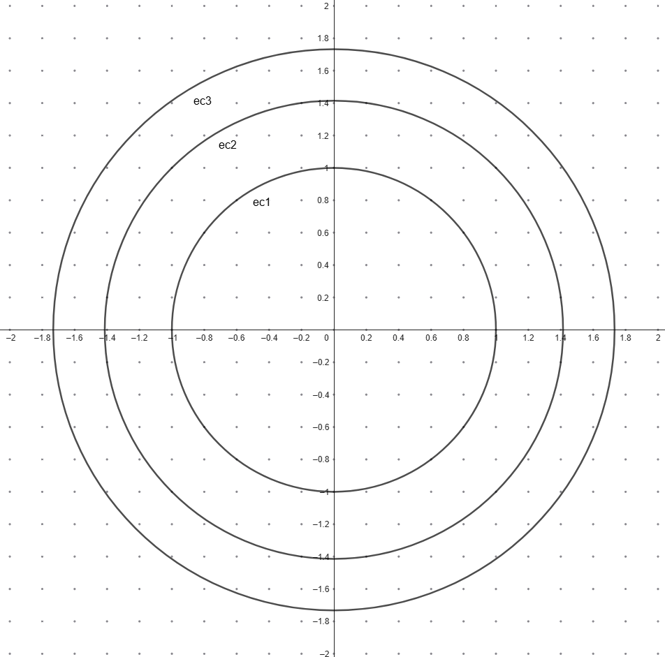

## $y\,dx + x\,dy = 0$

### Esbozo mediante método de isóclinas

1. **Pasa a forma normal**

   $$
   \frac{dy}{dx}=-\frac{y}{x}=f(x,y), \qquad x\neq 0.
   $$

2. **Isóclinas** $f(x,y)=c$

   $$
   -\frac{y}{x}=c \;\;\Longrightarrow\;\; y=-c\,x.
   $$

   Son rectas por el origen; en cada recta la pendiente de las soluciones es la constante $c$.
   Ejemplos:
   - $c=-1 \Rightarrow y = x$
   - $c=-0.5 \Rightarrow y = 0.5\,x$
   - $c=1 \Rightarrow y = -x$
   - $c=0.5 \Rightarrow y = -0.5\,x$

3. **Dibujo del campo**

    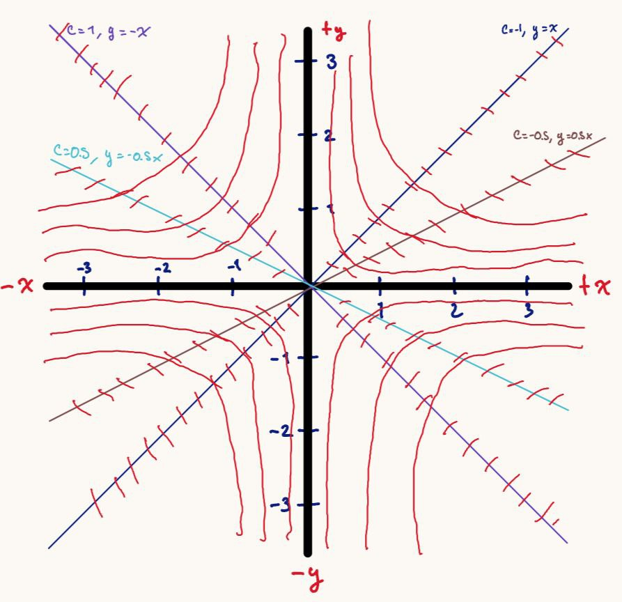

### Solución de la EDO

Ecuación separable:

$$
y\,dx + x\,dy=0 \;\;\Longleftrightarrow\;\; d(xy)=0
\;\;\Rightarrow\;\; \boxed{\,xy=C\,}.
$$

**Forma explícita:**

$$
\boxed{\,y(x)=\frac{C}{x}\,},\quad x\neq 0.
$$

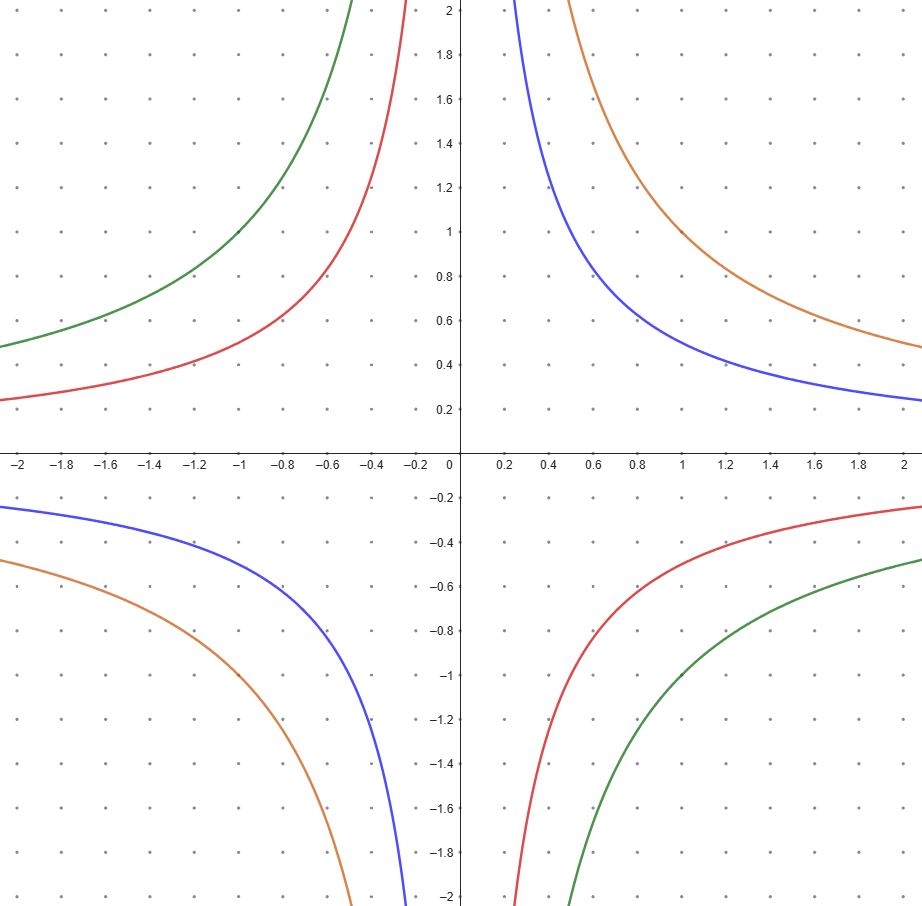

## $\dfrac{dy}{dx} = y^2 - y$

### Diagrama de fase

1. **Autónoma.**

    $f(y)=y(y-1)$ depende solo de $y$ => aplica diagrama de fase en la recta $y$.

2. **Puntos de equilibrio.**

    Resolver $f(y)=0\Rightarrow y=0,\;y=1$.

3. **Tabla de signos (línea de fase).**

    | Intervalo     | Valor prueba | $f(y)=y(y-1)$ | Dirección |
    | ------------- | ------------ | ------------- | --------- |
    | $(-\infty,0)$ | $y=-1$       | $+$           | arriba    |
    | $(0,1)$       | $y=0.5$      | $−$           | abajo     |
    | $(1,\infty)$  | $y=2$        | $+$           | arriba    |

4. **Clasificación de equilibrios.**

    - $y=0$: **atractor (estable)**, flechas llegan desde arriba y abajo.
    - $y=1$: **repulsor (inestable)**, flechas se alejan a ambos lados.

5. **Validez (existencia–unicidad).**

    $f$ es polinómica => $f$ y $f_y$ continuas en todo $\mathbb{R}$ => soluciones **únicas** y no se cruzan; el diagrama es consistente.

    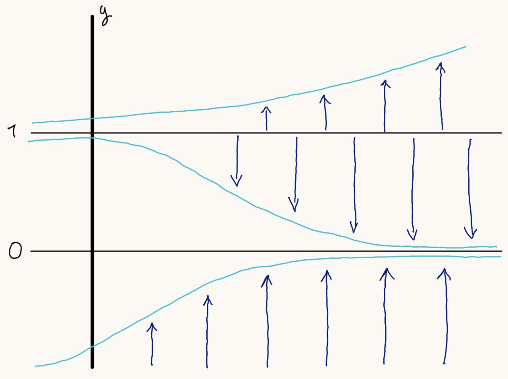

### Solución de la EDO

Ecuación separable (partimos de $y'=y^2-y$):

$$
\frac{dy}{dx}=y(y-1)
\;\Rightarrow\;
\frac{dy}{y(y-1)}=dx.
$$

**Fracciones parciales:**

$$
\frac{1}{y(y-1)}=\frac{-1}{y}+\frac{1}{y-1}.
$$

**Integramos:**

$$
\int\!\Big(\!-\frac{1}{y}+\frac{1}{y-1}\Big)\,dy=\int dx
\;\Rightarrow\;
-\ln|y|+\ln|y-1|=x+C.
$$

**Reordenamos y exponenciamos:**

$$
\ln\Big|\frac{y-1}{y}\Big|=x+C
\;\Rightarrow\;
\frac{y-1}{y}=K\,e^{x}.
$$

**Despeje de $y$:**

$$
1-\frac{1}{y}=K e^{x}
\;\Rightarrow\;
\frac{1}{y}=1-K e^{x}
\;\Rightarrow\;
\boxed{\,y(x)=\frac{1}{\,1+K e^{x}\,}\,},\quad K\in\mathbb{R}.
$$

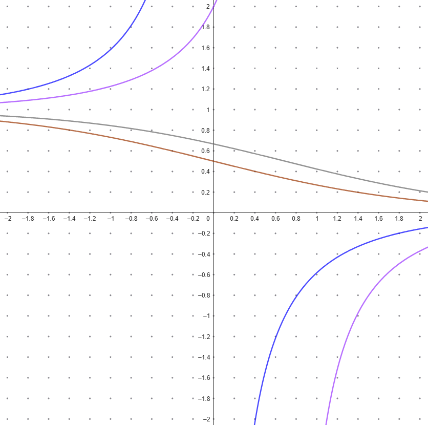

## Discusión y comparación

**1. $y'=-xy$**

- **Boceto vs. analítica:** $y=C\,e^{-x^2/2}$ tiene tangente horizontal en $x=0$ y simetría par en $x$, tal como sugieren las flechas.
- **Concavidad:** $y''=y(x^2-1)$ -> cambio en $x=\pm1$ observado en el esbozo.
- **Teorema E. & U.:** $f$ y $f_y$ continuas => las trayectorias no se cruzan; las curvas coinciden.

**2. $y'=xy$**

- **Boceto vs. analítica:** $y=C\,e^{x^2/2}$ crece rápido para $|x|$ grande, con tangente horizontal en $x=0$; el campo muestra crecimiento en I y III y descenso en II y IV, consistente.
- **Concavidad:** $y''=y(1+x^2)$ -> arriba cóncava ↑, abajo cóncava ↓, como en el esbozo.
- **Teorema E. & U.:** global; coincidencia total.

**3. $x\,dx+y\,dy=0$**

- **Boceto (isóclinas) vs. analítica:** la familia $x^2+y^2=C$ (circunferencias) es coherente con isóclinas radiales $y=-x/c$: sobre cada recta la pendiente es constante $c$ y las tangentes a los círculos cumplen $y'=-x/y$.

**4. $y\,dx+x\,dy=0$**

- **Boceto (isóclinas) vs. analítica:** $xy=C$ (hipérbolas rectangulares) concuerda con isóclinas $y=-c\,x$. En el campo, sobre $y=0$ se ven pendientes 0; en $x=0$ la forma normal no define $y'$, y la familia implícita incluye la recta vertical $x=0$ cuando $C=0$.
- **Coincidencia:** las ramas y asintotas a los ejes concuerdan con el esbozo.

**5. $y'=y^2-y$** (autónoma)

- **Diagrama de fase vs. analítica:** $y(x)=\frac{1}{1+K e^{x}}$ más $y\equiv0,1$. El diagrama predijo $y=0$ **atractor** y $y=1$ **repulsor**:

  - Si $0<y_0<1$: la solución **desciende** a 0 (hacia $+\infty$) y **tiende** a 1 (hacia $-\infty$).
  - Si $y_0>1$ o $y_0<0$: la solución **sube**.
- **Teorema E. & U.:** polinómica => unicidad global; el campo/diagrama y las fórmulas coinciden.

**Conclusión general.**
Los esbozos cualitativos (campo de pendientes, isóclinas y diagrama de fase) predicen correctamente la forma, concavidad, equilibrios y singularidades de las soluciones analíticas.

# Problema 3

Resolver la ecuación diferencial  

$$x y'' + 2y' = 6x \tag{2}$$  

haciendo una sustitución adecuada para convertir la ecuación (2) en una EDO de primer orden.  
A partir de la ecuación de primer orden obtenida, indicar la región del plano $\mathbb{R}^2$ en donde vale el teorema de existencia y unicidad, e indicar aquellas regiones en donde no se cumple.  

Analizar en los puntos donde no se cumple el teorema, qué es lo que ocurre con las soluciones en estos puntos  
(¿hay solución?, ¿hay más de una? ¿o no hay soluciones?).  

Resolver los problemas de valor inicial siguientes:  

- $y(1) = 2$,  
- $y(1) = -2$,  
- $y(1) = 1$,  
- $y(0) = -3$  

y graficar las soluciones obtenidas asumiendo un término constante $C = 0$ en la expresión de su solución.

## Procedimiento

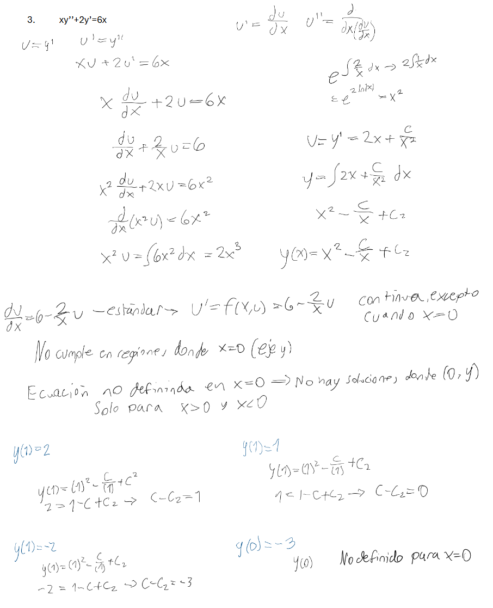

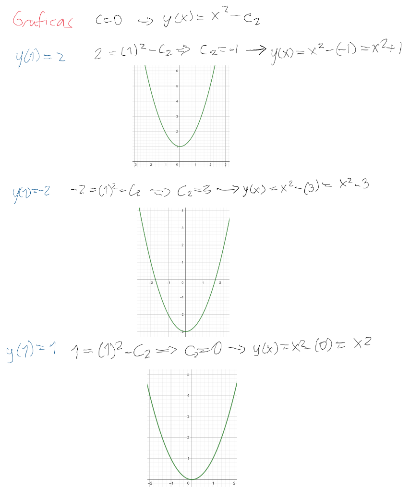

# Problema 4

Considere el siguiente problema de valor inicial

$$
\frac{dy}{dx}
=\frac{x-3y-3\!\left(x^{2}-y^{2}\right)+3xy}{\,2x-y+3\!\left(x^{2}-y^{2}\right)+2xy\,},
\qquad y(1.5)=0. \tag{3}
$$

## Inciso a

Graficar el campo de direcciones de la EDO anterior.  

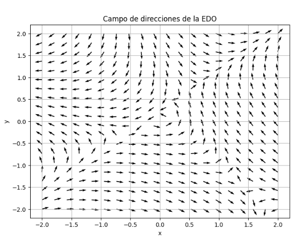

**¿Cómo se realizó?**  

Se implementó una función `F(x, y)` que devuelve las dos componentes del campo vectorial asociado a la EDO. Se generó una malla de puntos en el plano con `numpy.meshgrid`, y se calcularon las direcciones en cada punto. Usando `matplotlib.pyplot.quiver` se graficaron las flechas normalizadas, obteniendo el campo de direcciones. Esta visualización permite observar hacia dónde apuntan las soluciones locales de la ecuación diferencial en cada región del plano.

**¿Qué se encontró?**  

El campo muestra un patrón de flujo no lineal, con regiones donde las flechas rotan y cambian de orientación. Esto anticipa la existencia de puntos de equilibrio y trayectorias inestables.

## Inciso b

A partir del campo de direcciones, esbozar la solución del problema de valor inicial (3), y agregar la curva solución al *plot* del campo de direcciones.  


**¿Cómo se realizó?**

Se resolvió el problema de valor inicial `y(1.5)=0` mediante integración numérica con `solve_ivp` de SciPy. Se implementó la función pendiente `dy/dx = f(x, y)` a partir de la relación entre las componentes de `F(x, y)`. El integrador numérico construyó la trayectoria de la solución en un intervalo de `x`, y se graficó esta curva en color rojo sobre el campo de direcciones. El punto inicial se marcó con un círculo azul para indicar la condición inicial, comprobando que la trayectoria sigue la orientación de las flechas.

**¿Qué se encontró?**

La curva solución parte de `(1.5, 0)` y sigue la dirección de las flechas del campo, descendiendo rápidamente hacia valores negativos de `y`. Esto indica un comportamiento inestable: la solución no converge a un equilibrio, sino que se aleja a medida que `x` aumenta.

## Inciso c

Hallar numéricamente los puntos de equilibrio de la EDO anterior, que son aquellos puntos en donde el campo de direcciones $F(x,y)=\mathbf{0}$ es el vector nulo. Para ello, resolver numéricamente el sistema:

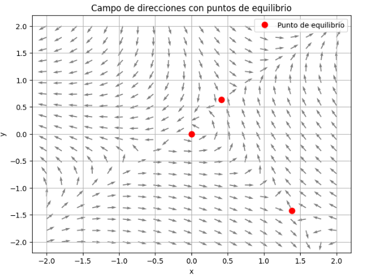

$$
\begin{cases}
x-3y-3\!\left(x^{2}-y^{2}\right)+3xy=0,\\[2pt]
2x-y+3\!\left(x^{2}-y^{2}\right)+2xy=0.
\end{cases}
$$

**¿Cómo se realizó?**

Los puntos de equilibrio corresponden a los lugares donde `F(x, y) = (0, 0)`. Para hallarlos, se planteó el sistema no lineal y se utilizó el método numérico `fsolve` de SciPy probando distintos valores iniciales. El procedimiento arrojó tres puntos de equilibrio aproximados:  
`(0, 0)`, `(0.41248, 0.63864)`, `(1.38698, -1.41775)`.  
Estos puntos se graficaron en color rojo sobre el campo de direcciones, observando que en su entorno las flechas cambian de orientación, confirmando su papel como soluciones de equilibrio.

**¿Qué se encontró?**

Se obtuvieron tres puntos de equilibrio aproximados:  
`(0, 0)`, `(0.41248, 0.63864)`, `(1.38698, -1.41775)`.  
En el campo de direcciones se confirma que alrededor de estos puntos las flechas cambian de orientación, validando que son posiciones de equilibrio del sistema.
