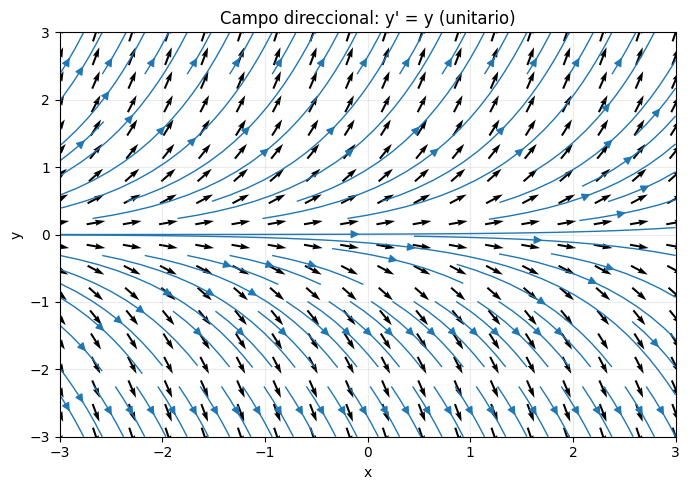
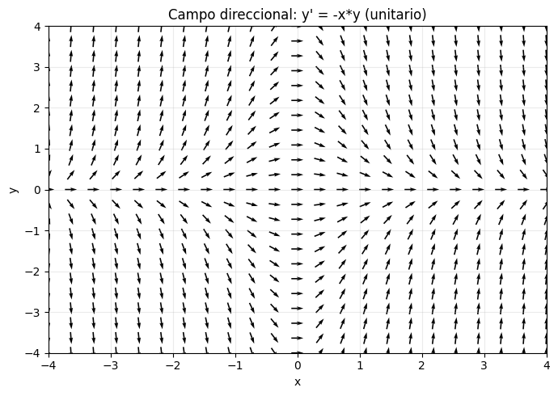
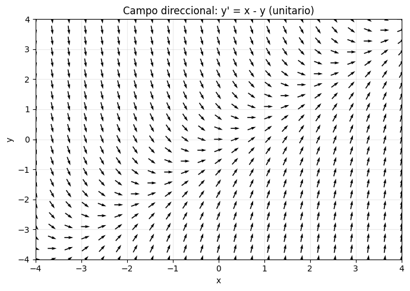

# Problema 1

Implementar en Python una función que grafique el campo de direcciones asociado a una ecuación diferencial de primer orden  

$$\frac{dy}{dx} = f(x,y). \tag{1}$$

Como parámetros su algoritmo debe recibir la función $f$, los límites $x_{\min}, x_{\max}, y_{\min}, y_{\max}$ de la ventana que desea graficar, y parámetros $xstep$ y $ystep$ para indicar la separación en la que quiere subdividir su grid de puntos sobre los ejes $x$ y $y$, respectivamente. Puede añadir parámetros adicionales que usted desee.  

También debe incluir algún parámetro que permita graficar entre el campo $F$ asociado a la ecuación (1), o el campo unitario $N$ equivalente.  

Para la salida, su función debe devolver una figura con el campo de direcciones requerido. Si usted lo desea, puede incorporar que su función grafique también las líneas de flujo o curvas solución de la ecuación diferencial.  

**Sugerencia:** Apoyarse de las funciones `numpy.linspace` para crear los rangos y subdivisiones en los ejes $x$ y $y$. Usar la función `numpy.meshgrid` para generar la rejilla de puntos a graficar. Usar `matplotlib.pyplot.quiver` para construir el campo vectorial requerido. Puede usar la función `matplotlib.pyplot.streamplot` para graficar las líneas de flujo.  

Se sugiere implementar la construcción del campo a través de una función auxiliar:  

```python
def F(x, y):
    return (expr1, expr2)
```

donde `expr1` y `expr2` corresponden a las componentes del campo $F(x,y)$ que desea graficar.

Ilustrar los resultados de su función graficando dos campos vectoriales de su elección.

## Procedimiento

### 1. De la EDO al campo vectorial

La ecuación diferencial de primer orden es de la forma

$$
\frac{dy}{dx} = f(x,y).
$$

Podemos representarla como un campo vectorial en el plano:

$$
F(x,y) = (1,\, f(x,y)).
$$

* La primera componente siempre es **1** -> significa que avanzamos en el eje $x$.
* La segunda componente es el valor de la pendiente en $(x,y)$.

Así, cada punto del plano recibe una flecha que indica la dirección de la curva solución en ese punto.

### 2. Normalización de vectores

Si usamos directamente $F(x,y)$, algunas flechas pueden salir muy largas o muy cortas.
Por eso, calculamos el vector unitario equivalente:

$$
\hat{F}(x,y) = \frac{(1, f(x,y))}{\sqrt{1 + f(x,y)^2}}.
$$

Esto asegura que todas las flechas tengan la misma longitud, pero con la dirección correcta.
Ese fue el caso en tus gráficas (usaste `useUnitField=True`).

### 3. Construcción del grid

* Usamos `numpy.linspace` para crear subdivisiones uniformes en los intervalos $[x_{\min}, x_{\max}]$ y $[y_{\min}, y_{\max}]$.
* Luego `numpy.meshgrid` genera la rejilla bidimensional de puntos donde evaluamos $F(x,y)$.

### 4. Visualización

* `matplotlib.pyplot.quiver`: dibuja las flechas del campo direccional.
* `matplotlib.pyplot.streamplot`: esto se ve en el primer gráfico donde se pueden ver líneas de flujo, que siguen las trayectorias solución.

### 5. Ejemplos implementados

1. **$y' = y$:**

    

2. **$y' = 1 - y$:**

    

3. **$y' = sin(x)$:**

    
