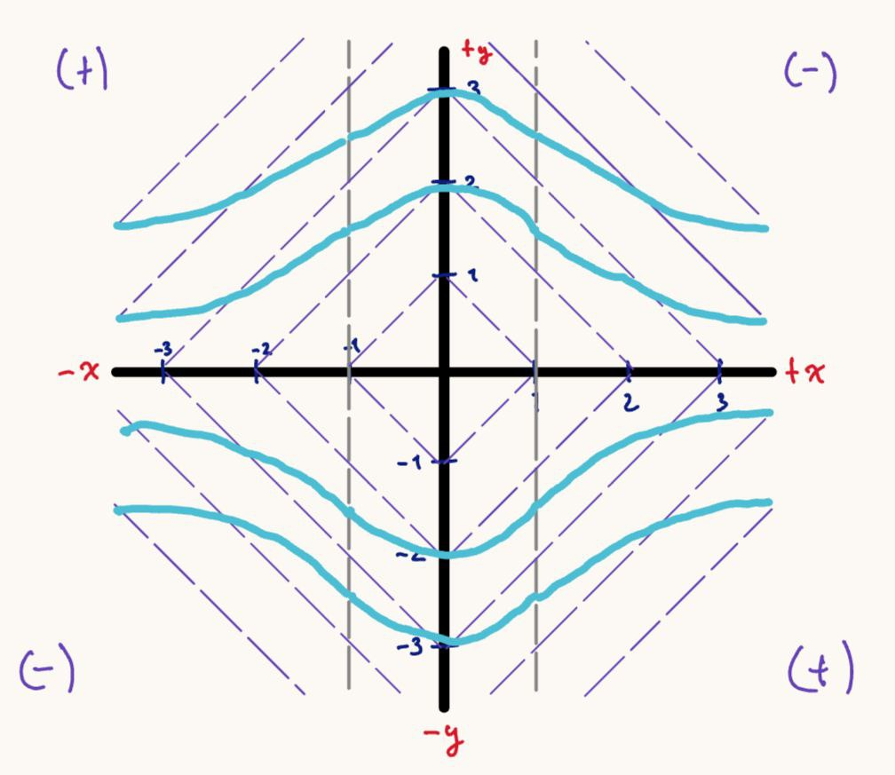
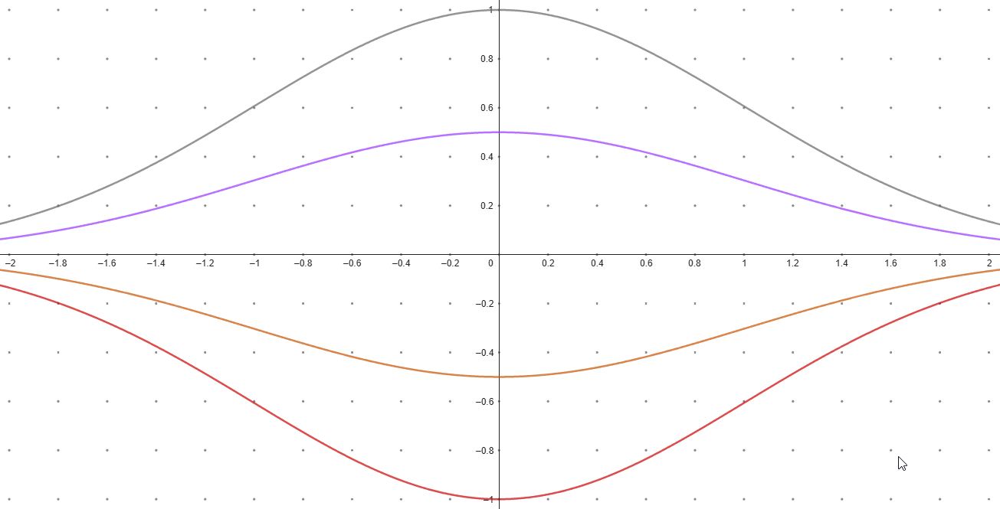
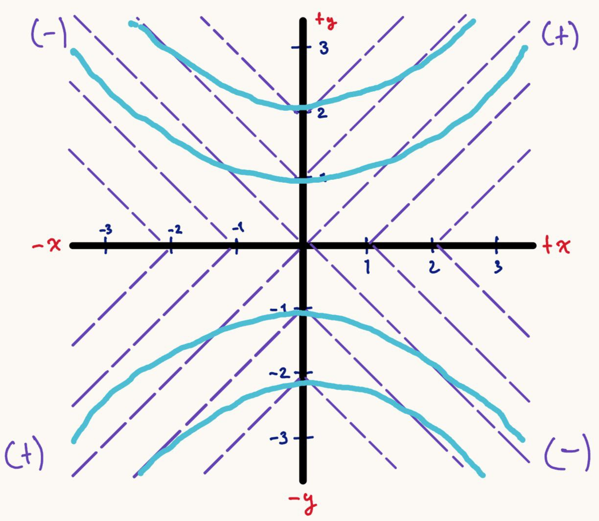
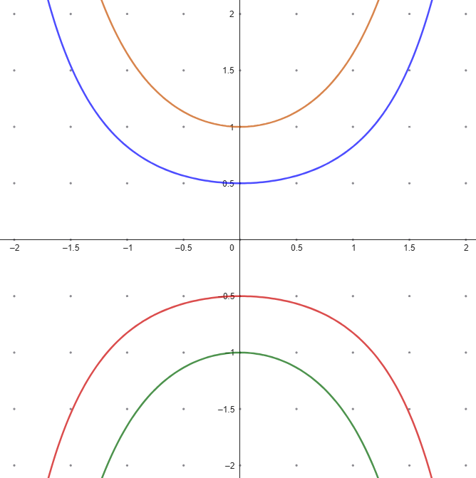
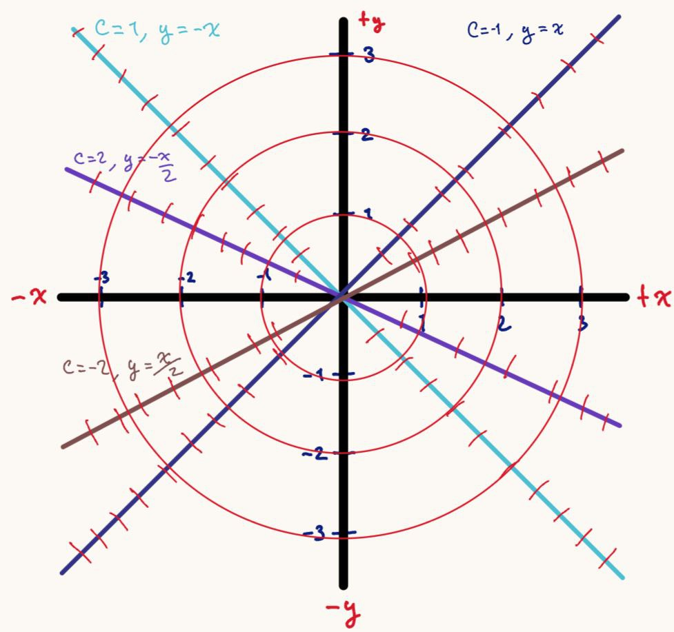
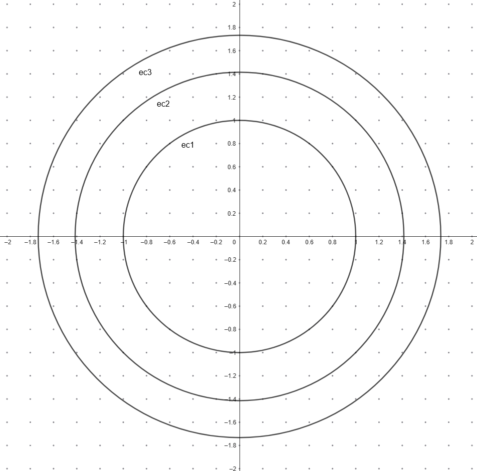
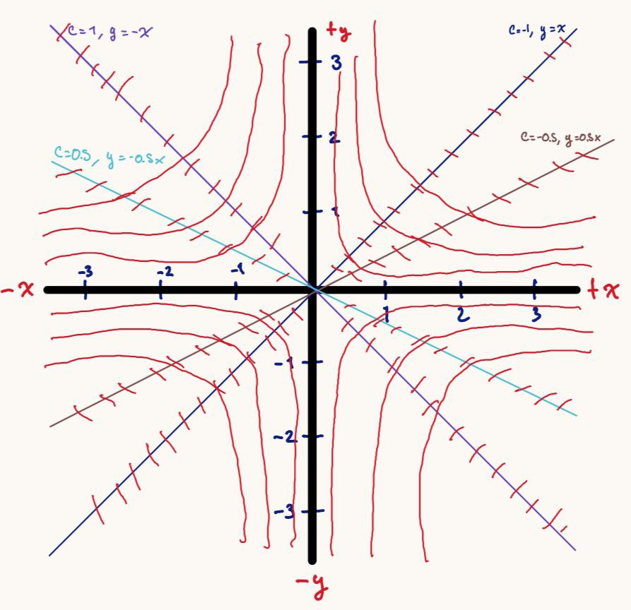
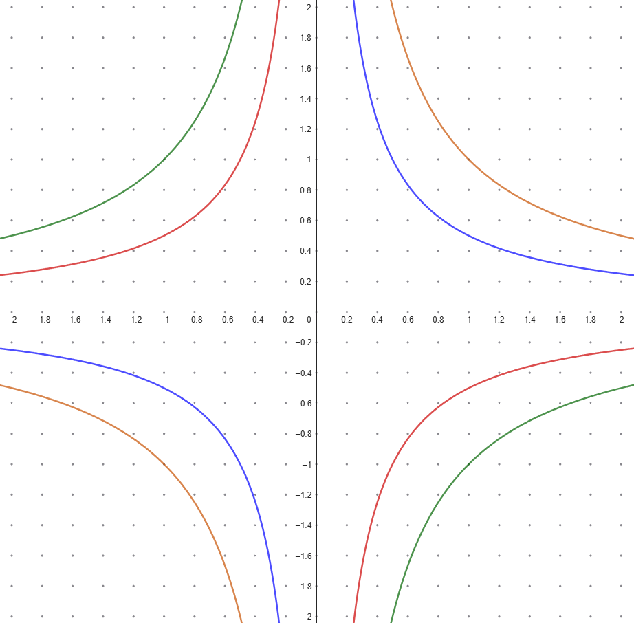
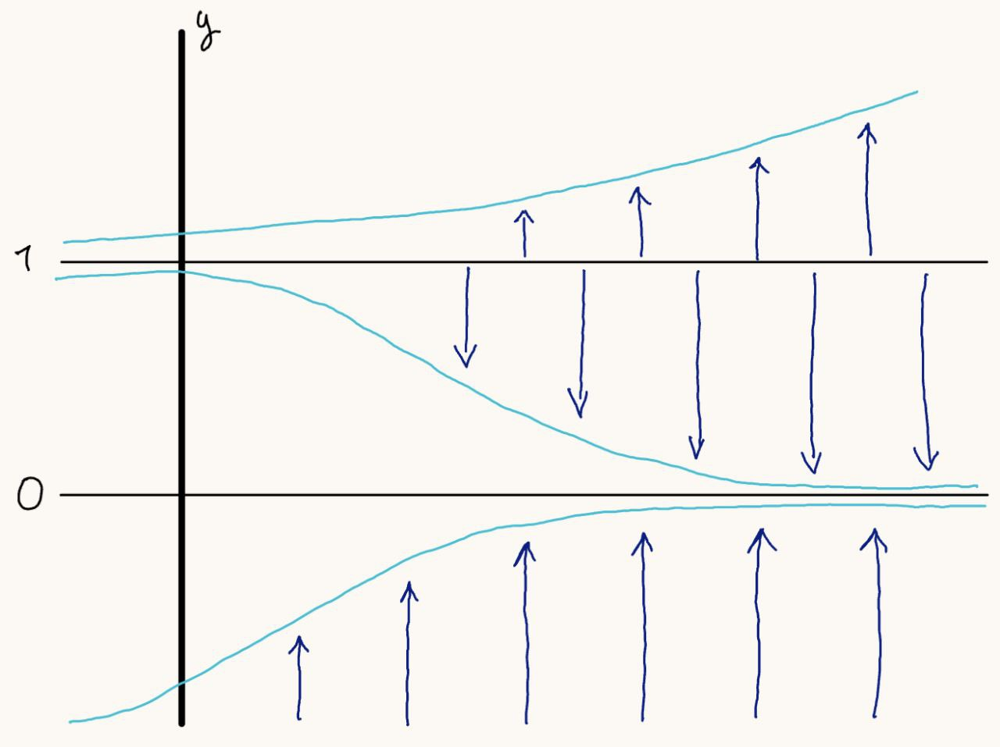
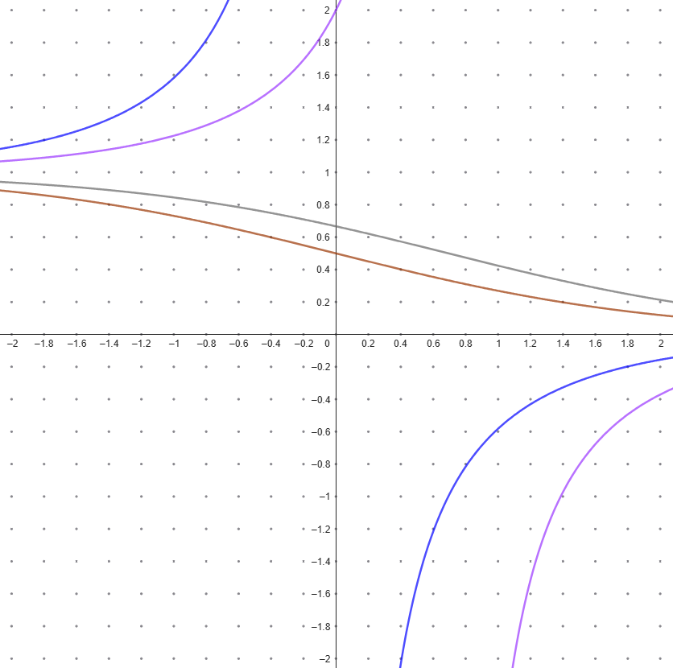

# Problema 2

Para las siguientes ecuaciones diferenciales ordinarias, utilizar métodos cualitativos para esbozar las soluciones de la EDO.  
Luego, resolver cada EDO con los métodos aprendidos en sus cursos pasados, para determinar una expresión de la solución general de cada EDO. Comparar la solución obtenida contra su solución esbozada. Discutir si coinciden las curvas solución.  

> Nota: en clase se vieron las siguientes técnicas para esbozar soluciones de una EDO
>
> 1. **Campo de pendientes**
>
>    - Representar la EDO $y'=f(x,y)$ como el campo vectorial $F(x,y)=(1,f(x,y))$.
>    - Graficar flechas cortas que muestran la dirección local de las soluciones.
> 2. **Análisis de signos de $f(x,y)$**
>
>    - Si $f(x,y)>0$: la solución sube.
>    - Si $f(x,y)<0$: la solución baja.
>    - Si $f(x,y)=0$: hay solución constante o equilibrio.
> 3. **Análisis de concavidad**
>
>    - Usar $y''=f_x+f f_y$.
>    - Si $y''>0$: cóncava hacia arriba.
>    - Si $y''<0$: cóncava hacia abajo.
>    - Si $y''=0$: punto de inflexión.
> 4. **Método de las isóclinas**
>
>    - Trazar curvas donde $f(x,y)=c$ es constante.
>    - Cada curva guía el campo de pendientes y muestra familias de trayectorias.
> 5. **Diagramas de fase (para EDO autónomas)**
>
>    - Identificar puntos de equilibrio (donde $f(y)=0$).
>    - Clasificarlos como atractores, repulsores o semiestables.
>    - Representar con flechas la dirección de las soluciones según el signo de $f(y)$.
> 6. **Teorema de existencia y unicidad** (como herramienta de validez)
>
>    - Verificar continuidad de $f$ y $\partial f/\partial y$ para asegurar que las trayectorias no se crucen y la representación cualitativa tenga sentido.

## $y' = -xy$

### Esbozo mediante campo de pendientes (con análisis de concavidad)

- **Definir función:**

$$
f(x,y) = -xy
$$

- **Análisis de signo de $f(x,y)$:**

  - Cuadrante I ($x>0, y>0$): $f<0$
  - Cuadrante II ($x<0, y>0$): $f>0$
  - Cuadrante III ($x<0, y<0$): $f<0$
  - Cuadrante IV ($x>0, y<0$): $f>0$
  - Sobre los ejes: $f=0$ (pendiente horizontal).

- **Concavidad:**

  $$
  f_x + f f_y = -y + (-xy)(-x) = -y + x^2y = y(x^2 - 1)
  $$

  Factorizamos:

  $$
  f_x + f f_y = y(x+1)(x-1)
  $$

  Estudio de signos:

  | Intervalo de $x$ | Signo de $(x+1)(x-1)$ | Resultado en $y>0$   | Resultado en $y<0$   |
  | ------------------ | ----------------------- | ---------------------- | ---------------------- |
  | $(-\infty,-1)$   | $+$                   | $+$ (cóncava arriba) | $-$ (cóncava abajo)  |
  | $(-1,1)$         | $-$                   | $-$ (cóncava abajo)  | $+$ (cóncava arriba) |
  | $(1,\infty)$     | $+$                   | $+$ (cóncava arriba) | $-$ (cóncava abajo)  |

- Existen **puntos de inflexión** en $x=-1$ y $x=1$.
- En la parte superior (cuando $y>0$), las curvas alternan entre concavidad hacia arriba y hacia abajo según los intervalos de $x$.
- En la parte inferior (cuando $y<0$), ocurre lo opuesto.
- La recta $y=0$ sigue siendo una solución constante.

### Solución de la EDO

Ecuación separable:

$$
\frac{dy}{y}=-x\,dx
\;\;\Rightarrow\;\;
\int\frac{1}{y}\,dy=\int -x\,dx
\;\;\Rightarrow\;\;
\ln|y|=-\frac{x^{2}}{2}+C
$$

Exponentiando:

$$
|y|=e^{C}\,e^{-x^{2}/2}\;\Rightarrow\; \boxed{\,y(x)=C\,e^{-x^{2}/2}\,}
$$

donde $C\in\mathbb{R}$ (incluye $y\equiv 0$ con $C=0$).

## $y' = xy$

### Esbozo mediante campo de pendientes (con análisis de concavidad)

Definimos:

$$
f(x,y) = xy
$$

- **Análisis de signo de $f(x,y)$:**

  - Cuadrante I ($x>0, y>0$): $f>0$
  - Cuadrante II ($x<0, y>0$): $f<0$
  - Cuadrante III ($x<0, y<0$): $f>0$
  - Cuadrante IV ($x>0, y<0$): $f<0$
  - Sobre los ejes $x=0$ o $y=0$: $f=0$ (pendiente horizontal).

- **Análisis de concavidad:**

  $$
  f_x + f f_y = y + (xy)(x) = y + x^2y = y(x^2+1)
  $$

  Como $x^2+1 > 0$ siempre, el signo depende de $y$:

  - Si $y>0$: concavidad hacia arriba.
  - Si $y<0$: concavidad hacia abajo.

- En los cuadrantes I y II las curvas suben con concavidad hacia arriba.
- En los cuadrantes III y IV las curvas suben con concavidad hacia abajo.
- La recta $y=0$ es solución constante.

Esto genera curvas en forma de "U" arriba del eje $x$ y curvas invertidas debajo del eje $x$.

### Solución de la EDO

Ecuación separable (partimos de $y'=xy$ $\Leftrightarrow$ $\frac{dy}{dx}=x\,y$):

$$
\frac{dy}{y}=x\,dx
\;\;\Rightarrow\;\;
\int \frac{1}{y}\,dy=\int x\,dx
\;\;\Rightarrow\;\;
\ln|y|=\frac{x^{2}}{2}+C.
$$

**Exponentiando:**

$$
|y|=e^{C}\,e^{x^{2}/2}\;=\;K\,e^{x^{2}/2},\quad K>0
\;\;\Rightarrow\;\;
\boxed{\,y(x)=C\,e^{x^{2}/2}\,}
$$

donde $C\in\mathbb{R}$ (incluye $y\equiv 0$ con $C=0$).

## $x\,dx + y\,dy = 0$

### Esbozo mediante método de isóclinas

1. **Pasa a forma normal**

    $$
    \frac{dy}{dx}=-\frac{x}{y}=f(x,y).
    $$

    > $y\neq 0$.

2. **Definir isóclinas** $f(x,y)=c$

    $$
    -\frac{x}{y}=c\;\;\Longrightarrow\;\; y=-\frac{x}{c}.
    $$

    Son rectas que pasan por el origen; cada recta tiene pendiente constante $c$ para las soluciones. Ejemplos:

    - $c=1$: $y=-x$
    - $c=2$: $y=-\tfrac{x}{2}$
    - $c=-1$: $y=x$
    - $c=-2$: $y=\tfrac{x}{2}$

3. **Dibujo del campo**

    

### Solución de la EDO

Ecuación separable (a partir de $x\,dx + y\,dy = 0$ o, en forma normal, $y'=-x/y$):

$$
y\,dy=-x\,dx
\;\;\Rightarrow\;\;
\int y\,dy=\int -x\,dx
\;\;\Rightarrow\;\;
\frac{y^{2}}{2}=-\,\frac{x^{2}}{2}+C.
$$

Multiplicando por 2 y reacomodando:

$$
\boxed{\,x^{2}+y^{2}=C_1\,}
$$

## $y\,dx + x\,dy = 0$

### Esbozo mediante método de isóclinas

1. **Pasa a forma normal**

   $$
   \frac{dy}{dx}=-\frac{y}{x}=f(x,y), \qquad x\neq 0.
   $$

2. **Isóclinas** $f(x,y)=c$

   $$
   -\frac{y}{x}=c \;\;\Longrightarrow\;\; y=-c\,x.
   $$

   Son rectas por el origen; en cada recta la pendiente de las soluciones es la constante $c$.
   Ejemplos:
   - $c=-1 \Rightarrow y = x$
   - $c=-0.5 \Rightarrow y = 0.5\,x$
   - $c=1 \Rightarrow y = -x$
   - $c=0.5 \Rightarrow y = -0.5\,x$

3. **Dibujo del campo**

    

### Solución de la EDO

Ecuación separable:

$$
y\,dx + x\,dy=0 \;\;\Longleftrightarrow\;\; d(xy)=0
\;\;\Rightarrow\;\; \boxed{\,xy=C\,}.
$$

**Forma explícita:**

$$
\boxed{\,y(x)=\frac{C}{x}\,},\quad x\neq 0.
$$

## $\dfrac{dy}{dx} = y^2 - y$

### Diagrama de fase

1. **Autónoma.**

    $f(y)=y(y-1)$ depende solo de $y$ => aplica diagrama de fase en la recta $y$.

2. **Puntos de equilibrio.**

    Resolver $f(y)=0\Rightarrow y=0,\;y=1$.

3. **Tabla de signos (línea de fase).**

    | Intervalo     | Valor prueba | $f(y)=y(y-1)$ | Dirección |
    | ------------- | ------------ | ------------- | --------- |
    | $(-\infty,0)$ | $y=-1$       | $+$           | arriba    |
    | $(0,1)$       | $y=0.5$      | $−$           | abajo     |
    | $(1,\infty)$  | $y=2$        | $+$           | arriba    |

4. **Clasificación de equilibrios.**

    - $y=0$: **atractor (estable)**, flechas llegan desde arriba y abajo.
    - $y=1$: **repulsor (inestable)**, flechas se alejan a ambos lados.

5. **Validez (existencia–unicidad).**

    $f$ es polinómica => $f$ y $f_y$ continuas en todo $\mathbb{R}$ => soluciones **únicas** y no se cruzan; el diagrama es consistente.

    

### Solución de la EDO

Ecuación separable (partimos de $y'=y^2-y$):

$$
\frac{dy}{dx}=y(y-1)
\;\Rightarrow\;
\frac{dy}{y(y-1)}=dx.
$$

**Fracciones parciales:**

$$
\frac{1}{y(y-1)}=\frac{-1}{y}+\frac{1}{y-1}.
$$

**Integramos:**

$$
\int\!\Big(\!-\frac{1}{y}+\frac{1}{y-1}\Big)\,dy=\int dx
\;\Rightarrow\;
-\ln|y|+\ln|y-1|=x+C.
$$

**Reordenamos y exponenciamos:**

$$
\ln\Big|\frac{y-1}{y}\Big|=x+C
\;\Rightarrow\;
\frac{y-1}{y}=K\,e^{x}.
$$

**Despeje de $y$:**

$$
1-\frac{1}{y}=K e^{x}
\;\Rightarrow\;
\frac{1}{y}=1-K e^{x}
\;\Rightarrow\;
\boxed{\,y(x)=\frac{1}{\,1+K e^{x}\,}\,},\quad K\in\mathbb{R}.
$$

## Discusión y comparación

**1. $y'=-xy$**

- **Boceto vs. analítica:** $y=C\,e^{-x^2/2}$ tiene tangente horizontal en $x=0$ y simetría par en $x$, tal como sugieren las flechas.
- **Concavidad:** $y''=y(x^2-1)$ -> cambio en $x=\pm1$ observado en el esbozo.
- **Teorema E. & U.:** $f$ y $f_y$ continuas => las trayectorias no se cruzan; las curvas coinciden.

**2. $y'=xy$**

- **Boceto vs. analítica:** $y=C\,e^{x^2/2}$ crece rápido para $|x|$ grande, con tangente horizontal en $x=0$; el campo muestra crecimiento en I y III y descenso en II y IV, consistente.
- **Concavidad:** $y''=y(1+x^2)$ -> arriba cóncava ↑, abajo cóncava ↓, como en el esbozo.
- **Teorema E. & U.:** global; coincidencia total.

**3. $x\,dx+y\,dy=0$**

- **Boceto (isóclinas) vs. analítica:** la familia $x^2+y^2=C$ (circunferencias) es coherente con isóclinas radiales $y=-x/c$: sobre cada recta la pendiente es constante $c$ y las tangentes a los círculos cumplen $y'=-x/y$.

**4. $y\,dx+x\,dy=0$**

- **Boceto (isóclinas) vs. analítica:** $xy=C$ (hipérbolas rectangulares) concuerda con isóclinas $y=-c\,x$. En el campo, sobre $y=0$ se ven pendientes 0; en $x=0$ la forma normal no define $y'$, y la familia implícita incluye la recta vertical $x=0$ cuando $C=0$.
- **Coincidencia:** las ramas y asintotas a los ejes concuerdan con el esbozo.

**5. $y'=y^2-y$** (autónoma)

- **Diagrama de fase vs. analítica:** $y(x)=\frac{1}{1+K e^{x}}$ más $y\equiv0,1$. El diagrama predijo $y=0$ **atractor** y $y=1$ **repulsor**:

  - Si $0<y_0<1$: la solución **desciende** a 0 (hacia $+\infty$) y **tiende** a 1 (hacia $-\infty$).
  - Si $y_0>1$ o $y_0<0$: la solución **sube**.
- **Teorema E. & U.:** polinómica => unicidad global; el campo/diagrama y las fórmulas coinciden.

**Conclusión general.**
Los esbozos cualitativos (campo de pendientes, isóclinas y diagrama de fase) predicen correctamente la forma, concavidad, equilibrios y singularidades de las soluciones analíticas.
