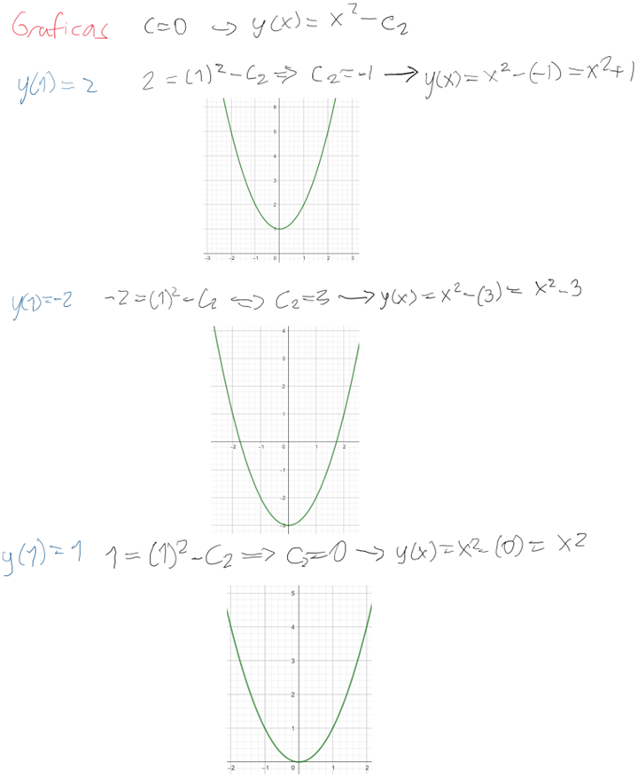

# Problema 3
Resolver la ecuación diferencial

`xy′′ + 2y′ = 6x`

haciendo una sustitución adecuada para convertir la ecuación en una EDO de primer orden. A partir de la ecuación deprimer orden obtenida, indicar la región del plano $$R^2$$ en donde vale el teorema de existencia y unicidad, e indicar aquellas regiones en donde no se cumple.
Analizar en los puntos donde no se cumple el teorema, qué es lo que ocurre con las soluciones en estos puntos (¿hay solución?, ¿hay más de una? o no hay soluciones). Resolver los problemas de valor inicial siguientes: `y(1) = 2`, `y(1) = −2`, `y(1) = 1`, `y(0) = −3` y graficar las soluciones
obtenidas asumiendo un término constante `C = 0` en la expresión de su solución.

## ¿Cómo se realizó?  
Se realizó la sustitución `u=y′`, entonces `u′=y′′`, haciendo que la ecuacion se volviera en `xu' + 2u = 6x`. Se obtiene esta ecuación de primer orden 
$$
\frac{du}{dx} + \frac{2}{x}u = 6 
$$
### Analisis
Para la ecuación $$ u' = f(x, u) = 6-\frac{2}{x}u $$

**Regiones donde se cumple el teorema:**
-  `x > 0`  (semiplano derecho)
-  `x < 0` (semiplano izquierdo)
**Regiones donde NO se cumple el teorema:**
- `x = 0` (eje y) - aquí la función no está definida

**Análisis en x = 0:**
- *NO hay solución* que pase por puntos de la forma `(0, y0)` porque la ecuación no está definida en `x = 0`
- Las soluciones existen solo para  `x > 0` o `x < 0`, pero no pueden cruzar el eje y

### Solución general

$$y(x) = x^2 - \frac{C}{x} + K$$

### Problemas de valor inicial

1. **y(1) = 2**

   
   $$2 = 1^2 - \frac{C}{1} + K$$
   $$K - C = 1$$

2. **y(1) = -2**

   
   $$-2 = 1 - C + K$$
   $$K - C = -3$$

3. **y(1) = 1**:

   
   $$1 = 1 - C + K$$
   $$K - C = 0$$

4. **y(0) = -3**

   *NO tiene solución*
     `x = 0` no está en el dominio de la ecuación diferencial.

### Gráficas con C = 0 

Con `C = 0`, la solución es: $$y(x) = x^2 + K$$

## ¿Qué se encontró?  
Todas las soluciones son parábolas desplazadas verticalmente. Las soluciones están definidas por separado para `x > 0` y `x < 0`, pero ninguna puede incluir `x = 0`, confirmando el análisis teórico sobre el dominio de la ecuación diferencial.