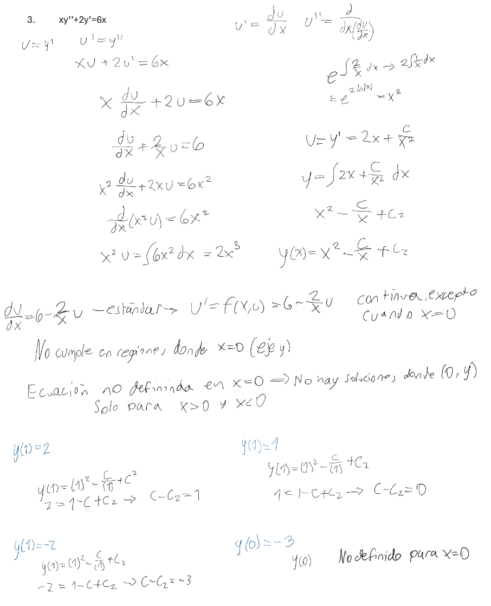
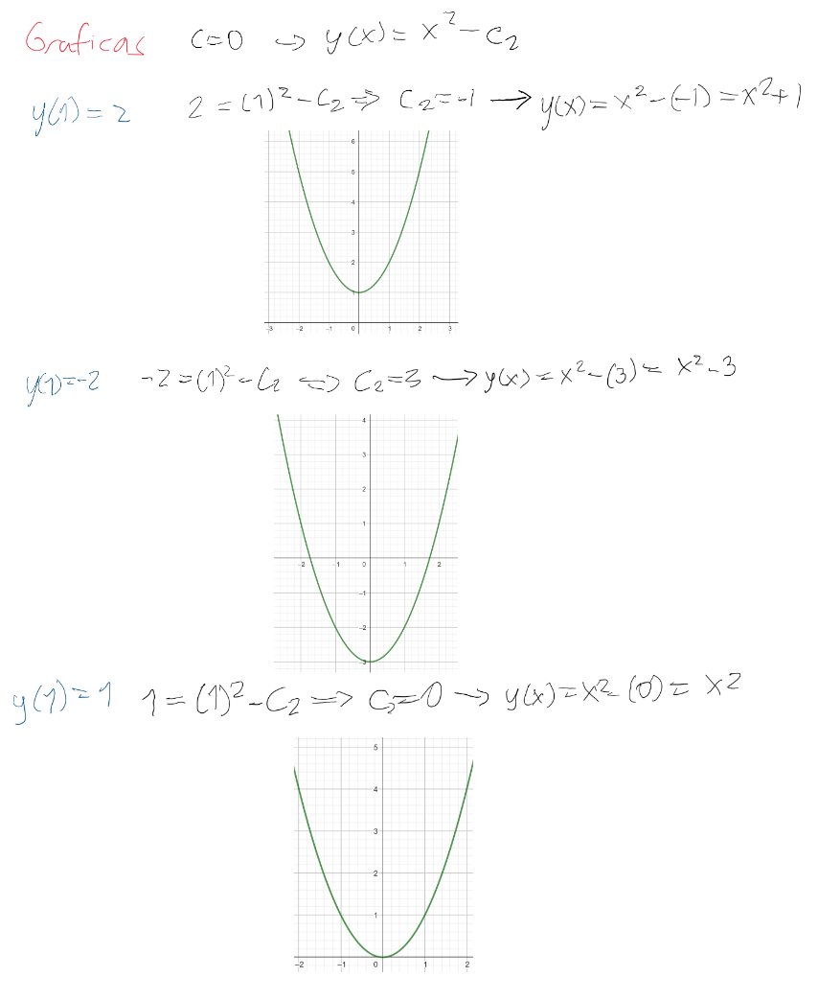

# Problema 3

Resolver la ecuación diferencial  

$$x y'' + 2y' = 6x \tag{2}$$  

haciendo una sustitución adecuada para convertir la ecuación (2) en una EDO de primer orden.  
A partir de la ecuación de primer orden obtenida, indicar la región del plano $\mathbb{R}^2$ en donde vale el teorema de existencia y unicidad, e indicar aquellas regiones en donde no se cumple.  

Analizar en los puntos donde no se cumple el teorema, qué es lo que ocurre con las soluciones en estos puntos  
(¿hay solución?, ¿hay más de una? ¿o no hay soluciones?).  

Resolver los problemas de valor inicial siguientes:  

- $y(1) = 2$,  
- $y(1) = -2$,  
- $y(1) = 1$,  
- $y(0) = -3$  

y graficar las soluciones obtenidas asumiendo un término constante $C = 0$ en la expresión de su solución.

## Procedimiento

