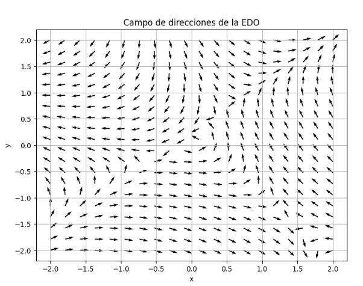
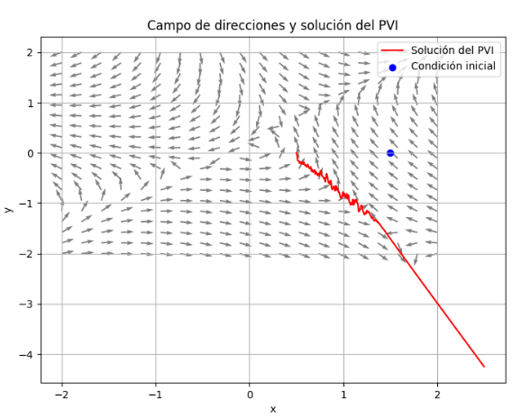
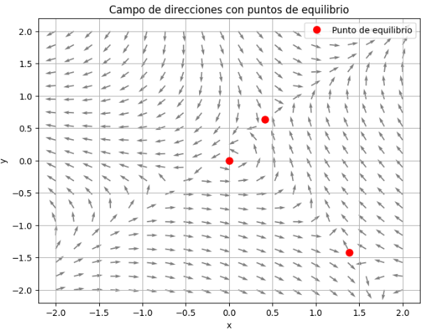

# Problema 4

Considere el siguiente problema de valor inicial

$$
\frac{dy}{dx}
=\frac{x-3y-3\!\left(x^{2}-y^{2}\right)+3xy}{\,2x-y+3\!\left(x^{2}-y^{2}\right)+2xy\,},
\qquad y(1.5)=0. \tag{3}
$$

## Inciso a

Graficar el campo de direcciones de la EDO anterior.  

**¿Cómo se realizó?**  

Se implementó una función `F(x, y)` que devuelve las dos componentes del campo vectorial asociado a la EDO. Se generó una malla de puntos en el plano con `numpy.meshgrid`, y se calcularon las direcciones en cada punto. Usando `matplotlib.pyplot.quiver` se graficaron las flechas normalizadas, obteniendo el campo de direcciones. Esta visualización permite observar hacia dónde apuntan las soluciones locales de la ecuación diferencial en cada región del plano.

**¿Qué se encontró?**  

El campo muestra un patrón de flujo no lineal, con regiones donde las flechas rotan y cambian de orientación. Esto anticipa la existencia de puntos de equilibrio y trayectorias inestables.

## Inciso b

A partir del campo de direcciones, esbozar la solución del problema de valor inicial (3), y agregar la curva solución al *plot* del campo de direcciones.  

**¿Cómo se realizó?**

Se resolvió el problema de valor inicial `y(1.5)=0` mediante integración numérica con `solve_ivp` de SciPy. Se implementó la función pendiente `dy/dx = f(x, y)` a partir de la relación entre las componentes de `F(x, y)`. El integrador numérico construyó la trayectoria de la solución en un intervalo de `x`, y se graficó esta curva en color rojo sobre el campo de direcciones. El punto inicial se marcó con un círculo azul para indicar la condición inicial, comprobando que la trayectoria sigue la orientación de las flechas.

**¿Qué se encontró?**

La curva solución parte de `(1.5, 0)` y sigue la dirección de las flechas del campo, descendiendo rápidamente hacia valores negativos de `y`. Esto indica un comportamiento inestable: la solución no converge a un equilibrio, sino que se aleja a medida que `x` aumenta.

## Inciso c

Hallar numéricamente los puntos de equilibrio de la EDO anterior, que son aquellos puntos en donde el campo de direcciones $F(x,y)=\mathbf{0}$ es el vector nulo. Para ello, resolver numéricamente el sistema:

$$
\begin{cases}
x-3y-3\!\left(x^{2}-y^{2}\right)+3xy=0,\\[2pt]
2x-y+3\!\left(x^{2}-y^{2}\right)+2xy=0.
\end{cases}
$$

**¿Cómo se realizó?**

Los puntos de equilibrio corresponden a los lugares donde `F(x, y) = (0, 0)`. Para hallarlos, se planteó el sistema no lineal y se utilizó el método numérico `fsolve` de SciPy probando distintos valores iniciales. El procedimiento arrojó tres puntos de equilibrio aproximados:  
`(0, 0)`, `(0.41248, 0.63864)`, `(1.38698, -1.41775)`.  
Estos puntos se graficaron en color rojo sobre el campo de direcciones, observando que en su entorno las flechas cambian de orientación, confirmando su papel como soluciones de equilibrio.

**¿Qué se encontró?**

Se obtuvieron tres puntos de equilibrio aproximados:  
`(0, 0)`, `(0.41248, 0.63864)`, `(1.38698, -1.41775)`.  
En el campo de direcciones se confirma que alrededor de estos puntos las flechas cambian de orientación, validando que son posiciones de equilibrio del sistema.
