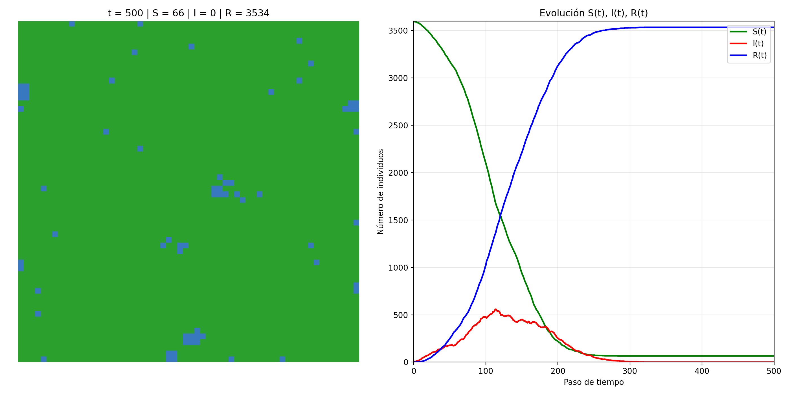

# Laboratorio 6

Implementaremos un **modelo SIR** por dos métodos: (1) partículas móviles y (2) autómata celular. Nos apoyaremos en LLMs y motores de IA generativa.

Modelo SIR (Kermack–McKendrick):
$$\frac{dS}{dt}=-\frac{\beta}{N}SI,\qquad \frac{dI}{dt}=\frac{\beta}{N}SI-\gamma I,\qquad \frac{dR}{dt}=\gamma I.$$

## Integrantes

- Abby Donis
- Cindy Gualim
- Josué Say

## Enlaces

- [Repositorio](https://github.com/JosueSay/labs-ms/tree/main/Labs/lab6)

# Simulación SIR con partículas móviles en $[0,L]\times[0,L]$

Pedirle a una IA que genera una simulación del modelo SIR mediante un sistema de partículas, moviéndose dentro de una región rectangular $[0,L]\times[0,L]$ en el plano $\mathbb{R}^2$, en la cual hay $N$ partículas, que en todo momento de la simulación, se mueven a una velocidad lineal constante, y tienen cada una exactamente uno de los estados siguientes:

- 0: susceptible (pertenece a la población $S$)
- 1: infectado (pertenece a la población $I$)
- 2: recuperado (pertenece a la población $R$)

La siguiente figura ilustra lo que se espera de la simulación:


Deberá proporcionarle a la IA un prompt bastante detallado, indicando todos los parámetros necesarios, para hacer que se genera una simulación que visualice las partículas, las interacciones entre ellas, y que las partículas cambian de color conforme cambian de estado.
Asimismo, deberá generar una visualización de cómo cambian las curvas de las cantidades $S(t)$, $I(t)$ e $R(t)$ en el tiempo. En ambas visualizaciones debe permitir que se visualice la dinámica de la propagación del contegio según el modelo SIR.

Finalmente, deberá generar una animación .gif o un video en formato .mp4 en el que se visualice la dinámica obtenida de esta simulación. Tome encuenta los siguientes parámetros:

- $L =$ tamaño del cuadrado
- $N_{total} =$ población total de partículas
- $I_0 =$ número inicial de infectados
- $v_{max} =$ velocidad máxima
- $r =$ radio de contagio
- $\beta =$ tasa de infección
- $\gamma =$ tasa de recuperación
- $dt =$ delta de tiempo

## Variables principales

El programa lee los siguientes parámetros desde `config.yaml`:

| Variable     | Tipo  | Descripción                                                                           |
| ------------ | ----- | ------------------------------------------------------------------------------------- |
| `L`          | float | Tamaño del lado del cuadrado simulado. Define el espacio de movimiento.               |
| `N_total`    | int   | Número total de partículas o individuos.                                              |
| `I0`         | int   | Número inicial de individuos infectados (los demás inician como susceptibles).        |
| `vmax`       | float | Velocidad máxima permitida para las partículas.                                       |
| `r`          | float | Radio de contagio: distancia máxima para que ocurra infección por contacto.           |
| `beta`       | float | Tasa de infección del modelo (afecta la probabilidad de contagio).                    |
| `gamma`      | float | Tasa de recuperación (afecta la probabilidad de pasar de infectado a recuperado).     |
| `dt`         | float | Paso de integración temporal (discretización de tiempo).                              |
| `steps`      | int   | Número total de pasos simulados.                                                      |
| `fps`        | int   | Cuadros por segundo del GIF resultante.                                               |
| `boundary`   | str   | Tipo de frontera del dominio: `"reflect"` para rebote, `"wrap"` para borde periódico. |
| `out_gif`    | str   | Ruta del archivo de salida para la animación.                                         |
| `curves_png` | str   | Ruta del archivo con las curvas SIR.                                                  |
| `seed`       | int   | Semilla aleatoria global para reproducibilidad.                                       |

## Funcionamiento del algoritmo

1. **Carga y validación de configuración:**
   Se lee `config.yaml` y se valida que todas las claves requeridas estén presentes y tengan tipos correctos. Si algo falta, el programa se detiene con un mensaje de error.

2. **Inicialización de la simulación:**

   - Las posiciones iniciales de las partículas se generan aleatoriamente dentro del cuadrado $[0,L]\times[0,L]$.
   - Cada partícula recibe una velocidad aleatoria con magnitud <= `vmax`.
   - Se seleccionan `I0` partículas al azar para iniciar como infectadas; el resto son susceptibles.

3. **Dinámica de movimiento:**

   - En cada paso, las posiciones se actualizan con integración **Euler explícita**:
     $$
     \mathbf{x}*{i}^{t+1} = \mathbf{x}*{i}^{t} + \mathbf{v}_{i} \cdot dt
     $$
   - Si la frontera es `reflect`, las partículas rebotan al tocar un borde.
     Si es `wrap`, el dominio se comporta como un **toroide**: las partículas que salen por un lado reaparecen por el opuesto.

4. **Procesos de infección y recuperación:**

   - **Infección:** si una partícula susceptible tiene al menos un infectado dentro del radio `r`, se infecta con probabilidad

     $p_{\text{inf}} = 1 - e^{-\beta , dt}$

   - **Recuperación:** cada infectado se recupera con probabilidad
     $p_{\text{rec}} = 1 - e^{-\gamma , dt}$

   - Las transiciones se aplican **sincrónicamente** en cada paso.

5. **Estructura de búsqueda eficiente:**
   Para evitar cálculos $O(N^2)$, el código usa **hashing espacial**: divide el dominio en celdas cuadradas del tamaño de `r` y solo compara partículas cercanas en celdas vecinas.

6. **Registro y visualización:**
   En cada paso se:

   - Calculan los conteos de (S, I, R).
   - Actualizan los paneles de la figura:

     - **Izquierda:** dispersión de partículas (S=azul, I=rojo, R=verde).
     - **Derecha:** curvas temporales (S=verde, I=rojo, R=azul).
   - Se genera un frame y se agrega a la lista para componer el GIF final.

7. **Salida final:**

   - Se guarda la imagen `curves_png` con la evolución completa de las curvas.
   - Se genera el archivo `out_gif` combinando los frames con `imageio.mimsave`.
   - Al terminar, el script imprime un resumen con los valores finales de S, I y R.

## Resultados obtenidos

**Ejecución:**

```bash
# Windows
python p1\sim1.py --config config.yaml
# Linux/Mac
python p1/sim1.py --config config.yaml
```

**Parámetros usados:**

- `seed=12345`, `L=10`, `N_total=200`, `I0=5`
- `vmax=0.8`, `r=0.6`, `beta=0.35`, `gamma=0.08`
- `dt=1.0`, `steps=230`, `fps=20`, `boundary="reflect"`
- Salidas: `images/sim1/sim1.gif`, `images/sim1/sim1_curvas.png`
- Probabilidades por paso: `p_inf = 1 - e^{-betha*dt} = 0.295`, `p_rec = 0.077`.

**Salidas obtenidas:**


- [Enlace al gif generado](https://github.com/JosueSay/labs-ms/blob/main/Labs/lab6/images/sim1/sim1.gif)

**Resumen de la corrida:**

- Estado inicial: (S_0=195), (I_0=5), (R_0=0).
- La curva **I(t)** alcanza un $\text{pico} \approx 105$ alrededor de $t \approx 25–30$ pasos.
- **S(t)** desciende rápidamente hacia ~0 antes de $t \approx 40$.
- **R(t)** crece de forma monótona y se aproxima a **N_total=200**, manteniéndose plano el resto de la simulación.
- El GIF muestra el movimiento con **rebote** en bordes (`reflect`), y el panel de la izquierda reporta en el título los conteos (S, I, R) en cada paso.

# Simulación SIR como autómata celular en un grid $M\times N$

Pedirle a una IA que genera una simulación del modelo SIR mediante un autómata celular. Para ello, considere un grid rectangular de tamaño $M\times N$, en el cual cada celda del grid tiene, en todo momento de la simulación, exactamente uno de los estados siguientes:

- 0: susceptible (pertenece a la población $S$),
- 1: infectado (pertenece a la población $I$),
- 2: recuperado (pertenece a la población $R$).

En este caso, las celdas del grid cambiarán su estado en función de la proporción de celdas vecidas infectadas.

La siguiente figura ilustra lo que se espera de la simulación:


Deberá proporcionarle a la IA un prompt bastante detallado, indicando todos los parámetros necesarios, para hacer que se genera una simulación que visualice el grid y las celdas con el color en función de su estado, y la dinámica de contagio dentro del grid.
Deberá generar también la visualización de cómo cambian las curvas de las cantidades $S(t)$, $I(t)$ e $R(t)$ en el tiempo. En ambas visualizaciones debe permitir que se visualice la dinámica de la propagación del contegio según el modelo SIR.

Generar una animación .gif o un video en formato .mp4 en el que se visualice la dinámica obtenida de esta simulación. Tome encuenta los siguientes parámetros:

- $M, N =$ altura y anchura del grid
- $I_0 =$ número inicial de infectados
- $T =$ tiempo total simulación
- $r =$ radio de la vecindad
- $\beta =$ tasa de infección
- $\gamma =$ tasa de recuperación

## Cómo llegamos a la solución



- [Enlace al gif generado](https://github.com/JosueSay/labs-ms/blob/main/Labs/lab6/images/sim2/sim2.gif)

Se trabajó siguiendo dos artefactos del proyecto: el prompt de especificación (`prompt.md`) y la implementación final (`sim2.py`). A continuación se resume el proceso y las decisiones principales.

1. Lectura del prompt (prompt.md)

- Se extrajeron los requisitos exactos: dimensiones del grid (M × N), I0, T, radio de vecindad r, tasas β y γ, formato de salida (animación .gif/.mp4) y la visualización simultánea del grid y las curvas S(t), I(t), R(t).
- Se definió el formato de los estados: 0=S (azul), 1=I (rojo), 2=R (verde) y el título informativo por frame:  
  t = {tiempo} | S = {susceptibles} | I = {infectados} | R = {recuperados}.

2. Diseño del modelo (decisiones tomadas)

- Modelo: autómata celular discreto en tiempo y espacio.
- Vecindad: Von Neumann con radio r = 1 (cuatro vecinos) — implementada sin borde periódico (bordes con menos vecinos).
- Reglas:
  - Susceptible → infectado con probabilidad p = β * (n_infectados / n_vecinos) si tiene vecinos infectados.
  - Infectado → recuperado con probabilidad γ.
  - Recuperado mantiene estado (inmune).
- Actualización: esquema síncrono (calcula transiciones sobre el estado actual y aplica todas a la vez).
- Reproducibilidad: semilla fija (SEED) para generar trayectorias replicables.

3. Implementación en sim2.py

- Funciones principales:
  - init_grid(M,N,I0): inicializa el grid con I0 infectados aleatorios.
  - von_neumann_shifts(grid): cuenta vecinos infectados en Von Neumann r=1.
  - neighbor_counts(M,N): calcula número efectivo de vecinos por celda (bordes).
  - step(grid, beta, gamma, neighbor_count): aplica las reglas y devuelve la nueva generación.
  - run_sim(...): ejecuta la simulación por T pasos, guarda grids y vectores S_hist, I_hist, R_hist; detiene temprano si I(t)=0 y rellena historiales hasta T.
- Visualización:
  - Matplotlib con `imshow` para el grid y curvas S/I/R en el panel derecho.
  - `FuncAnimation` actualiza ambos paneles en tiempo real.
  - Colormap consistente: azul (#3778bf) para S, rojo (#d62728) para I, verde (#2ca02c) para R.
- Salida:
  - Guarda animación como `simulacion_SIR.gif` usando PillowWriter; arreglos para guardar MP4 si ffmpeg está disponible.
  - Código incluye mecanismo para guardar un PNG (snapshot) del `fig` cuando se alcanza una condición deseada en t (se puede activar según prompt).

4. Verificación y ajustes

- Se verificaron historiales S(t), I(t), R(t) en cada paso y la conservación del número total de celdas (S+I+R = M·N).
- Parámetros de visualización (interval, fps) ajustados para obtener una animación fluida y legible para T grande.
- Se eligió no usar fronteras periódicas porque la dinámica en bordes es más representativa para muchos escenarios epidemiológicos en autómatas celulares.

5. Notas prácticas

- Cambiar parámetros (M, N, I0, T, r, β, γ, SEED) al inicio del archivo `sim2.py` para experimentar con escenarios.
- Para obtener la misma secuencia exacta (por ejemplo, para guardar el snapshot pedido en el prompt), fijar SEED y repetir la ejecución.
- Si la animación es demasiado pesada, reducir T o guardar solo cada k-ésimo frame.

# Comportamientos Promedio de Simulaciones

A continuación se examinarán los promedios de las cantidades S(t), I(t) y R(t) las simulaciones y se compararán sus resultados. Estableciendo una cantidad específica de repeticiones y una semilla aleatoria fija para garantizar que las repeticiones hagan uso de los mismos datos.

La semilla utilizada fue el valor de 150, las variables utilizadas no son fijas, acoplandose según las necesidades de cada simulación, además de esto se estableció un total de 5 repeticiones para cada simulación.

## Simulacion 1: Partículas Móviles

La cantidad de pasos fue de 230, la menor entre ambos casos, con los siguientes parámetros establecidos

```bash
  L: 10
  N_total: 200
  I0: 5
  beta: 0.35
  gamma: 0.08
  steps: 230
```

Los resultados obtenidos fueron los siguientes

```bash
Repeticion 1 con semilla 150...
    Datos capturados: 11 puntos temporales
Repeticion 2 con semilla 150...
    Datos capturados: 11 puntos temporales
Repeticion 3 con semilla 150...
    Datos capturados: 11 puntos temporales
Repeticion 4 con semilla 150...
    Datos capturados: 11 puntos temporales
Repeticion 5 con semilla 150...
    Datos capturados: 11 puntos temporales

Repeticiones exitosas: 5/5
Longitud temporal de datos: 11 pasos

==================================================
RESULTADOS PROMEDIADOS
==================================================
Valores finales (promedio ± desviacion estándar):
  S(t_final) = 1.0 ± 0.0
  I(t_final) = 0.0 ± 0.0
  R(t_final) = 199.0 ± 0.0

Evolucion temporal:
  Paso   0: S= 195.0 ±  0.0, I=   5.0 ±  0.0, R=   0.0 ±  0.0
  Paso   2: S=   1.0 ±  0.0, I=  25.0 ±  0.0, R= 174.0 ±  0.0
  Paso   5: S=   1.0 ±  0.0, I=   0.0 ±  0.0, R= 199.0 ±  0.0
  Paso   8: S=   1.0 ±  0.0, I=   0.0 ±  0.0, R= 199.0 ±  0.0
  Paso  10: S=   1.0 ±  0.0, I=   0.0 ±  0.0, R= 199.0 ±  0.0

```

Junto con esta grafica de los promedios


**Resultados**

Todas las simulaciones tomaron la misma cantidad de pasos (tiempo), con una recuperación casi total al contar solamente con un individuo suceptible y 199 individuos recuperados al final de esta. Al iniciar con 5 infectados la enferemedad se propagó rápidamente pero no fue lo suficientemente fuerte para contagiar a más de 75 individuos, con una velocidad de recuperación bastante alta.

Al tener esta velocidad de recuperación, la propagación de la enfermedad no fue muy alta y no hubo riesgo de infección para varios, demostrado en la caída de individuos suceptibles a la infección.

## Simulacion 2: Grid Célular

Se utilizaron los siguientes parámetros para la simulación:

```bash
I0: 5
M: 60
N: 60
SEED: 42
T: 500
beta: 0.3
gamma: 0.05
r: 1
```

Con un total de 500 pasos (tiempo), y un cambio en la semilla, se obtuvieron los soguientes resutlados

```bash
============================================================
EJECUTANDO 5 REPETICIONES DE SIM2
Simulacion 2 (Grid celular)
============================================================
Parametros simulacion 2:
I0: 5
beta: 0.3
gamma: 0.05

Repeticion 1 con semilla 150...
    Datos capturados: 321 puntos temporales
Repeticion 2 con semilla 150...
    Datos capturados: 321 puntos temporales
Repeticion 3 con semilla 150...
    Datos capturados: 321 puntos temporales
Repeticion 4 con semilla 150...
    Datos capturados: 321 puntos temporales
Repeticion 5 con semilla 150...
    Datos capturados: 321 puntos temporales

Repeticiones exitosas: 5/5
Longitud temporal de datos: 321 pasos

==================================================
RESULTADOS PROMEDIADOS
==================================================
Valores finales (promedio ± desviacion estándar):
  S(t_final) = 66.0 ± 0.0
  I(t_final) = 0.0 ± 0.0
  R(t_final) = 3534.0 ± 0.0

Evolucion temporal:
  Paso   0: S=3595.0 ±  0.0, I=   5.0 ±  0.0, R=   0.0 ±  0.0
  Paso  80: S=2647.0 ±  0.0, I= 347.0 ±  0.0, R= 606.0 ±  0.0
  Paso 160: S= 746.0 ±  0.0, I= 427.0 ±  0.0, R=2427.0 ±  0.0
  Paso 240: S=  83.0 ±  0.0, I=  73.0 ±  0.0, R=3444.0 ±  0.0
  Paso 320: S=  66.0 ±  0.0, I=   0.0 ±  0.0, R=3534.0 ±  0.0
```

Junto con un fragmento del gif generado de una de las repeticiones


Y una grafica de los promedios


**Resultados**

En esta segunda simulación tambien se obtuvo una cantidad pareja de tiempo y pasos entre sí, pero llegó a tomar menos pasos en que la infección se controlara.
Podemos observar que en esta simulación hubo una mayor cantidad de individuos y tiempo, aunque se mantiene una similitud con el comportamiento de la primera población, el número de individuos suceptibles fue disminuyendo conforme el numero de individuos en recuperación aumentaba. Cabe resaltar que el pico de la cantidad de individuos infectados llegó a su punto máximo en el cruce entre individuos en recuperación y suceptibles a diferencia de la primera simulación.

Podríamos suponer que el comportamiento de la cantidad de individuos infectados podría darse en base a que hubo un mejor control de la infección en la población a diferencia de la primera simulación.

## Otros enlaces

- [Gif simulación 1](https://github.com/JosueSay/labs-ms/blob/main/Labs/lab6/images/sim1/sim1.gif)
- [Gif simulación 2](https://github.com/JosueSay/labs-ms/blob/main/Labs/lab6/images/sim2/sim2.gif)
- [Enlace al prompt realizado simulación 1](https://github.com/JosueSay/labs-ms/blob/main/Labs/lab6/p1/prompt.md)
- [Enlace al prompt realizado simulación 2](https://github.com/JosueSay/labs-ms/blob/main/Labs/lab6/p2/prompt.md)
- [Enlace al chat utilizado simulación 1](https://chatgpt.com/share/68eee784-5fa8-800f-b78b-30ee22977975)
