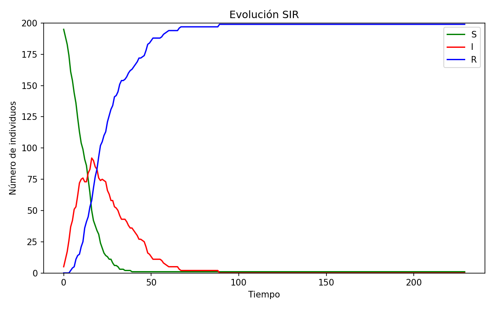

# Laboratorio 6

Implementaremos un **modelo SIR** por dos métodos: (1) partículas móviles y (2) autómata celular. Nos apoyaremos en LLMs y motores de IA generativa.

Modelo SIR (Kermack–McKendrick):
$$\frac{dS}{dt}=-\frac{\beta}{N}SI,\qquad \frac{dI}{dt}=\frac{\beta}{N}SI-\gamma I,\qquad \frac{dR}{dt}=\gamma I.$$

## Integrantes

- Abby Donis
- Cindy Gualim
- Josué Say

## Enlaces

- [Repositorio](https://github.com/JosueSay/labs-ms/tree/main/Labs/lab6)

# Simulación SIR con partículas móviles en $[0,L]\times[0,L]$

Pedirle a una IA que genera una simulación del modelo SIR mediante un sistema de partículas, moviéndose dentro de una región rectangular $[0,L]\times[0,L]$ en el plano $\mathbb{R}^2$, en la cual hay $N$ partículas, que en todo momento de la simulación, se mueven a una velocidad lineal constante, y tienen cada una exactamente uno de los estados siguientes:

- 0: susceptible (pertenece a la población $S$)
- 1: infectado (pertenece a la población $I$)
- 2: recuperado (pertenece a la población $R$)

La siguiente figura ilustra lo que se espera de la simulación:


Deberá proporcionarle a la IA un prompt bastante detallado, indicando todos los parámetros necesarios, para hacer que se genera una simulación que visualice las partículas, las interacciones entre ellas, y que las partículas cambian de color conforme cambian de estado.
Asimismo, deberá generar una visualización de cómo cambian las curvas de las cantidades $S(t)$, $I(t)$ e $R(t)$ en el tiempo. En ambas visualizaciones debe permitir que se visualice la dinámica de la propagación del contegio según el modelo SIR.

Finalmente, deberá generar una animación .gif o un video en formato .mp4 en el que se visualice la dinámica obtenida de esta simulación. Tome encuenta los siguientes parámetros:

- $L =$ tamaño del cuadrado
- $N_{total} =$ población total de partículas
- $I_0 =$ número inicial de infectados
- $v_{max} =$ velocidad máxima
- $r =$ radio de contagio
- $\beta =$ tasa de infección
- $\gamma =$ tasa de recuperación
- $dt =$ delta de tiempo

## Variables principales

El programa lee los siguientes parámetros desde `config.yaml`:

| Variable     | Tipo  | Descripción                                                                           |
| ------------ | ----- | ------------------------------------------------------------------------------------- |
| `L`          | float | Tamaño del lado del cuadrado simulado. Define el espacio de movimiento.               |
| `N_total`    | int   | Número total de partículas o individuos.                                              |
| `I0`         | int   | Número inicial de individuos infectados (los demás inician como susceptibles).        |
| `vmax`       | float | Velocidad máxima permitida para las partículas.                                       |
| `r`          | float | Radio de contagio: distancia máxima para que ocurra infección por contacto.           |
| `beta`       | float | Tasa de infección del modelo (afecta la probabilidad de contagio).                    |
| `gamma`      | float | Tasa de recuperación (afecta la probabilidad de pasar de infectado a recuperado).     |
| `dt`         | float | Paso de integración temporal (discretización de tiempo).                              |
| `steps`      | int   | Número total de pasos simulados.                                                      |
| `fps`        | int   | Cuadros por segundo del GIF resultante.                                               |
| `boundary`   | str   | Tipo de frontera del dominio: `"reflect"` para rebote, `"wrap"` para borde periódico. |
| `out_gif`    | str   | Ruta del archivo de salida para la animación.                                         |
| `curves_png` | str   | Ruta del archivo con las curvas SIR.                                                  |
| `seed`       | int   | Semilla aleatoria global para reproducibilidad.                                       |

## Funcionamiento del algoritmo

1. **Carga y validación de configuración:**
   Se lee `config.yaml` y se valida que todas las claves requeridas estén presentes y tengan tipos correctos. Si algo falta, el programa se detiene con un mensaje de error.

2. **Inicialización de la simulación:**

   - Las posiciones iniciales de las partículas se generan aleatoriamente dentro del cuadrado $[0,L]\times[0,L]$.
   - Cada partícula recibe una velocidad aleatoria con magnitud <= `vmax`.
   - Se seleccionan `I0` partículas al azar para iniciar como infectadas; el resto son susceptibles.

3. **Dinámica de movimiento:**

   - En cada paso, las posiciones se actualizan con integración **Euler explícita**:
     $$
     \mathbf{x}*{i}^{t+1} = \mathbf{x}*{i}^{t} + \mathbf{v}_{i} \cdot dt
     $$
   - Si la frontera es `reflect`, las partículas rebotan al tocar un borde.
     Si es `wrap`, el dominio se comporta como un **toroide**: las partículas que salen por un lado reaparecen por el opuesto.

4. **Procesos de infección y recuperación:**

   - **Infección:** si una partícula susceptible tiene al menos un infectado dentro del radio `r`, se infecta con probabilidad

     $p_{\text{inf}} = 1 - e^{-\beta , dt}$

   - **Recuperación:** cada infectado se recupera con probabilidad
     $p_{\text{rec}} = 1 - e^{-\gamma , dt}$

   - Las transiciones se aplican **sincrónicamente** en cada paso.

5. **Estructura de búsqueda eficiente:**
   Para evitar cálculos $O(N^2)$, el código usa **hashing espacial**: divide el dominio en celdas cuadradas del tamaño de `r` y solo compara partículas cercanas en celdas vecinas.

6. **Registro y visualización:**
   En cada paso se:

   - Calculan los conteos de (S, I, R).
   - Actualizan los paneles de la figura:

     - **Izquierda:** dispersión de partículas (S=azul, I=rojo, R=verde).
     - **Derecha:** curvas temporales (S=verde, I=rojo, R=azul).
   - Se genera un frame y se agrega a la lista para componer el GIF final.

7. **Salida final:**

   - Se guarda la imagen `curves_png` con la evolución completa de las curvas.
   - Se genera el archivo `out_gif` combinando los frames con `imageio.mimsave`.
   - Al terminar, el script imprime un resumen con los valores finales de S, I y R.

## Resultados obtenidos

**Ejecución:**

```bash
# Windows
python p1\sim1.py --config config.yaml
# Linux/Mac
python p1/sim1.py --config config.yaml
```

**Parámetros usados:**

- `seed=12345`, `L=10`, `N_total=200`, `I0=5`
- `vmax=0.8`, `r=0.6`, `beta=0.35`, `gamma=0.08`
- `dt=1.0`, `steps=230`, `fps=20`, `boundary="reflect"`
- Salidas: `images/sim1/sim1.gif`, `images/sim1/sim1_curvas.png`
- Probabilidades por paso: `p_inf = 1 - e^{-betha*dt} = 0.295`, `p_rec = 0.077`.

**Salidas obtenidas:**



- [Enlace al gif generado](https://github.com/JosueSay/labs-ms/blob/main/Labs/lab6/images/sim1/sim1.gif)

**Resumen de la corrida:**

- Estado inicial: (S_0=195), (I_0=5), (R_0=0).
- La curva **I(t)** alcanza un $\text{pico} \approx 105$ alrededor de $t \approx 25–30$ pasos.
- **S(t)** desciende rápidamente hacia ~0 antes de $t \approx 40$.
- **R(t)** crece de forma monótona y se aproxima a **N_total=200**, manteniéndose plano el resto de la simulación.
- El GIF muestra el movimiento con **rebote** en bordes (`reflect`), y el panel de la izquierda reporta en el título los conteos (S, I, R) en cada paso.

## Otros enlaces

- [Enlace al prompt realizado](https://github.com/JosueSay/labs-ms/blob/main/Labs/lab6/p1/prompt.md)
- [Enlace al chat utilizado](https://chatgpt.com/share/68eee784-5fa8-800f-b78b-30ee22977975)
