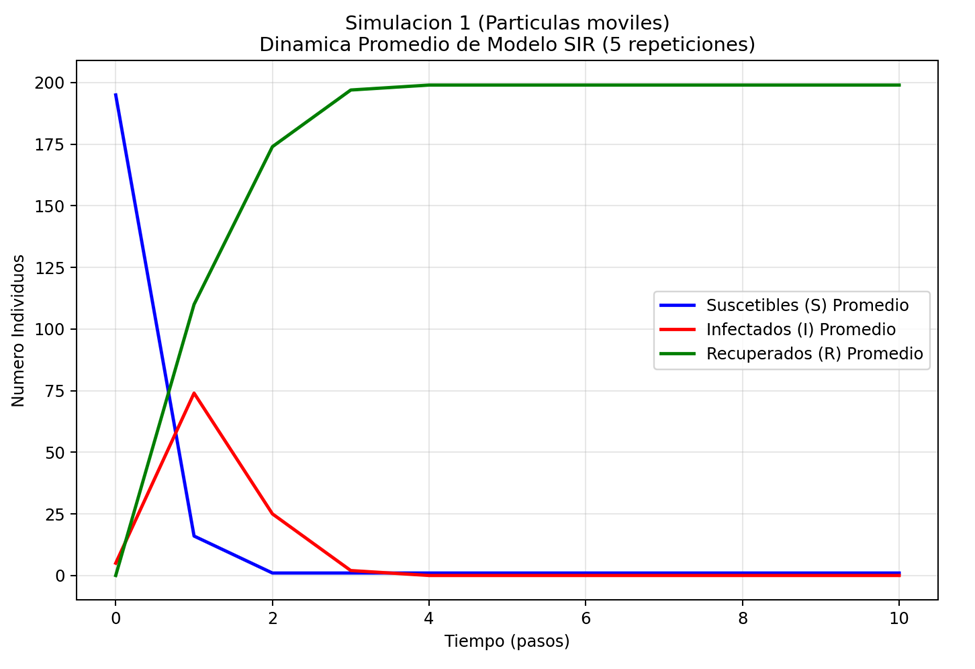
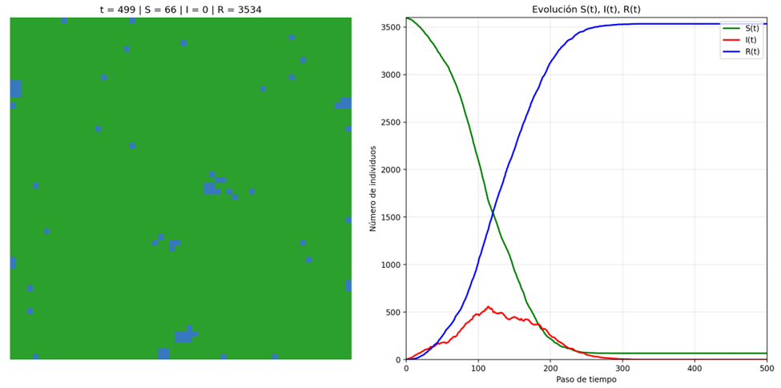
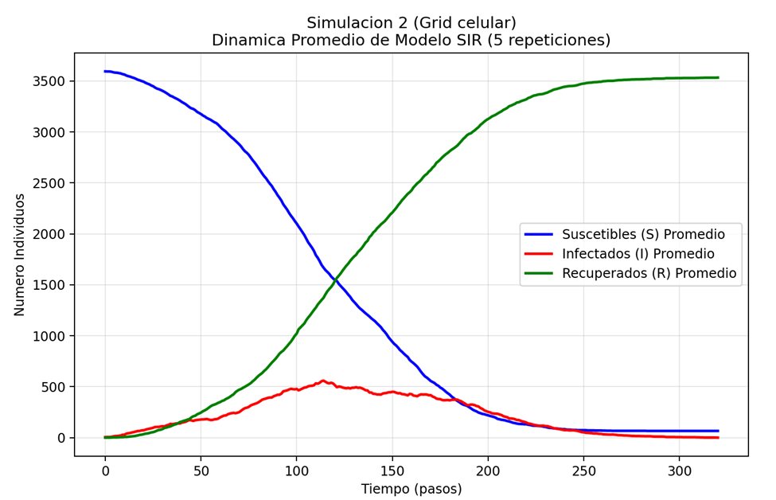

# Comportamientos Promedio de Simulaciones
A continuación se examinarán los promedios de las cantidades S(t), I(t) y R(t) las simulaciones y se compararán sus resultados. Estableciendo una cantidad específica de repeticiones y una semilla aleatoria fija para garantizar que las repeticiones hagan uso de los mismos datos.

La semilla utilizada fue el valor de 150, las variables utilizadas no son fijas, acoplandose según las necesidades de cada simulación, además de esto se estableció un total de 5 repeticiones para cada simulación.

### Simulacion 1: Partículas Móviles
La cantidad de pasos fue de 230, la menor entre ambos casos, con los siguientes parámetros establecidos
```
  L: 10
  N_total: 200
  I0: 5
  beta: 0.35
  gamma: 0.08
  steps: 230
```

Los resultados obtenidos fueron los siguientes
```
Repeticion 1 con semilla 150...
    Datos capturados: 11 puntos temporales
Repeticion 2 con semilla 150...
    Datos capturados: 11 puntos temporales
Repeticion 3 con semilla 150...
    Datos capturados: 11 puntos temporales
Repeticion 4 con semilla 150...
    Datos capturados: 11 puntos temporales
Repeticion 5 con semilla 150...
    Datos capturados: 11 puntos temporales

Repeticiones exitosas: 5/5
Longitud temporal de datos: 11 pasos

==================================================
RESULTADOS PROMEDIADOS
==================================================
Valores finales (promedio ± desviacion estándar):
  S(t_final) = 1.0 ± 0.0
  I(t_final) = 0.0 ± 0.0
  R(t_final) = 199.0 ± 0.0

Evolucion temporal:
  Paso   0: S= 195.0 ±  0.0, I=   5.0 ±  0.0, R=   0.0 ±  0.0
  Paso   2: S=   1.0 ±  0.0, I=  25.0 ±  0.0, R= 174.0 ±  0.0
  Paso   5: S=   1.0 ±  0.0, I=   0.0 ±  0.0, R= 199.0 ±  0.0
  Paso   8: S=   1.0 ±  0.0, I=   0.0 ±  0.0, R= 199.0 ±  0.0
  Paso  10: S=   1.0 ±  0.0, I=   0.0 ±  0.0, R= 199.0 ±  0.0

```
Junto con esta grafica de los promedios



**Resultados**
Todas las simulaciones tomaron la misma cantidad de pasos (tiempo), con una recuperación casi total al contar solamente con un individuo suceptible y 199 individuos recuperados al final de esta. Al iniciar con 5 infectados la enferemedad se propagó rápidamente pero no fue lo suficientemente fuerte para contagiar a más de 75 individuos, con una velocidad de recuperación bastante alta.

Al tener esta velocidad de recuperación, la propagación de la enfermedad no fue muy alta y no hubo riesgo de infección para varios, demostrado en la caída de individuos suceptibles a la infección.

### Simulacion 2: Grid Célular
Se utilizaron los siguientes parámetros para la simulación:
```
I0: 5
M: 60
N: 60
SEED: 42
T: 500
beta: 0.3
gamma: 0.05
r: 1
```
Con un total de 500 pasos (tiempo), y un cambio en la semilla, se obtuvieron los soguientes resutlados
```
============================================================
EJECUTANDO 5 REPETICIONES DE SIM2
Simulacion 2 (Grid celular)
============================================================
Parametros simulacion 2:
I0: 5
beta: 0.3
gamma: 0.05

Repeticion 1 con semilla 150...
    Datos capturados: 321 puntos temporales
Repeticion 2 con semilla 150...
    Datos capturados: 321 puntos temporales
Repeticion 3 con semilla 150...
    Datos capturados: 321 puntos temporales
Repeticion 4 con semilla 150...
    Datos capturados: 321 puntos temporales
Repeticion 5 con semilla 150...
    Datos capturados: 321 puntos temporales

Repeticiones exitosas: 5/5
Longitud temporal de datos: 321 pasos

==================================================
RESULTADOS PROMEDIADOS
==================================================
Valores finales (promedio ± desviacion estándar):
  S(t_final) = 66.0 ± 0.0
  I(t_final) = 0.0 ± 0.0
  R(t_final) = 3534.0 ± 0.0

Evolucion temporal:
  Paso   0: S=3595.0 ±  0.0, I=   5.0 ±  0.0, R=   0.0 ±  0.0
  Paso  80: S=2647.0 ±  0.0, I= 347.0 ±  0.0, R= 606.0 ±  0.0
  Paso 160: S= 746.0 ±  0.0, I= 427.0 ±  0.0, R=2427.0 ±  0.0
  Paso 240: S=  83.0 ±  0.0, I=  73.0 ±  0.0, R=3444.0 ±  0.0
  Paso 320: S=  66.0 ±  0.0, I=   0.0 ±  0.0, R=3534.0 ±  0.0
```
Junto con un fragmento del gif generado de una de las repeticiones

Y una grafica de los promedios


**Resultados**
En esta segunda simulación tambien se obtuvo una cantidad pareja de tiempo y pasos entre sí, pero llegó a tomar menos pasos en que la infección se controlara. 
Podemos observar que en esta simulación hubo una mayor cantidad de individuos y tiempo, aunque se mantiene una similitud con el comportamiento de la primera población, el número de individuos suceptibles fue disminuyendo conforme el numero de individuos en recuperación aumentaba. Cabe resaltar que el pico de la cantidad de individuos infectados llegó a su punto máximo en el cruce entre individuos en recuperación y suceptibles a diferencia de la primera simulación.

Podríamos suponer que el comportamiento de la cantidad de individuos infectados podría darse en base a que hubo un mejor control de la infección en la población a diferencia de la primera simulación.