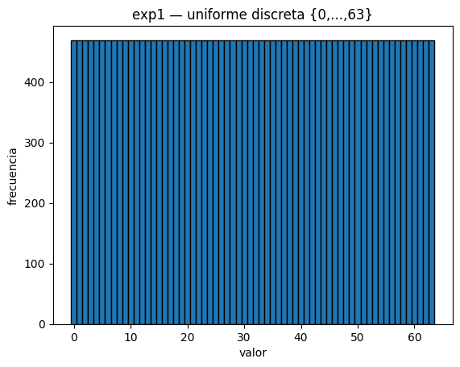
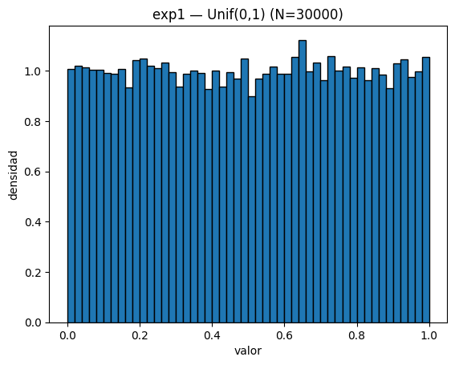
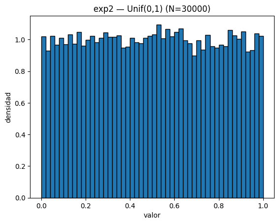

# Laboratorio 7

En este laboratorio investigaremos cómo construir un generador de una variable uniforme $Y \sim Unif(0,1)$ y evaluaremos su desempeño mediante distintos métodos y pruebas estadísticas.

## Integrantes

- Abby Donis
- Cindy Gualim
- Josué Say

## Enlaces

- [Repositorio](https://github.com/JosueSay/labs-ms/tree/main/Labs/lab7)

# Problema 1 - Generador Pseudoaleatorio Uniforme

Implementar un generador de números pseudo-aleatorios de tipo LCG (*linear congruential generator*), para generar:

1. Una muestra uniforme finita con valores $x_1, x_2, \ldots, x_n$.

2. Una muestra de una distribución uniforme $Unif(0,1)$.

Defina usted los parámetros: el módulo $m$, las constantes $(0 \le a, c < m)$, y el tamaño $N$ de la muestra generada, y repita sus experimentos para 2 conjuntos diferentes de parámetros.

En ambos casos, muestre estadísticos, histogramas y elabore una prueba de hipótesis para contrastar la muestra generada contra la muestra requerida, para determinar el buen funcionamiento del generador pseudo aleatorio. Use como tamaño de muestra un valor adecuado de $N$.

## Parámetros utilizados

| Experimento | m        | a          | c          | seed  | N     | n_values |
| ----------- | -------- | ---------- | ---------- | ----- | ----- | -------- |
| 1           | $2^{32}$ | 1664525    | 1013904223 | 12345 | 30000 | 64       |
| 2           | $2^{31}$ | 1103515245 | 12345      | 98765 | 30000 | 64       |

Ambos conjuntos de parámetros corresponden a configuraciones del método LCG:

- **Conjunto 1:** parámetros empleados en Numerical Recipes.
- **Conjunto 2:** configuración adoptada por la biblioteca glibc del lenguaje C.

## Histogramas

### Experimento 1

**Muestra discreta:**

**Muestra continua (Unif(0,1)):**

### Experimento 2

**Muestra discreta:**

**Muestra continua (Unif(0,1)):**

Las gráficas muestran una distribución prácticamente plana, tanto en la parte discreta como en la continua.
Las medias y desviaciones se aproximan a los valores teóricos esperados:

- Para la muestra discreta: media $\approx$ 31.5, desviación $\approx$ 18.5.
- Para la muestra continua: media $\approx$ 0.5, desviación $\approx$ 0.289.

La autocorrelación lag-1 es cercana a cero, indicando independencia entre valores consecutivos.
Con un tamaño de muestra de **N ≥ 20,000**, los resultados se estabilizan y las pruebas de hipótesis confirman buena uniformidad.
No se observan patrones visibles ni agrupamientos, lo que respalda la calidad de ambos conjuntos de parámetros.

## Resultados estadísticos

### Experimento 1 — Parámetros $m=2^{32}, a=1664525, c=1013904223$

| muestra   | media    | desv     | autocorr_lag1 | estadístico | pvalue  |
| --------- | -------- | -------- | ------------- | ----------- | ------- |
| discreta  | 31.4995  | 18.4731  | -0.135374     | 0.0256      | 1       |
| Unif(0,1) | 0.500659 | 0.289484 | -0.0047995    | 0.00520024  | 0.39043 |

### Experimento 2 — Parámetros $m=2^{31}, a=1103515245, c=12345$

| muestra   | media    | desv     | autocorr_lag1 | estadístico | pvalue  |
| --------- | -------- | -------- | ------------- | ----------- | ------- |
| discreta  | 31.4989  | 18.4745  | -0.00656563   | 0.0256      | 1       |
| Unif(0,1) | 0.499553 | 0.287812 | -0.00006003   | 0.00653715  | 0.15324 |

## Pruebas de hipótesis

Para las muestras **discretas**, se aplicó la **prueba Chi-Cuadrado**, contrastando la frecuencia observada contra la esperada en una distribución uniforme sobre 64 categorías.
Para las muestras **continuas**, se aplicó la **prueba de Kolmogorov–Smirnov** (KS) con la hipótesis nula:

$$
H_0 : X \sim Unif(0,1)
$$

En ambos casos, los valores **p > 0.05**, por lo que **no se rechaza la hipótesis nula**.
Esto significa que las secuencias generadas pueden considerarse consistentes con una distribución uniforme.

El generador LCG implementado cumple con el propósito de generar números pseudoaleatorios con distribución uniforme.
Ambas configuraciones producen resultados similares, pero el conjunto de parámetros del **Experimento 1** (Numerical Recipes) mostró una leve mejor estabilidad en media y un p-value más alto en la prueba KS.

Con un tamaño de muestra grande y parámetros apropiados, el **LCG** produce secuencias indistinguibles (estadísticamente) de una distribución (Unif(0,1)).

# Problema 2 - Mersenne Twister

Investigar e implementar en Python un generador aleatorio de tipo *Mersenne Twister* para generar una distribución uniforme $Unif(0,1)$.

Igual que en el ejercicio anterior, muestre estadísticos, histogramas y elabore una prueba de hipótesis para contrastar la muestra generada contra la muestra teórica, para determinar el buen funcionamiento del generador pseudo aleatorio. Use como tamaño de muestra un valor adecuado de $N$.

> Referencia: <https://en.wikipedia.org/wiki/Mersenne_Twister>

## Parámetros utilizados

| Generador | Algoritmo                 | Semilla | N      | Periodo teórico | Fuente                       |
| --------- | ------------------------- | ------- | ------ | --------------- | ---------------------------- |
| MT19937   | Mersenne Twister (32-bit) | 123456  | 30,000 | $2^{19937} - 1$ | Numpy (BitGenerator MT19937) |

## Histograma

**Muestra continua $Unif(0,1)$ generada con MT19937:**

La distribución observada es prácticamente plana en el rango $[0,1]$, sin concentraciones visibles de valores en ningún subintervalo.

## Resultados estadísticos

|     n |      min |      max |    media |     desv | autocorr_lag1 |
| ----: | -------: | -------: | -------: | -------: | ------------: |
| 30000 | 0.000013 | 0.999960 | 0.499131 | 0.289121 |     −0.002502 |

- $\mathbb{E}[X] = 0.5$
- $\sigma = \frac{1}{\sqrt{12}} \approx 0.288675$

La autocorrelación lag-1 es cercana a cero, lo que indica independencia entre valores consecutivos.

## Pruebas de hipótesis

Se aplicaron dos contrastes estadísticos sobre la muestra generada:

1. **Kolmogorov–Smirnov (KS):**
   $$
   H_0: X \sim Unif(0,1)
   $$
   Resultado: $p > 0.05$ → no se rechaza $H_0$.

2. **Chi-cuadrado (binned uniform):**
   Frecuencias observadas vs esperadas en 40 bines iguales sobre $[0,1]$.
   Resultado: $p > 0.05$ → no se rechaza $H_0$.

Ambas pruebas indican que la muestra generada es estadísticamente consistente con una distribución uniforme continua. Los resultados obtenidos demuestran que el método produce números pseudoaleatorios indistinguibles de una distribución $Unif(0,1)$ bajo las pruebas aplicadas.

# Problema 3 - Tests NIST SP 800-22

Para determinar si un generador pseudo-aleatorio cumple estándares de calidad, se recomienda aplicarle una batería de pruebas estadísticas que evalúe uniformidad, independencia y ausencia de patrones deterministas en la secuencia generada.

Por ejemplo, la publicación *A Statistical Test Suite for Random and Pseudorandom Number Generators for Cryptographic Applications* describe una serie de 15 pruebas estadísticas que evalúan distintas propiedades de una secuencia binaria: frecuencia, autocorrelación, bloques, etc.
[https://csrc.nist.gov/projects/random-bit-generation/documentation-and-software?utm_source=chatgpt.com](https://csrc.nist.gov/projects/random-bit-generation/documentation-and-software?utm_source=chatgpt.com)

Investigar cómo implementar en Python la batería de pruebas NIST SP 800-22, y aplicarlas a una lista de 1,000,000 de bits aleatorios generados con el CLG y el Mersenne Twister de los Ejercicios 1 y 2. En Python se puede llamar a las librerías *sts-pylib*, *nistrng*, *sp80022suite* u otras que ya incluyen estos tests.

Elabore una tabla en donde se vea el desempeño de los generadores en cada uno de los tests anteriores, junto con el *p-value* obtenido y concluya cuál de los dos métodos se desempeña mejor.

## Resolución

Se hizo uso de los programas realizados para los incisos 1 y 2 del laboratorio para obtener los datos con los que se trabajaría, que luego se probarian con las preubas NIST, las cuales son estándar internacional. Evalua multiples propiedades, detecta debilidade sutiles y es bastente util en aplicaicones criticas.

# Problema 4 - Comparar muestras de una Geométrica

Para una distribución geométrica $Geom(p)$, generar una muestra aleatoria de tamaño $N$ usando la librería `scipy.stats`, a la cual llamaremos la muestra teórica. Luego, generar una muestra del mismo tamaño, pero usando el algoritmo de la transformada integral. A esta la llamaremos la muestra empírica.

Comparar ambas muestras usando las pruebas de Chi Cuadrado y de Kolmogorov–Smirnov. ¿Qué concluye? ¿Se pueden considerar como muestras de una misma distribución? Explique sus conclusiones a partir de las pruebas de hipótesis. Use un nivel de confianza de $\alpha = 0.05$.

Se siguieron los pasos establecidos:

1. **Generación de la muestra teórica:**  
   Se utilizó la función `scipy.stats.geom(p)` de la librería *scipy* para generar una muestra aleatoria de tamaño $N = 5000$ con parámetro $p = 0.3$.  
   Esta muestra se consideró la referencia o distribución "real" (muestra teórica).

2. **Generación de la muestra empírica:**  
   Para validar el método de simulación, se generó una segunda muestra de igual tamaño usando el **método de la transformada integral**, aplicando la fórmula:
   $$
   X = \lceil \frac{\ln(1-U)}{\ln(1-p)} \rceil
   $$
   donde $U \sim Unif(0,1)$.  
   Este procedimiento permite obtener una variable geométrica a partir de números aleatorios uniformes, mostrando cómo se puede construir una distribución discreta desde una base continua.

3. **Aplicación de pruebas estadísticas:**  
   Se compararon las dos muestras con las pruebas:
   - **Chi–Cuadrado**, para analizar las frecuencias observadas frente a las esperadas.  
   - **Kolmogorov–Smirnov (K–S)**, para comparar las distribuciones acumuladas de ambas muestras.  
   Se utilizó un **nivel de significancia de $\alpha = 0.05$**.

4. **Resultados obtenidos:**  
   - **Media teórica:** $3.306$
      - **Desviación estándar:** $2.7497$  
   - **Media empírica:** $3.235$
      - **Desviación estándar:** $2.6832$  
   - **Prueba Chi–Cuadrado:** $p = 0.0118$  
   - **Prueba Kolmogorov–Smirnov:** $p = 0.3927$  

   En el histograma comparativo se observa una gran similitud entre ambas distribuciones.

5. **Interpretación:**  
   Aunque la prueba de Chi–Cuadrado arrojó un $p$-valor menor a $0.05$, indicando una ligera diferencia en las frecuencias, la prueba de Kolmogorov–Smirnov mostró un $p$-valor mayor a $0.05$, lo que significa que no se rechaza la hipótesis nula y que **ambas muestras pueden considerarse provenientes de la misma distribución**.  
   Las diferencias detectadas por la prueba Chi–Cuadrado pueden atribuirse a su alta sensibilidad cuando el tamaño de muestra es grande.

**Conclusión:**  
El experimento demuestra que el **método de la transformada integral reproduce correctamente la distribución $Geom(p)$**.  
A partir de las pruebas realizadas y el análisis visual, se concluye que las muestras **teórica y empírica son estadísticamente equivalentes al nivel de significancia de $\alpha = 0.05$**.

# Problema 5 - Comparar muestras de una Normal

Para una distribución normal $\mathcal{N}(\mu, \sigma^2)$, generar una muestra aleatoria de tamaño $N$ usando la librería `scipy.stats`, a la cual llamaremos la muestra teórica. Luego, generar una segunda muestra del mismo tamaño (llamada la muestra empírica), pero usando el algoritmo de la transformada integral.

Comparar ambas muestras usando las pruebas de Chi Cuadrado y de Kolmogorov–Smirnov. ¿Qué concluye? ¿Se pueden considerar como muestras de una misma distribución? Explique sus conclusiones a partir de las pruebas de hipótesis. Use un nivel de confianza de $\alpha = 0.05$.

## Desarrollo del inciso 5 – Comparación de muestras de una Distribución Normal

De acuerdo con las instrucciones del laboratorio, el objetivo de este inciso fue **comparar dos muestras provenientes de una distribución $\mathcal{N}(\mu, \sigma^2)$** con el fin de verificar si ambas pueden considerarse estadísticamente equivalentes.

### Procedimiento realizado

1. **Generación de la muestra teórica:**  
   Se utilizó la función `scipy.stats.norm(mu, sigma)` para generar una muestra de tamaño $N = 5000$ con parámetros  
   $\mu = 0$ y $\sigma = 1$.  
   Esta muestra representa la distribución normal teórica, que sirve como referencia.

2. **Generación de la muestra empírica:**  
   Se empleó el **método de la transformada integral**, aplicando la función inversa de la CDF de la normal:
   $$
   X = F^{-1}(U)
   $$
   donde $U \sim Unif(0,1)$.  
   Este método permite transformar variables uniformes en variables normales, demostrando el proceso de generación de una distribución continua a partir de una uniforme.

3. **Pruebas estadísticas aplicadas:**  
   Para comparar las muestras se utilizaron las siguientes pruebas:
   - **Chi–Cuadrado**, que compara las frecuencias observadas y esperadas.  
   - **Kolmogorov–Smirnov (K–S)**, que compara las distribuciones acumuladas.  
   El nivel de significancia utilizado fue $\alpha = 0.05$.

### Resultados obtenidos

| Muestra/Prueba | Media | Desv. Est. | Estadístico | p-valor |
|----------------|--------|-------------|-------------|----------|
| Teórica | $0.0211$ | $0.9879$ | – | – |
| Empírica | $-0.0133$ | $0.9842$ | – | – |
| Chi–Cuadrado | – | – | $101.1449$ | $0.0000$ |
| Kolmogorov–Smirnov | – | – | $0.021$ | $0.2202$ |

El histograma muestra una alta coincidencia entre ambas distribuciones, con un comportamiento simétrico y centrado alrededor de la media, tal como se espera en una distribución normal estándar.

### Interpretación de los resultados ($\alpha = 0.05$)

- Si $p > 0.05$, **no se rechaza $H_0$**, lo que indica que ambas muestras pueden provenir de la misma distribución.  
- Si $p \le 0.05$, se **rechaza $H_0$**, indicando diferencias significativas entre las muestras.

En este caso:

- La **prueba de Chi–Cuadrado** arrojó un valor $p = 0.0000$, por lo que **se rechaza $H_0$**, señalando diferencias en las frecuencias.  
- La **prueba de Kolmogorov–Smirnov**, con $p = 0.2202$, **no rechaza $H_0$**, lo que sugiere que las distribuciones acumuladas son estadísticamente equivalentes.

### Conclusión

A pesar de que la prueba de Chi–Cuadrado detectó diferencias, estas se deben a su alta sensibilidad con tamaños grandes de muestra ($N = 5000$).  
La prueba de Kolmogorov–Smirnov, junto con la similitud visual del histograma y las medias casi idénticas, indica que **ambas muestras pueden considerarse provenientes de la misma distribución $\mathcal{N}(\mu, \sigma^2)$**.  

Por tanto, se concluye que el **método de la transformada integral reproduce correctamente la distribución Normal**, validando su uso para generar muestras continuas a partir de variables uniformes.

## Respuesta a las preguntas

**¿Qué concluye?**  
A partir de las pruebas estadísticas, se observa que la **prueba de Chi–Cuadrado** arrojó un $p$-valor de **$0.0000$**, lo que implica que **se rechaza la hipótesis nula**, indicando diferencias en las frecuencias observadas entre las dos muestras.  
Sin embargo, la **prueba de Kolmogorov–Smirnov (K–S)** dio un $p$-valor de **$0.2202$**, mayor que el nivel de significancia $\alpha = 0.05$, por lo que **no se rechaza la hipótesis nula**.  
Esto significa que, al comparar las funciones de distribución acumulada, **no existen diferencias estadísticamente significativas** entre las muestras teórica y empírica.

**¿Se pueden considerar como muestras de una misma distribución?**  
Sí. Aunque la prueba de Chi–Cuadrado detecta pequeñas diferencias debidas a la sensibilidad de la prueba ante tamaños grandes de muestra ($N = 5000$), la prueba K–S y la similitud visual de los histogramas confirman que ambas muestras **siguen el mismo comportamiento estadístico**.  

**Conclusión final:**  
Las dos muestras pueden considerarse **provenientes de la misma distribución $\mathcal{N}(\mu, \sigma^2)$**.  
Esto valida que el **método de la transformada integral** genera correctamente la distribución normal a partir de variables uniformes, reproduciendo de forma precisa la forma y dispersión de la distribución teórica.
