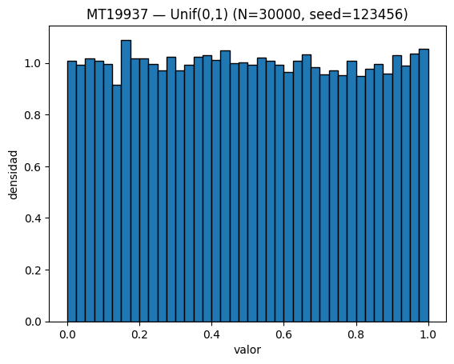

# Problema 2 - Mersenne Twister

Investigar e implementar en Python un generador aleatorio de tipo *Mersenne Twister* para generar una distribución uniforme $Unif(0,1)$.

Igual que en el ejercicio anterior, muestre estadísticos, histogramas y elabore una prueba de hipótesis para contrastar la muestra generada contra la muestra teórica, para determinar el buen funcionamiento del generador pseudo aleatorio. Use como tamaño de muestra un valor adecuado de $N$.

> Referencia: <https://en.wikipedia.org/wiki/Mersenne_Twister>

## Parámetros utilizados

| Generador | Algoritmo                 | Semilla | N      | Periodo teórico | Fuente                       |
| --------- | ------------------------- | ------- | ------ | --------------- | ---------------------------- |
| MT19937   | Mersenne Twister (32-bit) | 123456  | 30,000 | $2^{19937} - 1$ | Numpy (BitGenerator MT19937) |

## Histograma

**Muestra continua $Unif(0,1)$ generada con MT19937:**

La distribución observada es prácticamente plana en el rango $[0,1]$, sin concentraciones visibles de valores en ningún subintervalo.

## Resultados estadísticos

|     n |      min |      max |    media |     desv | autocorr_lag1 |
| ----: | -------: | -------: | -------: | -------: | ------------: |
| 30000 | 0.000013 | 0.999960 | 0.499131 | 0.289121 |     −0.002502 |

- $\mathbb{E}[X] = 0.5$
- $\sigma = \frac{1}{\sqrt{12}} \approx 0.288675$

La autocorrelación lag-1 es cercana a cero, lo que indica independencia entre valores consecutivos.

## Pruebas de hipótesis

Se aplicaron dos contrastes estadísticos sobre la muestra generada:

1. **Kolmogorov–Smirnov (KS):**
   $$
   H_0: X \sim Unif(0,1)
   $$
   Resultado: $p > 0.05$ → no se rechaza $H_0$.

2. **Chi-cuadrado (binned uniform):**
   Frecuencias observadas vs esperadas en 40 bines iguales sobre $[0,1]$.
   Resultado: $p > 0.05$ → no se rechaza $H_0$.

Ambas pruebas indican que la muestra generada es estadísticamente consistente con una distribución uniforme continua. Los resultados obtenidos demuestran que el método produce números pseudoaleatorios indistinguibles de una distribución $Unif(0,1)$ bajo las pruebas aplicadas.
