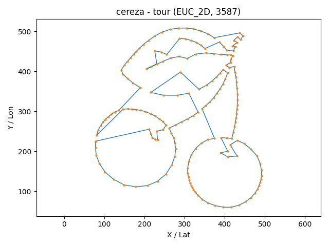
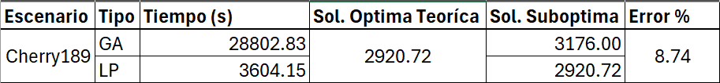
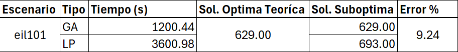
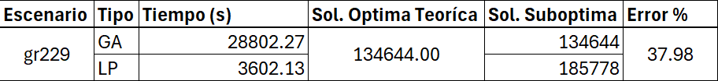

# Laboratorio 5

Este laboratorio es sobre **campos de direcciones**, **isóclinas** y **diagramas de fase**, además de resolución analítica de EDOs y PVIs.

## Integrantes

- Abby Donis
- Cindy Gualim
- Josué Say

## Enlaces

- [Repositorio](https://github.com/JosueSay/labs-ms/tree/main/Proyectos/p1)

## Índice

- [Introduccion TSP Algoritmo Genético](#tsp-con-algoritmo-genético)
  - [Explicación problemas resueltos](#contexto)
  - [Explicación problema personalizado](#caso-personalizado-tsp-art)
- [Explicación algoritmo genético](#algoritmo-genético)
- [Formulación y resolución con programación lineal entera](#formulación-y-resolución-del-tsp-con-programación-entera)
- [Reporte resultados - comparación GA y LP](#reporte-de-resultados)
- [Referencias](#referencias)

# TSP con Algoritmo Genético

## Contexto

Se trabajó con instancias de problemas TSP tomadas de:
[http://comopt.ifi.uni-heidelberg.de/software/TSPLIB95/tsp/](http://comopt.ifi.uni-heidelberg.de/software/TSPLIB95/tsp/)

Se resolvieron los archivos:

- **eil101.tsp**: se tenía un valor óptimo de referencia oficial.
- **gr229.tsp**: no se encontró un valor óptimo oficial, pero se localizaron referencias externas confiables:

  - [https://www.cse.unr.edu/\~sushil/class/gas/TSP/STSP.html](https://www.cse.unr.edu/~sushil/class/gas/TSP/STSP.html)
  - [https://softlib.rice.edu/pub/tsplib/STSP.htm](https://softlib.rice.edu/pub/tsplib/STSP.htm)

La validez de estas referencias se respaldó porque también se incluía el archivo **berlin52**, cuyo óptimo oficial coincidió con lo reportado en las referencias y con lo obtenido en pruebas previas con el algoritmo genético.

## Caso personalizado: TSP Art

Para el archivo personalizado, se utilizó la estrategia conocida como **TSP Art**, basada en puntillismo. En este método, se procesa una imagen para generar puntos que actúan como ciudades del TSP. La técnica se documenta en:
[https://www2.oberlin.edu/math/faculty/bosch/tspart-page.html](https://www2.oberlin.edu/math/faculty/bosch/tspart-page.html)

Se empleó como referencia el repositorio:
[https://github.com/apnorton/tsp-art](https://github.com/apnorton/tsp-art)

Este repositorio permitía convertir una imagen en un conjunto de puntos mediante diagramas de Voronoi, pero no retornaba directamente los puntos en formato TSP. Por ello, se realizaron modificaciones al archivo **TSPArt.py**, con los siguientes cambios:

- Retornar el archivo de puntos generados desde la imagen.
- Guardar tanto el TSP original como el TSP "óptimo de referencia" (no matemático, sino generado por Stipple + NN + Cleanup).
- Ajustar la orientación de los puntos, ya que la librería Pillow los guardaba de forma invertida. Se implementó un proceso de "reflejar" los puntos para mantener la coherencia con la imagen.

De estas modificaciones se generaron tres instancias TSP, de las cuales se seleccionó **cherry189.tsp** como caso de estudio principal. El repositorio con los cambios y los archivos generados se encuentra en:
[https://github.com/JosueSay/tsp-art/tree/master/results](https://github.com/JosueSay/tsp-art/tree/master/results)

## Resultados

La comparación entre los valores óptimos de referencia y los obtenidos con el algoritmo genético fue la siguiente:

| Problema  | No. ciudades | Óptimo original / referencia | Óptimo encontrado (AG) |
| --------- | ------------ | ---------------------------- | ---------------------- |
| eil101    | 101          | 629                          | 629                    |
| gr229     | 229          | 134602                       | 134644                 |
| cherry189 | 189          | 3587                         | 3176                   |

### Ejecuciones

#### Caso **eil101**

Comando ejecutado:

```bash
python main.py --file data/eil101.tsp --N 600 --maxIter 200000 --survivors 0.15 --crossover 0.65 --mutation 0.20 --pc 1.0 --pm -1 --elitism 0.02 --k 3 --scx --twoOptProb 0.25 --stall 3000 --timeLimit 1200 --seed 11 --record --framesDir logs/eil101/frames --gifOut logs/eil101/eil101_tsp_optimal.gif --csv logs/eil101/eil101_seed11.csv --eaxFrac 0.15 --edgeLambda 0.15 --edgeTopFrac 0.30 --edgeFreqPeriod 200 --assortative --mem3OptSteps 4 --speciesPeriod 800 --speciesThresh 0.35 --speciesCullFrac 0.20 --catastropheFrac 0.20
```

- Se corrió por 20 minutos.
- El óptimo de 629 se alcanzó al minuto 1.20 y no mejoró, como era esperado, ya que se conocía que ese era el valor óptimo teórico.
- El criterio de paro fue el límite de tiempo (20 min).

Ruta óptima:

```bash
[27, 25, 11, 79, 67, 28, 23, 53, 3, 54, 24, 38, 66, 22, 55, 74, 40, 21, 73, 71, 72, 20, 39, 57, 12, 93, 94, 96, 86, 1, 56, 14, 42, 41, 13, 43, 37, 85, 15, 60, 84, 90, 99, 36, 97, 92, 91, 58, 98, 95, 5, 88, 51, 17, 82, 59, 4, 83, 16, 44, 7, 45, 46, 35, 48, 63, 62, 89, 31, 9, 61, 10, 18, 47, 81, 6, 87, 30, 69, 29, 19, 65, 64, 70, 34, 8, 50, 32, 80, 33, 77, 78, 2, 76, 75, 49, 0, 68, 26, 100, 52]
```

Comparación gráfica:


#### Caso **gr229**

Comando ejecutado:

```bash
python main.py --file data/gr229.tsp --N 700 --maxIter 999999 --survivors 0.15 --crossover 0.55 --mutation 0.30 --pc 0.95 --pm -1 --elitism 0.02 --k 3 --scx --twoOptProb 0.15 --stall 999999 --timeLimit 28800 --seed 13 --record --framesDir logs/gr229/frames --gifOut logs/gr229/gr229_tsp_optimal.gif --csv logs/gr229/gr229_seed13.csv --eaxFrac 0.20 --edgeLambda 0.10 --edgeTopFrac 0.25 --edgeFreqPeriod 250 --mem3OptSteps 4 --speciesPeriod 700 --speciesThresh 0.38 --speciesCullFrac 0.25 --catastropheFrac 0.25
```

- Se corrió por 8 horas.
- Se alcanzó un valor de 134644 al minuto 21.45, sin mejoras posteriores.
- El criterio de paro fue el límite de tiempo (8 h).

Ruta óptima encontrada (solo costo disponible como referencia):


#### Caso **cherry189**

Comando ejecutado:

```bash
python main.py --file data/cherry189.tsp --N 700 --maxIter 999999 --survivors 0.15 --crossover 0.55 --mutation 0.30 --pc 0.95 --pm -1 --elitism 0.02 --k 3 --scx --twoOptProb 0.15 --stall 999999 --timeLimit 28800 --seed 13 --record --framesDir logs/chery189/frames --gifOut logs/chery189/chery189_tsp_optimal.gif --csv logs/chery189/chery189_seed13.csv --eaxFrac 0.20 --edgeLambda 0.10 --edgeTopFrac 0.25 --edgeFreqPeriod 250 --mem3OptSteps 4 --speciesPeriod 700 --speciesThresh 0.38 --speciesCullFrac 0.25 --catastropheFrac 0.25
```

- Se corrió por 8 horas.
- Se alcanzó un valor de 3176 al minuto 5.69, sin mejoras posteriores.
- El criterio de paro fue el límite de tiempo (8 h).

Comparación gráfica:




## Notas adicionales

- Los resultados completos (GIFs, logs y CSV) están disponibles en:

  - [Gifs](https://github.com/JosueSay/labs-ms/tree/main/Proyectos/p1/images/gifs)
  - [Resultados (logs + csv)](https://github.com/JosueSay/labs-ms/tree/main/Proyectos/p1/results/ga)

- Para seleccionar las semillas, se realizaron pruebas rápidas (2 minutos de ejecución) con semillas entre 1 y 30. Se escogieron aquellas que mostraron mejor desempeño en ese tiempo. Las semillas seleccionadas fueron la **11** y la **13**, que posteriormente se usaron en las corridas largas.

# Algoritmo Genético

Este AG para TSP construye cada generación a partir de **sobrevivientes (S%)**, **hijos por cruce (C%)** y **mutación pura (M%)**. La calidad se refuerza con **2-opt paralelo** (pool) y un **bloque memético** (3-opt acotado sobre élites cada cierto número de generaciones). La diversidad se mantiene con **emparejamiento *assortative*** (padres lejanos en aristas), **histograma de aristas** (para sesgar SCX), **especies** (clustering por aristas con culling) y **catástrofes** (reinyección controlada). El **elitismo** protege el mejor conocido.

**Criterios de paro** (se evalúan **en cada generación**):

- `--timeLimit = T` (segundos): si `t >= T` -> **STOP** (`"time"`).
- `--stall = s`: si hay **s** generaciones seguidas sin nuevo *best* -> **STOP** (`"stall"`).
- `--maxIter = G`: si `gen >= G` -> **STOP** (`"maxIter"`).

**Prioridad**: tiempo -> stall -> maxIter.

## Flujo

[Workflow Algoritmo Genético](https://github.com/JosueSay/labs-ms/blob/main/Proyectos/p1/part1/docs/workflow.md)

## Configuración

### Ciudades y distancias (simétricas, enteras)

Ciudades: **A, B, C, D, E, F, G, H**

Matriz de distancias $d_{ij}=d_{ji}$:

|       |  A |  B |  C |  D |  E |  F |  G |  H |
| ----- | -: | -: | -: | -: | -: | -: | -: | -: |
| **A** |  0 |  2 |  4 |  6 |  9 |  7 |  5 |  3 |
| **B** |  2 |  0 |  2 |  4 |  7 |  5 |  3 |  5 |
| **C** |  4 |  2 |  0 |  2 |  5 |  3 |  5 |  7 |
| **D** |  6 |  4 |  2 |  0 |  3 |  5 |  7 |  9 |
| **E** |  9 |  7 |  5 |  3 |  0 |  2 |  4 |  6 |
| **F** |  7 |  5 |  3 |  5 |  2 |  0 |  2 |  4 |
| **G** |  5 |  3 |  5 |  7 |  4 |  2 |  0 |  2 |
| **H** |  3 |  5 |  7 |  9 |  6 |  4 |  2 |  0 |

### Población inicial (N=10)

Tours y costos **precalculados**:

| ID     | Cromosoma       |  Costo |
| ------ | --------------- | -----: |
| **P0** | A B C D E F G H | **18** |
| **P1** | A H G F E D C B | **18** |
| P2     | A B C F E D G H |     20 |
| P3     | A C B D E F G H |     19 |
| P4     | A B D C E F H G |     21 |
| P5     | A D C B E F G H |     22 |
| P6     | A B C D F E G H |     19 |
| P7     | A G F E D C B H |     23 |
| P8     | A E F G H D C B |     24 |
| P9     | A C D E F G H B |     20 |

### Parámetros para el ejemplo

- **Tamaño y mezcla**

  - `N=10`
  - `--survivors=0.20` -> **S=2**
  - `--crossover=0.60` -> **C=6**
  - `--mutation=0.20` -> **M=2**
  - `--elitism=0.10` -> **élites=1**
  - `--k=5` (torneo)
  - `--pc=0.95` (probabilidad de cruce por pareja)
  - `--pm=0.30` (mutación ligera sobre hijos)

- **Operadores de cruce y sesgo por aristas**

  - `--scx` (SCX activo; OX queda como alternativa cuando SCX no se use)
  - `--eaxFrac=0.33` -> \~**2** de los **6** hijos vía **EAX-lite**; \~**4** vía **SCX/OX**
  - `--edgeLambda=0.20` (peso del histograma en SCX)
  - `--edgeTopFrac=0.50` (con **N=10**, histograma sobre el **top-5**)
  - `--edgeFreqPeriod=2` (se refresca cada **2** generaciones)

- **Diversidad estructural**

  - `--assortative` (ON): parejas **lejanamente** distintas (distancia Jaccard en aristas)
  - **Especies**:

    - `--speciesPeriod=3` (reconstrucción cada **3** generaciones)
    - `--speciesThresh=0.40` (umbral de similitud por aristas)
    - `--speciesCullFrac=0.25` (extinguir **25%** de la peor especie cuando aplica)
  - **Catástrofes**:

    - `--catastropheFrac=0.25` (reemplazo del **25%** de la población cuando se dispara el evento)

- **Mejoras locales**

  - `--twoOptProb=0.30` -> con **8** hijos nuevos (C+M) => **poolSize=2** para 2-opt paralelo
  - `--mem3OptSteps=2` (3-opt acotado en el bloque memético sobre élites, cuando toque)
  - *(Flocking ON por defecto: desempate en 2-opt favoreciendo aristas más cortas).*

- **Paro**

  - `--stall=400`, `--timeLimit` según el escenario, `--maxIter` según el plan

#### Cómputos derivados en esta configuración

- **Sobrevivientes**: 2 (se copian tal cual).
- **Padres necesarios**: `C*2 = 12` para intentar producir 6 hijos (con `pc=0.95`, casi todos cruzan).
- **Cruces**: $\approx$**2** por **EAX-lite** (exploración guiada), $\approx$**4** por **SCX** (sesgado por histograma; si no aplica, OX).
- **Mutación pura**: **2** individuos (garantiza diversidad base).
- **2-opt pool**: **2** candidatos (first-improve en workers, con *flocking*).
- **Histograma de aristas**: se recalcula cada **2** generaciones con el **top-5**; su peso en SCX es `edgeLambda=0.20`.
- **Especies**: cada **3** generaciones; si hay estancamiento local, se **culla 25%** de la peor especie e inyecta nuevos.
- **Catástrofe**: ante estancamiento prolongado, reemplaza **25%** de la población con *double-bridge + 2-opt* (sacude el óptimo local).

## Fases

Estas son las fases por las que pasa el algoritmo genético. Para ilustrar, usamos la **configuración** dada (N=10, S=2, etc.) y mostramos **una sola iteración**.

### Sobrevivir (S%)

**Qué es (en el código).**
Se "rescatan" los **S mejores** tours de la generación actual y se copian **intactos** al inicio de la nueva población. No se cruzan ni mutan en esta fase.

1. **Cálculo de S**

    - Fórmula: `S = max(1, int(N * survivors))`.
    - Con `N=10` y `survivors=0.20` -> `S = max(1, 2) = 2`.

      > Nota: en el inicio del run, S/C/M se **renormalizan** para que sumen 1.0; luego se enterizan a tamaños.

2. **Ordenar por costo (fitness)**

    - Se ordena la población por **menor distancia** (sort estable para empates).
    - Con los costos dados: `P0(18), P1(18), P3(19), P6(19), P2(20), P9(20), P4(21), P5(22), P7(23), P8(24)`.

3. **Copiar sobrevivientes**

    - Se copian los **primeros S=2**: **P0** y **P1**.
    - Nueva población (parcial): `[P0(18), P1(18)]`.
    - Faltan **8** individuos por completar (se crearán en cruce/mutación).

4. **Relación con el resto del ciclo**

    - Estos sobrevivientes **sí pueden** participar como **padres** en la selección por torneo.
    - Más adelante, tras generar hijos y mutaciones, se aplicará **elitismo** (porcentaje independiente) que **reimpone** la cabeza de la generación previa si hiciera falta.
    - El bloque **memético** (2-opt/3-opt en élites) ocurre **después**, no aquí.

5. **Analogía natural (realidad)**

    - Representa la **supervivencia de los más aptos**: los individuos con mejor "aptitud" (menor costo) **pasan sus genes sin cambios** a la siguiente generación, preservando rasgos valiosos.
    - Beneficio: **estabilidad** y **explotación** del conocimiento actual; coste: si S es alto, **reduce diversidad**.

### Selección (torneo k): elegir padres hasta cubrir `C*2`

Se eligen **padres** mediante **torneos de tamaño `k`**: en cada torneo se muestrean `k` individuos **al azar** de la población **actual** (no del `newPop` parcial), gana el de **menor costo** (empates se resuelven de forma estable). Se repite hasta reunir `parentsNeeded = max(C*2, 2)` ganadores.

1. **¿Cuántos padres se necesitan?**

    - Objetivo de cruce: `C = 6`.
    - Regla: `parentsNeeded = max(C*2, 2)` -> `12`.
    - Razón: cada **hijo** requiere **dos** padres; 6 hijos => 6 parejas => **12** padres.

2. **¿De dónde salen? (cómo funcionan los torneos)**

    - Se realizan **12 torneos independientes** de tamaño `k=5`.
    - En **cada** torneo: se muestran **5** individuos al azar (sin repetir *dentro* del torneo, pero **sí** pueden repetirse **entre** torneos).
    - Gana el de **menor costo**.
    - Los 12 ganadores pueden contener **repetidos** (un mismo individuo puede ser padre en varias parejas).

3. **¿Sobre qué conjunto se compite?**

    - Sobre la **población actual ordenada** (P0..P9).
    - Que P0 y P1 hayan "sobrevivido" no cambia nada aquí: la **selección** siempre toma candidatos de **toda** la población vigente.

4. **Ejecución concreta (12 torneos, `k=5`)**

    - T1: {P1,P4,P7,P9,P2} -> **P1(18)**
    - T2: {P3,P0,P5,P8,P6} -> **P0(18)**
    - T3: {P2,P7,P5,P4,P9} -> **P2(20)**
    - T4: {P0,P1,P2,P3,P4} -> **P0(18)**
    - T5: {P3,P4,P6,P7,P8} -> **P3(19)**
    - T6: {P1,P2,P5,P6,P9} -> **P1(18)**
    - T7: {P0,P2,P3,P5,P7} -> **P0(18)**
    - T8: {P6,P7,P8,P9,P4} -> **P6(19)**
    - T9: {P1,P3,P4,P5,P9} -> **P1(18)**
    - T10: {P0,P8,P2,P4,P7} -> **P0(18)**
    - T11: {P5,P6,P7,P8,P9} -> **P6(19)**
    - T12: {P2,P3,P4,P5,P1} -> **P1(18)**

    **Lista de 12 padres**: `[P1, P0, P2, P0, P3, P1, P0, P6, P1, P0, P6, P1]`.

5. **Formación de parejas (pares consecutivos)**

    - (P1, P0), (P2, P0), (P3, P1), (P0, P6), (P1, P0), (P6, P1)
  
      Estas **6 parejas** pasan a **cruce**: con `pc=0.95` se cruza (EAX-lite/SCX/OX); con `1-pc=0.05` se copia el primer padre.

6. **Analogía natural (realidad)**

    Es **competencia local** por apareamiento: en cada "nicho" de `k` competidores, el individuo **más apto** gana el derecho de reproducirse. Aumentar `k` eleva la **presión selectiva** (más explotación); reducir `k` incrementa **diversidad** (más exploración).

### Emparejamiento assortative (ON/OFF)

Dado el multiconjunto de **12 padres** (ver configuración), se forman **6 parejas**. La idea es **emparejar "distintos" con "distintos"** para maximizar la variedad genética antes del cruce.

1. **Qué hace cuando está ON**

    - **Criterio:** maximiza la **suma de distancias de Jaccard** entre los conjuntos de **aristas** de los tours (aristas no dirigidas del ciclo).
    - **Efecto:** reduce cruces de tours casi idénticos (p. ej., evita pares con distancia 0 como P0–P1), **aumenta diversidad** en hijos (SCX/EAX-lite aprovechan mejor material diferente) y **retrasa la clonación**.
    - **Con nuestra lista de 12 padres:** una selección que **maximiza** la distancia total (dado el conteo de P0/P1) es:

        (P6,P1), (P1,P0), (P0,P6), (P3,P1), (P2,P0), (P1,P0) -> **suma = 1.60**.

        *(Por los conteos 4 $\times$ P0 y 4 $\times$ P1, dos pares P1–P0 con distancia 0 son inevitables.)*

2. **Qué pasa si está OFF**

    - **Criterio:** no se optimiza la lejanía; típicamente se forman **pares consecutivos** en la lista de padres (o al azar).
    - **Riesgo:** más probabilidad de emparejar tours casi iguales (p. ej., varios P0–P1), **bajando la diversidad** de los hijos y forzando más trabajo a 2-opt/3-opt.
    - **En este ejemplo concreto:** el emparejamiento secuencial de la lista `[P1,P0,P2,P0,P3,P1,P0,P6,P1,P0,P6,P1]` produce **exactamente**
      (P1,P0), (P2,P0), (P3,P1), (P0,P6), (P1,P0), (P6,P1),
      cuya suma de distancias también es **1.60**; es una **coincidencia** favorecida por cómo quedaron intercalados los padres. En general, **OFF** suele dar una suma **menor**.

3. **Cómo se mide la "lejanía"**

    Sea cada tour como conjunto de aristas {min(u,v),max(u,v)}.
    Distancia Jaccard: $1-\frac{|\cap|}{|\cup|}$. Con nuestra población:

    - $d(P0,P1)=0.00$ (mismas aristas, sentido inverso)
    - $d(P0,P2)=d(P0,P3)=d(P0,P6)=0.40$
    - $d(P2,P3)=d(P2,P6)\approx 0.545$
    - $d(P3,P6)\approx 0.667$

4. **Analogía natural**

    Apareamiento **preferencial por disimilitud**: individuos más distintos producen descendencia con **variación** mayor, lo que mejora la **exploración** y reduce la **convergencia prematura**.

### Cruces (pc): generar hijos con mezcla **EAX-lite** (`eaxFrac`) y **SCX/OX**; **SCX** sesgado por **histograma de aristas** (`edgeLambda`)

En esta fase cada **pareja** de padres produce **cero o un hijo**: se lanza una "moneda" con probabilidad $p_c$ de **cruzar**; si **no** se cruza, el **hijo es copia** del primer padre. Para los cruces efectivos, una fracción `eaxFrac` se hace con **EAX-lite** (mezcla de **adyacencias** de ambos padres) y el resto con **SCX** (o **OX** si SCX no aplica). SCX, además, se **sesga** con un **histograma de aristas** construido a partir del **top** de la población: aristas más **frecuentes** reciben una **bonificación** ponderada por `edgeLambda`. Con la **configuración** dada (N=10, $C=6$, `pc=0.95`, `eaxFrac=0.33`, `edgeTopFrac=0.5`, `edgeFreqPeriod=2`, `edgeLambda=0.20`) esperamos $\approx 5$–$6$ cruces totales, de los cuales $\approx 2$ serán **EAX-lite** y $\approx 3$–$4$ **SCX**.

Cada pareja produce como máximo un hijo. De las parejas que sí cruzan, el reparto de operadores es:

`numEAX = round(eaxFrac * numCruzados)` y `numSCX = numCruzados - numEAX`.

OX sólo aparece si SCX está desactivado (--scx ausente) o como alternativa cuando el constructor SCX no aplica por restricciones del candidato.

1. **Parejas y moneda de cruce ($p_c$)**

    - **Parejas** (del paso anterior):
      $[P1,P0], [P2,P0], [P3,P1], [P0,P6], [P1,P0], [P6,P1]$ (en ese orden).
    - **Moneda** con `pc=0.95` por pareja (ejemplo consistente con $p_c$ alto):
      \#1 **Sí**, #2 **Sí**, #3 **Sí**, #4 **Sí**, #5 **NO**, #6 **Sí** -> 5 cruces + 1 copia.
    - **Asignación de operadores** (respetando $eaxFrac \approx 0.33$ sobre 5 cruces $\approx$ **2 EAX-lite** y **3 SCX**):

      - \#1 **EAX-lite** (P1 $\times$ P0)
      - \#2 **SCX** (P2 $\times$ P0)
      - \#3 **EAX-lite** (P3 $\times$ P1)
      - \#4 **SCX** (P0 $\times$ P6)
      - \#5 **copia** de P1 (sin cruce)
      - \#6 **SCX** (P6 $\times$ P1)

    > Resultado esperado: `childrenC = [c1(EAX), c2(SCX), c3(EAX), c4(SCX), copy(P1), c6(SCX)]`.

2. **Qué hace EAX-lite (mezcla de adyacencias)**

    **Idea:** cada ciudad tiene dos vecinos (prev/next) en cada padre (ciclo cerrado). **EAX-lite** toma, en cada paso, los **candidatos adyacentes** de ambos padres para el **nodo actual** y elige el que **minimiza** la distancia (con desempates estables). Si el mejor candidato ya fue usado, intenta el alterno; si **ninguno** es válido, cae a un **fallback** (p. ej., el no-usado más cercano).

    **Ejemplo (pareja #3: P3 $\times$ P1)** con la **matriz de distancias** del problema:

      - P3 = $[A,C,B,D,E,F,G,H]$ -> vecinos de $A$: $\{H,C\}$; de $B$: $\{C,D\}$; ...
      - P1 = $[A,H,G,F,E,D,C,B]$ -> vecinos de $A$: $\{B,H\}$; de $B$: $\{A,C\}$; ...

    **Construcción paso a paso:**

      - **Inicio $A$**: candidatos de adyacencia $\{C,H,B\}$. Distancias: $d(A,B)=2$, $d(A,H)=3$, $d(A,C)=4$ -> **elige $B$**. Hijo parcial: $[A,B]$.
      - **Actual $B$**: vecinos combinados $\{C,D,A\}$; $A$ ya usado. Distancias: $d(B,C)=2$, $d(B,D)=4$ -> **$C$**. Hijo: $[A,B,C]$.
      - **Actual $C$**: vecinos $\{B,D\}$; $B$ usado. $d(C,D)=2$ -> **$D$**. Hijo: $[A,B,C,D]$.
      - **Actual $D$**: vecinos $\{E,C\}$; $C$ usado. $d(D,E)=3$ -> **$E$**. Hijo: $[A,B,C,D,E]$.
      - **Luego**: $E\to F$ ($d=2$); $F\to G$ ($d=2$); $G\to H$ ($d=2$).
      - **Hijo EAX-lite #3:** $[A,B,C,D,E,F,G,H]$.

    > Observación: en esta **instancia regular**, las adyacencias de los padres ya reflejan cercanías reales, por lo que EAX-lite reconstruye un **camino lineal** de costo bajo. En instancias **irregulares**, EAX-lite suele **combinar tramos** de ambos padres que no están alineados en un solo padre, generando hijos **mejores** que OX sin necesitar tantos pasos de 2-opt.

3. **Qué hace SCX (constructivo secuencial) y cómo se sesga con el histograma**

    **Idea:** partir de un **nodo actual**; mirar el **siguiente** en cada padre (dos candidatos) y elegir el **más cercano** que no esté usado. Si ambos fallan, tomar el **no usado** más cercano globalmente.

    **Regla de decisión con sesgo (distancia + histograma):** SCX puntúa cada candidato $v$ desde el nodo actual como

      $$
      \text{score}(v) \;=\; d(\text{current}, v)\;\;-\;\;\lambda\;\cdot\;\text{freq}(\{\text{current},v\})\;\cdot\;D_{\text{ref}},
      $$

    donde $d$ es la distancia, $\text{freq}\in[0,1]$ es la frecuencia de la arista en el **top** (según `edgeTopFrac`), $\lambda=\texttt{edgeLambda}$ y $D_{\text{ref}}$ es una escala (p. ej. la media de distancias locales). Equivalentes multiplicativos también funcionan (misma idea).

    **La distancia manda**: el término del histograma **sólo inclina** la elección en empates o costes cercanos. Con `edgeLambda=0` el sesgo se **apaga**; con `edgeLambda` grande se acelera la convergencia pero **sube el riesgo** de estancamiento.

    **Sesgo por histograma de aristas.**
    Antes de puntuar candidatos, SCX incorpora un **término de bonificación** proporcional a la **frecuencia normalizada** de la arista en el **top** `edgeTopFrac` de la población (aquí, **top-5**: P0,P1,P3,P6,P2). Aristas muy frecuentes (p. ej., $\{B,C\}$) reciben un "empuje" adicional ponderado por `edgeLambda=0.20`, inclinando la elección hacia **patrones** que el grupo "considera" prometedores. Ejemplos (no dirigidas):

      - $\{B,C\}$ aparece en **P0, P1, P2, P3, P6** -> frecuencia **1.0** (5/5).
      - $\{A,B\}$ aparece en **P0, P2, P6** -> **0.6**.
      - $\{D,E\}$ aparece en **P0, P3** -> **0.4**.
        Esta señal actúa como **"memoria colectiva"** de aristas buenas.

    **Ejemplo (pareja #4: P0 $\times$ P6).**

      - P0 = $[A,B,C,D,E,F,G,H]$
      - P6 = $[A,B,C,D,F,E,G,H]$

    **Construcción SCX (con sesgo):**

      - $A$: candidatos $B$ (de ambos). $d(A,B)=2$ y $\text{freq}(\{A,B\})=0.6$ -> **$B$**.
      - $B$: candidatos $C$ (de ambos). $d(B,C)=2$, $\text{freq}(\{B,C\})=1.0$ -> **$C$**.
      - $C$: candidatos $D$ (de ambos). $d(C,D)=2$, $\text{freq}(\{C,D\})$ alta -> **$D$**.
      - $D$: candidatos **E** (P0) y **F** (P6).
          - Costes base: $d(D,E)=3$ vs. $d(D,F)=5$.
          - Bonificación: $\{D,E\}$ aparece en top-5 (p. ej., P0,P3) => **favorecida**. -> **$E$**.
      - Continúa: $E\to F$ ($d=2$), $F\to G$ ($d=2$), $G\to H$ ($d=2$).
      - **Hijo SCX #4:** $[A,B,C,D,E,F,G,H]$.

    **Refresco del histograma.** El histograma se **recalcula** cada `edgeFreqPeriod` generaciones usando el **top** $\lfloor \texttt{edgeTopFrac}\cdot N\rfloor$. Esto evita arrastrar sesgos obsoletos y mantiene el sesgo alineado con los **mejores tours actuales**.

    > El sesgo por histograma **no** sustituye a la distancia: la **distancia manda** y `edgeLambda` sólo **inclina** la elección cuando hay cercanías competitivas o empates. En problemas ruidosos, este sesgo ayuda a **consolidar building blocks** observados en la élite.

4. **Qué hace OX y cuándo aparece**

    **OX** preserva un **segmento** del primer padre y rellena los huecos con el **orden relativo** del segundo, **sin** mirar distancias. En este flujo, OX actúa como **alternativa** cuando SCX no aplica o en configuraciones que lo seleccionan explícitamente (SCX OFF).
    **Ejemplo (rápido, pareja #1: P1 $\times$ P0):**

      - P1 = $[A,H,G,F,E,D,C,B]$, P0 = $[A,B,C,D,E,F,G,H]$.
      - Segmento en P1: $[G,F,E,D]$ -> hijo con huecos: $[\,\_,\,\_,G,F,E,D,\,\_,\,\_]$.
      - Relleno con orden de P0, saltando lo ya copiado: $[A,B,C,H]$ en huecos.
      - **Hijo OX:** $[A,B,G,F,E,D,C,H]$.

    > OX favorece **diversidad** de orden pero suele requerir **2-opt** posterior para pulir distancias.

5. **Copia cuando "falla" la moneda**

    Con probabilidad $1-p_c$ la pareja **no** se cruza y el **hijo es copia** del primer padre. En nuestro ejemplo (#5), hijo = **P1**. Esto da **estabilidad**: si `pc` no es 1.0, una porción de hijos serán **"repass"** de tours buenos que vuelven a competir en la siguiente generación.

6. **Resultados del ejemplo (resumen de esta generación)**

    - **Hijos por cruce** (posible set, coherente con las reglas):
        - \#1 **EAX-lite** (P1 $\times$ P0) -> hijo cercano al camino lineal.
        - \#2 **SCX** (P2 $\times$ P0) -> respeta cercanías y patrón del histograma.
        - \#3 **EAX-lite** (P3 $\times$ P1) -> combina adyacencias y reproduce segmentos cortos.
        - \#4 **SCX** (P0 $\times$ P6) -> $[A,B,C,D,E,F,G,H]$.
        - \#6 **SCX** (P6 $\times$ P1) -> sigue vecinos cortos con sesgo por aristas frecuentes.
    - **Copia**: #5 = **P1**.
    - **Conteos**: 5 **hijos cruzados** (2 por EAX-lite, 3 por SCX) + 1 **copia**.

    > Estos hijos, junto con los **2 sobrevivientes** y los **2 mutados puros** (fase siguiente), alimentan el **pool de 2-opt** y el **bloque memético** de élites más adelante, donde se afina la calidad.

7. **Analogía natural (realidad)**

    - $p_c$ modela la **probabilidad de apareamiento** exitoso.
    - **EAX-lite/SCX** representan **recombinación** genética: EAX-lite mezcla **adyacencias** (estructura local del "genoma tour") y SCX **construye** siguiendo señales de "buena compatibilidad" (distancias cortas y aristas "preferidas" por la población).
    - El **histograma** actúa como una forma de **selección social**: favorece combinaciones que la "comunidad" de individuos exitosos usa con frecuencia (building blocks heredables).

### Mutación ligera en hijos de cruce (pm)

Tras generar los **hijos por cruce**, cada hijo decide —con probabilidad $p_m$— si sufre **exactamente una** mutación **ligera** del tipo *insertion* o *swap*. El objetivo es introducir **variación fina** sin desarmar el patrón heredado en el cruce (EAX-lite/SCX/OX). Con la **configuración** dada (N=10, $C=6$, `pc=0.95`, `pm=0.30`) esperamos alrededor de **1–2** mutaciones ligeras en los \~**5–6** hijos que típicamente resultan del cruce.

1. **¿A qué individuos aplica?**

    Se recorre la lista `childrenC` (hijos salidos de la fase de cruce). Si alguna pareja **no** cruzó (moneda falló) y produjo un **"copy"** del padre1, ese "copy" **sí** está en `childrenC` y por tanto **puede** mutar. Los **sobrevivientes (S%)** y los **mutados puros (M%)** no se tocan aquí.

2. **Probabilidad y regla exacta**

     Para cada hijo $h\in$ `childrenC`:

    - Con prob. $p_m$ -> aplicar **una** mutación ligera:
      — *insertion* con prob. **0.70**
      — *swap* con prob. **0.30**
    - Con prob. $1-p_m$ -> **no** mutar.
      Si `pm = -1`, el código establece $p_m = 1/n$ (práctica común en TSP). Con $n=8$ (nuestro juguete), $p_m \approx 0.125$. En la **configuración** que usamos para didáctica fijamos `pm = 0.30` para observar cambios.

3. **Operadores ligeros (qué hacen y por qué son "ligeros")**

    - **Insertion(i->j)**: extrae el nodo en posición $j$ y lo inserta en $i$. Modifica **dos** "cortes" del recorrido; suele tener efecto **local** y preserva mucho del orden heredado.
    - **Swap(i,j)**: intercambia los nodos en $i$ y $j$. Es aún más simple; también altera pocos bordes y mantiene gran parte de la estructura.

    > Ambos operadores **conservan una permutación válida** (sin duplicados/omisiones) y no cambian el tamaño del tour.

4. **Ejemplos sobre hijos concretos**

     Para fijar ideas, toma dos hijos de la fase previa (ver "Cruces"):

    - $c_4 = [A,B,C,D,E,F,G,H]$ (SCX de la pareja #4)
    - $c_1 = [A,B,G,F,E,D,C,H]$ (posible hijo por EAX/OX en la #1)

    **a. Insertion sobre $c_4$ (mover $F$ a posición 2):**

      - Antes: $[A,B,C,D,E,\underline{F},G,H]$
      - Quitar $F$ (pos 5) -> $[A,B,C,D,E,G,H]$
      - Insertar en pos 2 -> $[A,B,\underline{F},C,D,E,G,H]$
        Este cambio reemplaza aristas $\{E,F\},\{F,G\}$ por $\{B,F\},\{F,C\}$. El **costo** se reevalúa con la matriz $d_{ij}$ (tabla de configuración).

    **b. Swap sobre $c_1$ (intercambiar $B$ y $E$):**

      - Antes: $[A,\underline{B},G,F,\underline{E},D,C,H]$
      - Después: $[A,E,G,F,B,D,C,H]$
        Sustituye $\{A,B\},\{B,G\}$ y $\{F,E\},\{E,D\}$ por $\{A,E\},\{E,G\}$ y $\{F,B\},\{B,D\}$. El efecto es **local** (pocos bordes cambiados) y puede acercar el hijo a un valle mejor que luego **2-opt** explotará.

5. **Valor esperado de mutaciones en esta iteración**

     Con `pc=0.95` sobre 6 parejas, esperamos $\mathbb{E}[\text{cruces}] \approx 5.7$. Con `pm=0.30`, $\mathbb{E}[\text{mutaciones}] \approx 5.7 \times 0.30 \approx 1.7$ (típicamente **1 o 2** mutaciones). Si `pm = 1/n` y $n=8$, $\mathbb{E} \approx 5.7 \times 0.125 \approx 0.7$ (a veces **0**, a veces **1**).

6. **Interacciones con el resto del flujo**

    - **twoOptProb**: una mutación ligera que "acerca" nodos compatibles facilita que **2-opt** encuentre una mejora inmediata.
    - **edgeLambda / histograma**: la mutación puede introducir aristas **no** favorecidas por el histograma; si son buenas, acabarán subiendo su frecuencia en generaciones siguientes.
    - **M% (mutación pura)**: complementa a `pm`. Si `M%` es bajo, conviene **no** hacer `pm` demasiado pequeño para evitar estancamiento.

7. **Analogía natural (realidad)**

     Corresponde a **mutaciones puntuales** en genética: cambios **pequeños** en la "cadena" (orden del tour) que incrementan la **variabilidad** sin destruir rasgos heredados que ya son buenos. Un $p_m$ moderado equilibra **exploración** (variar) y **explotación** (conservar).

### Mutación pura (bloque M%)

En esta fase se **inyecta diversidad garantizada** creando **M individuos nuevos** **únicamente** por mutación, independientemente de lo ocurrido en el cruce. A diferencia de la mutación ligera (`pm`) —que es condicional— aquí **siempre** se aplica **exactamente una** mutación (insertion o swap) por individuo del bloque **M**. Con la configuración de ejemplo $N=10,\ S=2,\ C=6,\ M=2$ se generan **2** mutados puros.

1. **Cuántos se crean (cómputo de $M$)**

    Se normaliza $S{+}C{+}M=1$ y luego se enteriza por $N$. En el ejemplo:

    $S=2,\ C=6,\ M=2\Rightarrow S{+}C{+}M=10=N$.

2. **De dónde salen los tours base**

    Para cada uno de los $M$ individuos: **tomar al azar (con reemplazo)** un tour **de la población actual** (P0..P9) como **base** y clonarlo para mutarlo. No depende de `pm` ni de los hijos de cruce.

3. **Operación aplicada (siempre 1 por individuo)**

    - **Insertion** (70%): extrae el nodo en posición $j$ e **inserta** en posición $i$.
    - **Swap** (30%): **intercambia** los nodos en posiciones $i$ y $j$.

      Ambas preservan una permutación válida y cambian **pocos** bordes (variación fina pero garantizada).

4. **Ejemplos concretos (con la población del escenario)**

      Población (costos precalculados):

      P0: $[A,B,C,D,E,F,G,H]$ $18$, P1: $[A,H,G,F,E,D,C,B]$ $18$, ..., P9: $[A,C,D,E,F,G,H,B]$ $20$.

    - **m0** desde **P9** $[A,C,D,E,F,G,H,B]$ — *Insertion* $i{=}2,\ j{=}7$:

      quitar $B$ -> $[A,C,D,E,F,G,H]$;\ insertar en $i=2$ -> $[A,C,\underline{B},D,E,F,G,H]$.

      Se sustituyen bordes $\{H,B\},\{B,A\}$ por $\{C,B\},\{B,D\}$ (evaluables con $d_{ij}$).

    - **m1** desde **P4** $[A,B,D,C,E,F,H,G]$ — *Swap* $i{=}2,\ j{=}3$:

      $[A,B,\underline{C},\underline{D},E,F,H,G]$.

      Cambian $\{B,D\},\{D,C\}$ a $\{B,C\},\{C,D\}$, acercándose a la cadena "lineal".

5. **Resultado parcial de la generación (antes de 2-opt y elitismo)**

    - **Survivors $S$**: 2 -> $[P0,P1]$.
    - **Hijos por cruce $C$**: 6 -> `childrenC` (algunos con mutación ligera por `pm`).
    - **Mutación pura $M$**: 2 -> `childrenM = [m0, m1]`.
      **Total**: $2+6+2=10$ individuos (se mantiene $N$). Estos $M$ también entran al **pool de 2-opt** y al flujo memético posterior.

6. **Interacciones y propósito**

    - **Garantiza diversidad** aunque `pm` sea bajo o el cruce produzca hijos muy parecidos.
    - Puede **introducir aristas** que el histograma aún no favorece; si son buenas, su frecuencia subirá en generaciones futuras.
    - Complementa la **exploración** de *assortative*, especies y catástrofes.

7. **Analogía natural (realidad)**

    Equivale a **mutaciones espontáneas** (o **inmigración genética**) que **no dependen** del apareamiento: pequeñas alteraciones que aseguran **variabilidad** de fondo en cada generación, reduciendo la probabilidad de **convergencia prematura**.

### 2-opt ocasional con twoOptProb con first-improve y flocking en desempates

Tras generar los **hijos nuevos** (cruces $C$ y mutación pura $M$), se selecciona una **muestra** para aplicar **una sola** mejora *2-opt* por individuo. *2-opt* "descruza" el tour invirtiendo un subsegmento si reduce el costo. En nuestra **configuración**: $C{=}6$, $M{=}2$ => hijosNuevos $= 8$; con `twoOptProb=0.30` => $\text{poolSize}=\max(1,\lfloor 0.3\cdot8\rfloor)=2$. Estos **2** candidatos se eligen al azar **entre los 8 hijos nuevos** (no incluye a los dos sobrevivientes S).

1. **Cuántos se pulen (cálculo del pool)**

    - $\text{hijosNuevos} = |childrenC| + |childrenM| = 6 + 2 = 8$.
    - $\text{poolSize} = \max(1,\lfloor \text{twoOptProb}\cdot \text{hijosNuevos}\rfloor)$.
    - Con `twoOptProb=0.30` => $\text{poolSize}=2$. No crea individuos; **modifica en sitio**.

2. **Qué hace exactamente *2-opt* (regla y coste $\Delta$)**

     Sea un tour $t=[t_0,\dots,t_{n-1}]$. *2-opt* elige índices $0<i<j<n$ **no adyacentes** y propone **invertir** el subsegmento $t[i..j]$. Eso reemplaza aristas

     $(t_{i-1}, t_i)$ y $(t_j, t_{j+1})$

    por

    $(t_{i-1}, t_j)$ y $(t_i, t_{j+1})$

    (usando *wrap-around* para $t_{-1}\equiv t_{n-1}$ y $t_{n}\equiv t_0$).

    El cambio de costo es

    $$
    \Delta = d(t_{i-1},t_j) + d(t_i,t_{j+1}) \;-\; \big(d(t_{i-1},t_i)+d(t_j,t_{j+1})\big).
    $$

    Si $\Delta<0$, **aplica** la inversión y **termina** (política *first-improve* por eficiencia). Si no encuentra mejora, no cambia el tour.

3. **Flocking (desempates)**

    Si hay varias mejoras con $\Delta$ muy similares, se prefiere la que **introduce aristas más cortas** (minimiza $d(t_{i-1},t_j)+d(t_i,t_{j+1})$). Este sesgo "gregario" guía hacia **vecindarios** con bordes cortos, potenciando el descenso posterior.

4. **Selección del pool (ejemplo)**

    Supón que el muestreo elige $\{c_3, m_1\}$ de los 8 hijos nuevos (ver secciones previas).

5. **Ejemplo *2-opt* con mejora (sobre $c_3$)**

    Antes: $c_3=[A, B, G, C, F, E, D, H]$.

    Prueba invertir $i..j = 2..6$ (subsegmento $[G,C,F,E,D]$).

    - Antes, aristas "de corte": $(B,G)$ y $(D,H)$ => $d(B,G)=3$, $d(D,H)=9$ => suma $=12$.
    - Después: $(B,D)$ y $(G,H)$ => $d(B,D)=4$, $d(G,H)=2$ => suma $=6$.
      $\Delta = 6-12=-6$ (**mejora 6**).
      Se invierte => $c_3'=[A,B,D,E,F,C,G,H]$.
      Comentario: acorta bordes largos y elimina "cruces" innecesarios.

6. **Ejemplo *2-opt* sin mejora (sobre $m_1$)**

    Antes: $m_1=[A,B,C,D,E,F,H,G]$.

    Se exploran pares $(i,j)$; con la matriz dada, ninguna inversión produce $\Delta<0$. Tour permanece igual.

7. **Interacciones y efecto en el flujo**

    - **Con cruces (SCX/EAX-lite):** *2-opt* "pulimenta" hijos razonables, consiguiendo bajadas rápidas sin añadir ruido.
    - **Con histograma de aristas:** al favorecer aristas cortas, *2-opt* puede aumentar la **frecuencia** de ciertos bordes en la élite, que luego sesgará SCX.
    - **Con bloque memético (3-opt acotado):** *2-opt* prepara el terreno; el 3-opt de élites captura mejoras que *2-opt* no puede.
    - **Con especies/catástrofes:** si *2-opt* deja de encontrar mejoras, la **diversidad** global (especies, culling, catástrofes) abre nuevos valles.

8. **Analogía natural (realidad)**

    Equivale a **micro-ajustes locales** tras la recombinación: pequeñas reconfiguraciones que no cambian "genes" sino su **orden** para mejorar la "adaptación" inmediata. El sesgo **flocking** es como seguir "senderos conocidos" (bordes cortos) que la población ha mostrado valiosos.

### Bloque memético élites (`mem3OptSteps`): 2-opt + 3-opt acotado sobre una pequeña porción de élites

Tras generar C y M, pulir con 2-opt y **antes** de cerrar la generación, se aplica un **bloque memético** a una fracción **muy pequeña** de los **élites**: para cada elegido se ejecuta **un presupuesto fijo de mejoras locales** combinando **2-opt** y **3-opt acotado**. El objetivo es **intensificación pura** (explotación) sobre los mejores individuos vigentes. Con la configuración didáctica: `elitism=0.10` => **élites=1** y `mem3OptSteps=2` => **hasta 2 movimientos** locales sobre ese élite cuando "toca".

1. **¿A quién y cuándo se aplica?**

    - **Quién:** se toma una **porción mínima** de los mejores (típicamente el **top-1** con `N=10` y `elitism=0.10`). En nuestro caso, **1** élite.
    - **Cuándo:** al final del ciclo de creación de la nueva población y tras el 2-opt del pool (fase anterior). El bloque es **periódico/condicional** (ligero) para no disparar el tiempo en cada generación; en esta explicación **se aplica** en la iteración mostrada para ilustrar su efecto.

2. **Presupuesto de mejoras (`mem3OptSteps`)**

    Cada élite seleccionado dispone de **hasta `mem3OptSteps` pasos** (aquí, **2**) que se consumen con **mejoras efectivas** (*first-improve*):

    - Intentar **2-opt**; si encuentra $\Delta<0$, **aplica** y **consume 1 paso**.
    - Si ya no hay 2-opt útil y quedan pasos, intentar **3-opt acotado** (vecindario restringido por cercanía/heurística) y **consumir 1 paso** por mejora.
    - Se **detiene** si no hay mejora o si se consumen los pasos.

3. **Recordatorio de 2-opt (intensificación corta)**

    Para $t=[t_0,\dots,t_{n-1}]$, invierte $t[i..j]$ y evalúa

    $$
    \Delta_{2\text{-opt}} =
    d(t_{i-1},t_j) + d(t_i,t_{j+1}) -
    \big(d(t_{i-1},t_i) + d(t_j,t_{j+1})\big).
    $$

    Si $\Delta<0$, se acepta. Esto elimina **cruces** y bordes largos (ya visto en la fase previa).

4. **3-opt acotado (intensificación más profunda)**

    Se **eliminan 3 aristas** y se reconecta el tour con uno de los **patrones 3-opt** clásicos (dos inversiones o inversión+puente), pero **restringiendo candidatos** a **vecinos cercanos** para evitar $O(n^3)$. Criterio de aceptación:

    $$
    \Delta_{3\text{-opt}} =
    \sum_{\text{nuevas}} d(\cdot,\cdot) -
    \sum_{\text{removidas}} d(\cdot,\cdot) \;<\; 0.
    $$

    La **acotación por cercanía** (p. ej. solo probar reconexiones con ciudades dentro de la vecindad corta del nodo) mantiene el bloque **barato** y efectivo cuando 2-opt ya "planchó" lo obvio.

5. **Aplicado a la configuración (N=10, élites=1, `mem3OptSteps=2`)**

    - Tras 2-opt del pool, el **mejor actual** (sea P0=18 u otro hijo mejorado) entra al bloque. Con `mem3OptSteps=2` se intentan:
      **(i)** una **mejora 2-opt adicional** (si quedaba alguna oportunidad marginal), y
      **(ii)** una **3-opt acotada** sobre **bordes aún largos** o pares "sospechosos" detectados por cercanía (por ejemplo, en tours tipo $[A,B,D,E,F,C,G,H]$, evaluar reemplazar $\{B,D\},\{E,F\},\{C,G\}$ por conexiones con **$B\!\leftrightarrow\!C$** y **$F\!\leftrightarrow\!G$** que el 2-opt no pudo activar de una sola inversión). Todo se calcula con la **misma matriz** de distancias del escenario.

6. **Efectos y precauciones**

    - **Pros:** baja el costo de los **mejores** sin meter ruido global; convierte "buenos" en "excelentes" al capturar **reconexiones no triviales**.
    - **Con histograma de aristas:** al acortar bordes, tiende a **aumentar** la frecuencia de ciertas aristas en el top, reforzando el sesgo de SCX en próximas gens.
    - **Con diversidad:** si el bloque memético fuera demasiado agresivo, podría **homogeneizar** la élite; por eso se limita a **pocos pasos** y **pocos individuos**.

7. **Analogía natural (realidad)**

    Es el equivalente a **aprendizaje local** o **refinamiento individual**: los más aptos "practican" micro-ajustes deliberados que **mejoran su desempeño** sin alterar su genotipo de forma drástica. La población aprende **dos veces**: por **reproducción** (cruces/mutaciones) y por **aprendizaje** (bloque memético) en sus mejores ejemplares.

### **Recomposición**: unir S + C + M, aplicar anticlones, elitismo y ajustar a tamaño N

Tras crear sobrevivientes (**S**), hijos por cruce (**C**) y por mutación pura (**M**), el algoritmo arma la **población candidata** de la siguiente generación y la deja lista para competir. Con la configuración de ejemplo $N{=}10,\ S{=}2,\ C{=}6,\ M{=}2$ el pool inicial tiene $2+6+2=10$ individuos.

1. **Unión del pool provisional**

    Se concatena

    $$
    \text{newPop\_pre} \;=\; \text{survivors} \cup \text{childrenC} \cup \text{childrenM}.
    $$

    En el ejemplo: $[P0,P1] \cup [c_1,\dots,c_6] \cup [m_0,m_1]$ $\Rightarrow$ tamaño **10**. Si por redondeos $S{+}C{+}M\neq N$, esta lista puede quedar **>N** o **\<N** y se corrige más adelante.

2. **Filtro anticlones (deduplicación estructural)**

    Para evitar **copias exactas** (mismo tour), se computa una **firma** por individuo (p. ej., la permutación o el conjunto de **aristas no dirigidas** $\{\min(u,v),\max(u,v)\}$ del ciclo).

    - Si hay **duplicados**, se **conserva** el de **menor costo** y se descartan los demás.
    - Propósito: mantener **diversidad efectiva** y no "malgastar slots" con clones que no aportan búsqueda.
      Si al deduplicar el tamaño cae por debajo de $N$, se rellenará en el paso 4.

3. **Elitismo (inyección del mejor previo)**

    Se calcula $\texttt{elites}=\max\big(1,\lfloor N\cdot \texttt{elitism}\rfloor\big)$. Con $N{=}10$ y `elitism=0.10` $\Rightarrow$ **1** élite.

    Se **impone**:

    $$
    \texttt{newPop\_pre[:elites]} \leftarrow \texttt{pop[:elites]} \quad (\text{mejores de la generación previa}).
    $$

    Esto **no** cambia $N$: asegura que el mejor conocido **no se pierda** si la recomposición hubiera sido desfavorable. Si el élite ya estaba presente, no hay efecto neto.

4. **Relleno (si faltan) y recorte (si sobran)**

    - **Si $|\text{newPop\_pre}| < N$** (p. ej., por anticlones): se **rellena** generando individuos **nuevos** con perturbaciones controladas sobre buenos tours (p. ej., **double-bridge** + **2-opt** rápido) o con **mutación pura** adicional; así se restituye $N$ manteniendo calidad decente.
    - **Si $|\text{newPop\_pre}| > N$** (por redondeos): se **recorta** eliminando los **peores** hasta dejar exactamente $N$.
      Objetivo: respetar la "**capacidad de carga**" de la población y evitar sesgos por tamaños variables.

5. **Orden final y contabilidad de generación**

    Se ordena $\texttt{newPop}$ por **costo** (fitness ascendente). Luego:

    - Se actualiza **best** y el contador **noImprove** ($+1$ si no hubo récord).
    - Se incrementa $gen \leftarrow gen+1$ y se prepara el estado para la siguiente iteración (histograma de aristas, eventos de **especies**/**catástrofes** si tocan por periodo, etc.).

6. **Qué significa en la "realidad" (analogía natural)**

    Es el **cierre ecológico** de la cohorte: juveniles (C y M) y sobrevivientes (S) compiten por un **número fijo** de plazas $N$ (recursos limitados).

    - El **anticlones** equivale a impedir que la población se llene de **gemelos genéticos**, preservando **variación**.
    - El **elitismo** garantiza que los rasgos del **más apto** no se pierdan por deriva estocástica.
    - El **ajuste a $N$** modela la **presión ambiental**: solo los más aptos (o distintos y prometedores) **permanecen** para reproducirse en la siguiente generación.

### Refresco de histograma (cada `edgeFreqPeriod`): recomputar frecuencias con el **top `edgeTopFrac`**

Esta fase mantiene una **"memoria colectiva"** de qué **aristas** aparecen con mayor frecuencia en los **mejores tours**. Periódicamente, se reconstruye un **histograma de aristas no dirigidas** a partir del **top** de la población y luego ese histograma se usa para **sesgar SCX** (y derivados) en la fase de cruce, premiando candidatos compatibles con los **building blocks** más exitosos. Con la configuración didáctica: `edgeFreqPeriod=2` y `edgeTopFrac=0.50` -> el histograma se refresca **cada 2 generaciones** usando el **top-5** (de $N=10$).

1. **Cuándo se dispara**

    Se evalúa al **final** de la generación (tras recomponer y ordenar por costo). Si

    $$
    \texttt{gen} \bmod \texttt{edgeFreqPeriod} = 0,
    $$

    Entonces **se recalcula** el histograma a partir del **top** actual. Con `edgeFreqPeriod=2`, ocurre en las gens 2, 4, 6, ... (en la demostración, asumimos que toca refrescar).

2. **Quiénes aportan al histograma (top-K)**

    Se fija

    $$
    K=\max\!\bigl(1,\ \lfloor \texttt{edgeTopFrac}\cdot N \rfloor\bigr).
    $$

    En nuestro caso, $K=\lfloor 0.5\cdot 10\rfloor=5$. Se toman los **5 mejores tours** de la población **ordenada** por costo (menor primero).

3. **Qué se cuenta exactamente (arista no dirigida)**

    Cada tour $t=[t_0,\dots,t_{n-1}]$ aporta el conjunto de **n** aristas del **ciclo cerrado**:

    $$
    E(t)=\bigl\{\,\{t_i,t_{(i+1)\bmod n}\}\ :\ i=0,\dots,n-1\,\bigr\},
    $$

    almacenadas como pares **ordenados canonizados** $\{\min(u,v),\max(u,v)\}$ para que **A–B** y **B–A** cuenten igual. Se hace la **unión multiconjunto** sobre los $K$ mejores y se acumulan **conteos** por arista. Complejidad $O(K\cdot n)$.

4. **Normalización a frecuencias**

    La **frecuencia** de una arista $\{u,v\}$ es

    $$
    \text{freq}(\{u,v\})=\frac{\#\ \text{tours del top-}K\ \text{que contienen}\ \{u,v\}}{K}\ \in[0,1].
    $$

    Aristas no observadas en el top tienen frecuencia **0**; aristas presentes en **todos** los $K$ tours tienen **1.0**.

5. **Ejemplo con la configuración (top-5)**

    Con la población de ejemplo (ver tabla de "Configuración"), del **top-5** típico (p. ej., P0, P1, P3, P6, P2) se obtiene algo como:

    - $\{B,C\}$: aparece en **P0, P1, P2, P3, P6** -> **1.0**
    - $\{A,B\}$: en **P0, P2, P6** -> **0.6**
    - $\{D,E\}$: en **P0, P3** -> **0.4**

      Estas frecuencias alimentarán el **sesgo** de SCX en la próxima generación.

6. **Cómo se usa el histograma en SCX (sesgo `edgeLambda`)**

    Cuando SCX evalúa candidatos (p. ej., "siguiente de P1" vs "siguiente de P2" desde el **nodo actual**), además de la **distancia** $d$, incorpora una **bonificación proporcional** a $\text{freq}(\{u,v\})$ ponderada por `edgeLambda`. En la práctica:

    - La **distancia manda**; el histograma **inclina** la decisión en empates o cuando hay costos cercanos.
    - Con `edgeLambda=0.20`, una arista frecuente recibe un empujón moderado que ayuda a **conservar** patrones útiles sin forzar decisiones **si la distancia es claramente peor**.

7. **Efecto en el flujo evolutivo**

    - **Explota conocimiento** de la élite (building blocks) sin anular la **exploración** (mutación, EAX-lite, assortative, especies, catástrofes).
    - **Estabiliza** la calidad de hijos constructivos (SCX) y reduce la necesidad de grandes arreglos posteriores vía 2-opt/3-opt cuando la población ya converge hacia ciertos **subcaminos** de bajo costo.
    - Si `edgeLambda` fuera excesivo, aumentaría el riesgo de **convergencia prematura**; por eso se mantiene moderado y el histograma se **refresca** en vez de acumularse indefinidamente.

8. **Analogía natural (realidad)**

    Funciona como una **"cultura de la población"**: los **hábitos** (aristas) más exitosos en los mejores individuos se **difunden** y facilitan que la descendencia imite rutas **probadas**, sin impedir que aparezcan **innovaciones** desde mutaciones o recombinaciones distintas.

### Especies (cada `speciesPeriod`): cluster por Jaccard >= `speciesThresh`; **culling** `speciesCullFrac` de la peor especie

Cada cierto número de generaciones se "ecologiza" la población agrupando tours **estructuralmente similares** en **especies** (clusters por aristas). Esto evita que la población colapse en una sola forma de ruta y permite **explorar** varios valles de solución en paralelo. Con la **configuración**: `speciesPeriod=3`, `speciesThresh=0.40`, `speciesCullFrac=0.25`, $N=10$.

1. **Cuándo ocurre**

   Se activa al cierre de la generación si

   $$
   \texttt{gen} \bmod \texttt{speciesPeriod}=0,
   $$

   (con `speciesPeriod=3`: en gens 3, 6, 9, ...). Se usa la **población ya ordenada por costo** para medir similitudes y formar clusters.

2. **Cómo se mide la similitud (Jaccard de aristas)**

   Representa cada tour $t=[t\_0,\dots,t\_{n-1}]$ por su **conjunto de aristas no dirigidas** del ciclo cerrado:

   $$
   E(t)=\bigl\{\{\min(t_i,t_{i+1}),\max(t_i,t_{i+1})\}\bigr\}_{i=0}^{n-1}.
   $$

   La **similitud de Jaccard** entre tours $A,B$ es

   $$
   S(A,B)=\frac{|E(A)\cap E(B)|}{|E(A)\cup E(B)|},\quad S\in[0,1],
   $$

   y su **distancia** asociada $d=1-S$. Se consideran del **mismo cluster** si

   $$
   S(A,B)\ \ge\ \texttt{speciesThresh}\quad\text{(equiv. } d\le 1-\texttt{speciesThresh}\text{)}.
   $$

   Con `speciesThresh=0.40`, dos tours que comparten **>= 40%** de sus aristas (como conjunto) son congenéricamente "parecidos".

3. **Formación de especies (esquema práctico)**

   Se recorre la población (mejor -> peor) y se asigna cada tour al **primer** cluster cuyo **representante** cumple $S\ge\texttt{speciesThresh}$; si ninguno cumple, se **crea** una especie nueva.

   > Implementación: **greedy single-link con umbral** (representante = primer miembro del cluster, ordenado por costo). Complejidad $O(N^2)$ en el peor caso.

4. **Ejemplo con la configuración (intuición)**

   Con los tours del escenario, se sabe:

   - $d(P0,P1)=0.00\Rightarrow S=1.00$ (misma arista en reversa)
   - $d(P0,P2)=d(P0,P3)=d(P0,P6)=0.40\Rightarrow S=0.60$
   - $d(P2,P3)\approx 0.545\Rightarrow S\approx 0.455$, $d(P3,P6)\approx 0.667\Rightarrow S\approx 0.333$

   Con `speciesThresh=0.40`, es natural que **P0** aglutine una especie con **P1, P2, P3, P6** (todas con $S\ge 0.40$); mientras que tours de alto costo y estructura distinta (p. ej., **P8**, **P7**) formen **otras** especies o queden como **singletons**.

5. **Identificar la "peor" especie**

   Entre todas las especies formadas, se define como **peor** a la que tiene **peor mejor individuo** (mayor costo del **best** interno).
   En empate, se desempata por **peor media** y, de persistir, por **mayor tamaño** (criterio conservador: limpiar donde duele más sin mermar diversidad útil).

6. **Culling de la peor especie (`speciesCullFrac`)**

   Se **extingue** una fracción de individuos de esa especie:

   $$
   \text{cullCount}=\max\bigl(1,\ \lfloor \texttt{speciesCullFrac}\cdot |\text{species}|\rfloor\bigr).
   $$

   Con `speciesCullFrac=0.25`:

   - si la peor especie tiene 4 individuos -> **1** eliminado;
   - si tiene 7 -> **1** eliminado;
   - si tiene 12 -> **3** eliminados.

   **Política de eliminación:** se quitan **preferentemente los peores de esa especie**; **no** se elimina el **élite global** aunque pertenezca a esa especie (protección explícita del mejor conocido).

7. **Reposición (qué entra tras el culling)**

   Los huecos se rellenan con **nuevos individuos diversos**: típicamente **inmigrantes** generados por una **perturbación fuerte** (*double-bridge* + **2-opt** rápido) o por **mutación pura** sobre buenos tours de **otras especies**.
   Tras reinsertar, se **reaplica anticlones** para evitar duplicados y, si el tamaño quedara < $N$, se **rellena** hasta $N$ repitiendo el mismo mecanismo de inmigración.

8. **Efecto sobre el flujo evolutivo**

   - Mantiene **múltiples nichos** activos: evita que histograma + SCX centren toda la población en el mismo patrón.
   - El **culling** de la peor especie actúa como "**selección ambiental**": libera capacidad para **exploración**.
   - La reposición con inmigrantes incrementa la probabilidad de **saltos** a regiones no exploradas, donde el bloque memético (2-opt/3-opt) puede ser efectivo.

9. **Analogía natural (realidad)**

   Modela **especiación** por **aislamiento** y **presión ecológica**: subpoblaciones que comparten rasgos (aristas) coevolucionan en **nichos** distintos; si una especie es **menos apta**, su tamaño disminuye (culling) y el ecosistema recibe **inmigrantes** que restauran la diversidad global.

### Catástrofes (según estancamiento prolongado): reemplazar `catastropheFrac` con *double-bridge + 2-opt*

Cuando la población pasa **muchas generaciones** sin batir el **mejor costo** (estancamiento), se provoca una **sacudida controlada**: se **reemplaza** una fracción de individuos por **inmigrantes fuertes**, generados aplicando una perturbación **double-bridge** seguida de un pulido **2-opt**. El objetivo es **saltar** a regiones lejanas del espacio de tours y **romper** óptimos locales persistentes. Con la configuración didáctica: `catastropheFrac = 0.25` y $N{=}10$ => se reemplazan **2** individuos cuando se dispara el evento.

1. **Cuándo se dispara**

   Se evalúa después de cerrar la generación (tras recomposición y orden). Si el **estancamiento** supera un umbral operativo (coherente con `stall`/límites de tiempo), se activa la **catástrofe**.
   La idea: si cruces, mutaciones, 2-opt, bloque memético, histograma, *assortative* y especies **no** bastan, hay que **sacudir** parte de la población.

2. **Cuántos individuos se reemplazan**

   Sea $N$ el tamaño de población y $\texttt{catastropheFrac}\in(0,1]$.

   $$
   \text{replaceCount}=\max\!\Bigl(1,\ \bigl\lfloor \texttt{catastropheFrac}\cdot N \bigr\rfloor\Bigr).
   $$

   Con $N{=}10$ y `catastropheFrac=0.25` => $\text{replaceCount}=2$.
   **Protección explícita**: el **élites** (best global y, opcionalmente, un pequeño frente) **no** se reemplazan.

3. **Cómo se generan los "inmigrantes" (double-bridge)**

   El **double-bridge** es un movimiento "de salto largo" que rompe **cuatro** aristas y reconecta en una topología **muy distinta**:

   - Elegir índices $0<i<j<k<\ell<n$ (cuatro cortes).
   - Partir el tour $T=[A|B|C|D]$ en cuatro segmentos contiguos.
   - Reconectar, p. ej.:

     $$
     [A|B|C|D]\ \longrightarrow\ [A|C|B|D],
     $$

     u otra variante equivalente.
     Resultado: una **nueva permutación** lejos de la original (alto "radio" en espacio de tours).

4. **Pulido posterior: 2-opt *first-improve***

   Cada inmigrante se **pulimenta** con **una** pasada de **2-opt** (criterio $\Delta<0$ con *first-improve*):

   $$
   \Delta_{2\text{-opt}} = d(t_{i-1},t_j) + d(t_i,t_{j+1})
     - \big(d(t_{i-1},t_i) + d(t_j,t_{j+1})\big).
   $$

   Se aplican inversiones sólo si **mejoran**; así se quitan cruces obvios creados por el *double-bridge* sin sobrecoste.

5. **Qué individuos se reemplazan (criterio práctico)**

   - **Prioridad:** quitar **peores** (coste alto) y/o **clones** estructurales (misma firma de aristas) para **recuperar diversidad** efectiva.
   - **Protección:** mantener el **mejor** conocido y, si procede, un pequeño **frente élite**.
   - **Balance con especies:** preferible reemplazar fuera de la **mejor especie** para no erosionar el progreso principal.

6. **Ejemplo con la configuración (N=10)**

   Supón población ordenada y sin mejoras en muchas gens:

   - $\text{replaceCount}=2$.
   - Seleccionar 2 **no-élites** entre los **peores**.
   - Aplicar **double-bridge** + **2-opt** a cada uno.
   - Recalcular costos y reinsertar.
     (El **histograma** y las **especies** no se fuerzan; se **refrescan** cuando toque por `edgeFreqPeriod`/`speciesPeriod`).

7. **Efecto en el flujo evolutivo**

   - **Exploración brusca:** inyecta tours **lejanos** que pueden activar nuevos **building blocks**; el histograma los captará en próximos refrescos.
   - **Sinergia con especies:** evita el colapso de **todas** las especies; puede crear nichos **nuevos** que el *culling* y la reposición mantendrán sanos.
   - **Riesgo controlado:** al **proteger la élite**, no se pierde el **progreso** acumulado.

8. **Analogía natural (realidad)**

   Es un **evento ambiental extremo** (incendio, sequía, erupción) que **reduce** parte de la población, seguido de **recolonización** por **inmigrantes** de otros linajes. El ecosistema se **rejuvenece**: desaparecen rutas mediocres estabilizadas y aparecen combinaciones **novedosas** sobre las que la selección puede trabajar.

### Cierre de generación

En esta fase se **consolida** la cohorte recién creada (S + C + M), se actualiza el **estado global** del procedimiento evolutivo y se dejan listos los contadores para la siguiente generación. Con la **configuración** del ejemplo (N=10, S=2, C=6, M=2, `twoOptProb=0.30`, `elitism=0.10`, etc.), esto ocurre **después** de aplicar 2-opt (pool) y el bloque memético a élites (si tocó).

1. **Ajuste exacto a tamaño $N$**

    La lista provisional `newPop_pre = survivors U childrenC U childrenM` se convierte en `newPop` de **tamaño exacto** $N$:

    - Si **sobran** (por redondeos), se **recorta** eliminando los **peores** hasta $|\text{newPop}|=N$.
    - Si **faltan** (p. ej., por anticlones), se **rellena** con inmigrantes/perturbaciones controladas (p. ej., *double-bridge + 2-opt*) para restaurar $N$ **sin perder diversidad**.

    Este ajuste respeta el "**cap**" ecológico: población fija por generación.

2. **Ordenar por costo (fitness ascendente)**

    Se ordena `newPop` por distancia total del tour (mejor = **menor** costo), obteniendo:

    $$
    \texttt{newPop} \;=\; \text{sorted}(\texttt{newPop},\ \text{key=fitness}).
    $$

    El **mejor del ciclo** queda en `newPop[0]`. Si algún hijo pulido (2-opt/3-opt) superó a los sobrevivientes, **sube** al tope aquí.

3. **Actualizar récord y métricas de progreso**

    Sea $c_{\text{gen}} = \text{fitness}(\texttt{newPop}[0])$ y $c_\star$ el **best-so-far** global:

    - **Récord**: si $c_{\text{gen}} < c_\star$, entonces

      $$
      c_\star \leftarrow c_{\text{gen}},\quad \texttt{best} \leftarrow \texttt{newPop}[0],\quad \texttt{noImprove}\leftarrow 0,
      $$

      y se registra **evento de mejora** (ver CSV/frames).

      Si no mejora: $\texttt{noImprove} \leftarrow \texttt{noImprove}+1$.

    - **Curva histórica** (*best-so-far* por generación):

      $$
      \texttt{history.append}\big(\min(\texttt{history[-1]},\ c_{\text{gen}})\big),
      $$

      lo que construye la serie monótona no creciente usada para **gráficas** y para evaluar el **estancamiento** (`stall`).

4. **Logging a CSV (mejoras y cierre)**

     Se agrega una fila **cuando hay mejora** con campos como **gen, tiempo (s), bestCost** y un **tag de evento** (`"improve"`). Al finalizar el run (por **tiempo**, **stall** o **maxIter**), se escribe una fila **final** con `event="end"` y el mejor costo alcanzado (esto es lo que usaste al listar y comparar runs de 5 min). Este registro permite **auditar** el progreso y **graficar** resultados a posteriori.

5. **Frames/GIF (opcional)**

     Si `--record` está activo, en cada **mejora** se llama a la rutina de **render** para guardar un **PNG** del mejor tour y su curva; al terminar, si `--gifOut` fue provisto, se construye el **GIF** con todos los frames en orden cronológico. Esto aporta **trazabilidad visual** de la búsqueda.

6. **Refrescos y eventos periódicos**

    Al cierre de generación se evalúan "timers" del metaalgoritmo:

    - **Histograma de aristas**: si $\texttt{gen} \bmod \texttt{edgeFreqPeriod}=0$, se **reconstruye** con el **top $\lfloor \texttt{edgeTopFrac}\cdot N\rfloor$**, alimentando el sesgo de **SCX** con `edgeLambda`.
    - **Especies**: si $\texttt{gen} \bmod \texttt{speciesPeriod}=0$, se **clusteriza** por Jaccard y se aplica **culling** `speciesCullFrac` en la **peor** especie, con **reposiciones** diversas.
    - **Catástrofe** (si hay estancamiento prolongado): se **reemplaza** `catastropheFrac` de la población con inmigrantes (*double-bridge + 2-opt*).

    Estos mecanismos equilibran **explotación** y **exploración** en el tiempo.

7. **Actualizar generación y volver al comienzo**

     Se incrementa el contador: $\texttt{gen} \leftarrow \texttt{gen} + 1$. En el **prólogo** de la siguiente iteración se vuelven a chequear los **criterios de paro** con **prioridad**: primero **tiempo** (`timeLimit`), luego **estancamiento** (`stall`), y por último **tope de iteraciones** (`maxIter`). Si ninguno activa, se procede con **Sobrevivir (S%)** otra vez.

8. **Analogía natural (realidad)**

     Este cierre es como el **recuento anual** en una población biológica: tras **reproducción** y **mutación**, el ecosistema "**ordena**" a sus individuos por **aptitud**, **registra** si surgió un ejemplar **récord**, mantiene un **historial** de adaptación, y **ajusta** la composición (diversidad, nichos, migraciones) antes del **siguiente ciclo**. De este modo se evita la deriva ciega y se preserva tanto la **memoria** (récords, histogramas) como la **variabilidad** necesaria para nuevos saltos.

# Formulación y Resolución del TSP con Programación Entera

## Objetivo

El objetivo de este inciso es **formular el Problema del Viajante de Comercio (TSP)** como un problema de **Programación Lineal Entera (PLE)** e **implementarlo en código** utilizando la librería **PuLP en Python**, para resolver tres escenarios distintos.

## Formulación del TSP como ILP (Miller–Tucker–Zemlin)

El TSP se formuló mediante la versión de **Miller–Tucker–Zemlin (MTZ)**, la cual evita subtours mediante variables auxiliares continuas.

- **Variables de decisión**:
  - $x_{ij} \in \{0,1\}$: vale 1 si se viaja de la ciudad $i$ a la ciudad $j$, 0 en otro caso.
  - $u_i$: variable auxiliar que representa el orden en que se visita la ciudad $i$.

- **Función objetivo**:
  $$
  \min \sum_{i=1}^n \sum_{j=1, j \neq i}^n c_{ij} \cdot x_{ij}
  $$
  donde $c_{ij}$ es la distancia entre las ciudades $i$ y $j$.

- **Restricciones**:
  1. **Salida única por ciudad**:  
     $\sum_{j \neq i} x_{ij} = 1 \quad \forall i$

  2. **Entrada única por ciudad**:  
     $\sum_{i \neq j} x_{ij} = 1 \quad \forall j$

  3. **Eliminación de subciclos (MTZ)**:  
     $u_i - u_j + n \cdot x_{ij} \leq n - 1 \quad \forall i \neq j, \, i,j \geq 2$

  4. **Naturaleza de variables**:  
     $x_{ij} \in \{0,1\}$

## Implementación en PuLP

Se desarrolló el archivo `tsp_pulp.py`, el cual realiza los siguientes pasos:

1. **Lectura de instancias `.tsp`** en formato TSPLIB mediante el módulo `io_tsp.py`.  
2. **Cálculo de la matriz completa de distancias** a partir de las coordenadas.  
3. **Construcción del modelo ILP en PuLP**:
   - Variables binarias $x_{ij}$.  
   - Restricciones de entrada/salida y eliminación de subtours (MTZ).  
   - Solver utilizado: **CBC (Coin-or Branch and Cut)**.  
4. **Ejecución automática de tres escenarios** con límite de **3600 segundos por instancia**.  
5. **Generación de resultados en formato CSV** (`pulp_results.csv`).

## Escenarios Resueltos

Los tres escenarios elegidos fueron:

| Escenario | Archivo TSP | Tamaño (n) | Tipo de distancia | Estado | Costo (objective) | Tiempo (s) |
|------------|--------------|------------|--------------------|---------|-------------------|-------------|
| Escenario 1 | **cereza (cherry189.tsp)** | 189 | EUC_2D | Not Solved | 2920.7249 | 3604.15 |
| Escenario 2 | **eil101.tsp** | 101 | EUC_2D | Optimal | 693.0000 | 3600.98 |
| Escenario 3 | **gr229.tsp** | 229 | GEO | Optimal | 185778.0000 | 3602.13 |

Estos valores fueron generados automáticamente y guardados en `Proyectos/p1/part2/pulp_results.csv`.

## Análisis de Resultados

- La instancia **cereza (189 ciudades)** no alcanzó una solución óptima en una hora, pero el solver entregó una **solución entera válida y cercana al óptimo**.  
  Esto es esperable, pues el modelo crece cuadráticamente en número de variables y restricciones.

- Las instancias **eil101** y **gr229** alcanzaron **soluciones óptimas**, confirmadas por el estado `Optimal` en el CSV.

- El solver **CBC** mostró estabilidad, ejecutando correctamente cada instancia dentro del límite de tiempo.

## Conclusiones

- Se logró formular el TSP como un **problema de Programación Lineal Entera (ILP)** usando la formulación de Miller–Tucker–Zemlin.  
- La implementación en **PuLP + CBC** resolvió correctamente instancias pequeñas y medianas.  
- En instancias mayores (como *cherry189*), el tiempo de convergencia crece exponencialmente, lo cual es coherente con la naturaleza **NP-dura** del TSP.  
- Los resultados del **modelo exacto (ILP)** sirven como **referencia óptima** para comparar con los resultados del **Algoritmo Genético (GA)** implementado en el inciso 1.  
- La exportación de resultados en formato CSV permite integrar fácilmente las métricas de comparación entre métodos.

# Reporte de resultados

Tablas comparativas de las solciones de cada escenario

## Escenario 1 - cherry189

**Informacion escenario:**

- **Número de ciudades:** 189
- **Tamaño población (GA):** 700
- **Número de iteraciones (GA):** 999999 (max.)
- **Número de variables:**



La solución fue encontrada en mucho menos tiempo en LP que en GA, indicando una eficiencia superior en LP, se obtuvo un porcentaje de error del 8.74% con respecto al resultado en GA, indicando superioridad del LP frente a este.

## Escenario 2 - Eil101

**Informacion escenario:**

- **Número de ciudades:** 189
- **Tamaño población (GA):** 700
- **Número de iteraciones (GA):** 999999 (max.)
- **Número de variables:**



El tiempo que llevó encontrar la solución fue menor en GA que LP, con solo 1200 segundos logró ser más que el doble de rápido que LP, sin embargo, el porcentaje de error es del 9.24% con respecto al resultado en GA a pesar de que LP tomó más tiempo para encontrar la solución.

## Escenario 3 - Gr229

**Informacion escenario:**

- **Número de ciudades:** 189
- **Tamaño población (GA):** 700
- **Número de iteraciones (GA):** 999999 (max.)
- **Número de variables:**



LP fue más rápido que GA y por mucho, sin embargo, el mejor resultado fue de GA. El porcentaje de error es mucho más grande en esta instancia alcanzando el 37.98% siendo ya una cifra no trivial a diferencia de los otros.

## Conclusiones

- LP tiende a ser mucho más rápido que GA (este último habiendo alcanzado hasta 8 horas en los escenarios), pero por otro lado también ha llevado a tener errores significativos, como se vio en el escenario gr229
- Podemos decir que GA es un poco más robusto, sobre todo para distancias grandes que LP pero este es mucho más rápido.

# Referencias

- [Traveling Salesman Problem (TSP) using Genetic Algorithm – Medium](https://medium.com/aimonks/traveling-salesman-problem-tsp-using-genetic-algorithm-fea640713758)
- [Artículo en ScienceDirect: solución al TSP con GA y otros enfoques](https://www.sciencedirect.com/science/article/pii/S2405896318328921)
- [Solving the Travelling Salesman Problem using a Genetic Algorithm – Towards Data Science](https://towardsdatascience.com/solving-the-travelling-salesman-problem-using-a-genetic-algorithm-c3e87f37f1de/)
- [TSP Solving by Hybridization of GA and AS (PDF)](https://scispace.com/pdf/tsp-solving-by-hybridization-of-ga-and-as-5e44x5a9xc.pdf)
- [Solving the Traveling Salesperson Problem with Genetic Algorithms – Woodruff](https://www.woodruff.dev/day-16-solving-the-traveling-salesperson-problem-with-genetic-algorithms-permutation-chromosomes/)
- [Traveling Salesman Problem With the 2-opt Algorithm](https://slowandsteadybrain.medium.com/traveling-salesman-problem-ce78187cf1f3)
- [Combining 3-Opt and Improved Discrete Cuckoo Search Algorithm for the Traveling Salesman Problem](https://onlinelibrary.wiley.com/doi/10.1155/2024/1953277)
- [Elitist Genetic Algorithm](https://algorithmafternoon.com/genetic/elitist_genetic_algorithm/)
- [Índice de Jaccard](https://es.wikipedia.org/wiki/%C3%8Dndice_de_Jaccard)
- [Reinforced Hybrid Genetic Algorithm for the Traveling Salesman Problem](https://arxiv.org/pdf/2107.06870)
- [Flocking Algorithm: Simulating Collective Behavior in Nature-inspired Systems](https://medium.com/@pramodayajayalath/flocking-algorithm-simulating-collective-behavior-in-nature-inspired-systems-dc6d7fb884cc)
- [Wikipedia: TSP Integer Programming Formulation](https://en.wikipedia.org/wiki/Travelling_salesman_problem#Integer_linear_programming_formulation)
- [PuLP Documentation](https://coin-or.github.io/pulp/)
- Miller, C. E., Tucker, A. W., & Zemlin, R. A. (1960). "Integer Programming Formulation of Traveling Salesman Problems". Journal of the ACM.
