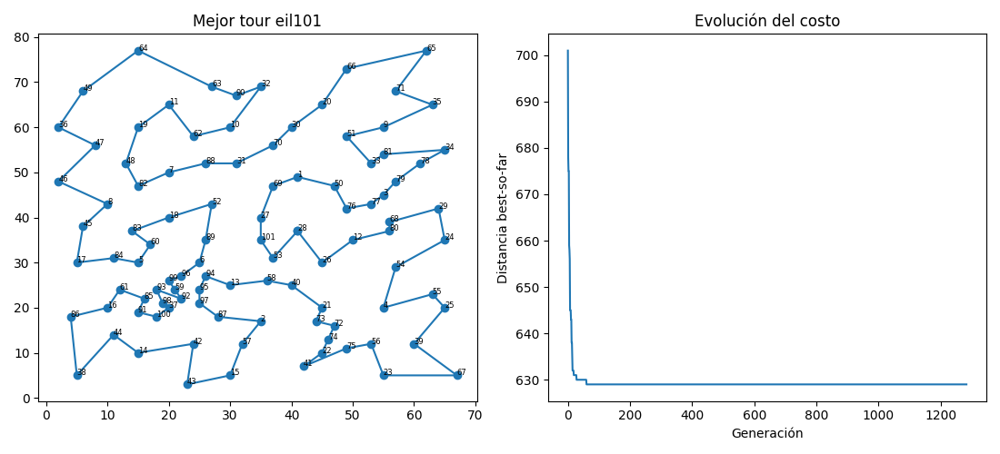
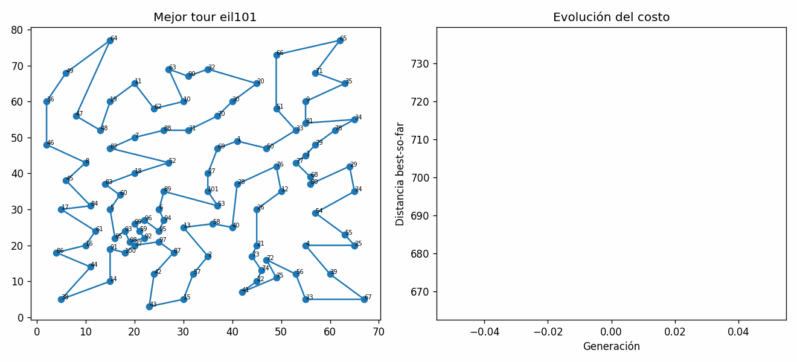
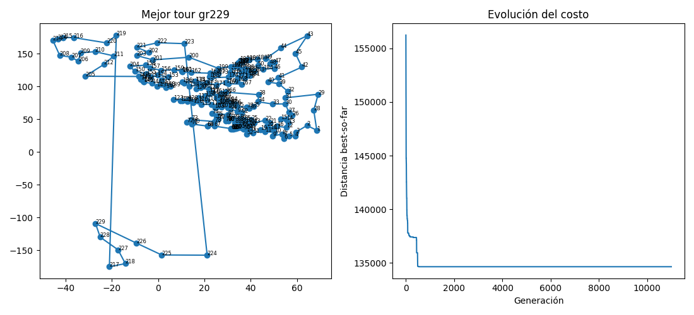
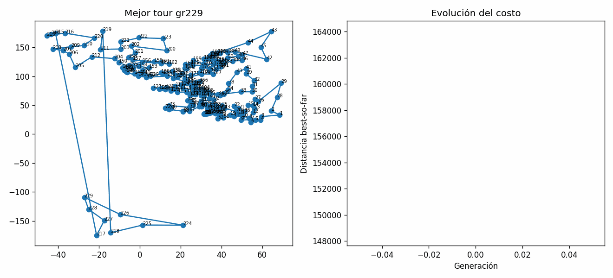
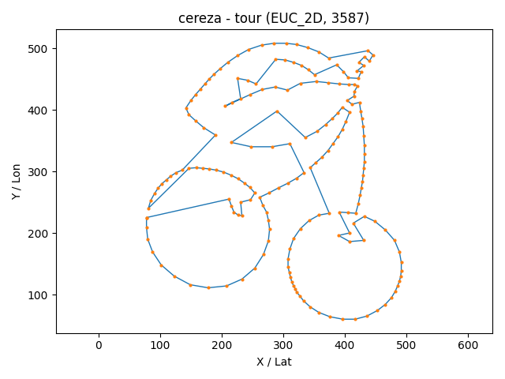
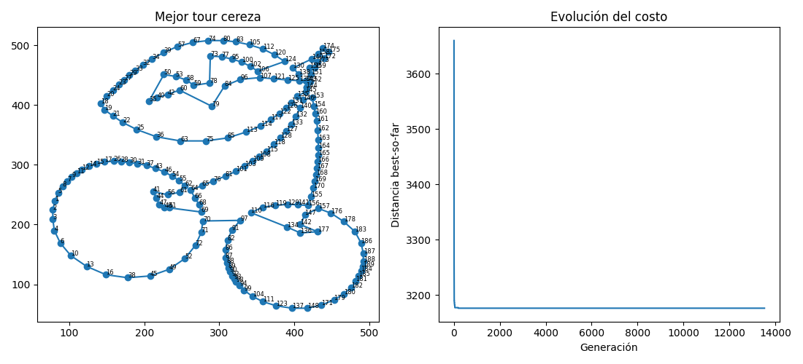
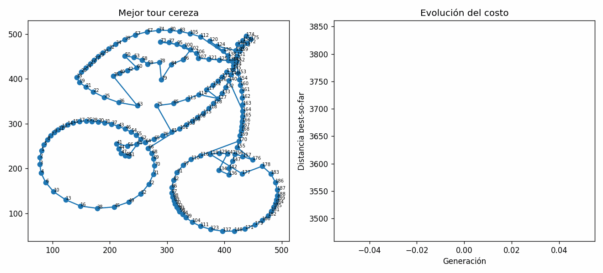

# TSP-GA

## Estructura del proyecto

```bash
.
├── README.md
├── docs
│   └── code                 # documentación de código
├── images
│   ├── gifs                 # animaciones de corridas
│   ├── optimo_ga            # mejores tours hallados por el GA
│   └── optimo_ref           # tours heurísticos de referencia (p.ej. nn_clean)
├── part1
│   ├── README.md            # Este archivo
│   ├── data                 # instancias .tsp y tours .nn_clean.tour / .tour
│   ├── docs
│   │   ├── estructura.md    # documentación sobre estructuras usadas
│   │   ├── ga               # documentación del GA
│   │   ├── ga.md
│   │   ├── notes            # notas de clase
│   │   ├── parametros.md    # explicación detallada de parámetros
│   │   └── tsp.md           # explicación del problema TSP
│   ├── ga.py
│   ├── io_tsp.py
│   ├── main.py
│   ├── optimal.py
│   ├── poblation.py
│   └── viz.py
├── part2
├── part3
├── requirements.txt         # dependencias
└── results
    └── ga                   # logs + csv de corridas del GA
```

### Contenido por archivo

- **ga.py**
  Núcleo del algoritmo genético. Incluye:
  `selectionTournament`, `crossoverOX`, `crossoverSCX`, `eaxLite`,
  `mutateInsertion`, `mutateSwap`, `apply2optOnce`, `apply3optOnce`,
  `buildEdgeHistogram` (frecuencias de aristas), `assortativePairs` (emparejamiento por lejanía),
  mecanismos de **especies** y **catástrofes** (`species*`, `catastropheFrac`, `doubleBridgeKick`),
  2-opt paralelo (workers), tie-break **flocking** y bloque memético `mem3OptSteps`.
  `runGa(...)` orquesta el ciclo (selección -> cruce/EAX -> mutación -> 2-opt/3-opt -> reemplazo), registra eventos/CSV y maneja cortes por estancamiento/tiempo.

- **io_tsp.py**
  Parser TSPLIB (`parseTsp`) con soporte **EUC_2D** y **GEO**; construcción de distancias **comprimidas** (`buildDistanceMatrixCompressed`), accesos O(1) (`getDistance`) y costo de tour (`tourDistance`).

- **poblation.py**
  Generación de población inicial: tours aleatorios (`makeRandomTour`) y semillas heurísticas **Nearest Insertion** (`nearestInsertionSeed`), mezcla y deduplicación (`initPopulation`).

- **viz.py**
  Visualización y animación: guardar frames (`saveFrame`), armar GIF (`makeGifFromFrames`) y figura final (`plotResults`) con mejor tour + historial de costo.

- **main.py**
  CLI y validaciones: normaliza S/C/M, calcula defaults, ruta parámetros -> `runGa`, imprime resumen y opcionalmente grafica / genera GIF / CSV; incluye modo **`--estimate`** para medir gen/s y predecir cortes.

- **optimal.py**
  Visor interactivo para `.tsp` + `.tour`: calcula costo con la métrica correcta (EUC_2D/GEO) y grafica el tour con opciones de marcado.

## Parámetros (CLI)

| Parámetro           | Tipo  | Rango / Valores |             Default | Descripción                                                                   |
| ------------------- | ----- | --------------- | ------------------: | ----------------------------------------------------------------------------- |
| `--file`            | str   | ruta existente  | `data/berlin52.tsp` | Archivo TSPLIB a cargar.                                                      |
| `--N`               | int   | >= 10            |                 300 | Tamaño de población.                                                          |
| `--maxIter`         | int   | >= 1             |                1500 | Iteraciones máximas (generaciones).                                           |
| `--survivors`       | float | \[0,1]          |                0.20 | Fracción S de sobrevivientes (S+C+M=1).                                       |
| `--crossover`       | float | \[0,1]          |                0.60 | Fracción C creada por cruce.                                                  |
| `--mutation`        | float | \[0,1]          |                0.20 | Fracción M creada por mutación.                                               |
| `--pc`              | float | \[0,1]          |                0.95 | Probabilidad de aplicar cruce a una pareja.                                   |
| `--pm`              | float | \[0,1] o `-1`   |                  -1 | Mutación ligera a hijos (si `-1` ⇒ usa 1/n).                                  |
| `--elitism`         | float | \[0,1]          |                0.05 | Fracción élite reinyectada.                                                   |
| `--k`               | int   | >= 2             |                   5 | Tamaño de torneo (selección).                                                 |
| `--scx`             | flag  | —               |                 off | Si está presente, usa **SCX** en lugar de **OX**.                             |
| `--twoOptProb`      | float | \[0,1]          |                0.05 | Proporción de hijos sometidos a 2-opt (pool paralelo).                        |
| `--stall`           | int   | >= 0             |                 400 | Cortar si no mejora en `stall` generaciones.                                  |
| `--timeLimit`       | float | >= 0 (seg)       |                 0.0 | Cortar por tiempo (0 = sin límite).                                           |
| `--record`          | flag  | —               |                 off | Guarda un PNG en cada mejora (requiere `--framesDir`).                        |
| `--framesDir`       | str   | carpeta         |            `frames` | Carpeta para PNG de mejoras.                                                  |
| `--gifOut`          | str   | ruta `.gif`     |                `""` | Construye GIF desde `framesDir` (usualmente con `--record`).                  |
| `--csv`             | str   | ruta            |                `""` | Escribe traza de eventos y métricas a CSV.                                    |
| `--seed`            | int   | cualquiera      |                  42 | Semilla aleatoria (reproducibilidad).                                         |
| `--estimate`        | int   | >= 1             |                   0 | Ejecuta N generaciones de *warm-up* para estimar duración y cortar.           |
| `--noPlot`          | flag  | —               |                 off | No mostrar figura final (o fuerza backend sin GUI).                           |
| `--eaxFrac`         | float | \[0,1]          |                0.15 | Fracción de cruces hecha con **EAX-lite** (mezcla de adyacencias).            |
| `--edgeLambda`      | float | \[0,1] típico   |                0.15 | Peso del **histograma de aristas** para sesgar SCX hacia aristas frecuentes.  |
| `--edgeTopFrac`     | float | (0,1]           |                0.30 | Porción “top” usada para construir el histograma de aristas.                  |
| `--edgeFreqPeriod`  | int   | >= 1             |                 250 | Periodicidad (gens) para recalcular el histograma.                            |
| `--assortative`     | flag  | —               |                  on | Empareja padres maximizando lejanía (Jaccard) para diversidad.                |
| `--noAssortative`   | flag  | —               |                   — | Desactiva emparejamiento assortative.                                         |
| `--mem3OptSteps`    | int   | >= 0             |                   4 | Pasos de **3-opt** acotado aplicados periódicamente a élites.                 |
| `--speciesPeriod`   | int   | >= 1             |                 700 | Periodicidad para reconstruir **especies**.                                   |
| `--speciesThresh`   | float | (0,1]           |                0.35 | Umbral Jaccard para pertenencia a una especie.                                |
| `--speciesCullFrac` | float | \[0,1]          |                0.20 | Fracción de la peor especie a **extinguir** en culling.                       |
| `--catastropheFrac` | float | \[0,1]          |                0.20 | Fracción de población reemplazada en **catástrofes** (double-bridge + 2-opt). |
| `--noFlocking`      | flag  | —               |                 off | Desactiva el desempate **flocking** en 2-opt (ON por defecto).                |

**Notas clave:**

- **Matriz de distancias**: no se guarda $n \times n$ completa; se usa triángulo superior **comprimido** con accesos O(1).
- **Operadores**: SCX/OX y **EAX-lite**; el histograma de aristas sesga SCX con `edgeLambda`.
- **Diversidad**: emparejamiento **assortative**, **especies** (periodicidad/umbral/culling) y **catástrofes** para escapar de estancamientos.
- **Memética**: 2-opt paralelo + **3-opt** acotado en élites (`mem3OptSteps`).
- **Registro**: CSV, frames y GIF opcionales (considera el costo de I/O en corridas largas).
- **Tours de referencia**: si usas `.nn_clean.tour` desde TSPArt, recuerda que **no son óptimos garantizados**; sirven como baseline/semilla.

## Ejecuciones

### Caso **eil101**

Comando ejecutado:

```bash
python main.py --file data/eil101.tsp --N 600 --maxIter 200000 --survivors 0.15 --crossover 0.65 --mutation 0.20 --pc 1.0 --pm -1 --elitism 0.02 --k 3 --scx --twoOptProb 0.25 --stall 3000 --timeLimit 1200 --seed 11 --record --framesDir logs/eil101/frames --gifOut logs/eil101/eil101_tsp_optimal.gif --csv logs/eil101/eil101_seed11.csv --eaxFrac 0.15 --edgeLambda 0.15 --edgeTopFrac 0.30 --edgeFreqPeriod 200 --assortative --mem3OptSteps 4 --speciesPeriod 800 --speciesThresh 0.35 --speciesCullFrac 0.20 --catastropheFrac 0.20
```

- Se corrió por 20 minutos.
- El óptimo de 629 se alcanzó al minuto 1.20 y no mejoró, como era esperado, ya que se conocía que ese era el valor óptimo teórico.
- El criterio de paro fue el límite de tiempo (20 min).

Ruta óptima:

```bash
[27, 25, 11, 79, 67, 28, 23, 53, 3, 54, 24, 38, 66, 22, 55, 74, 40, 21, 73, 71, 72, 20, 39, 57, 12, 93, 94, 96, 86, 1, 56, 14, 42, 41, 13, 43, 37, 85, 15, 60, 84, 90, 99, 36, 97, 92, 91, 58, 98, 95, 5, 88, 51, 17, 82, 59, 4, 83, 16, 44, 7, 45, 46, 35, 48, 63, 62, 89, 31, 9, 61, 10, 18, 47, 81, 6, 87, 30, 69, 29, 19, 65, 64, 70, 34, 8, 50, 32, 80, 33, 77, 78, 2, 76, 75, 49, 0, 68, 26, 100, 52]
```

Comparación gráfica:





### Caso **gr229**

Comando ejecutado:

```bash
python main.py --file data/gr229.tsp --N 700 --maxIter 999999 --survivors 0.15 --crossover 0.55 --mutation 0.30 --pc 0.95 --pm -1 --elitism 0.02 --k 3 --scx --twoOptProb 0.15 --stall 999999 --timeLimit 28800 --seed 13 --record --framesDir logs/gr229/frames --gifOut logs/gr229/gr229_tsp_optimal.gif --csv logs/gr229/gr229_seed13.csv --eaxFrac 0.20 --edgeLambda 0.10 --edgeTopFrac 0.25 --edgeFreqPeriod 250 --mem3OptSteps 4 --speciesPeriod 700 --speciesThresh 0.38 --speciesCullFrac 0.25 --catastropheFrac 0.25
```

- Se corrió por 8 horas.
- Se alcanzó un valor de 134644 al minuto 21.45, sin mejoras posteriores.
- El criterio de paro fue el límite de tiempo (8 h).

Ruta óptima encontrada (solo costo disponible como referencia):




### Caso **cherry189**

Comando ejecutado:

```bash
python main.py --file data/cherry189.tsp --N 700 --maxIter 999999 --survivors 0.15 --crossover 0.55 --mutation 0.30 --pc 0.95 --pm -1 --elitism 0.02 --k 3 --scx --twoOptProb 0.15 --stall 999999 --timeLimit 28800 --seed 13 --record --framesDir logs/chery189/frames --gifOut logs/chery189/chery189_tsp_optimal.gif --csv logs/chery189/chery189_seed13.csv --eaxFrac 0.20 --edgeLambda 0.10 --edgeTopFrac 0.25 --edgeFreqPeriod 250 --mem3OptSteps 4 --speciesPeriod 700 --speciesThresh 0.38 --speciesCullFrac 0.25 --catastropheFrac 0.25
```

- Se corrió por 8 horas.
- Se alcanzó un valor de 3176 al minuto 5.69, sin mejoras posteriores.
- El criterio de paro fue el límite de tiempo (8 h).

Comparación gráfica:




