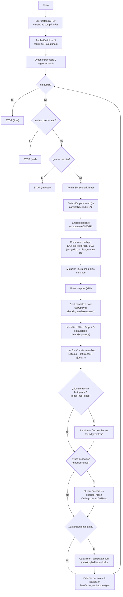

# Algoritmo Genético

Este AG para TSP construye cada generación a partir de **sobrevivientes (S%)**, **hijos por cruce (C%)** y **mutación pura (M%)**. La calidad se refuerza con **2-opt paralelo** (pool) y un **bloque memético** (3-opt acotado sobre élites cada cierto número de generaciones). La diversidad se mantiene con **emparejamiento *assortative*** (padres lejanos en aristas), **histograma de aristas** (para sesgar SCX), **especies** (clustering por aristas con culling) y **catástrofes** (reinyección controlada). El **elitismo** protege el mejor conocido.

**Criterios de paro** (se evalúan **en cada generación**):

- `--timeLimit = T` (segundos): si `t >= T` -> **STOP** (`"time"`).
- `--stall = s`: si hay **s** generaciones seguidas sin nuevo *best* -> **STOP** (`"stall"`).
- `--maxIter = G`: si `gen >= G` -> **STOP** (`"maxIter"`).

**Prioridad**: tiempo -> stall -> maxIter.

## Configuración

### Ciudades y distancias (simétricas, enteras)

Ciudades: **A, B, C, D, E, F, G, H**

Matriz de distancias $d_{ij}=d_{ji}$:

|       |  A |  B |  C |  D |  E |  F |  G |  H |
| ----- | -: | -: | -: | -: | -: | -: | -: | -: |
| **A** |  0 |  2 |  4 |  6 |  9 |  7 |  5 |  3 |
| **B** |  2 |  0 |  2 |  4 |  7 |  5 |  3 |  5 |
| **C** |  4 |  2 |  0 |  2 |  5 |  3 |  5 |  7 |
| **D** |  6 |  4 |  2 |  0 |  3 |  5 |  7 |  9 |
| **E** |  9 |  7 |  5 |  3 |  0 |  2 |  4 |  6 |
| **F** |  7 |  5 |  3 |  5 |  2 |  0 |  2 |  4 |
| **G** |  5 |  3 |  5 |  7 |  4 |  2 |  0 |  2 |
| **H** |  3 |  5 |  7 |  9 |  6 |  4 |  2 |  0 |

### Población inicial (N=10)

Tours y costos **precalculados**:

| ID     | Cromosoma       |  Costo |
| ------ | --------------- | -----: |
| **P0** | A B C D E F G H | **18** |
| **P1** | A H G F E D C B | **18** |
| P2     | A B C F E D G H |     20 |
| P3     | A C B D E F G H |     19 |
| P4     | A B D C E F H G |     21 |
| P5     | A D C B E F G H |     22 |
| P6     | A B C D F E G H |     19 |
| P7     | A G F E D C B H |     23 |
| P8     | A E F G H D C B |     24 |
| P9     | A C D E F G H B |     20 |

### Parámetros para el ejemplo (con nuevas opciones)

- **Tamaño y mezcla**

  - `N=10`
  - `--survivors=0.20` -> **S=2**
  - `--crossover=0.60` -> **C=6**
  - `--mutation=0.20` -> **M=2**
  - `--elitism=0.10` -> **élites=1**
  - `--k=5` (torneo)
  - `--pc=0.95` (probabilidad de cruce por pareja)
  - `--pm=0.30` (mutación ligera sobre hijos)

- **Operadores de cruce y sesgo por aristas**

  - `--scx` (SCX activo; OX queda como alternativa cuando SCX no se use)
  - `--eaxFrac=0.33` -> \~**2** de los **6** hijos vía **EAX-lite**; \~**4** vía **SCX/OX**
  - `--edgeLambda=0.20` (peso del histograma en SCX)
  - `--edgeTopFrac=0.50` (con **N=10**, histograma sobre el **top-5**)
  - `--edgeFreqPeriod=2` (se refresca cada **2** generaciones)

- **Diversidad estructural**

  - `--assortative` (ON): parejas **lejanamente** distintas (distancia Jaccard en aristas)
  - **Especies**:

    - `--speciesPeriod=3` (reconstrucción cada **3** generaciones)
    - `--speciesThresh=0.40` (umbral de similitud por aristas)
    - `--speciesCullFrac=0.25` (extinguir **25%** de la peor especie cuando aplica)
  - **Catástrofes**:

    - `--catastropheFrac=0.25` (reemplazo del **25%** de la población cuando se dispara el evento)

- **Mejoras locales**

  - `--twoOptProb=0.30` -> con **8** hijos nuevos (C+M) => **poolSize=2** para 2-opt paralelo
  - `--mem3OptSteps=2` (3-opt acotado en el bloque memético sobre élites, cuando toque)
  - *(Flocking ON por defecto: desempate en 2-opt favoreciendo aristas más cortas).*

- **Paro**

  - `--stall=400`, `--timeLimit` según el escenario, `--maxIter` según el plan

#### Cómputos derivados en esta configuración

- **Sobrevivientes**: 2 (se copian tal cual).
- **Padres necesarios**: `C*2 = 12` para intentar producir 6 hijos (con `pc=0.95`, casi todos cruzan).
- **Cruces**: $\approx$**2** por **EAX-lite** (exploración guiada), $\approx$**4** por **SCX** (sesgado por histograma; si no aplica, OX).
- **Mutación pura**: **2** individuos (garantiza diversidad base).
- **2-opt pool**: **2** candidatos (first-improve en workers, con *flocking*).
- **Histograma de aristas**: se recalcula cada **2** generaciones con el **top-5**; su peso en SCX es `edgeLambda=0.20`.
- **Especies**: cada **3** generaciones; si hay estancamiento local, se **culla 25%** de la peor especie e inyecta nuevos.
- **Catástrofe**: ante estancamiento prolongado, reemplaza **25%** de la población con *double-bridge + 2-opt* (sacude el óptimo local).

## Fases

Estas son las fases por las que pasa el algoritmo genético. Para ilustrar, usamos la **configuración** dada (N=10, S=2, etc.) y mostramos **una sola iteración**.

### Sobrevivir (S%)

**Qué es (en el código).**
Se "rescatan" los **S mejores** tours de la generación actual y se copian **intactos** al inicio de la nueva población. No se cruzan ni mutan en esta fase.

1. **Cálculo de S**

    - Fórmula: `S = max(1, int(N * survivors))`.
    - Con `N=10` y `survivors=0.20` -> `S = max(1, 2) = 2`.

      > Nota: en el inicio del run, S/C/M se **renormalizan** para que sumen 1.0; luego se enterizan a tamaños.

2. **Ordenar por costo (fitness)**

    - Se ordena la población por **menor distancia** (sort estable para empates).
    - Con los costos dados: `P0(18), P1(18), P3(19), P6(19), P2(20), P9(20), P4(21), P5(22), P7(23), P8(24)`.

3. **Copiar sobrevivientes**

    - Se copian los **primeros S=2**: **P0** y **P1**.
    - Nueva población (parcial): `[P0(18), P1(18)]`.
    - Faltan **8** individuos por completar (se crearán en cruce/mutación).

4. **Relación con el resto del ciclo**

    - Estos sobrevivientes **sí pueden** participar como **padres** en la selección por torneo.
    - Más adelante, tras generar hijos y mutaciones, se aplicará **elitismo** (porcentaje independiente) que **reimpone** la cabeza de la generación previa si hiciera falta.
    - El bloque **memético** (2-opt/3-opt en élites) ocurre **después**, no aquí.

5. **Analogía natural (realidad)**

    - Representa la **supervivencia de los más aptos**: los individuos con mejor "aptitud" (menor costo) **pasan sus genes sin cambios** a la siguiente generación, preservando rasgos valiosos.
    - Beneficio: **estabilidad** y **explotación** del conocimiento actual; coste: si S es alto, **reduce diversidad**.

### Selección (torneo k): elegir padres hasta cubrir `C*2`

Se eligen **padres** mediante **torneos de tamaño `k`**: en cada torneo se muestrean `k` individuos **al azar** de la población **actual** (no del `newPop` parcial), gana el de **menor costo** (empates se resuelven de forma estable). Se repite hasta reunir `parentsNeeded = max(C*2, 2)` ganadores.

1. **¿Cuántos padres se necesitan?**

    - Objetivo de cruce: `C = 6`.
    - Regla: `parentsNeeded = max(C*2, 2)` -> `12`.
    - Razón: cada **hijo** requiere **dos** padres; 6 hijos => 6 parejas => **12** padres.

2. **¿De dónde salen? (cómo funcionan los torneos)**

    - Se realizan **12 torneos independientes** de tamaño `k=5`.
    - En **cada** torneo: se muestran **5** individuos al azar (sin repetir *dentro* del torneo, pero **sí** pueden repetirse **entre** torneos).
    - Gana el de **menor costo**.
    - Los 12 ganadores pueden contener **repetidos** (un mismo individuo puede ser padre en varias parejas).

3. **¿Sobre qué conjunto se compite?**

    - Sobre la **población actual ordenada** (P0..P9).
    - Que P0 y P1 hayan "sobrevivido" no cambia nada aquí: la **selección** siempre toma candidatos de **toda** la población vigente.

4. **Ejecución concreta (12 torneos, `k=5`)**

    - T1: {P1,P4,P7,P9,P2} -> **P1(18)**
    - T2: {P3,P0,P5,P8,P6} -> **P0(18)**
    - T3: {P2,P7,P5,P4,P9} -> **P2(20)**
    - T4: {P0,P1,P2,P3,P4} -> **P0(18)**
    - T5: {P3,P4,P6,P7,P8} -> **P3(19)**
    - T6: {P1,P2,P5,P6,P9} -> **P1(18)**
    - T7: {P0,P2,P3,P5,P7} -> **P0(18)**
    - T8: {P6,P7,P8,P9,P4} -> **P6(19)**
    - T9: {P1,P3,P4,P5,P9} -> **P1(18)**
    - T10: {P0,P8,P2,P4,P7} -> **P0(18)**
    - T11: {P5,P6,P7,P8,P9} -> **P6(19)**
    - T12: {P2,P3,P4,P5,P1} -> **P1(18)**

    **Lista de 12 padres**: `[P1, P0, P2, P0, P3, P1, P0, P6, P1, P0, P6, P1]`.

5. **Formación de parejas (pares consecutivos)**

    - (P1, P0), (P2, P0), (P3, P1), (P0, P6), (P1, P0), (P6, P1)
  
      Estas **6 parejas** pasan a **cruce**: con `pc=0.95` se cruza (EAX-lite/SCX/OX); con `1-pc=0.05` se copia el primer padre.

6. **Analogía natural (realidad)**

    Es **competencia local** por apareamiento: en cada "nicho" de `k` competidores, el individuo **más apto** gana el derecho de reproducirse. Aumentar `k` eleva la **presión selectiva** (más explotación); reducir `k` incrementa **diversidad** (más exploración).

### Emparejamiento *assortative* (ON/OFF)

Dado el multiconjunto de **12 padres** (ver configuración), se forman **6 parejas**. La idea es **emparejar "distintos" con "distintos"** para maximizar la variedad genética antes del cruce.

1. **Qué hace cuando está ON**

    - **Criterio:** maximiza la **suma de distancias de Jaccard** entre los conjuntos de **aristas** de los tours (aristas no dirigidas del ciclo).
    - **Efecto:** reduce cruces de tours casi idénticos (p. ej., evita pares con distancia 0 como P0–P1), **aumenta diversidad** en hijos (SCX/EAX-lite aprovechan mejor material diferente) y **retrasa la clonación**.
    - **Con nuestra lista de 12 padres:** una selección que **maximiza** la distancia total (dado el conteo de P0/P1) es:

        (P6,P1), (P1,P0), (P0,P6), (P3,P1), (P2,P0), (P1,P0) -> **suma = 1.60**.

        *(Por los conteos 4 $\times$ P0 y 4 $\times$ P1, dos pares P1–P0 con distancia 0 son inevitables.)*

2. **Qué pasa si está OFF**

    - **Criterio:** no se optimiza la lejanía; típicamente se forman **pares consecutivos** en la lista de padres (o al azar).
    - **Riesgo:** más probabilidad de emparejar tours casi iguales (p. ej., varios P0–P1), **bajando la diversidad** de los hijos y forzando más trabajo a 2-opt/3-opt.
    - **En este ejemplo concreto:** el emparejamiento secuencial de la lista `[P1,P0,P2,P0,P3,P1,P0,P6,P1,P0,P6,P1]` produce **exactamente**
      (P1,P0), (P2,P0), (P3,P1), (P0,P6), (P1,P0), (P6,P1),
      cuya suma de distancias también es **1.60**; es una **coincidencia** favorecida por cómo quedaron intercalados los padres. En general, **OFF** suele dar una suma **menor**.

3. **Cómo se mide la "lejanía"**

    Sea cada tour como conjunto de aristas {min(u,v),max(u,v)}.
    Distancia Jaccard: $1-\frac{|\cap|}{|\cup|}$. Con nuestra población:

    - $d(P0,P1)=0.00$ (mismas aristas, sentido inverso)
    - $d(P0,P2)=d(P0,P3)=d(P0,P6)=0.40$
    - $d(P2,P3)=d(P2,P6)\approx 0.545$
    - $d(P3,P6)\approx 0.667$

4. **Analogía natural**

    Apareamiento **preferencial por disimilitud**: individuos más distintos producen descendencia con **variación** mayor, lo que mejora la **exploración** y reduce la **convergencia prematura**.

### Cruces (pc): generar hijos con mezcla **EAX-lite** (`eaxFrac`) y **SCX/OX**; **SCX** sesgado por **histograma de aristas** (`edgeLambda`)

En esta fase cada **pareja** de padres produce **cero o un hijo**: se lanza una "moneda" con probabilidad $p_c$ de **cruzar**; si **no** se cruza, el **hijo es copia** del primer padre. Para los cruces efectivos, una fracción `eaxFrac` se hace con **EAX-lite** (mezcla de **adyacencias** de ambos padres) y el resto con **SCX** (o **OX** si SCX no aplica). SCX, además, se **sesga** con un **histograma de aristas** construido a partir del **top** de la población: aristas más **frecuentes** reciben una **bonificación** ponderada por `edgeLambda`. Con la **configuración** dada (N=10, $C=6$, `pc=0.95`, `eaxFrac=0.33`, `edgeTopFrac=0.5`, `edgeFreqPeriod=2`, `edgeLambda=0.20`) esperamos $\approx 5$–$6$ cruces totales, de los cuales $\approx 2$ serán **EAX-lite** y $\approx 3$–$4$ **SCX**.

1. **Parejas y moneda de cruce ($p_c$)**

    - **Parejas** (del paso anterior):
      $[P1,P0], [P2,P0], [P3,P1], [P0,P6], [P1,P0], [P6,P1]$ (en ese orden).
    - **Moneda** con `pc=0.95` por pareja (ejemplo consistente con $p_c$ alto):
      \#1 **Sí**, #2 **Sí**, #3 **Sí**, #4 **Sí**, #5 **NO**, #6 **Sí** -> 5 cruces + 1 copia.
    - **Asignación de operadores** (respetando $eaxFrac \approx 0.33$ sobre 5 cruces $\approx$ **2 EAX-lite** y **3 SCX**):

      - \#1 **EAX-lite** (P1 $\times$ P0)
      - \#2 **SCX** (P2 $\times$ P0)
      - \#3 **EAX-lite** (P3 $\times$ P1)
      - \#4 **SCX** (P0 $\times$ P6)
      - \#5 **copia** de P1 (sin cruce)
      - \#6 **SCX** (P6 $\times$ P1)

    > Resultado esperado: `childrenC = [c1(EAX), c2(SCX), c3(EAX), c4(SCX), copy(P1), c6(SCX)]`.

2. **Qué hace EAX-lite (mezcla de adyacencias)**

    **Idea:** cada ciudad tiene dos vecinos (prev/next) en cada padre (ciclo cerrado). **EAX-lite** toma, en cada paso, los **candidatos adyacentes** de ambos padres para el **nodo actual** y elige el que **minimiza** la distancia (con desempates estables). Si el mejor candidato ya fue usado, intenta el alterno; si **ninguno** es válido, cae a un **fallback** (p. ej., el no-usado más cercano).

    **Ejemplo (pareja #3: P3 $\times$ P1)** con la **matriz de distancias** del problema:

      - P3 = $[A,C,B,D,E,F,G,H]$ -> vecinos de $A$: $\{H,C\}$; de $B$: $\{C,D\}$; ...
      - P1 = $[A,H,G,F,E,D,C,B]$ -> vecinos de $A$: $\{B,H\}$; de $B$: $\{A,C\}$; ...

    **Construcción paso a paso:**

      - **Inicio $A$**: candidatos de adyacencia $\{C,H,B\}$. Distancias: $d(A,B)=2$, $d(A,H)=3$, $d(A,C)=4$ -> **elige $B$**. Hijo parcial: $[A,B]$.
      - **Actual $B$**: vecinos combinados $\{C,D,A\}$; $A$ ya usado. Distancias: $d(B,C)=2$, $d(B,D)=4$ -> **$C$**. Hijo: $[A,B,C]$.
      - **Actual $C$**: vecinos $\{B,D\}$; $B$ usado. $d(C,D)=2$ -> **$D$**. Hijo: $[A,B,C,D]$.
      - **Actual $D$**: vecinos $\{E,C\}$; $C$ usado. $d(D,E)=3$ -> **$E$**. Hijo: $[A,B,C,D,E]$.
      - **Luego**: $E\to F$ ($d=2$); $F\to G$ ($d=2$); $G\to H$ ($d=2$).
      - **Hijo EAX-lite #3:** $[A,B,C,D,E,F,G,H]$.

    > Observación: en esta **instancia regular**, las adyacencias de los padres ya reflejan cercanías reales, por lo que EAX-lite reconstruye un **camino lineal** de costo bajo. En instancias **irregulares**, EAX-lite suele **combinar tramos** de ambos padres que no están alineados en un solo padre, generando hijos **mejores** que OX sin necesitar tantos pasos de 2-opt.

3. **Qué hace SCX (constructivo secuencial) y cómo se sesga con el histograma**

    **Idea:** partir de un **nodo actual**; mirar el **siguiente** en cada padre (dos candidatos) y elegir el **más cercano** que no esté usado. Si ambos fallan, tomar el **no usado** más cercano globalmente.

    **Sesgo por histograma de aristas.**
    Antes de puntuar candidatos, SCX incorpora un **término de bonificación** proporcional a la **frecuencia normalizada** de la arista en el **top** `edgeTopFrac` de la población (aquí, **top-5**: P0,P1,P3,P6,P2). Aristas muy frecuentes (p. ej., $\{B,C\}$) reciben un "empuje" adicional ponderado por `edgeLambda=0.20`, inclinando la elección hacia **patrones** que el grupo "considera" prometedores. Ejemplos (no dirigidas):

      - $\{B,C\}$ aparece en **P0, P1, P2, P3, P6** -> frecuencia **1.0** (5/5).
      - $\{A,B\}$ aparece en **P0, P2, P6** -> **0.6**.
      - $\{D,E\}$ aparece en **P0, P3** -> **0.4**.
        Esta señal actúa como **"memoria colectiva"** de aristas buenas.

    **Ejemplo (pareja #4: P0 $\times$ P6).**

      - P0 = $[A,B,C,D,E,F,G,H]$
      - P6 = $[A,B,C,D,F,E,G,H]$

    **Construcción SCX (con sesgo):**

      - $A$: candidatos $B$ (de ambos). $d(A,B)=2$ y $\text{freq}(\{A,B\})=0.6$ -> **$B$**.
      - $B$: candidatos $C$ (de ambos). $d(B,C)=2$, $\text{freq}(\{B,C\})=1.0$ -> **$C$**.
      - $C$: candidatos $D$ (de ambos). $d(C,D)=2$, $\text{freq}(\{C,D\})$ alta -> **$D$**.
      - $D$: candidatos **E** (P0) y **F** (P6).
          - Costes base: $d(D,E)=3$ vs. $d(D,F)=5$.
          - Bonificación: $\{D,E\}$ aparece en top-5 (p. ej., P0,P3) => **favorecida**. -> **$E$**.
      - Continúa: $E\to F$ ($d=2$), $F\to G$ ($d=2$), $G\to H$ ($d=2$).
      - **Hijo SCX #4:** $[A,B,C,D,E,F,G,H]$.

    > El sesgo por histograma **no** sustituye a la distancia: la **distancia manda** y `edgeLambda` sólo **inclina** la elección cuando hay cercanías competitivas o empates. En problemas ruidosos, este sesgo ayuda a **consolidar building blocks** observados en la élite.

4. **Qué hace OX y cuándo aparece**

    **OX** preserva un **segmento** del primer padre y rellena los huecos con el **orden relativo** del segundo, **sin** mirar distancias. En este flujo, OX actúa como **alternativa** cuando SCX no aplica o en configuraciones que lo seleccionan explícitamente (SCX OFF).
    **Ejemplo (rápido, pareja #1: P1 $\times$ P0):**

      - P1 = $[A,H,G,F,E,D,C,B]$, P0 = $[A,B,C,D,E,F,G,H]$.
      - Segmento en P1: $[G,F,E,D]$ -> hijo con huecos: $[\,\_,\,\_,G,F,E,D,\,\_,\,\_]$.
      - Relleno con orden de P0, saltando lo ya copiado: $[A,B,C,H]$ en huecos.
      - **Hijo OX:** $[A,B,G,F,E,D,C,H]$.

    > OX favorece **diversidad** de orden pero suele requerir **2-opt** posterior para pulir distancias.

5. **Copia cuando "falla" la moneda**

    Con probabilidad $1-p_c$ la pareja **no** se cruza y el **hijo es copia** del primer padre. En nuestro ejemplo (#5), hijo = **P1**. Esto da **estabilidad**: si `pc` no es 1.0, una porción de hijos serán **"repass"** de tours buenos que vuelven a competir en la siguiente generación.

6. **Resultados del ejemplo (resumen de esta generación)**

    - **Hijos por cruce** (posible set, coherente con las reglas):
        - \#1 **EAX-lite** (P1 $\times$ P0) -> hijo cercano al camino lineal.
        - \#2 **SCX** (P2 $\times$ P0) -> respeta cercanías y patrón del histograma.
        - \#3 **EAX-lite** (P3 $\times$ P1) -> combina adyacencias y reproduce segmentos cortos.
        - \#4 **SCX** (P0 $\times$ P6) -> $[A,B,C,D,E,F,G,H]$.
        - \#6 **SCX** (P6 $\times$ P1) -> sigue vecinos cortos con sesgo por aristas frecuentes.
    - **Copia**: #5 = **P1**.
    - **Conteos**: 5 **hijos cruzados** (2 por EAX-lite, 3 por SCX) + 1 **copia**.

    > Estos hijos, junto con los **2 sobrevivientes** y los **2 mutados puros** (fase siguiente), alimentan el **pool de 2-opt** y el **bloque memético** de élites más adelante, donde se afina la calidad.

7. **Analogía natural (realidad)**

    - $p_c$ modela la **probabilidad de apareamiento** exitoso.
    - **EAX-lite/SCX** representan **recombinación** genética: EAX-lite mezcla **adyacencias** (estructura local del "genoma tour") y SCX **construye** siguiendo señales de "buena compatibilidad" (distancias cortas y aristas "preferidas" por la población).
    - El **histograma** actúa como una forma de **selección social**: favorece combinaciones que la "comunidad" de individuos exitosos usa con frecuencia (building blocks heredables).

### Mutación ligera en hijos de cruce (pm)

Tras generar los **hijos por cruce**, cada hijo decide —con probabilidad $p_m$— si sufre **exactamente una** mutación **ligera** del tipo *insertion* o *swap*. El objetivo es introducir **variación fina** sin desarmar el patrón heredado en el cruce (EAX-lite/SCX/OX). Con la **configuración** dada (N=10, $C=6$, `pc=0.95`, `pm=0.30`) esperamos alrededor de **1–2** mutaciones ligeras en los \~**5–6** hijos que típicamente resultan del cruce.

1. **¿A qué individuos aplica?**

    Se recorre la lista `childrenC` (hijos salidos de la fase de cruce). Si alguna pareja **no** cruzó (moneda falló) y produjo un **"copy"** del padre1, ese "copy" **sí** está en `childrenC` y por tanto **puede** mutar. Los **sobrevivientes (S%)** y los **mutados puros (M%)** no se tocan aquí.

2. **Probabilidad y regla exacta**

     Para cada hijo $h\in$ `childrenC`:

    - Con prob. $p_m$ -> aplicar **una** mutación ligera:
      — *insertion* con prob. **0.70**
      — *swap* con prob. **0.30**
    - Con prob. $1-p_m$ -> **no** mutar.
      Si `pm = -1`, el código establece $p_m = 1/n$ (práctica común en TSP). Con $n=8$ (nuestro juguete), $p_m \approx 0.125$. En la **configuración** que usamos para didáctica fijamos `pm = 0.30` para observar cambios.

3. **Operadores ligeros (qué hacen y por qué son "ligeros")**

    - **Insertion(i->j)**: extrae el nodo en posición $j$ y lo inserta en $i$. Modifica **dos** "cortes" del recorrido; suele tener efecto **local** y preserva mucho del orden heredado.
    - **Swap(i,j)**: intercambia los nodos en $i$ y $j$. Es aún más simple; también altera pocos bordes y mantiene gran parte de la estructura.

    > Ambos operadores **conservan una permutación válida** (sin duplicados/omisiones) y no cambian el tamaño del tour.

4. **Ejemplos sobre hijos concretos**

     Para fijar ideas, toma dos hijos de la fase previa (ver "Cruces"):

    - $c_4 = [A,B,C,D,E,F,G,H]$ (SCX de la pareja #4)
    - $c_1 = [A,B,G,F,E,D,C,H]$ (posible hijo por EAX/OX en la #1)

    **a. Insertion sobre $c_4$ (mover $F$ a posición 2):**

      - Antes: $[A,B,C,D,E,\underline{F},G,H]$
      - Quitar $F$ (pos 5) -> $[A,B,C,D,E,G,H]$
      - Insertar en pos 2 -> $[A,B,\underline{F},C,D,E,G,H]$
        Este cambio reemplaza aristas $\{E,F\},\{F,G\}$ por $\{B,F\},\{F,C\}$. El **costo** se reevalúa con la matriz $d_{ij}$ (tabla de configuración).

    **b. Swap sobre $c_1$ (intercambiar $B$ y $E$):**

      - Antes: $[A,\underline{B},G,F,\underline{E},D,C,H]$
      - Después: $[A,E,G,F,B,D,C,H]$
        Sustituye $\{A,B\},\{B,G\}$ y $\{F,E\},\{E,D\}$ por $\{A,E\},\{E,G\}$ y $\{F,B\},\{B,D\}$. El efecto es **local** (pocos bordes cambiados) y puede acercar el hijo a un valle mejor que luego **2-opt** explotará.

5. **Valor esperado de mutaciones en esta iteración**

     Con `pc=0.95` sobre 6 parejas, esperamos $\mathbb{E}[\text{cruces}] \approx 5.7$. Con `pm=0.30`, $\mathbb{E}[\text{mutaciones}] \approx 5.7 \times 0.30 \approx 1.7$ (típicamente **1 o 2** mutaciones). Si `pm = 1/n` y $n=8$, $\mathbb{E} \approx 5.7 \times 0.125 \approx 0.7$ (a veces **0**, a veces **1**).

6. **Interacciones con el resto del flujo**

    - **twoOptProb**: una mutación ligera que "acerca" nodos compatibles facilita que **2-opt** encuentre una mejora inmediata.
    - **edgeLambda / histograma**: la mutación puede introducir aristas **no** favorecidas por el histograma; si son buenas, acabarán subiendo su frecuencia en generaciones siguientes.
    - **M% (mutación pura)**: complementa a `pm`. Si `M%` es bajo, conviene **no** hacer `pm` demasiado pequeño para evitar estancamiento.

7. **Analogía natural (realidad)**

     Corresponde a **mutaciones puntuales** en genética: cambios **pequeños** en la "cadena" (orden del tour) que incrementan la **variabilidad** sin destruir rasgos heredados que ya son buenos. Un $p_m$ moderado equilibra **exploración** (variar) y **explotación** (conservar).

### Mutación pura (bloque M%)

En esta fase se **inyecta diversidad garantizada** creando **M individuos nuevos** **únicamente** por mutación, independientemente de lo ocurrido en el cruce. A diferencia de la mutación ligera (`pm`) —que es condicional— aquí **siempre** se aplica **exactamente una** mutación (insertion o swap) por individuo del bloque **M**. Con la configuración de ejemplo $N=10,\ S=2,\ C=6,\ M=2$ se generan **2** mutados puros.

1. **Cuántos se crean (cómputo de $M$)**

    Se normaliza $S{+}C{+}M=1$ y luego se enteriza por $N$. En el ejemplo:

    $S=2,\ C=6,\ M=2\Rightarrow S{+}C{+}M=10=N$.

2. **De dónde salen los tours base**

    Para cada uno de los $M$ individuos: **tomar al azar (con reemplazo)** un tour **de la población actual** (P0..P9) como **base** y clonarlo para mutarlo. No depende de `pm` ni de los hijos de cruce.

3. **Operación aplicada (siempre 1 por individuo)**

    - **Insertion** (70%): extrae el nodo en posición $j$ e **inserta** en posición $i$.
    - **Swap** (30%): **intercambia** los nodos en posiciones $i$ y $j$.

      Ambas preservan una permutación válida y cambian **pocos** bordes (variación fina pero garantizada).

4. **Ejemplos concretos (con la población del escenario)**

      Población (costos precalculados):

      P0: $[A,B,C,D,E,F,G,H]$ $18$, P1: $[A,H,G,F,E,D,C,B]$ $18$, …, P9: $[A,C,D,E,F,G,H,B]$ $20$.

    - **m0** desde **P9** $[A,C,D,E,F,G,H,B]$ — *Insertion* $i{=}2,\ j{=}7$:

      quitar $B$ -> $[A,C,D,E,F,G,H]$;\ insertar en $i=2$ -> $[A,C,\underline{B},D,E,F,G,H]$.

      Se sustituyen bordes $\{H,B\},\{B,A\}$ por $\{C,B\},\{B,D\}$ (evaluables con $d_{ij}$).

    - **m1** desde **P4** $[A,B,D,C,E,F,H,G]$ — *Swap* $i{=}2,\ j{=}3$:

      $[A,B,\underline{C},\underline{D},E,F,H,G]$.

      Cambian $\{B,D\},\{D,C\}$ a $\{B,C\},\{C,D\}$, acercándose a la cadena "lineal".

5. **Resultado parcial de la generación (antes de 2-opt y elitismo)**

    - **Survivors $S$**: 2 -> $[P0,P1]$.
    - **Hijos por cruce $C$**: 6 -> `childrenC` (algunos con mutación ligera por `pm`).
    - **Mutación pura $M$**: 2 -> `childrenM = [m0, m1]`.
      **Total**: $2+6+2=10$ individuos (se mantiene $N$). Estos $M$ también entran al **pool de 2-opt** y al flujo memético posterior.

6. **Interacciones y propósito**

    - **Garantiza diversidad** aunque `pm` sea bajo o el cruce produzca hijos muy parecidos.
    - Puede **introducir aristas** que el histograma aún no favorece; si son buenas, su frecuencia subirá en generaciones futuras.
    - Complementa la **exploración** de *assortative*, especies y catástrofes.

7. **Analogía natural (realidad)**

    Equivale a **mutaciones espontáneas** (o **inmigración genética**) que **no dependen** del apareamiento: pequeñas alteraciones que aseguran **variabilidad** de fondo en cada generación, reduciendo la probabilidad de **convergencia prematura**.

### 2-opt ocasional con twoOptProb con *first-improve* y **flocking** en desempates

Tras generar los **hijos nuevos** (cruces $C$ y mutación pura $M$), se selecciona una **muestra** para aplicar **una sola** mejora *2-opt* por individuo. *2-opt* "descruza" el tour invirtiendo un subsegmento si reduce el costo. En nuestra **configuración**: $C{=}6$, $M{=}2$ => hijosNuevos $= 8$; con `twoOptProb=0.30` => $\text{poolSize}=\max(1,\lfloor 0.3\cdot8\rfloor)=2$. Estos **2** candidatos se eligen al azar **entre los 8 hijos nuevos** (no incluye a los dos sobrevivientes S).

1. **Cuántos se pulen (cálculo del pool)**

    - $\text{hijosNuevos} = |childrenC| + |childrenM| = 6 + 2 = 8$.
    - $\text{poolSize} = \max(1,\lfloor \text{twoOptProb}\cdot \text{hijosNuevos}\rfloor)$.
    - Con `twoOptProb=0.30` => $\text{poolSize}=2$. No crea individuos; **modifica en sitio**.

2. **Qué hace exactamente *2-opt* (regla y coste $\Delta$)**

     Sea un tour $t=[t_0,\dots,t_{n-1}]$. *2-opt* elige índices $0<i<j<n$ **no adyacentes** y propone **invertir** el subsegmento $t[i..j]$. Eso reemplaza aristas

     $(t_{i-1}, t_i)$ y $(t_j, t_{j+1})$

    por

    $(t_{i-1}, t_j)$ y $(t_i, t_{j+1})$

    (usando *wrap-around* para $t_{-1}\equiv t_{n-1}$ y $t_{n}\equiv t_0$).

    El cambio de costo es

    $$
    \Delta = d(t_{i-1},t_j) + d(t_i,t_{j+1}) \;-\; \big(d(t_{i-1},t_i)+d(t_j,t_{j+1})\big).
    $$

    Si $\Delta<0$, **aplica** la inversión y **termina** (política *first-improve* por eficiencia). Si no encuentra mejora, no cambia el tour.

3. **Flocking (desempates)**

    Si hay varias mejoras con $\Delta$ muy similares, se prefiere la que **introduce aristas más cortas** (minimiza $d(t_{i-1},t_j)+d(t_i,t_{j+1})$). Este sesgo "gregario" guía hacia **vecindarios** con bordes cortos, potenciando el descenso posterior.

4. **Selección del pool (ejemplo)**

    Supón que el muestreo elige $\{c_3, m_1\}$ de los 8 hijos nuevos (ver secciones previas).

5. **Ejemplo *2-opt* con mejora (sobre $c_3$)**

    Antes: $c_3=[A, B, G, C, F, E, D, H]$.

    Prueba invertir $i..j = 2..6$ (subsegmento $[G,C,F,E,D]$).

    - Antes, aristas "de corte": $(B,G)$ y $(D,H)$ => $d(B,G)=3$, $d(D,H)=9$ => suma $=12$.
    - Después: $(B,D)$ y $(G,H)$ => $d(B,D)=4$, $d(G,H)=2$ => suma $=6$.
      $\Delta = 6-12=-6$ (**mejora 6**).
      Se invierte => $c_3'=[A,B,D,E,F,C,G,H]$.
      Comentario: acorta bordes largos y elimina "cruces" innecesarios.

6. **Ejemplo *2-opt* sin mejora (sobre $m_1$)**

    Antes: $m_1=[A,B,C,D,E,F,H,G]$.

    Se exploran pares $(i,j)$; con la matriz dada, ninguna inversión produce $\Delta<0$. Tour permanece igual.

7. **Interacciones y efecto en el flujo**

    - **Con cruces (SCX/EAX-lite):** *2-opt* "pulimenta" hijos razonables, consiguiendo bajadas rápidas sin añadir ruido.
    - **Con histograma de aristas:** al favorecer aristas cortas, *2-opt* puede aumentar la **frecuencia** de ciertos bordes en la élite, que luego sesgará SCX.
    - **Con bloque memético (3-opt acotado):** *2-opt* prepara el terreno; el 3-opt de élites captura mejoras que *2-opt* no puede.
    - **Con especies/catástrofes:** si *2-opt* deja de encontrar mejoras, la **diversidad** global (especies, culling, catástrofes) abre nuevos valles.

8. **Analogía natural (realidad)**

    Equivale a **micro-ajustes locales** tras la recombinación: pequeñas reconfiguraciones que no cambian "genes" sino su **orden** para mejorar la "adaptación" inmediata. El sesgo **flocking** es como seguir "senderos conocidos" (bordes cortos) que la población ha mostrado valiosos.
