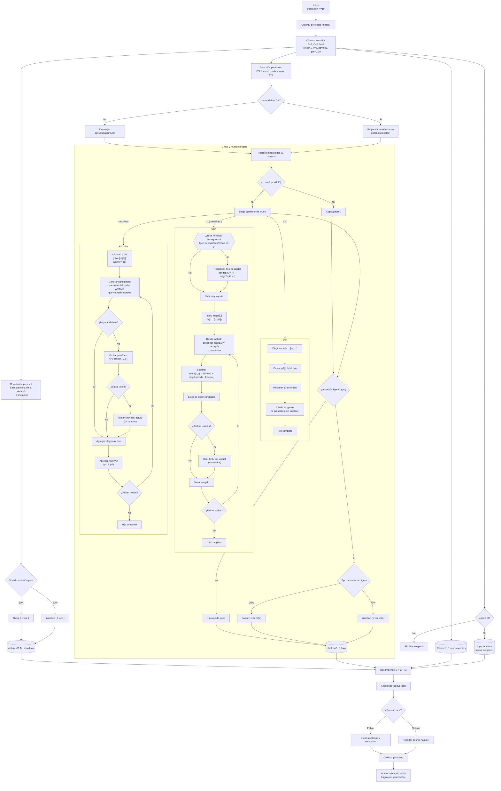

# Flujo algoritmo genético

```mermaid
flowchart TD
    A[Inicio<br>Población N=10] --> B[Ordenar por costo #40;fitness#41;]
    B --> C[Calcular tamaños<br>S=2, C=6, M=2<br>élites=1, k=5, pc=0.95, pm=0.30]

    %% Elitismo
    C --> D[(Copiar S: S sobrevivientes)]
    C --> D0{¿gen > 0?}
    D0 -->|Sí| E[(Inyectar élites<br>#40;mejor de gen-1#41;)]
    D0 -->|No| E2[Sin élite en gen 0]
    E --> V

    %% Selección y emparejamiento
    C --> F[Selección por torneo<br>C*2 torneos, cada uno con k=5]
    F --> G{--assortative ON?}
    G -->|Sí| H[Emparejar maximizando<br>distancia #40;aristas#41;]
    G -->|No| H2[Emparejar secuencial/circular]
    H --> I
    H2 --> I

    %% Cruce + mutación ligera
    subgraph J[ Cruce y mutación ligera]
        I[Padres emparejados #40;C parejas#41;]
        I --> K{¿cruza? #40;pc=0.95#41;}

        K -->|Sí| L[Elegir operador de cruce]
        K -->|No| M[Copia padre1]

        %% Detalle de operadores
        L -->|OX| L_ox
        L -->|1- #40;--eaxFrac #41;| L_scx
        L -->|--eaxFrac| L_eax

        %% Mutación ligera
        L --> N{¿mutación ligera? #40;pm#41;}
        M --> N
        N -->|Sí| O{Tipo de mutación ligera}
        N -->|No| P[Hijo queda igual]
        O -->|70%| Q[Insertion #40;1 vez máx#41;]
        O -->|30%| R[Swap #40;1 vez máx#41;]
        Q --> S[(childrenC: C hijos)]
        R --> S
        P --> S
    end

    %% Mutación pura
    C --> T[M mutación pura = 2<br>Base aleatoria de la población<br>+ 1 mutación]
    T --> U1{Tipo de mutación pura}
    U1 -->|50%| U2[Insertion #40; 1 vez #41;]
    U1 -->|50%| U3[Swap #40; 1 vez #41;]
    U2 --> U[(childrenM: M individuos)]
    U3 --> U

    %% Recomposición y limpieza
    V[Recomponer: S + C + M]
    D --> V
    S --> V
    U --> V
    V --> W[Anticlones #40;deduplicar#41;]
    W --> X{¿Tamaño != N?}
    X -->|Sobran| Y[Recortar peores hasta N]
    X -->|Faltan| Z[Crear aleatorios y deduplicar]
    Y --> AA[Ordenar por costo]
    Z --> AA
    AA --> AB[Nueva población N=10<br>#40;siguiente generación#41;]

    %% ------------------ OX (Order Crossover) ------------------
    subgraph L_ox [OX]
        direction TB
        OX1[Elegir corte #91;a..b#93; en p1] --> OX2[Copiar p1#91;a..b#93; al hijo]
        OX2 --> OX3[Recorrer p2 en orden]
        OX3 --> OX4[Añadir los genes<br>no presentes #40;sin duplicar#41;]
        OX4 --> OX5[Hijo completo]
    end

    %% ------------------ SCX (Secuencial Constructivo) ------------------
    subgraph L_scx [SCX]
        direction TB

        %% Histograma de frecuencias
        SCX0{{¿Toca refrescar histograma#63;<br>#40;gen % edgeFreqPeriod == 0#41;}}
        SCX0 -->|Sí| SCX_FREQ_RECALC[Recalcular freq de aristas<br>con top K = ⌊N · edgeTopFrac⌋]
        SCX0 -->|No| SCX_FREQ_USAR[Usar freq vigente]
        SCX_FREQ_RECALC --> SCX_FREQ_USAR

        %% Inicio SCX
        SCX_FREQ_USAR --> SCX1[Inicio en p1#91;0#93;<br>#40;hijo = #91;p1#91;0#93;#93;#41;]
        SCX1 --> SCX2[Desde 'actual':<br>proponer next#40;p1#41; y next#40;p2#41;<br>si no usados]
        SCX2 --> SCX3[Scoring:<br>score#40;u,v#41; = dist#40;u,v#41; − edgeLambda · freq#123;u,v#125;]
        SCX3 --> SCX4[Elegir el mejor candidato]
        SCX4 --> SCX5{¿Ambos usados#63;}
        SCX5 -->|Sí| SCX6[Usar KNN del 'actual'<br>#40;no usados#41;]
        SCX5 -->|No| SCX7[Tomar elegido]
        SCX6 --> SCX7
        SCX7 --> SCX8{¿Faltan nodos#63;}
        SCX8 -->|Sí| SCX2
        SCX8 -->|No| SCX9[Hijo completo]
    end

    %% ------------------ EAX-lite (Mezcla de adyacencias) ------------------
    subgraph L_eax [EAX-lite]
        direction TB
        EAX1[Inicio en p1#91;0#93;<br>#40;hijo=#91;p1#91;0#93;#93;;<br>activo = p1#41;] --> EAX2[Generar candidatos:<br>prev/next del padre ACTIVO<br>que no estén usados]
        EAX2 --> EAX3{¿Hay candidatos#63;}
        EAX3 -->|No| EAX4[Probar prev/next<br>DEL OTRO padre]
        EAX4 --> EAX5{¿Sigue vacío#63;}
        EAX3 -->|Sí| EAX6
        EAX5 -->|Sí| EAX7[Tomar KNN del 'actual'<br>#40;no usados#41;]
        EAX5 -->|No| EAX6
        EAX7 --> EAX6[Elegir el más cercano<br>#40;getDistance#41;;<br>empates por índice]
        EAX6[Agregar elegido al hijo] --> EAX8[Alternar ACTIVO<br>#40;p1 #8657; p2#41;]
        EAX8 --> EAX9{¿Faltan nodos#63;}
        EAX9 -->|Sí| EAX2
        EAX9 -->|No| EAX10[Hijo completo]
    end
```
