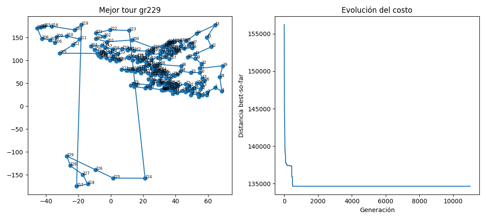

# Reporte de TSP con Algoritmo Genético

## Contexto

Se trabajó con instancias de problemas TSP tomadas de:
[http://comopt.ifi.uni-heidelberg.de/software/TSPLIB95/tsp/](http://comopt.ifi.uni-heidelberg.de/software/TSPLIB95/tsp/)

Se resolvieron los archivos:

* **eil101.tsp**: se tenía un valor óptimo de referencia oficial.
* **gr229.tsp**: no se encontró un valor óptimo oficial, pero se localizaron referencias externas confiables:

  * [https://www.cse.unr.edu/\~sushil/class/gas/TSP/STSP.html](https://www.cse.unr.edu/~sushil/class/gas/TSP/STSP.html)
  * [https://softlib.rice.edu/pub/tsplib/STSP.htm](https://softlib.rice.edu/pub/tsplib/STSP.htm)

La validez de estas referencias se respaldó porque también se incluía el archivo **berlin52**, cuyo óptimo oficial coincidió con lo reportado en las referencias y con lo obtenido en pruebas previas con el algoritmo genético.

## Caso personalizado: TSP Art

Para el archivo personalizado, se utilizó la estrategia conocida como **TSP Art**, basada en puntillismo. En este método, se procesa una imagen para generar puntos que actúan como ciudades del TSP. La técnica se documenta en:
[https://www2.oberlin.edu/math/faculty/bosch/tspart-page.html](https://www2.oberlin.edu/math/faculty/bosch/tspart-page.html)

Se empleó como referencia el repositorio:
[https://github.com/apnorton/tsp-art](https://github.com/apnorton/tsp-art)

Este repositorio permitía convertir una imagen en un conjunto de puntos mediante diagramas de Voronoi, pero no retornaba directamente los puntos en formato TSP. Por ello, se realizaron modificaciones al archivo **TSPArt.py**, con los siguientes cambios:

* Retornar el archivo de puntos generados desde la imagen.
* Guardar tanto el TSP original como el TSP "óptimo de referencia" (no matemático, sino generado por Stipple + NN + Cleanup).
* Ajustar la orientación de los puntos, ya que la librería Pillow los guardaba de forma invertida. Se implementó un proceso de "reflejar" los puntos para mantener la coherencia con la imagen.

De estas modificaciones se generaron tres instancias TSP, de las cuales se seleccionó **cherry189.tsp** como caso de estudio principal. El repositorio con los cambios y los archivos generados se encuentra en:
[https://github.com/JosueSay/tsp-art/tree/master/results](https://github.com/JosueSay/tsp-art/tree/master/results)

## Resultados

La comparación entre los valores óptimos de referencia y los obtenidos con el algoritmo genético fue la siguiente:

| Problema  | No. ciudades | Óptimo original / referencia | Óptimo encontrado (AG) |
| --------- | ------------ | ---------------------------- | ---------------------- |
| eil101    | 101          | 629                          | 629                    |
| gr229     | 229          | 134602                       | 134644                 |
| cherry189 | 189          | 3587                         | 3176                   |

### Ejecuciones

#### Caso **eil101**

Comando ejecutado:

```bash
python main.py --file data/eil101.tsp --N 600 --maxIter 200000 --survivors 0.15 --crossover 0.65 --mutation 0.20 --pc 1.0 --pm -1 --elitism 0.02 --k 3 --scx --twoOptProb 0.25 --stall 3000 --timeLimit 1200 --seed 11 --record --framesDir logs/eil101/frames --gifOut logs/eil101/eil101_tsp_optimal.gif --csv logs/eil101/eil101_seed11.csv --eaxFrac 0.15 --edgeLambda 0.15 --edgeTopFrac 0.30 --edgeFreqPeriod 200 --assortative --mem3OptSteps 4 --speciesPeriod 800 --speciesThresh 0.35 --speciesCullFrac 0.20 --catastropheFrac 0.20
```

* Se corrió por 20 minutos.
* El óptimo de 629 se alcanzó al minuto 1.20 y no mejoró, como era esperado, ya que se conocía que ese era el valor óptimo teórico.
* El criterio de paro fue el límite de tiempo (20 min).

Ruta óptima:

```bash
[27, 25, 11, 79, 67, 28, 23, 53, 3, 54, 24, 38, 66, 22, 55, 74, 40, 21, 73, 71, 72, 20, 39, 57, 12, 93, 94, 96, 86, 1, 56, 14, 42, 41, 13, 43, 37, 85, 15, 60, 84, 90, 99, 36, 97, 92, 91, 58, 98, 95, 5, 88, 51, 17, 82, 59, 4, 83, 16, 44, 7, 45, 46, 35, 48, 63, 62, 89, 31, 9, 61, 10, 18, 47, 81, 6, 87, 30, 69, 29, 19, 65, 64, 70, 34, 8, 50, 32, 80, 33, 77, 78, 2, 76, 75, 49, 0, 68, 26, 100, 52]
```

Comparación gráfica:


#### Caso **gr229**

Comando ejecutado:

```bash
python main.py --file data/gr229.tsp --N 700 --maxIter 999999 --survivors 0.15 --crossover 0.55 --mutation 0.30 --pc 0.95 --pm -1 --elitism 0.02 --k 3 --scx --twoOptProb 0.15 --stall 999999 --timeLimit 28800 --seed 13 --record --framesDir logs/gr229/frames --gifOut logs/gr229/gr229_tsp_optimal.gif --csv logs/gr229/gr229_seed13.csv --eaxFrac 0.20 --edgeLambda 0.10 --edgeTopFrac 0.25 --edgeFreqPeriod 250 --mem3OptSteps 4 --speciesPeriod 700 --speciesThresh 0.38 --speciesCullFrac 0.25 --catastropheFrac 0.25
```

* Se corrió por 8 horas.
* Se alcanzó un valor de 134644 al minuto 21.45, sin mejoras posteriores.
* El criterio de paro fue el límite de tiempo (8 h).

Ruta óptima encontrada (solo costo disponible como referencia):



#### Caso **cherry189**

Comando ejecutado:

```bash
python main.py --file data/cherry189.tsp --N 700 --maxIter 999999 --survivors 0.15 --crossover 0.55 --mutation 0.30 --pc 0.95 --pm -1 --elitism 0.02 --k 3 --scx --twoOptProb 0.15 --stall 999999 --timeLimit 28800 --seed 13 --record --framesDir logs/chery189/frames --gifOut logs/chery189/chery189_tsp_optimal.gif --csv logs/chery189/chery189_seed13.csv --eaxFrac 0.20 --edgeLambda 0.10 --edgeTopFrac 0.25 --edgeFreqPeriod 250 --mem3OptSteps 4 --speciesPeriod 700 --speciesThresh 0.38 --speciesCullFrac 0.25 --catastropheFrac 0.25
```

* Se corrió por 8 horas.
* Se alcanzó un valor de 3176 al minuto 5.69, sin mejoras posteriores.
* El criterio de paro fue el límite de tiempo (8 h).

Comparación gráfica:


## Notas adicionales

* Los resultados completos (GIFs, logs y CSV) están disponibles en:

  * [Gifs](https://github.com/JosueSay/labs-ms/tree/main/Proyectos/p1/images/gifs)
  * [Resultados (logs + csv)](https://github.com/JosueSay/labs-ms/tree/main/Proyectos/p1/results/ga)

* Para seleccionar las semillas, se realizaron pruebas rápidas (2 minutos de ejecución) con semillas entre 1 y 30. Se escogieron aquellas que mostraron mejor desempeño en ese tiempo. Las semillas seleccionadas fueron la **11** y la **13**, que posteriormente se usaron en las corridas largas.
