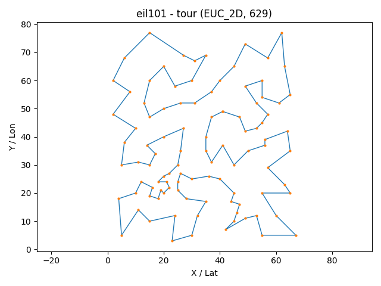

como contexto se tenia que resolver los arhicovs de <http://comopt.ifi.uni-heidelberg.de/software/TSPLIB95/tsp/>

para el archivo eil101.tsp se tenia una referencia del valor optima para tspo en comparación con el archivo gr229.tsp no se tenia una referencia oficial pero al buscar se encontró un valor de referencia esto debido porque tambien se enlista un archivo berlin52 por lo que se confia en esta referencia ya que en la pagina oficial el optimo para berlin52 se menciona y es igual que se comprobó con nuestro algoritmo genetico

referencia gr229

<https://www.cse.unr.edu/~sushil/class/gas/TSP/STSP.html>
<https://softlib.rice.edu/pub/tsplib/STSP.htm>

ahora para el caso del archivo tsp personalizado el escenario propuesto se derivo buscando la estrategia conocida como TSP Art donde utilizando puntillismo se verifica lee una imagen para generar puntos y estos actuarian como ciudades para el tsp el cual se menciona enjemplos en el siguiente enlace

<https://www2.oberlin.edu/math/faculty/bosch/tspart-page.html>

a lo cual se procedio a utilizar un repositorio de referencia que ya incluía la estrategia para convertir una imagen extraer puntos por voronoi y de este generar un tsp para dibujar imagenes,

<https://github.com/apnorton/tsp-art>

sin embargo este repositorio no ofrece la opción para retornar el conjunto de puntos tsp como se ha trabajado por lo que se hizo un cambio al archivo TSPArt.py para retornar tanto el archivo de puntos generado leyendo la imagen (siguiendo la misma logica del repositorio original) y retornando tambien el conjunto de puntos optimo como referencia no es un optimo real es de referencia ya que no es matematico sino que es un optimo por Stipple + NN + cleanup hecho el cual se obtuvo tomando de referencia del creador original del repositorio el cual estos cambios se implementaron en el repositorio original forkeado modificando adicional lo que se hizo fue modificar la forma de guardar puntos como la de guardar correctamente los tsp optimos y el original en terminos de indice asi como la opcion de "voltear" los puntos de tal forma que al usar una libreria origianl del prepositorio pillow este guarda los puntos en un orden inverso por lo que paso por un proceso de "reflejar" los puntos para obtener una tsp orientado a la iamgen de forma correcta entre ellos se generaron 3 tsp el cual se escogio para el problema personalizado el archivo "cherry189.tsp" con el fin de poder tener los 3 archivos tsp para este proyecto, se adjunta el repositorio donde se hicieron las modificaciones mencionadas asi como los archivos generados

<https://github.com/JosueSay/tsp-art/tree/master/results>

los resultados obtenidos comparando valor optimo "original/referencia" y el valor "optimo" encontrado por el algoritmo genético realizado es el siguiente se menciona nuevamente que el original es referencia para el caso de cherry189 porque al ser un escenario personalizado no se encuentra un valor optimo que ya ha sido resuelto, se compara con el optimo que se obtuvo al generar el archivo en el repositorio mencionado anterioremente:

problema | No. ciudades |  optimo original / referencia | optimo encontrado del algoritmo genetico |
eil101   | 101 | 629 | 629 |
gr229   | 229 | 134602 | 13464 |
cherry189   | 189 | 3587 |

los comandos utilizados fueron:

```bash
python main.py --file data/eil101.tsp --N 600 --maxIter 200000 --survivors 0.15 --crossover 0.65 --mutation 0.20 --pc 1.0 --pm -1 --elitism 0.02 --k 3 --scx --twoOptProb 0.25 --stall 3000 --timeLimit 1200 --seed 11 --record --framesDir logs/eil101/frames --gifOut logs/eil101/eil101_tsp_optimal.gif --csv logs/eil101/eil101_seed11.csv --eaxFrac 0.15 --edgeLambda 0.15 --edgeTopFrac 0.30 --edgeFreqPeriod 200 --assortative --mem3OptSteps 4 --speciesPeriod 800 --speciesThresh 0.35 --speciesCullFrac 0.20 --catastropheFrac 0.20
```

Para este problema se corrió por 20 minutos llegando al optimo en el minuto 1.20 sin mejorar (lo esperado) ya que teoricamente se sabia que 629 era el costo optimo por lo que no iba a mejorar. el motivo de paro para este problema fue al completar los 20 minutos la ruta optima para esto es:

```bash
[27, 25, 11, 79, 67, 28, 23, 53, 3, 54, 24, 38, 66, 22, 55, 74, 40, 21, 73, 71, 72, 20, 39, 57, 12, 93, 94, 96, 86, 1, 56, 14, 42, 41, 13, 43, 37, 85, 15, 60, 84, 90, 99, 36, 97, 92, 91, 58, 98, 95, 5, 88, 51, 17, 82, 59, 4, 83, 16, 44, 7, 45, 46, 35, 48, 63, 62, 89, 31, 9, 61, 10, 18, 47, 81, 6, 87, 30, 69, 29, 19, 65, 64, 70, 34, 8, 50, 32, 80, 33, 77, 78, 2, 76, 75, 49, 0, 68, 26, 100, 52]
```

y la comparación de la grafica encontrada es:




```bash
python main.py --file data/gr229.tsp --N 700 --maxIter 999999 --survivors 0.15 --crossover 0.55 --mutation 0.30 --pc 0.95 --pm -1 --elitism 0.02 --k 3 --scx --twoOptProb 0.15 --stall 999999 --timeLimit 28800 --seed 13 --record --framesDir logs/gr229/frames --gifOut logs/gr229/gr229_tsp_optimal.gif --csv logs/gr229/gr229_seed13.csv --eaxFrac 0.20 --edgeLambda 0.10 --edgeTopFrac 0.25 --edgeFreqPeriod 250 --mem3OptSteps 4 --speciesPeriod 700 --speciesThresh 0.38 --speciesCullFrac 0.25 --catastropheFrac 0.25
```

Para este problema se corrió por 8 horas llegando a un optimo de 134644 el cual no tuvo avance desde el minuto 21.45 y teniendo un criterio de paro por cumplir las 8 horas, la ruta optima encontrada es:

```bash
[177, 175, 174, 173, 171, 162, 172, 164, 163, 161, 160, 159, 158, 155, 156, 157, 203, 149, 154, 150, 153, 152, 151, 140, 139, 138, 141, 142, 143, 144, 145, 146, 147, 148, 204, 211, 210, 209, 208, 205, 206, 207, 212, 213, 214, 215, 219, 218, 216, 217, 226, 227, 228, 225, 224, 223, 222, 221, 220, 201, 202, 200, 199, 198, 197, 196, 186, 195, 194, 193, 191, 192, 190, 189, 188, 187, 49, 183, 45, 47, 46, 48, 43, 42, 44, 41, 40, 39, 38, 31, 30, 28, 27, 0, 1, 2, 3, 4, 5, 6, 7, 8, 9, 10, 18, 50, 51, 52, 54, 53, 57, 58, 59, 60, 61, 63, 64, 65, 62, 66, 67, 68, 70, 69, 71, 72, 77, 76, 75, 74, 73, 90, 89, 78, 79, 87, 88, 85, 84, 24, 83, 86, 80, 81, 82, 56, 55, 23, 22, 21, 20, 19, 17, 16, 15, 11, 12, 13, 14, 25, 26, 29, 32, 33, 37, 165, 124, 123, 109, 108, 107, 103, 104, 106, 105, 98, 97, 96, 95, 94, 36, 34, 35, 91, 92, 93, 99, 100, 101, 102, 111, 114, 117, 118, 120, 121, 122, 119, 115, 112, 116, 113, 110, 125, 126, 127, 128, 129, 130, 131, 137, 136, 135, 134, 133, 132, 170, 169, 168, 166, 167, 176, 178, 180, 179, 181, 182, 184, 185]
```

dado que no se proporciona un archivo para observar la ruta optima sino que solo se supo el costo por la referencia inicial solo se adjunta el valor óptimo dado por el algoritmo genético:


```bash
python main.py --file data/cherry189.tsp --N 700 --maxIter 999999 --survivors 0.15 --crossover 0.55 --mutation 0.30 --pc 0.95 --pm -1 --elitism 0.02 --k 3 --scx --twoOptProb 0.15 --stall 999999 --timeLimit 28800 --seed 13 --record --framesDir logs/chery189/frames --gifOut logs/chery189/chery189_tsp_optimal.gif --csv logs/chery189/chery189_seed13.csv --eaxFrac 0.20 --edgeLambda 0.10 --edgeTopFrac 0.25 --edgeFreqPeriod 250 --mem3OptSteps 4 --speciesPeriod 700 --speciesThresh 0.38 --speciesCullFrac 0.25 --catastropheFrac 0.25
```

Para este problema se corrió por 8 horas llegando a un optimo de 3176 el cual no tuvo avance desde el minuto 5.69 y teniendo un criterio de paro por cumplir las 8 horas, la ruta optima encontrada es:

```bash
[143, 144, 134, 145, 152, 153, 159, 160, 161, 162, 163, 164, 165, 166, 167, 168, 169, 154, 155, 140, 128, 118, 115, 109, 133, 135, 176, 141, 146, 156, 175, 177, 182, 185, 186, 187, 188, 183, 184, 180, 181, 179, 178, 170, 147, 136, 122, 110, 103, 98, 93, 97, 92, 91, 89, 88, 87, 86, 85, 81, 90, 96, 69, 70, 71, 51, 48, 44, 37, 15, 12, 9, 5, 3, 2, 1, 0, 4, 7, 6, 8, 10, 11, 13, 14, 16, 25, 27, 29, 30, 36, 42, 45, 53, 54, 61, 60, 55, 40, 43, 46, 47, 50, 68, 67, 65, 63, 64, 75, 80, 100, 102, 108, 107, 114, 117, 127, 126, 132, 131, 139, 130, 125, 121, 116, 113, 112, 84, 74, 62, 35, 24, 21, 20, 18, 17, 19, 23, 22, 26, 28, 32, 31, 33, 38, 56, 66, 73, 79, 82, 104, 111, 119, 123, 105, 101, 99, 94, 76, 72, 77, 58, 57, 52, 49, 34, 39, 41, 59, 78, 83, 95, 106, 120, 124, 138, 137, 129, 148, 157, 173, 174, 171, 172, 158, 149, 150, 142, 151]
```

y la comparación de la grafica encontrada es la siguiente, tomemos en cuenta que es la comparacion optima de referencia dado una version optima de NN + cleaup no es la optima matematica y la encontrada por el algoritmo genetico si lo es:


> Nota: si se desea ver el recorrido hecho por el algoritmo genetico y un detalle mas minucioso de lo que se obtuvo al correr los comandos se pueden visitar las rutas:
>
> - [Gifs](https://github.com/JosueSay/labs-ms/tree/main/Proyectos/p1/images/gifs)
> - [Resultados (logs + csv)](https://github.com/JosueSay/labs-ms/tree/main/Proyectos/p1/results/ga)

> Nota para escoger la semilla se recorrio con parametros prometedores diferentes semillas 1-30 para ver cual semilla podia tener un resultado prometedor y escogerla, no se corrio por tanto tiempo este se obtuvo corriendo el comando  para 2 minutos y ver cual consumia menos costo en ese tiempo, resultando como eficiente la semilla 11 y 13 y correr los comandos para los problemas tsp por mas tiempo.
