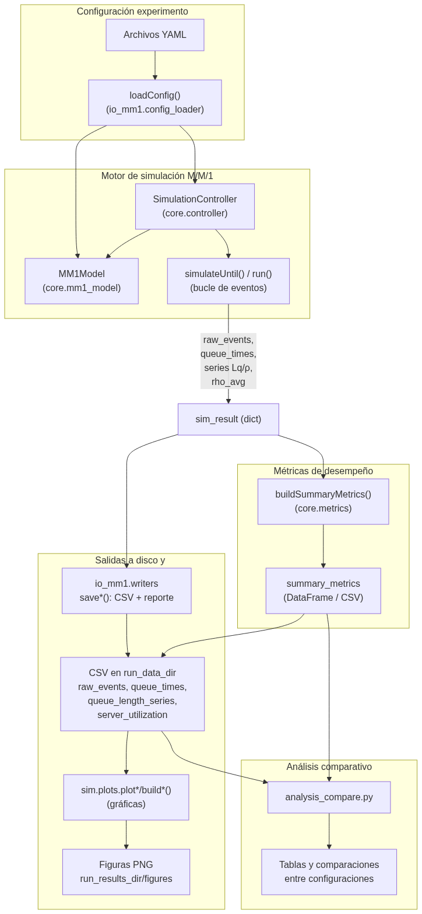
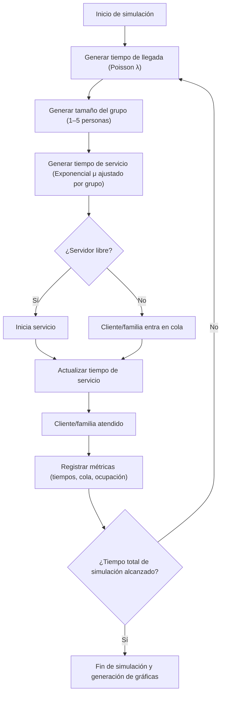

# **Propuesta de Proyecto – Simulación de un Sistema de Colas en un Restaurante**

## **1. Descripción general**

El proyecto propone **simular la dinámica de atención de clientes en un restaurante** aplicando la **teoría de colas (modelo M/M/1)**, con el fin de analizar tiempos de espera, longitud promedio de la fila y grado de utilización del servidor (mesero o caja).

Se plantea un modelo base académico sencillo, pero adaptable a condiciones reales del restaurante, considerando que un “cliente” puede representar a una **familia o grupo** que ocupa más tiempo de servicio.

## **2. Objetivo**

Simular y analizar el comportamiento de un sistema de atención en un restaurante con llegadas y servicios aleatorios, para observar métricas clave como:

- Tiempo promedio de espera de los clientes.
- Longitud promedio de la cola.
- Utilización del servidor.
- Efecto de variaciones en la tasa de llegada ($\lambda$) y de servicio ($\mu$).

## **3. Marco teórico**

### **3.1. Teoría de colas (M/M/1)**

El sistema M/M/1 describe un proceso donde:

- Las **llegadas siguen un proceso de Poisson** con tasa promedio $\lambda$.
- Los **tiempos de servicio siguen una distribución exponencial** con tasa $\mu$.
- Hay un **solo servidor** y una cola de espera infinita.

**Fórmulas principales:**

$$
\rho = \frac{\lambda}{\mu}, \quad
L = \frac{\rho}{1-\rho}, \quad
L_q = \frac{\rho^2}{1-\rho}, \quad
W = \frac{1}{\mu - \lambda}, \quad
W_q = \frac{\lambda}{\mu(\mu - \lambda)}
$$

Donde:

- $\rho$ = utilización del servidor
- $L$ = número promedio de clientes en el sistema
- $L_q$ = número promedio de clientes en cola
- $W$ = tiempo promedio en el sistema
- $W_q$ = tiempo promedio de espera en cola

## **4. Adaptación al contexto del restaurante**

- **Llegada de familias o grupos:** cada llegada puede representar de 1 a 5 personas (tamaño aleatorio).
- **Tiempo de servicio proporcional:** el tiempo de atención aumenta según el tamaño del grupo.
- **Llegadas y servicios simulados:** se usarán valores aleatorios generados mediante distribuciones Poisson y exponencial.

## **5. Metodología de simulación**

1. **Definir parámetros iniciales:** $\lambda$, $\mu$, tiempo total de simulación.
2. **Generar llegadas aleatorias:** según proceso de Poisson.
3. **Generar tiempos de servicio:** según distribución exponencial, ajustada al tamaño del grupo.
4. **Actualizar la cola:** llegada, servicio y salida de clientes.
5. **Registrar métricas:** tiempos de espera, número en cola, ocupación del servidor.
6. **Comparar resultados:** entre valores teóricos y simulados.
7. **Visualizar:** gráficas y tablas de desempeño del sistema.

<!--  -->

## **6. Resultados esperados**

- Promedios y varianzas de **tiempos de espera**, **longitud de cola** y **ocupación**.
- **Gráficas** de número de clientes vs tiempo.
- **Comparación teórica vs simulada** de los indicadores de desempeño.
- **Escenarios simulados:**

  - Flujo bajo (pocas llegadas).
  - Flujo medio.
  - Flujo alto (horas pico).

## **7. Posibles extensiones**

- Múltiples servidores (modelo M/M/c) para familias y no clientes individuales.
- Variación de tasas $\lambda$ según la hora (horarios pico).
- Clientes que se retiran si la cola es larga.

## **8. Referencias principales del modelo**

| Documento                  | Aporta a                                            | Utilidad en tu proyecto                       |
| -------------------------- | --------------------------------------------------- | --------------------------------------------- |
| **Kim et al. (2020)**      | Sustento teórico y gestión de colas en restaurantes | Fundamentación conceptual                     |
| **Yadav & Sohani (2019)**  | Implementación práctica M/M/1–M/M/3 en restaurante  | Base metodológica y fórmulas                  |
| **Naotunna et al. (2019)** | Simulación real en cafetería universitaria          | Guía para simulación y estructura del informe |

### **Referencias completas**

1. [Modelling and Simulation of a State University Cafeteria: A Case Study – Academia.edu](https://www.academia.edu/41926141/Modelling_and_Simulation_of_a_State_University_Cafeteria_A_Case_Study)
2. [Sustainability Journal – Small Queuing Restaurant Sustainable Revenue Management (MDPI)](https://www.mdpi.com/2071-1050/12/8/3477)
3. [Application of Queuing Theory on a Food Chain – IJSTR](https://www.ijstr.org/final-print/aug2019/Application-Of-Queuing-Theory-On-A-Food-Chain.pdf)
