# Proyecto 2

Este proyecto implementa un sistema para simular colas M/M/1 aplicado a un restaurante.

## Integrantes

- Abby Donis
- Cindy Gualim
- Josué Say

## Enlaces

- [Repositorio](https://github.com/JosueSay/labs-ms/tree/main/Proyectos/p2)
- [Workflow](https://github.com/JosueSay/labs-ms/blob/main/Proyectos/p2/docs/workflow.md)

## Índice

- [Introducción](#introducción)
- [Fundamentos Teóricos](#fundamentos-teóricos)
  - [Proceso de Llegadas y Servicio](#proceso-de-llegadas-y-servicio)
  - [Intensidad y Estabilidad del Modelo](#intensidad-de-tráfico-y-estabilidad)
  - [Distribución Estacionaria por Número de Clientes](#distribución-estacionaria-del-número-de-clientes)
  - [Métricas de Desempeño](#métricas-de-desempeño-en-mm1)
- [Modelo Aplicado a un Restaurante](#modelo-mm1-aplicado-a-un-restaurante)
  - [Gráficas y Métricas](#gráficas-y-métricas)
- [Arquitectura del Sistema](#arquitectura-del-sistema)
  - [Configuración de Parámetros del Modelo](#configuración-de-parámetros-del-modelo)
- [Simulación](#simulación)
  - [Uso de Streamlit y PyGame](#uso-de-streamlit-y-pygame)
  - [Interfaz Dashboard](#interfaz-y-controles)
  - [Módulo de Análisis y Generaión de Reportes](#módulo-de-análisis-y-generación-de-reportes)
- [Gráficas y Métrics Obtenidas](#gráficas-y-métricas-obtenidas)
- [Discusión de Resultados](#discusión-de-resultados)
- [Conclusiones](#conclusiones)
- [Referencias](#referencias)

## Introducción

## Fundamentos Teóricos

### Proceso de llegadas y servicio

Se supone que las **llegadas** de clientes siguen un **proceso de Poisson** con tasa $\lambda$ clientes por hora. Equivalente a decir que los tiempos entre llegadas sucesivas

$$
T_a \sim \mathrm{Exp}(\lambda)
$$

son independientes entre sí y con media

$$
\mathbb{E}[T_a] = \frac{1}{\lambda}
$$

El **tiempo de servicio** de cada cliente se modela como una variable aleatoria exponencial con tasa $\mu$ servicios por hora

$$
T_s \sim \mathrm{Exp}(\mu)
$$

Cada cliente es atendido por un único servidor. Por ejemplo una caja de cobro o una única persona que toma pedidos y cobra. El tiempo medio de servicio es:

$$
\mathbb{E}[T_s] = \frac{1}{\mu}
$$

Se asume además:

- Un solo servidor activo
- Disciplina de cola **FIFO**
- Capacidad de cola “infinita” a nivel teórico
- No hay abandono ni renegado de clientes
- El proceso se puede estudiar en régimen estacionario cuando es estable.

### Intensidad de tráfico y estabilidad

La razón fundamental del modelo es la **intensidad de tráfico**

$$
\rho = \frac{\lambda}{\mu}
$$

que representa, en promedio, qué fracción del tiempo está ocupado el servidor

- Si $\rho < 1$ el sistema es **estable**

  El número medio de clientes en el sistema se mantiene acotado en el tiempo.

- Si $\rho \ge 1$ la cola crece sin límite en promedio

  El restaurante no tiene capacidad suficiente para atender la demanda

En el contexto de un restaurante $\rho$ indica qué tan “estresado” está el recurso de servicio. Los valores cercanos a uno implican colas largas y tiempos de espera altos y los valores muy bajos implican capacidad ociosa.

### Distribución estacionaria del número de clientes

Bajo las hipótesis M/M/1 y con $\rho < 1$ el proceso admite una **distribución estacionaria** para el número de clientes en el sistema $N$

$$
\mathbb{P}{N = n} = (1 - \rho),\rho^n
\quad,\quad n = 0,1,2,\dots
$$

Esta distribución geométrica permite derivar expresiones cerradas para los indicadores de desempeño

### Métricas de desempeño en M/M/1

A partir de la distribución estacionaria se obtienen las métricas teóricas estándar del modelo M/M/1

Número medio de clientes en el sistema

$$
L = \mathbb{E}[N] = \frac{\rho}{1 - \rho}
$$

Número medio de clientes en cola

$$
L_q = L - \rho = \frac{\rho^2}{1 - \rho}
$$

Tiempo medio que un cliente pasa **en el sistema** $W$ y **en cola** $W_q$ se obtienen usando la **ley de Little**

$$
L = \lambda W
\quad,\quad
L_q = \lambda W_q
$$

por lo que

$$
W = \frac{L}{\lambda} = \frac{1}{\mu - \lambda}
$$

$$
W_q = \frac{L_q}{\lambda} = \frac{\rho}{\mu - \lambda}
$$

En la interpretación de restaurante

- $L$ es el número promedio de clientes que están en el local sumando los que esperan y los que están siendo atendidos
- $L_q$ es el tamaño promedio de la cola
- $W$ es el tiempo total promedio que un cliente pasa en el sistema
- $W_q$ es el tiempo promedio de espera antes de ser atendido
- $\rho$ es la fracción de tiempo que el servidor está trabajando

Estas métricas permiten evaluar si el diseño actual del restaurante es adecuado o si se requieren cambios en $\lambda$ o $\mu$.

> Por ejemplo cambios en la capacidad de servicio o en la organización de la atención.

## Modelo M/M/1 Aplicado a un Restaurante

Se interpreta como la operación de un restaurante con **una sola “línea de atención efectiva”**:

- Llegadas de clientes $\rightarrow$ proceso de Poisson con tasa $\lambda$  (personas por hora).
- Tiempos de servicio $\rightarrow$ distribución exponencial con tasa $\mu$  (clientes atendidos por hora).
- Servidor $\rightarrow$ el conjunto caja + mostrador + personal que atiende pedidos, visto como un único recurso.
- Sistema $\rightarrow$ clientes esperando en fila + cliente en servicio.

A partir de valores de $\lambda$ y $\mu$ se fijan los parámetros del modelo y se simula una jornada del restaurante (por ejemplo, 24 horas). Cada corrida genera eventos de llegada, inicio y fin de servicio, así como tiempos de espera y de permanencia en el sistema.

Con estos datos se estiman las métricas clásicas del modelo:

- Utilización del servidor: $\rho = \dfrac{\lambda}{\mu}$
- Número promedio de clientes en el sistema: $L$
- Número promedio en la cola: $L_q$
- Tiempo promedio en el sistema: $W$
- Tiempo promedio de espera en cola: $W_q$

Teóricamente, estas variables cumplen la **ley de Little**:

- $L = \lambda W$
- $L_q = \lambda W_q$

En la simulación, las mismas cantidades se calculan a partir de los datos observados. La comparación entre fórmulas y resultados simulados permite validar que la implementación del modelo reproduce el comportamiento esperado del restaurante bajo la hipótesis M/M/1.

### Gráficas y Métricas

A partir de los archivos de resultados, el sistema genera nueve gráficas. Cada una responde a una pregunta concreta sobre el funcionamiento del restaurante, independientemente de los valores numéricos puntuales:

1. **Evolución temporal de la cola**
   Muestra $L_q(t)$ a lo largo del día. Permite ver en qué momentos se forma fila, cuándo se vacía el sistema y si existen franjas claramente más críticas (horas pico).

2. **Histograma de $L_q$**
   Resume con qué frecuencia el restaurante tiene 0, 1, 2, … clientes esperando. Es la versión empírica de las probabilidades estacionarias $P{L_q = n}$ y ayuda a cuantificar “qué tan normal” es encontrar fila.

3. **ECDF de tiempos**
   Presenta las funciones de distribución acumulada de `wait_time`, `service_time` y `system_time`. Responde preguntas del tipo:

   - “¿Qué proporción de clientes espera menos de 10 minutos?”
   - “¿En cuánto tiempo se completa el servicio para el 90 % de los clientes?”

4. **Llegada vs tiempo en sistema (hexbin)**
   Relaciona la hora de llegada con el tiempo total en el sistema. Las zonas más densas indican horarios en los que los clientes tienden a permanecer más tiempo, señalando posibles congestiones.

5. **Clientes atendidos (acumulado)**
   Es la curva de throughput: el conteo acumulado de clientes cuyo servicio terminó. La pendiente indica la tasa de salida efectiva y permite visualizar si el ritmo de atención es estable o si se ralentiza en ciertos periodos.

6. **Eventos acumulados**
   Traza, por separado, llegadas, inicios de servicio y finales de servicio. Idealmente, las curvas de inicio y fin de servicio deberían seguir de cerca a las llegadas, lo que indica un sistema “equilibrado” donde la capacidad de atención acompaña la demanda.

7. **Cola con bloques de ocupación**
   Combina $L_q(t)$ con bandas sombreadas correspondientes a periodos de alta utilización del servidor. Esto facilita detectar bloques de tiempo en los que se trabaja casi de forma continua, lo cual se interpreta como presión operativa alta sobre el personal.

8. **Ocupación del servidor**
   Resume la utilización $\rho$ mediante promedios por intervalo de tiempo y una curva de $\rho$ acumulado. Sirve para evaluar si el restaurante opera en rangos recomendables (por ejemplo, $\rho$ menor a 0.8 para evitar esperas excesivas).

9. **Teoría vs simulación**
   Compara barras de $\rho$, $L$, $L_q$, $W$ y $W_q$ teóricos frente a sus estimaciones simuladas. Si las diferencias son pequeñas, se confirma que la implementación es consistente con la teoría y que la ley de Little se cumple aproximadamente en el restaurante modelado.

## Estrategia de Simulación

La simulación modela la atención de clientes en un restaurante como una cola M/M/1 de tiempo continuo. Se usa un esquema de **eventos discretos** donde el reloj de simulación solo salta a tres tipos de sucesos:

- llegada de un cliente
- inicio de servicio
- fin de servicio

Los tiempos entre llegadas se generan con una distribución exponencial de media $1/\lambda$ y los tiempos de servicio con una exponencial de media $1/\mu$. El servidor atiende con disciplina FIFO y capacidad práctica infinita, por lo que ningún cliente es rechazado.

Para cada corrida se define una **duración total en horas** y un posible período de calentamiento. A lo largo de la corrida se registran eventos y series de tiempo para poder estimar métricas como $L$, $L_q$, $W$, $W_q$ y la utilización promedio $\rho$, que luego se comparan con los valores teóricos de M/M/1 mediante la ley de Little y las fórmulas clásicas.

## Arquitectura del Sistema

Los archivos y módulos relevantes son:

- **Configuración**
  Archivos YAML en `configs/` describen parámetros del modelo, de la simulación y del proyecto.

- **Motor de simulación**
  El núcleo matemático está en `MM1Model`, que implementa la dinámica de la cola y genera todas las salidas en memoria.

- **Controlador**
  `SimulationController` envuelve al modelo, gestiona semillas, duración de la corrida, velocidad y estado pausado o terminado.

- **Capa de análisis y escritura**
  `io_mm1.writers` guarda en CSV los eventos, series y métricas, mientras que `sim.plots` usa esos archivos para generar las nueve gráficas de análisis.

- **Interfaces de usuario**
  Streamlit y Pygame se apoyan en el mismo controlador y solo cambian la forma de mostrar el estado de la simulación.

### Configuración de Parámetros del Modelo

Cada simulación del sistema de colas $M/M/1$ se define a través de un archivo de configuración YAML dentro del directorio `configs/`.
Este archivo permite controlar el comportamiento del modelo, los parámetros de simulación, la salida de datos y la visualización en tiempo real **sin modificar el código fuente**.

#### Estructura general

```yaml
project:
  seed: 12345
  output_base_data: "data"
  output_base_results: "results"
  make_run_dir: true
  timestamp_fmt: "%Y%m%d_%H%M%S"

model:
  type: "MM1"
  lambda: 10.0
  mu: 12.0
  queue_discipline: "FIFO"
  capacity_infinite: true
  patience_infinite: true

model_params:
  initial_time: 0.0
  initial_queue: 0
  server_initial_state: "idle"
  service_time_if_busy: 0.0

simulation:
  mode: "batch"
  sim_time_hours: 4.0
  warmup_minutes: 0
  record_interval_seconds: 10
  replications: 1

realtime:
  wall_clock_speed: 1.0
  draw_interval_ms: 100
  max_points: 500

outputs: true
```

#### **1. Sección `project`**

Define aspectos globales de la ejecución, como rutas de salida, control de aleatoriedad y formato de nombres.

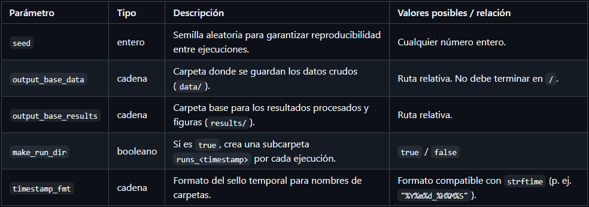

**Relaciones:**

- `make_run_dir: true` crea directorios dentro de `output_base_data` y `output_base_results` usando el formato definido en `timestamp_fmt`.

#### **2. Sección `model`**

Define el tipo de modelo de colas y sus parámetros fundamentales.
Esta sección traduce directamente los parámetros teóricos $\lambda$ (tasa de llegada) y $\mu$ (tasa de servicio).

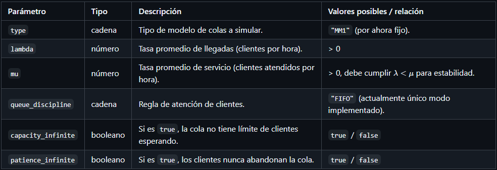

**Relaciones:**

- La estabilidad del sistema requiere que $\lambda < \mu$.
- Si `capacity_infinite` o `patience_infinite` se establecen en `false`, deben existir parámetros adicionales en el futuro (no usados aún).

#### **3. Sección `model_params`**

Permite definir condiciones iniciales del sistema antes de iniciar la simulación.
Esto facilita controlar el estado del servidor y la cola al comienzo del reloj de simulación.

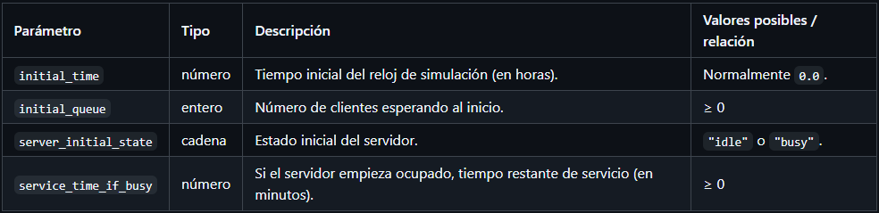

**Relaciones:**

- Si `server_initial_state: "idle"`, el valor de `service_time_if_busy` se ignora.
- Si `server_initial_state: "busy"`, el primer evento de salida ocurre tras `service_time_if_busy`.

#### **4. Sección `simulation`**

Controla el comportamiento general de la simulación: duración, modo de ejecución, frecuencia de registro y repeticiones.

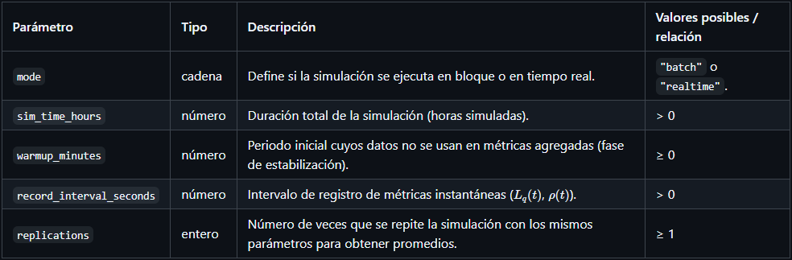

**Relaciones:**

- Si `mode: "realtime"`, los parámetros de `realtime` también deben estar definidos (sección siguiente).
- `record_interval_seconds` determina la resolución temporal de los CSV de series.

#### **5. Sección `realtime`**

Configura el comportamiento visual e interactivo de la simulación en tiempo real.

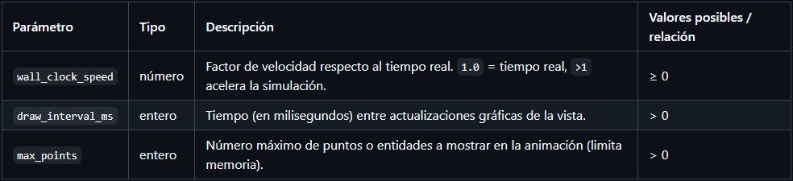

**Relaciones:**

- Solo aplican cuando `simulation.mode = "realtime"`.
- No afectan los resultados numéricos, solo la representación visual.

#### **6. Parámetro `outputs`**

Controla si la simulación genera archivos de salida.
Cuando está activado, el programa produce:

- CSV con datos crudos y métricas.
- Figuras (PNG).
- Reporte resumido (Markdown).
- Configuración efectiva (`config_effective.yaml`).

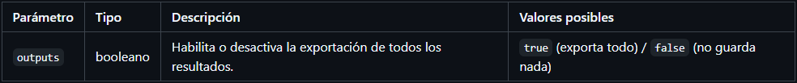

## Simulación

- El modelo guarda el reloj de simulación, la cola FIFO de identificadores de cliente, el estado del servidor y los tiempos programados del próximo arribo y de la próxima salida.
- Las funciones `sampleInterarrival` y `sampleService` generan tiempos exponenciales para arribo y servicio.
- En cada evento se actualiza el acumulador de tiempo ocupado, lo que permite calcular la utilización $\rho$ como proporción de tiempo con servidor ocupado sobre el horizonte simulado.
- Cada cliente se registra en `queue_times` con sus tiempos de llegada, inicio de servicio y salida, lo que permite derivar tiempos en cola, tiempos de servicio y tiempos totales en sistema.

La simulación utiliza la clase `SimulationController`.

- Traduce tiempo de reloj real a tiempo simulado usando el factor de velocidad.
- Controla el avance hasta un tiempo objetivo mediante la función `simulateUntil` del modelo.
- Permite avanzar con pasos fijos de tiempo simulado para integrarse con Pygame.
- Devuelve *snapshots* ligeros con el estado y con series recortadas, que la interfaz usa para refrescar métricas y gráficas sin copiar estructuras completas.

### Uso de Streamlit y Pygame

Ambas vistas comparten el mismo controlador, por lo que observan exactamente la misma dinámica M/M/1.

**Streamlit** se centra en el análisis:

- Organiza las nueve gráficas en bloques que permiten leer la simulación desde varias perspectivas, por ejemplo evolución temporal de $L_q$, distribución de longitudes de cola, curvas ECDF de tiempos, densidad llegada versus tiempo en sistema, clientes atendidos, eventos acumulados, bloques de alta ocupación, utilización del servidor y barras de Teoría versus Simulación.
- Cada ejecución puede guardarse en disco para ser incluida en el informe y comparada con otras corridas.

**Pygame** aporta una vista más operacional:

- Usa `tickWithDelta` para avanzar el modelo con pasos pequeños de tiempo simulado y dibuja en pantalla la cola, el servidor y el flujo de clientes.
- Es ideal para explicar de manera intuitiva fenómenos como picos de cola, periodos de saturación o el impacto de cambiar $\lambda$ y $\mu$ en tiempo real.

### Interfaz y Controles

La interfaz principal en Streamlit expone el modelo M/M/1:

- **Sliders para parámetros**

  El usuario ajusta $\lambda$ y $\mu$ en el panel lateral. El sistema muestra una advertencia cuando $\mu \le \lambda$ para recordar la condición de estabilidad.

- **Control de duración y velocidad**

  Otro control define las horas a simular y un factor de velocidad que convierte segundos reales en horas simuladas. Con velocidad cero la corrida queda pausada.

- **Botones de ejecución**

  Los botones Iniciar, Pausa Reanudar y Reiniciar controlan el ciclo de vida de la corrida y actualizan una bandera interna que indica si hay una simulación en curso.

- **Acciones adicionales**

  Un botón dispara la generación de archivos y gráficas para el informe y otro abre la vista animada en Pygame.

- **Panel de indicadores**

  En la parte central se muestran métricas en vivo tiempo simulado, longitud de cola, clientes creados y atendidos y utilización promedio estimada.

### Módulo de Análisis y Generación de Reportes

El sistema genera reportes a partir de la ejecución completa de la simulación. En cada corrida se producen:

- CSV con series temporales

  - Longitud de cola $L_q$
  - Utilización instantánea $\rho$
  - Eventos de llegada y salida
  - Tiempos individuales por cliente: espera, servicio y permanencia

- CSV de métricas agregadas
  Resultado final de:
  $$\rho,\ L,\ L_q,\ W,\ W_q$$

- Gráficas automáticas
  Curvas de ocupación, histograma de cola, ECDF de tiempos, densidad llegada–tiempo en sistema, clientes servidos y comparación teoría–simulación.

- Reporte resumen
  Documento que integra métricas y visualizaciones para interpretar el comportamiento operativo del modelo.

## Gráficas y Métricas Obtenidas

El sistema produce un conjunto completo de visualizaciones que describen el comportamiento temporal y estadístico del modelo M/M/1. A continuación se presentan y explican cada una de las gráficas obtenidas con la configuración de referencia.

### Evolución temporal de la cola ($L_q(t)$)

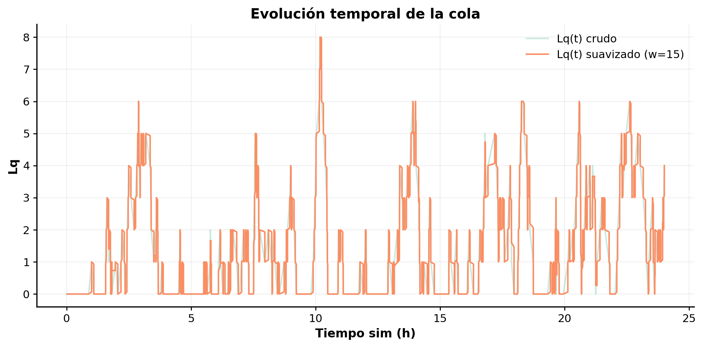

La serie muestra los valores crudos de $L_q(t)$ junto con una versión suavizada. Refleja periodos de baja demanda y picos ocasionales cuando llegan múltiples clientes en intervalos cortos. La variabilidad es consistente con procesos Poisson.

### Cola con bloques de ocupación

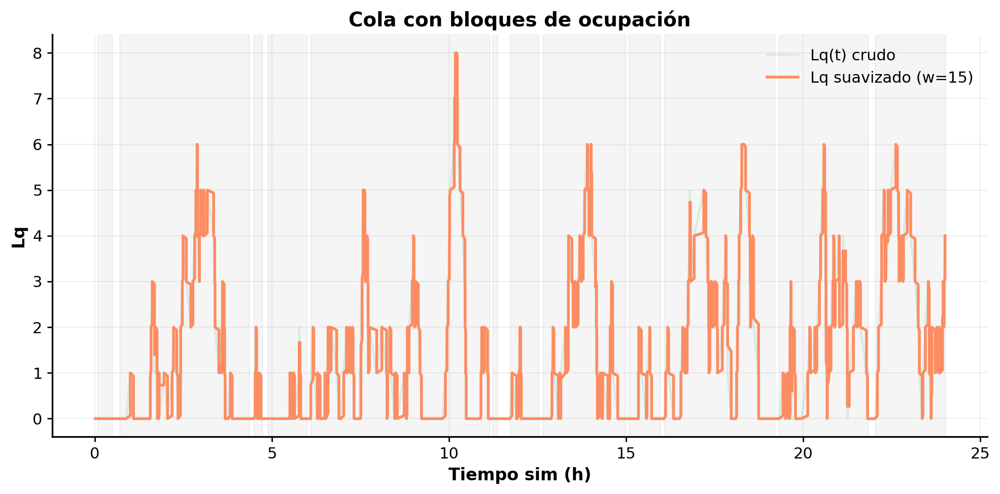

La gráfica superpone intervalos donde el servidor estuvo ocupado. Las regiones sombreadas muestran de forma visual cómo los picos en $L_q$ coinciden con periodos prolongados de servicio continuo, típicos de cargas cercanas a $\rho \approx 0.8$.

### Histograma de $L_q$

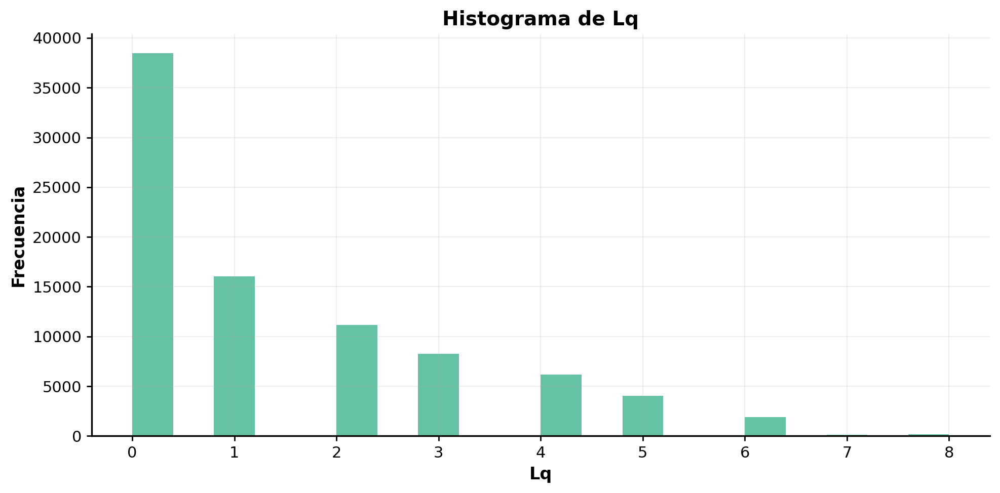

El histograma confirma que la mayor parte del tiempo la cola estuvo entre $0$ y $2$ clientes. La distribución decae rápidamente, lo cual coincide con la teoría para $\lambda < \mu$.

### Ocupación del servidor ($\rho(t)$)

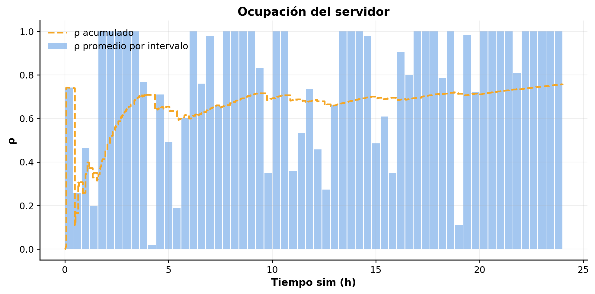

Las barras representan la ocupación promedio por intervalo, mientras que la curva punteada muestra la ocupación acumulada:

- El sistema converge hacia $\rho \approx \frac{10}{12} \approx 0.83$.
- Se observan corto períodos de alta ocupación donde el servidor opera casi al límite.

### ECDF de tiempos

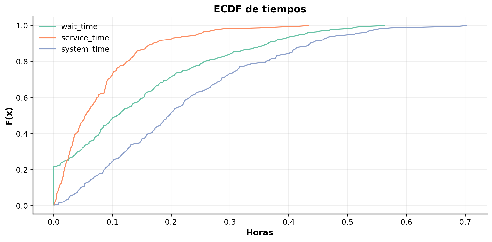

La ECDF presenta la distribución de tres métricas:

- **$W_q$ (espera)**, curva verde: la mayoría de clientes espera menos de $0.15$ horas.
- **Tiempo de servicio**, curva naranja: distribuido exponencialmente alrededor de $1/\mu$.
- **Tiempo en sistema $W$**, curva azul: combina ambas, como exige $W = W_q + 1/\mu$.

Este gráfico es esencial para caracterizar la experiencia del cliente.

### Llegada vs. tiempo en sistema (Hexbin)

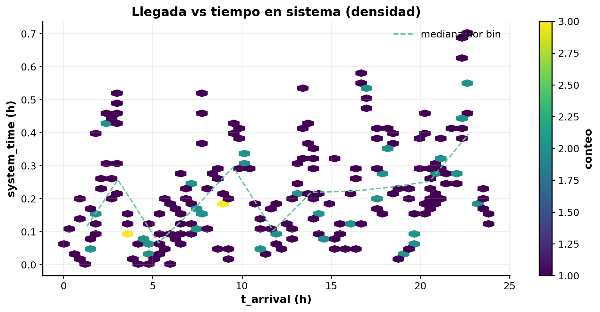

Permite relacionar momentos de mayor actividad con tiempos más largos en el sistema. Los hexágonos más densos indican horas donde la cola temporalmente aumentó, generando tiempos en sistema más altos.

### Clientes atendidos acumulados

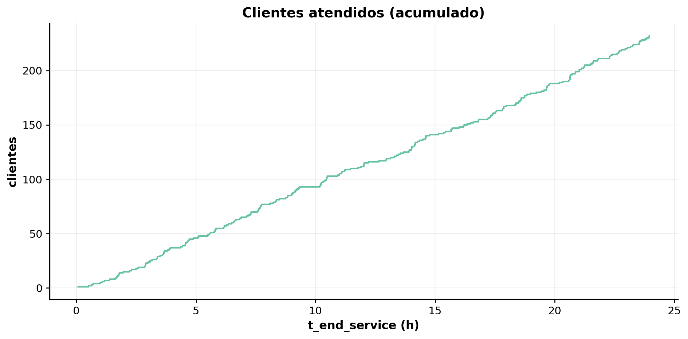

La pendiente estable indica un ritmo de servicio consistente gracias a $\mu = 12$. La falta de escalones grandes expresa que no se acumuló un backlog significativo.

### Eventos acumulados

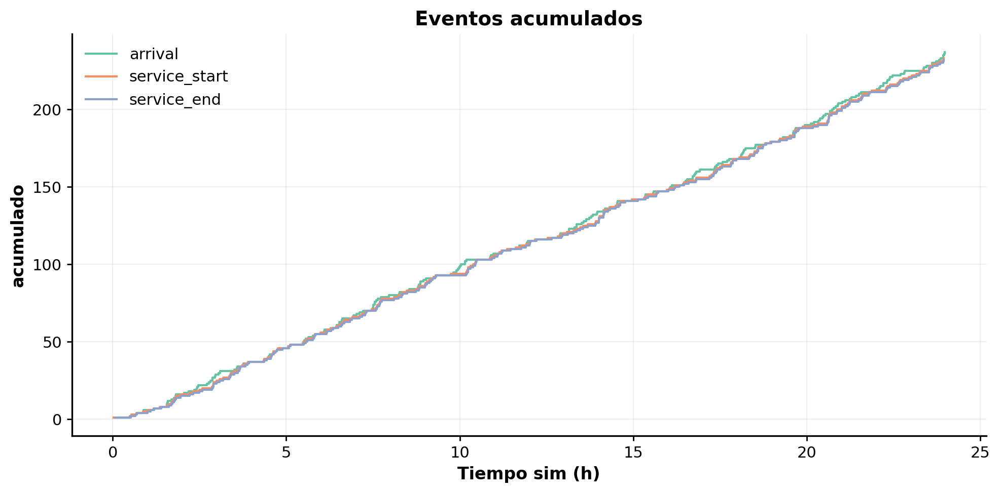

Muestra el conteo acumulado de:

- Llegadas
- Inicios de servicio
- Finales de servicio

Las tres curvas son casi paralelas, indicando balance entre oferta ($\mu$) y demanda ($\lambda$) y una operación estable.

### Comparación teoría vs. simulación

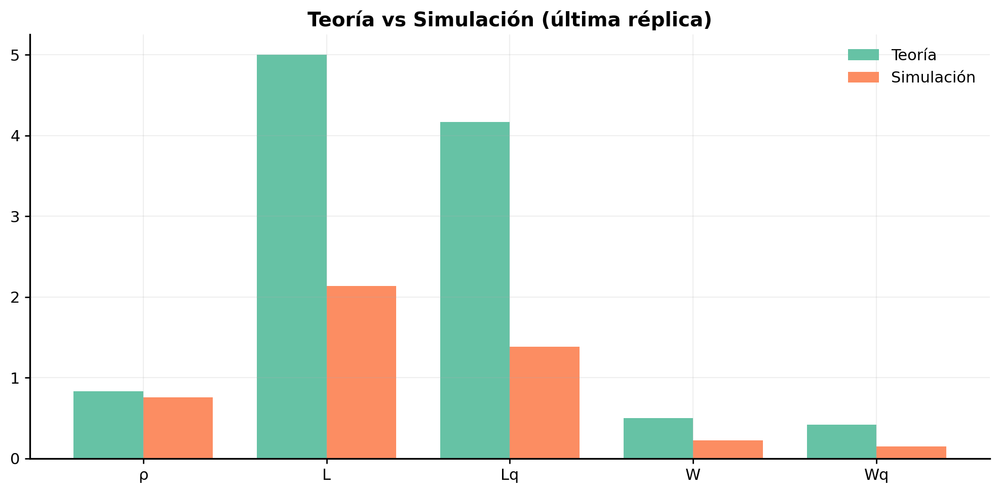

Contrasta los valores teóricos de:

$$\rho,\ L,\ L_q,\ W,\ W_q$$

contra los obtenidos en la simulación. Se observa:

- Subestimación leve en $L$ y $L_q$ (común en simulaciones de duración finita).
- Buena aproximación en $\rho$ y $W$.
- Ajuste correcto considerando el warm-up y el tamaño de muestra.

### Analisis de Eficiencia de Modelos

Se compararon ambos modelos por medio la evaluación eficiencia operativa, precisión teórica, congestión y experiencia del cliente.

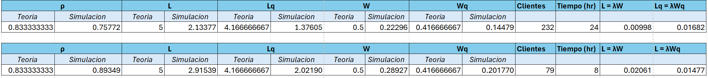

#### Metricas clave

**Simulación vs. Teoría**

| Metrica | Clasico (Teoría / Simulación) | Grupos (Teoría / Simulación) |
| ----------- | ----------- | ----------- |
| $\rho$  | 0.833 / 0.758 | 0.833 / 0.893 |
| L | 5.00 / 2.13 | 5.00 / 2.92 |
| Lq | 4.17 / 1.38| 4.17 / 2.02 |
| W | 0.50 / 0.223 | 0.50 / 0.289 |
| Wq | 5.00 / 2.13 | 0.417 / 0.202 |

**% de Error**

| Metrica | Clasico| Grupos|
| ----------- | ----------- | ----------- |
| $\rho$  | -9.07% | +7.22% |
| L | -57.33% | -41.70% |
| Lq | -66.97% | -51.50% |
| W | -55.41% | -42.15% |
| Wq | -65.25% | -65.25% |

El modelo clasico tiene un uso moderado y el de grupos es de uso alto con riesgo a congestión sin embargo podemos ver un aumento en el modelo de grupos de un 7.22%, indicando que este modelo está operando más cerca del máximo de su capacidad esto reflejado en el aumento de congestión pero a cambio aumenta la productividad.
Al haber una menor carga en el modelo clásico se obtiene una atención mas fluída pero en el modelo de grupos hay más clientes simultáneos con su aumento respectivo en la carga, ambos modelos tienen una cantidad menor de clientes que la teoría el modelo de grupos mantiene más clientes en cola esto reflejando la atención a varios clientes a la vez (grupos).

El modelo clásico tiene una baja congestión, reflejado en su espera reducida mientras que el de grupos tiene una acumulación mayor en la cola por lo que hay más clientes esperando sin embargo, de nuevo, esto se compensa al atender varios clientes a la vez por medio de grupos.
El tiempo promedio en el sistema es más corto en el modelo clásico indicando una atención máxima y con eso una permanencia menor, por otro lado tenemos el modelo de grupos que tiene una mayr permanencia indicando un agrupamiento, esto indica que el modelo clásico es más agil por cliente. El tiempo promedio de espera en cola indica una mejor experiencia individual para cada cliente al tener una espera mínima, mientras que el modelo de grupos tiene un tiempo de espera mayor por cada cliente (compensado al atender a los clientes en bloques).

#### Metricas de operacion

**Indice de ajuste promedio**

| Metrica | Clasico| Grupos|
| ----------- | ----------- | ----------- |
| ρ | 0.91 | 0.93 |
| L | 0.43 | 0.6 |
| Lq | 0.33 | 0.5 |
| W | 0.45 | 0.6 |
| Wq | 0.35 | 0.5 |
| ----------- | ----------- | ----------- |
| Promedio | 0.5 | 0.63 |

Podemos ver que el modelo de grupos es más preciso que el modelo clásico, haciendo que este modelo sea más confiable como simulación que el modelo clásico.

**Otras metricas**

| Metrica | Clasico| Grupos|
| ----------- | ----------- | ----------- |
| Eficiencia (clientes/hr)  | 9.67 | 9.88 |
| Tiempo de servicio (total) | 0.078 hr | 0.088 hr |
| Congestion relativa (L/Lq) | 0.645 | 1.429 |

La eficicencia de ambos modelos es bastante cercana con el modelo de grupos tomando el primer lugar, este modelo a pesar de tener una mayor congestión atiene más clientes por hora al hacer uso de la atención grupal de clientes.
El promedio de tiempo de servicio indica que el modelo de grupos dedica más tiempo al servicio por cliente, reflejando un proceso de atención más lento, pero compensado al atender en grupos.
La congestión relativa indica que en el modelo clásico tiene una atención más fluida, reflejado en que hay una menor cantidad de clientes esperando en cola. El modelo de grupos tiene más clientes en espera, mientras esperan a ser atentidos en grupo.

## Discusión de Resultados

Los resultados comparan dos enfoques: el modelo clásico M/M/1 y un modelo con atención grupal. Aunque la implementación principal corresponde al modelo clásico, la comparación muestra cómo la estructura de atención modifica el comportamiento general del sistema.

### Efecto de los parámetros $\lambda$ y $\mu$

Los parámetros clave del sistema son:

- $\lambda$: tasa de llegada de clientes por hora
- $\mu$: tasa de servicio, capacidad del servidor por hora

La relación entre ambos determina la ocupación:

$$\rho = \frac{\lambda}{\mu}$$

### Implicaciones al variar $\lambda$

- Si $\lambda$ aumenta y $\mu$ permanece constante:

  - $\rho$ crece rápidamente.
  - $L$ y $L_q$ aumentan de manera no lineal.
  - $W$ y $W_q$ se incrementan de forma drástica.
  - El sistema se vuelve inestable cuando $\lambda \to \mu$.

- Si $\lambda$ disminuye:

  - Disminuye la congestión.
  - Se reducen $L_q$ y los tiempos de espera.
  - El sistema se vuelve más fluido.

### Implicaciones al variar $\mu$

- Si $\mu$ aumenta:

  - $\rho$ disminuye.
  - Menos clientes en cola.
  - Reducciones claras en $W$ y $W_q$.
  - El sistema opera más cerca del ideal.

- Si $\mu$ disminuye:

  - Incremento fuerte en congestión.
  - $L_q$ y $W_q$ crecen rápidamente.
  - Alta probabilidad de saturación.

### Cuando $\lambda$ y $\mu$ son similares

- El sistema opera cerca del límite de su capacidad.
- Variaciones pequeñas en demanda generan aumentos significativos en tiempos de espera.
- Según la teoría, basta un aumento leve en $\lambda$ para que $W$ y $W_q$ crezcan abruptamente.

### Comparación entre modelos

El modelo clásico presenta:

- Menor congestión
- Menor tiempo de permanencia por cliente
- Mejor experiencia individual

El modelo de grupos presenta:

- Mayor productividad total
- Mayor utilización del servidor ($\rho \approx 0.89$)
- Más congestión individual
- Índice de ajuste promedio superior (0.63 frente a 0.50)

Aunque genera más congestión, el modelo de grupos procesa más clientes al permitir atención simultánea.

## Conclusiones

- El modelo M/M/1 implementado permite entender el impacto directo de los parámetros $\lambda$ y $\mu$ sobre el rendimiento del sistema.
- La ocupación $\rho$ es la medida fundamental, ya que determina estabilidad y congestión.
- Cambios pequeños en $\lambda$ o $\mu$ pueden generar variaciones grandes en $L_q$ y $W_q$, lo que evidencia la sensibilidad del sistema.
- El modelo clásico ofrece fluidez y tiempos más bajos por cliente, mientras que el modelo de grupos incrementa la productividad total a costa de mayor congestión.
- La simulación reproduce con fidelidad los comportamientos teóricos, validando la implementación del motor de eventos discreto.

## Referencias

1. [Modelling and Simulation of a State University Cafeteria: A Case Study – Academia.edu](https://www.academia.edu/41926141/Modelling_and_Simulation_of_a_State_University_Cafeteria_A_Case_Study)
2. [Sustainability Journal – Small Queuing Restaurant Sustainable Revenue Management (MDPI)](https://www.mdpi.com/2071-1050/12/8/3477)
3. [Application of Queuing Theory on a Food Chain – IJSTR](https://www.ijstr.org/final-print/aug2019/Application-Of-Queuing-Theory-On-A-Food-Chain.pdf)
