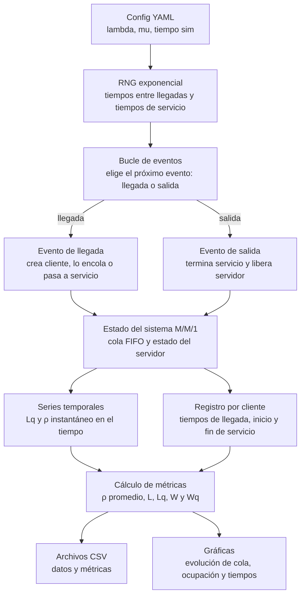
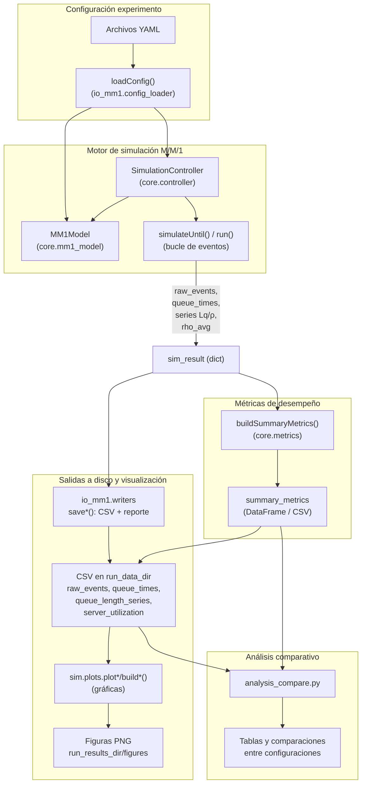

# Flujo de modelo y código

## Modelo

```mermaid
graph TD

  CFG["Config YAML<br>lambda, mu, tiempo sim"] --> RNG["RNG exponencial<br>tiempos entre llegadas y tiempos de servicio"]

  RNG --> EVENT_LOOP["Bucle de eventos<br>elige el próximo evento: llegada o salida"]

  EVENT_LOOP -->|llegada| ARRIVAL["Evento de llegada<br>crea cliente, lo encola o pasa a servicio"]
  EVENT_LOOP -->|salida| DEPARTURE["Evento de salida<br>termina servicio y libera servidor"]

  ARRIVAL --> STATE["Estado del sistema M/M/1<br>cola FIFO y estado del servidor"]
  DEPARTURE --> STATE

  STATE --> SERIES["Series temporales<br>Lq y ρ instantáneo en el tiempo"]
  STATE --> RECORD["Registro por cliente<br>tiempos de llegada, inicio y fin de servicio"]

  SERIES --> METRICS["Cálculo de métricas<br>ρ promedio, L, Lq, W y Wq"]
  RECORD --> METRICS

  METRICS --> CSV["Archivos CSV<br>datos y métricas"]
  METRICS --> FIGS["Gráficas<br>evolución de cola, ocupación y tiempos"]
```

## Código

```mermaid
flowchart TD
    %% ENTRADA Y CONFIGURACIÓN
    subgraph CFG[Configuración experimento]
        A[Archivos YAML]
        B[loadConfig#40;#41;<br/>#40;io_mm1.config_loader#41;]
    end
    A --> B

    %% NÚCLEO DE SIMULACIÓN
    subgraph CORE[Motor de simulación M/M/1]
        C[MM1Model<br/>#40;core.mm1_model#41;]
        D[SimulationController<br/>#40;core.controller#41;]
        E[simulateUntil#40;#41; / run#40;#41;<br/>#40;bucle de eventos#41;]
    end
    B --> C
    B --> D
    D --> C
    D --> E
    E -->|raw_events,<br/>queue_times,<br/>series Lq/ρ,<br/>rho_avg| F[sim_result #40;dict#41;]

    %% MÉTRICAS
    subgraph METRICS[Métricas de desempeño]
        G[buildSummaryMetrics#40;#41;<br/>#40;core.metrics#41;]
        H[summary_metrics<br/>#40;DataFrame / CSV#41;]
    end
    F --> G
    G --> H

    %% ESCRITURA EN DISCO Y GRÁFICAS
    subgraph IO[Salidas a disco y visualización]
        I[io_mm1.writers<br/>save*#40;#41;: CSV + reporte]
        J[CSV en run_data_dir<br/>raw_events, queue_times,<br/>queue_length_series,<br/>server_utilization]
        K[sim.plots.plot*/build*#40;#41;<br/>#40;gráficas#41;]
        L[Figuras PNG<br/>run_results_dir/figures]
    end
    F --> I
    I --> J
    H --> J
    J --> K
    K --> L

    %% ANÁLISIS OFFLINE
    subgraph ANALYSIS[Análisis comparativo]
        M[analysis_compare.py]
        N[Tablas y comparaciones<br/>entre configuraciones]
    end
    J --> M
    H --> M
    M --> N
```
